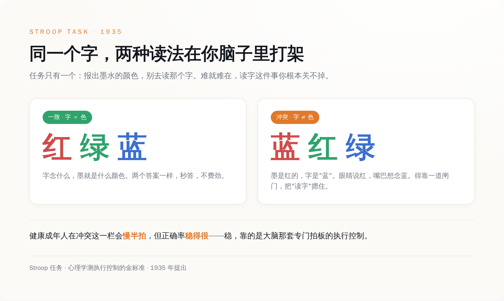
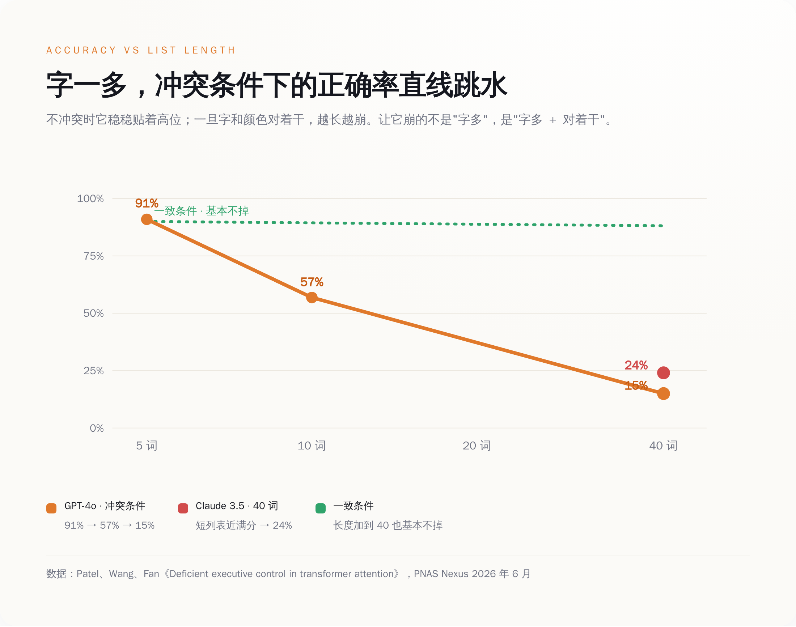
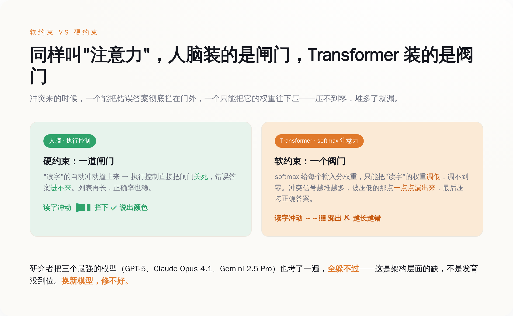
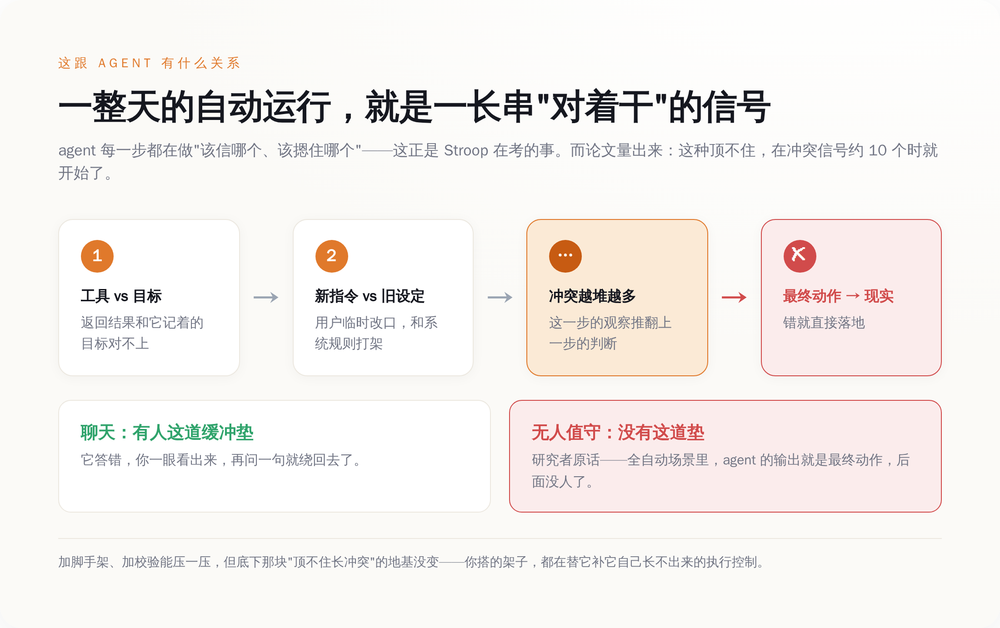

# 一道快一百年前的颜色题，把最强的三个 AI 全考崩了

> **发布日期**：2026-07-12 | **分类**：AI 观察

## 导语

先做个小测试。下面这行字，你别读它写的是什么，只说出它的墨水颜色：

红色的墨，写着"蓝"。绿色的墨，写着"红"。黄色的墨，写着"绿"。

你会慢一点，会有点别扭，但你不会答错。一个六岁小孩也不会。这就是心理学里最有名的一道题——Stroop 任务，1935 年就有了，快一百年了。它测的不是智商，是一件更底层的事：当"想读那个字"和"该说这个色"在你脑子里打架时，你能不能把那个自动蹦出来的错误答案，摁住。

2026 年 6 月，一篇发表在 PNAS Nexus 的论文，把这道题端到了地球上最强的几个 AI 面前。字少的时候，它们答得挺漂亮。字一多，全崩了——GPT-4o 的正确率从 91% 一路滑到 15%。而论文给出的结论，比分数更扎心：这不是哪个模型没调好，是这套架构，天生就缺这块。

---

## 一、这道题，简单到不该有 AI 做不出来

Stroop 任务的规则，简单到可以写在一张便利贴上：给你一串带颜色的字，你的任务只有一个——报墨水的颜色，别管字念什么。

难点全在"别管字念什么"这六个字上。因为读字对识字的人来说是自动的，你根本关不掉。当墨水是红的、字却是"蓝"的时候，你脑子里会同时冒出两个答案，一个来自眼睛看到的颜色，一个来自你憋不住的阅读本能。健康的成年人怎么处理这个冲突？会慢半拍，会偶尔卡壳，但正确率稳得很。这份"稳"，就是心理学说的执行控制——大脑里那个专门负责在两个答案打架时拍板的机制。

研究者做的事情，是把这道题改成 AI 能接的形式：把一串带颜色的词做成图片，喂给多模态模型，让它报颜色。词的数量从 1 个，一路加到 40 个。设了三种情况：字和颜色一致的（congruent）、不一致的（incongruent）、还有纯色块的对照组。

然后就是那个让人有点没绷住的结果。

OpenAI 的 GPT-4o，在 5 个词的短列表上，正确率 91%，挺好。加到 10 个词，掉到 57%。加到 40 个词，只剩 15%。Anthropic 的 Claude 3.5 Sonnet 也一样，短列表接近满分，一拉到 40 个词，崩到 24%。

能答对博士级难题的机器，栽在了"别看那个字"上——而且不是偶尔栽，是越考越栽。

---

## 二、它崩的方式，比崩本身更值得看

如果故事只是"AI 做长题会出错"，那不算新闻，谁都会累。真正有意思的，是它崩的方式。

同样是 40 个词的长列表，只要字和颜色是一致的（比如红墨水写"红"），模型的正确率基本不掉，稳稳地贴着高位。一旦换成不一致的（红墨水写"蓝"），才开始跳水。也就是说，让它崩的从来不是"字多"，是"字多"加上"字和颜色对着干"。它不是记不住那么多词，是拦不住那个错的答案。

更说明问题的是混合列表：研究者把一致和不一致的词掺在一起，结果模型在那些对着干的词上，正确率掉到接近 0%。它在同一串里，对不冲突的词照样答对，偏偏对冲突的词几乎全错。这不是"看花了眼"，这是"看见了，但摁不住"。

还有一个数字很微妙：这种下滑，在词数只有 10 个左右的时候就开始了。研究者据此说了一句挺重的话——这些模型能用来做执行控制的有效窗口，比它们号称能处理的上下文长度，要短得多。

**你以为它的瓶颈是记性，其实它的瓶颈是定力。**

翻译成人话：它能"读进去"很长的东西，但它能"顶住干扰、按住冲动"的那段，短得可怜。前者是各家发布会天天秀的百万上下文，后者，没人在发布会上提过。

---

## 三、为什么这毛病，换个新模型也治不好

看到这儿，正常人的第一反应是：GPT-4o、Claude 3.5，这都是老模型了，换最新的不就好了？

研究者早想到了。他们又补做了一组，用上了当时最新、最能"深度推理"的三个：GPT-5、Claude Opus 4.1、Gemini 2.5 Pro。结果是——全都躲不过。三个最强的脑子，在冲突条件下随着长度增加，正确率照样往随机水平滑。研究者的原话意思是：这个缺陷是架构层面的，不是发育层面的。换句话说，不是模型还小、还没长好，是它长成什么样，都缺这块。

为什么？问题出在 Transformer 那个叫"注意力"的核心机制上。它靠一个 softmax 给所有输入分权重，谁重要给谁多分一点。听着挺像人的注意力，其实差着一件关键的事：它只能给"读字"这个自动反应施加一个软约束——把它的权重调低一点，但调不到零。而人脑里那套执行控制，能下的是硬约束——直接一闸门把错误答案拦在外面。

软约束和硬约束的区别，在词少的时候看不出来，权重压一压也就够了。可当冲突信号越堆越多，那点被压低的权重会一点点漏出来，累积到某个点，就压垮了正确答案。这不是调参能修的漏，这是机制本身的形状决定的。研究者甚至把根子指到了更深的地方——模型嵌入空间的拓扑结构。

**在"注意力"这三个字上，Transformer 和你脑子里的注意力，压根是两回事。**

所以"下一代模型就好了"这个念想，这篇论文是直接给否了。你可以把模型堆得更大、喂得更多、推理链拉得更长，但只要底下还是这套软约束的注意力，那个"顶不住冲突"的老毛病就还在原地。

---

## 四、这事，跟"让 AI 帮你干活"有什么关系

聊到这儿你可能觉得，一个颜色测试而已，AI 又不靠数颜色赚钱，崩就崩呗。

问题恰恰在这。

这一年整个行业在卖什么？卖的是 agent——能无人值守、自己干一整天活的 AI。自己管数据库，自己跑客服，自己把一条工作流从头执行到尾，中间没人盯着。研究者自己就点破了这层：在这类全自动的场景里，agent 的输出就是最终动作，后面没有人这道缓冲垫了。它错了，就是真的错了，直接落到现实里。

而一个 agent 干活的过程是什么？是一段又长、又全是冲突信号的序列。工具返回的结果和它记着的目标对不上，用户的新指令和系统的旧设定对着干，这一步的观察推翻了上一步的判断——它每一步都在做"该信哪个、该摁住哪个"的选择。这正是 Stroop 任务在考的那件事：长序列里，顶住干扰，按住那个自动但错误的冲动。

而这篇论文量出来的是：这种顶不住，在冲突信号只有 10 个左右的时候就开始了。一个 agent 跑一整天，要处理的冲突信号，何止 10 个。

**我们正打算把公司交给一台在"别看那个字"上会崩的机器——它不是不聪明，它是定不住神。**

这不是说 agent 全是泡沫。加脚手架、加校验、加人盯着，都能把这个毛病压一压。但得清楚压的是什么：底下那个"顶不住长冲突"的地基没变，你搭的所有架子，都是在替它补那块它自己长不出来的执行控制。补得了一时的活，补不平架构的坑。

---

## 数据来源

- [Deficient executive control in transformer attention（PNAS Nexus, 2026 年 6 月）](https://academic.oup.com/pnasnexus/article/5/6/pgag149/8698838)
- [同一论文 bioRxiv 预印本全文（含实验数据）](https://www.biorxiv.org/content/10.1101/2025.01.22.634394v2.full.pdf)
