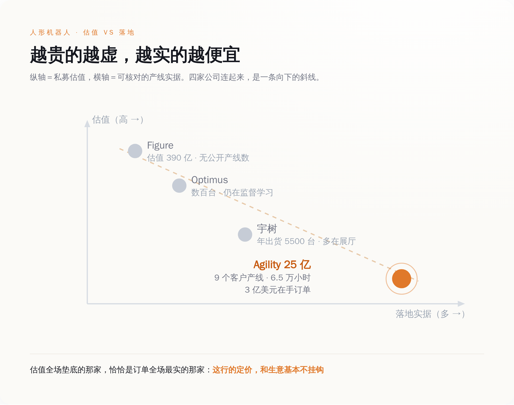
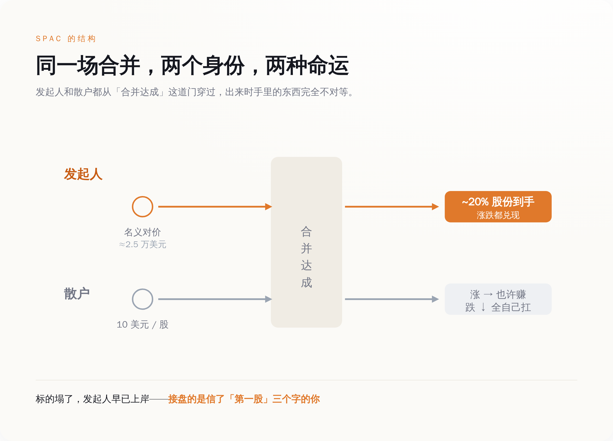
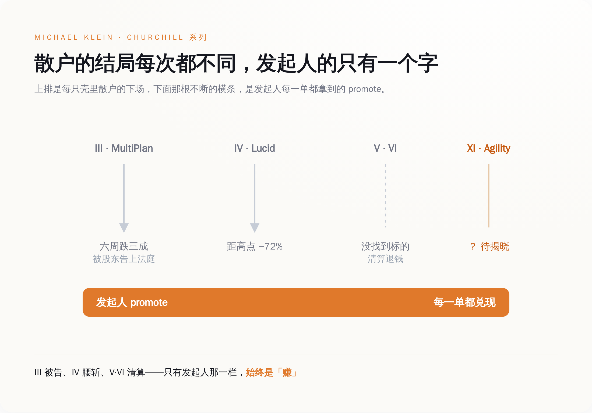

# 订单全行业最实的机器人公司，把上市交给了一个把 2.5 万美元变成 3 亿的人

> **发布日期**：2026-07-13 | **分类**：AI 观察 · 资本拆解

## 导语

2026 年 6 月 24 日，Agility Robotics 宣布上市，代码 AGLT，估值 25 亿美元。媒体给的标题很齐整：首个大型人形机器人 IPO。

齐整背后有两组数字，一组是这家公司的：Digit 机器人在丰田、GXO、Schaeffler 等 9 个客户的产线上，累计跑了 6.5 万小时，手里攥着 3 亿美元的多年期订单。在这个满地都是发布会和摆拍视频的赛道里，这是难得能落到账面上的东西。

另一组数字，是带它上市那个人的：Michael Klein，SPAC 发起人。他做过的壳一个接一个，最出名的两笔——一笔叫 MultiPlan，据后来的股东诉讼，他把 2.5 万美元的初始投入变成了 3 亿美元，而那家公司合并六周后丢了最大客户，股价跌掉三成；另一笔叫 Lucid，如今股价距高点跌去七成。

跑机器人的那位 CEO，公开说别指望机器人十年内进你家。管钱的那位，钱已经进兜里了。

所以这场上市，故事到底是讲给谁听的。

---

## 一、账面上，这是人形机器人行业里最不像 PPT 的一家

先说清楚，Agility 不是那种只有估值没有生意的公司。

它的机器人叫 Digit，双足，一米七上下，专门在仓库和工厂里搬箱子。招股材料里给的数据是硬的：9 个客户现场、6.5 万小时真实产线运行、3 亿美元以上的 Digit v5 多年期订单（附带一句「取决于合同里程碑达成」，这句后面再说）。它在俄勒冈 Salem 建了个叫 RoboFab 的厂，设计产能一年一万台。收费方式是按小时租，一小时 30 美元，对标一个人工的全成本，目标是让客户两年回本；要买断，一台 25 万美元。

把这些数字放进整个人形机器人行业里看，画风是反的。

Figure 这家公司，2025 年 9 月估值冲到 390 亿美元，是 Agility 的十五倍还多，投资人名单从英伟达排到贝索斯。它交付了多少台在客户产线上真干活的机器人？没有一个公开的、可核对的数字。特斯拉的 Optimus，2026 年 1 月启动量产线，马斯克在财报电话会上说部署了「数百台」，紧接着补了一句，还在监督学习阶段——翻过来就是，还得人盯着，不能自己干活。宇树便宜，2025 年出了五千五百多台，比 Figure 历史总和还多，可那些机器人大多在展厅里跳舞、在实验室里被训练，不在谁家的流水线上按 KPI 算账。

*估值最高的那家，落地证据最虚；落地最实的这家，估值垫底——这行的定价，和生意基本没关系*

结论有点扎心：在一堆估值几百亿、靠愿景撑着的同行里，Agility 是那个订单最实、估值最低的。它不是没东西可卖，它是这行里少数几家真有东西可卖的。

一个真有东西可卖的公司，本该走一条最体面的路上市。它偏偏选了最不体面的那条。这才是这件事真正拧巴的地方。

---

## 二、CEO 是全场唯一一个不肯吹的人

带 Agility 的人叫 Peggy Johnson，履历很重。她在高通干了 24 年，工程师出身；后来去微软当执行副总裁管业务拓展，微软 262 亿美元收购 LinkedIn 那笔迄今最大的并购，是她主导的；再后来去 Magic Leap 当 CEO，收拾那家把 AR 吹上天又摔下来的公司。2024 年 3 月，她接手 Agility。

这么一个在巨头并购和概念泡沫里都趟过的人，你以为她上市前会怎么讲故事？她讲的是反的。

被问到机器人什么时候进家庭，她说至少还得十年以上，别指望它很快给你把早餐端到床边。被问到当下能干什么，她只谈仓库、谈工厂、谈叉车旁边那点又重复又招不到人的活。人家同行的发布会上，机器人在叠衣服、煎鸡蛋、陪老人聊天；她的口径里，Digit 就是个通过了工业安全认证、能弯腰从低货架够箱子的搬运工。

搬箱子到底要不要两条腿，业内还在吵——轮式小车更便宜更稳，双足则不用改造老厂房，人能走的地方它就能走。这场技术争论先摆一边，真正反常的是 Johnson 的姿态：上市这个节骨眼上，全世界的惯例都是把故事吹到最大，好让估值撑到最高。她反着来，主动把预期往下摁。

**上市那天，全公司最沉得住气的是 CEO，最沉不住气的，是那套带她上市的金融机器。**

一个人越是不肯替产品吹牛，你越得问：那吹牛的活，谁替她干了。

---

## 三、真正上市的不是机器人，是 Klein 的那份 promote

SPAC 这个东西，说穿了不复杂。

发起人先攒一个空壳公司上市，圈一笔钱放进信托账户，然后拿着这笔钱去满世界找一家没上市的公司来合并，让它借壳登陆二级市场。散户买壳的股票，一股 10 美元，钱进信托，图的是将来合并的那家公司能涨。发起人呢，用一笔几乎可以忽略不计的钱，拿走合并后大约 20% 的股份——这部分叫 promote，是白送的。具体到 Klein 身上，那笔本钱就是本文标题里的 2.5 万美元。

关键就在这 20%。合并成了，发起人手里这笔股份就从几张纸变成真金白银；至于合并进来的公司后来涨还是跌、散户是赚是亏，跟他这笔本钱没有半点关系。他早就旱涝保收了。

*同一场合并，发起人的 promote 几乎零成本、旱涝保收；散户的 10 美元，承担了全部下行——两边根本不在一条船上*

Michael Klein 是把这套玩到极致的人。他发过一整个系列的空壳，都叫 Churchill Capital，编号从 III 排到了这次的 XI，一共十几个。战绩摊开看，是一张典型的「发起人赢、散户各安天命」的表。

Churchill III 装进来的是 MultiPlan，一家医疗账单公司。合并六周后，市场发现它最大的客户要跑，股价跌掉三成，此后长期在发行价下面躺着。散户告了，案子叫 Kwame Amo 诉 MultiPlan，特拉华衡平法院破天荒地放行了——第一次认定，普通信义义务的规矩，同样管得着 SPAC 这种壳。据这场诉讼披露的数字，Klein 在这单里，把 2.5 万美元变成了 3 亿。

Churchill IV 装的是 Lucid 电动车，2021 年 7 月合并，股东大会 98% 赞成通过，宣布时股价被炒上天，如今距高点跌去七成。Churchill V 和 VI，压根没找到能装的东西，到期清算，钱退还投资人——这算是散户最好的结局了，起码本金没亏在里面。

*从 MultiPlan 到 Lucid 到清算退场，散户的结局各不相同；只有发起人那一栏，每次都是同一个字——赚*

现在，第 XI 号壳，装进了 Agility。

**散户冲进来买的那张「人形机器人第一股」，本质是 Klein 十几年做壳生意的第 XI 单——机器人是这轮的抵押品，promote 才是常年不变的那个产品。**

---

## 四、越是诚实的标的，越是坑局最好的遮羞布

有个廉价结论很容易脱口而出：SPAC 是坑，Klein 是坏人，Agility 上当了。不是这么回事。

Agility 没上当，它算得很清楚。反过来问：一个手握 3 亿订单、6.5 万小时产线数据的公司，为什么不走正经 IPO，非要钻 Klein 的壳？

三个原因，一个比一个现实。

第一，正经 IPO 的窗口，对还没规模化盈利的人形机器人公司是关着的。投行不会让一个收入还小、订单还挂着「里程碑未达成」的公司，用传统方式去敲钟。SPAC 不挑这个，壳在那儿，谈拢就能进。

第二，SPAC 过去有个招人的地方：允许公司对外发布未来几年的营收预测，传统 IPO 受法律约束不敢这么放开吹。可这条好处，现在基本没了——美国证监会近年把 SPAC 也划进了「空白支票公司」的定义，等于取消了它在前瞻性预测上的法律庇护。换句话说，「选 SPAC 是为了讲更大的未来故事」这个流传很广的解释，在监管层面已经站不住了。Agility 选 SPAC，图的不是能多吹，是能快。

第三，是时间。Figure 兜里 390 亿美元估值撑起来的弹药，随时可能砸下来。Agility 手里东西再实，慢一步就可能被资本埋掉。它需要现在、立刻、马上拿到这笔六亿多美元——信托里 4.2 亿，加上富士康领投、每股 10 美元的 2 亿 PIPE。

两边于是一拍即合，各取所需。Klein 做了十几单壳，III 被告、IV 腰斩、V 和 VI 空手而归，太需要一个「这次是真有生意」的体面标的，来给自己那张难看的战绩表镶个金边；Agility 太需要这笔快钱和一个上市身份。**Agility 是 Klein 做壳生涯里最像样的一件抵押品，Klein 是 Agility 眼下唯一敞开的那扇门。**

被夹在中间的，是买「第一股」的散户。他们盯着的是那两条腿——两条腿长得像人，会让人联想到将来某天走进自己家、端茶倒水的那个画面。可眼下这两条腿真正在干的，是仓库里一小时 30 美元的搬运。他们付的是家用保姆的想象，买到的是工业搬运工的现实，中间那段差价，正是这台金融机器运转的燃料。

---

## 五、下回看到「第一股」是 SPAC，先查发起人上一单亏了多少

人形机器人这行值不值得投，是另一篇文章的事。这篇只讲一件事：怎么读「首个 XX 第一股」这六个字。

当它后面跟着的是一个 SPAC，你要看的就不是这家公司的机器人有多能干，而是壳背后那个发起人上一单干了什么。因为在 SPAC 的结构里，真正被摆上台面交易的，从来不是标的公司的前途，是发起人那份旱涝保收的 promote。标的涨了，皆大欢喜；标的塌了，发起人早已上岸，接盘的是信了「第一股」的你。

Rodney Brooks，iRobot 和 Rethink Robotics 的创始人、MIT 名誉教授，一直说当下这波人形机器人是注定要破的泡沫，说很多公司的训练方式是「纯粹的幻想」。他的话未必全对——Agility 的 6.5 万小时，恰恰是对「纯粹幻想」这个判断的一个反例。但泡沫的可怕之处从来不在于所有公司都是假的，而在于：当整个赛道用 PPT 定价的时候，一家真有订单的公司，也只配用一个专门分肥的壳上市。诚实在这里不值钱，它甚至反过来成了坑局的信用背书。

Peggy Johnson 不肯吹，不是因为她清高，是因为她不需要。**吹牛这道工序，Klein 的壳结构替她包了；她只要安静地把机器人卖进仓库，剩下的，交给那台从 2.5 万美元里榨出过 3 亿的机器自己去转。**

那场上市的故事，到底讲给谁听？讲给愿意相信「第一股」三个字的人听。而写故事的人，早在故事开始之前，就已经收了钱。

---

## 数据来源

- [Agility Robotics to Go Public Through $2.5 Billion Merger with Churchill Capital Corp XI（公司官方新闻稿，BusinessWire）](https://www.businesswire.com/news/home/20260624555633/en/Agility-Robotics-to-Go-Public-Through-$2.5-Billion-Merger-with-Churchill-Capital-Corp-XI)
- [Churchill Capital Corp XI — Form 8-K / Form 425（SEC EDGAR 原始文件）](https://www.sec.gov/Archives/edgar/data/0002074973/000121390026071287/ea029548401ex99-1.htm)
- [Agility Robotics 官网：Agility Robotics to Go Public Through Merger with Churchill Capital Corp XI](https://www.agilityrobotics.com/content/agility-robotics-to-go-public-through-merger-with-churchill-capital-corp-xi)
- [First Humanoid Robot Maker Goes Public In U.S.: $2.5 Billion Deal, $300 Million In Pre-orders（Forbes）](https://www.forbes.com/sites/johnkoetsier/2026/06/24/first-humanoid-robot-maker-goes-public-in-us-25-billion-deal-new-robot-300-million-in-pre-orders/)
- [Humanoid maker Agility Robotics to go public through SPAC merger（The Robot Report）](https://www.therobotreport.com/humanoid-maker-agility-robotics-go-public-through-spac-merger/)
- [This humanoid robotics company is going public, but its CEO isn't promising a robot in your home anytime soon（TechCrunch）](https://techcrunch.com/2026/07/05/this-humanoid-robotics-company-is-going-public-but-its-ceo-isnt-promising-a-robot-in-your-home-anytime-soon/)
- [SPAC Pioneer M. Klein Sued Over MultiPlan Blank-Check Merger（Bloomberg Law）](https://news.bloomberglaw.com/mergers-and-acquisitions/spac-pioneer-m-klein-sued-over-multiplan-blank-check-merger)
- [SPAC Litigation Alert: Kwame Amo v. MultiPlan（McDermott Will & Emery）](https://www.mcdermottlaw.com/insights/spac-litigation-alert-kwame-amo-v-multiplan/)
- ['Digit' maker Agility Robotics to go public in $2.5B deal — what the filings say（GeekWire）](https://www.geekwire.com/2026/digit-maker-agility-robotics-to-go-public-in-2-5b-deal-heres-what-the-filings-say-about-its-finances/)
