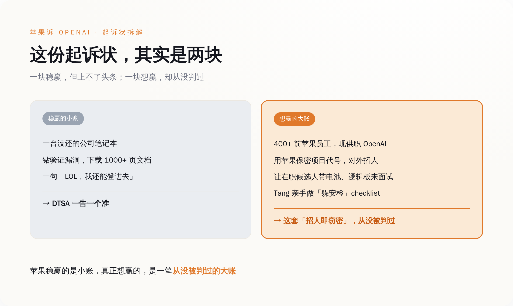
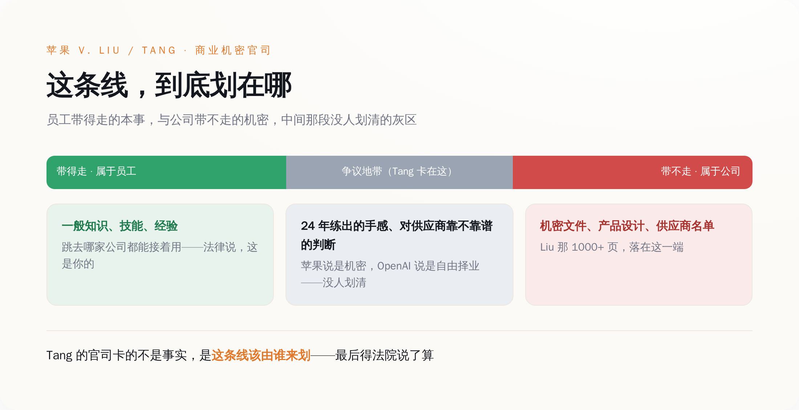
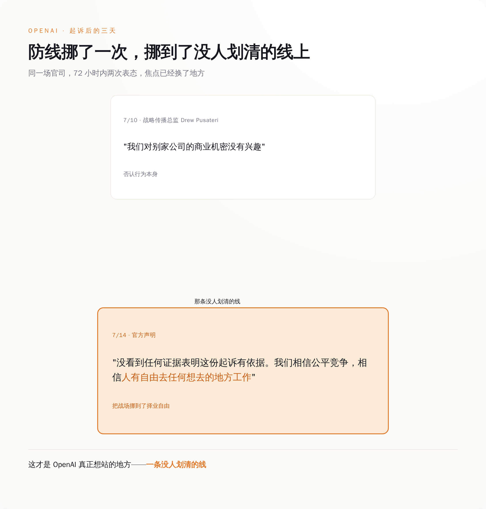

# 苹果告 OpenAI 偷机密，被告席上坐着 400 多个苹果自己养出来的人

> **发布日期**：2026-07-14 | **分类**：AI 观察 · 商业拆解

## 导语

2026 年 7 月 10 日，星期五，苹果把 OpenAI 告上了北加州联邦地方法院。

起诉状开头一句话就把调子定死了："从技术员工到首席硬件官，每一层，OpenAI 都在偷苹果的商业机密和保密信息。"（"At every level, from members of its Technical Staff to its Chief Hardware Officer... OpenAI has been stealing Apple's trade secrets."）

被告名单里有两个人。一个叫 Chang Liu，在苹果干过 8 年电气工程师；一个叫 Tang Yew Tan，在苹果干了 24 年，走的时候是 iPhone 和 Apple Watch 的产品设计副总裁，现在是 OpenAI 的首席硬件官。起诉状里还有个数字：现在在 OpenAI 上班的苹果前员工，超过 400 个。

所以你把这份 41 页的状子摊开看，会发现一件很拧巴的事：苹果起诉 OpenAI 偷走了它最值钱的硬件机密，而这些机密，是揣在四百多个苹果自己花了十年二十年养熟的人的脑子里，自己走出去的。

这官司真正在打的，不是那台没还的电脑。是一件从来没人判清楚过的大事。

---

## 一、先把苹果稳赢的那部分讲完：一台没还的电脑，和一句"LOL"

苹果这份状子里，有一部分是稳赢的。就是 Chang Liu 那部分。

Liu 2026 年从苹果离职去 OpenAI，走的时候，公司发的那台笔记本，他没还。这台电脑后来干了什么，起诉状写得很细：他利用了苹果网络里"一个罕见的、此前从未被发现的身份验证漏洞"（"a rare, previously unknown authentication bug"），登进了公司的网络存储，下载了几十份保密文件——不是随手翻翻，是"关于未发布产品的大量详细信息、工程演示、技术规格和专有项目数据"，其中一份，是把他在苹果做过的活整理成的技术文件合集，一千多页。

最要命的是一句聊天记录。苹果把它原样抄进了起诉状：Liu 给一个还在苹果的前同事发消息说——"LOL，我发现我还能登进（网络存储），太好笑了。"（"LOL, I found out I can access the [network storage], so funny."）

一个刚跳槽的人，发现前东家忘了关他的权限，第一反应不是心虚，是觉得好笑，然后顺手把一千多页东西拖了下来。他还没停在自己拖。起诉状说，他把苹果的保密信息分享给了其他正在应聘 OpenAI 的苹果同事，至少给其中一个划过重点：面试前该复习哪些东西。

这部分苹果告得毫无悬念。四项诉由走的是联邦《商业秘密保护法》（DTSA），外加两项违约。苹果要的东西也很直接：初步和永久禁令、保全电子证据、把信息还回来、赔钱、陪审团审判。一个离职员工不交电脑、还利用漏洞偷下一千多页文件——这在任何一部商业秘密法底下，都是一告一个准的。

*苹果稳赢的是小账，真正想赢的，是一笔从没被判过的大账*

如果这官司只到这儿，它上不了头条。无非又是一个吃相难看的离职员工，最后赔钱了事。

可你翻这份 41 页的状子会发现，讲这台电脑的篇幅，其实没多少。苹果真正花力气写的，是另一个人，和另一件事。

---

## 二、苹果真正想告的，是"招人"这件事本身

另一个人是 Tang Tan。

这人在苹果待了 24 年，管过 iPhone 和 Apple Watch 的产品设计。他 2023 年底离开苹果，2024 年跟 Jony Ive 一起创立了硬件公司 io Products；2025 年 5 月，OpenAI 花 65 亿美元把 io 整个买下，他这才当上 OpenAI 的首席硬件官。也就是说，苹果这次告的这个人，是他们自己那台造硬件的机器上，拧了二十四年螺丝的老师傅。苹果对他的指控，不是"偷了某份文件"，而是把整个招聘动作定性成了一套有组织的窃密工程。

起诉状里用的词是"institutional level 的、有协调的一整套不当行为"。具体到 Tang 头上的动作有这么几条：他在给 OpenAI 招人的时候，直接用苹果内部的保密项目代号跟候选人对暗号；他让还在苹果上班的候选人，把"实际的零件"（"actual parts"）——电池、逻辑板这些——带到 OpenAI 的面试现场，搞一场"show and tell"，好让他和他的团队从中再套出更多苹果的机密；他甚至亲手做了一份 checklist，发给新入职的前苹果员工，教他们怎么躲开苹果安全团队的排查。

把这几条连起来看，苹果指控的其实不是"某个人手脚不干净"，而是 OpenAI 把"雇一批前苹果人、再系统地问他们苹果是怎么干活的"这件事，本身办成了偷。

前面那台电脑、那一千多页文件，边界清清楚楚：那是苹果的东西，Liu 拖走了，就是偷。可"带零件来面试""用代号对暗号""问候选人苹果怎么做产品"——这些动作里被拿走的，到底是苹果的机密，还是这些人自己脑子里的本事？

苹果的答案是：都算机密。而这个答案要是成立，那被告席上就不该只坐两个人，该坐四百个。

---

## 三、可这四百多个人，是苹果自己养出来的

起诉状里那个数字，值得再念一遍：现在 OpenAI 里，超过 400 个苹果前员工。Tang 在苹果干了 24 年，Liu 干了 8 年。

再往上一层看，把这批人聚到一起的那家公司，也是苹果人开的。io Products 成立于 2024 年，四个创始人——Jony Ive（苹果的传奇设计总监，干到 2019 年）、Evans Hankey（Ive 在苹果的接班人，管过整个工业设计团队）、Scott Cannon，还有一个，就是这会儿坐在被告席上的 Tang Tan。2025 年 5 月，OpenAI 花大约 65 亿美元、全股票把 io 整个买下，55 个员工一个不落全进了 OpenAI。这次苹果连 io Products 都一起告了（被告栏里写的是 io Products 这家公司，Jony Ive 本人的名字没进去）。

所以你把这条链条拉直：一个干了 24 年的产品设计副总裁，一个干了 8 年的电气工程师，四百多个前员工，一家前设计总监创的公司——苹果要起诉的这一整套"窃密网络"，从上到下，是苹果自己用二十年时间，一手养出来的。

苹果最值钱的硬件本事，从来不只锁在保密文件柜里。它长在这些人身上——长在 Tang 二十四年练出来的那种对一块逻辑板该怎么排布的直觉里，长在他们对哪个供应商靠谱、哪条产线会出幺蛾子、哪个方案两年前试过撞了南墙的记忆里。这部分东西，苹果没法用一纸保密协议锁住，因为它不在纸上，它在人脑子里。而人，是会跳槽的。

**苹果这一告，告的表面上是 OpenAI 偷了文件，骨子里是它自己二十年砸进去的人才培养，某天集体长了腿，走进了对面那栋楼。**

---

## 四、"经验"和"机密"中间那条线，从来没人划清楚过

一个人从公司带走的东西，哪些是公司的机密，哪些是他自己的本事——这道题，商业秘密法吵了几十年，没吵出一个干净答案。

法律其实早有一条粗线。商业秘密保护的，是具体的、能界定的秘密信息——某个未发布产品的设计、某道制造工艺、某份供应商名单。而员工的"一般知识、技能和经验"（general knowledge, skill, and experience），是带得走的，是他的，跳到哪家公司都能接着用。你不能因为一个人在苹果学会了怎么做硬件，就判他这辈子不许再做硬件。

Liu 那一千多页文件，稳稳落在线的这一边：那是文件，是机密，拖走就是偷。

难的是 Tang 那一边。他没拖走文件，他脑子里装着二十四年。他知道苹果怎么评估一个供应商靠不靠谱——这算苹果的机密，还是算他 Tang 的经验？苹果说是机密，理由是他"太懂苹果了"；换个立场，这不过是一个干了二十四年的人该有的手感。这条线到底划在哪，苹果的状子没法自己说了算，得法院来划。

OpenAI 这边，防线的挪动很能说明问题。案子刚出来那天，OpenAI 战略传播总监 Drew Pusateri 的回应还是硬碰硬那一套："我们对别家公司的商业机密没有兴趣。"（"We have no interest in other companies' trade secrets."）到了 7 月 14 日，OpenAI 的口径换了：一句是"我们认真对待这些指控，但没看到任何证据表明这份起诉有依据"（"not aware of any evidence that this complaint has merit"），另一句是——"我们相信公平竞争，相信人有自由去任何他们想去的地方工作"。

后面这一句，是 OpenAI 真正要站的地方。它没在争"到底有没有偷文件"，它把战场挪到了"人有没有权利换工作"上。而这一挪，正好挪到了那条从来没人划清的线上。苹果说这是偷机密，OpenAI 说这是人才流动，两边说的是同一批人、同一件事，中间那条线往哪边偏一寸，结论就差一个天上一个地下。

*一条从没人划清的线：哪头是你的本事，哪头是前东家的机密*

这官司赌的，就是法院愿不愿意破天荒地，把那条线往苹果这边挪一挪。

---

## 五、这条线往哪划，跟你有关

你可能会觉得，苹果和 OpenAI 神仙打架，一个市值三万多亿，一个估值往一万亿冲，跟一个打工的有什么关系。

关系大了。因为那条线一旦被判动，动的不是这两家，是每一个在科技行业跳过槽的人。

你换过一次工作，脑子里就装着上一家的东西：你知道它的定价逻辑，你认识它的供应商，你踩过它踩过的坑，你清楚哪个方案是死路。这些东西没写在任何你签字带走的文件里，它就是你干那几年攒下的本事。可要是苹果这套"招人即窃密"的理论真在法庭上立住了，等于给每一份科技从业者的简历盖了个章：你这段经验，有一部分，产权归前东家。

*OpenAI 三天换了防线：从「没兴趣偷密」挪到「人有自由换工作」*

但也别急着替 OpenAI 喊冤。那份 checklist、那台没还的电脑、那句"LOL 我还能登进去"——这些是真的越了线。OpenAI 把一次正常的挖人，干成了系统性的掏空，恰恰是它自己，给了苹果把整件事往上纲上线的把柄。招人问经验，和发漏洞下文件，本是两回事；OpenAI 把这两件事搅在了一起，苹果才有机会把"人才流动"和"偷机密"打包成一个东西告上法庭。

而这场官司最可能的结局，是它压根不会给"经验到底算不算偷"一个干净答案。大概率，它会用那台电脑和那句 LOL 和解掉——Liu 认了这部分，赔笔钱，双方各自体面上岸——被告席上那四百多个人一个没事，那条最该被划清的线，继续悬在每一个打工人的头顶上，等下一次有人撞上去。

苹果这回告的从来不是一台电脑。它想让法院头一回承认：你跳槽那天，脑子里带走的东西，也有它的一份。这事它这次未必能赢，但它已经把话摆到了台面上——剩下的，就看下一个二十四年的 Tang Tan 跳槽的时候，法律记不记得今天这一问。

---

## 数据来源

- [Apple Inc. v. Liu, No. 5:26-cv-07078（美国北加州联邦地方法院案件档案，CourtListener）](https://www.courtlistener.com/docket/73602437/apple-inc-v-liu/)
- [Apple sues OpenAI alleging trade secret theft, says scheme was 'at every level'（CNBC，含起诉状原文引述）](https://www.cnbc.com/2026/07/10/apple-openai-lawsuit-trade-secrets.html)
- [The wildest allegations in Apple's trade secrets lawsuit against OpenAI（TechCrunch，逐条引述起诉状）](https://techcrunch.com/2026/07/13/the-wildest-allegations-in-apples-trade-secrets-lawsuit-against-openai/)
- [Apple says former employee exploited 'rare' bug to download confidential files after leaving for OpenAI（TechCrunch）](https://techcrunch.com/2026/07/13/apple-says-former-employee-exploited-rare-bug-to-download-confidential-files-after-leaving-for-openai/)
- [OpenAI pushes back on Apple trade secret lawsuit（TechCrunch，含 OpenAI 7/14 官方声明）](https://techcrunch.com/2026/07/14/openai-pushes-back-on-apple-trade-secret-lawsuit/)
- [OpenAI responds to Apple's trade secret theft lawsuit（9to5Mac，含 Drew Pusateri 首日声明）](https://9to5mac.com/2026/07/10/openai-responds-to-apples-trade-secret-theft-lawsuit/)
- [Apple lawsuit reveals how many of its former employees now work at OpenAI（9to5Mac，400+ 数字）](https://9to5mac.com/2026/07/13/apple-lawsuit-reveals-how-many-former-employees-now-work-at-openai/)
- [Apple challenges OpenAI's hardware push in trade-secret lawsuit（JURIST，诉由与救济梳理）](https://www.jurist.org/news/2026/07/apple-challenges-openais-hardware-push-in-trade-secret-lawsuit/)
- [Exclusive: OpenAI aims to debut first device in 2026, exec tells Axios（io 设备与 65 亿美元收购背景）](https://www.axios.com/2026/01/19/openai-device-2026-lehane-jony-ive)
- [A letter from Sam & Jony（OpenAI 官方：io 合并公告与 65 亿美元收购）](https://openai.com/sam-and-jony/)
- [io (company)（io 成立时间、四位创始人含 Tang Tan、55 名员工全部加入 OpenAI）](https://en.wikipedia.org/wiki/Io_(company))
