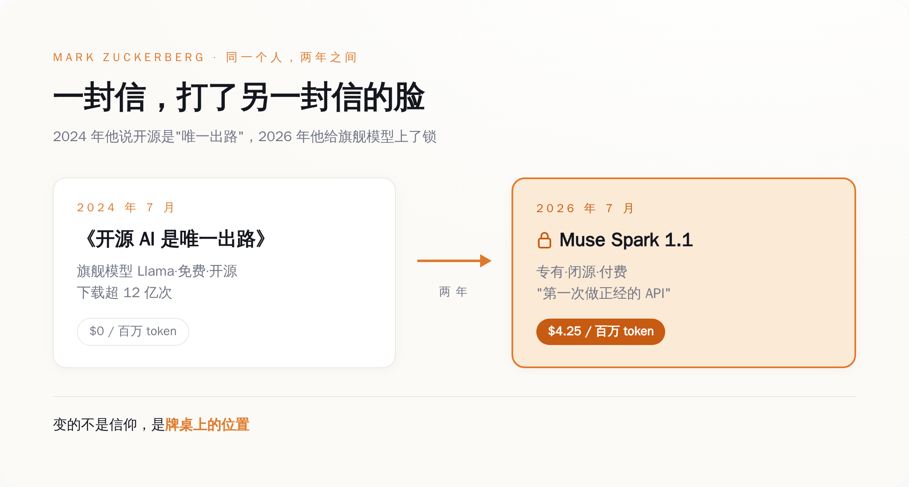
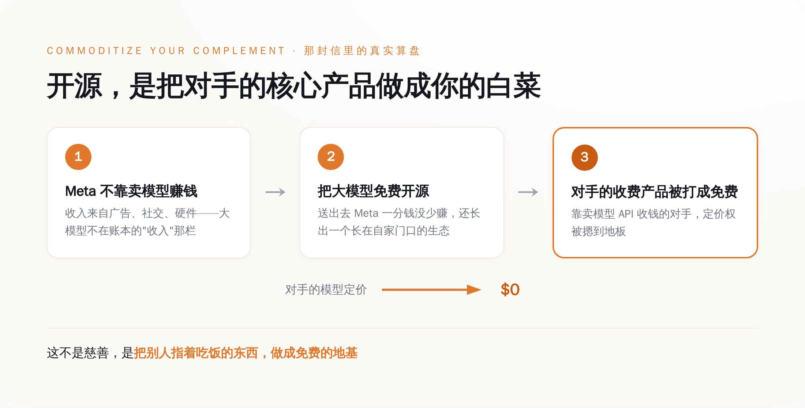
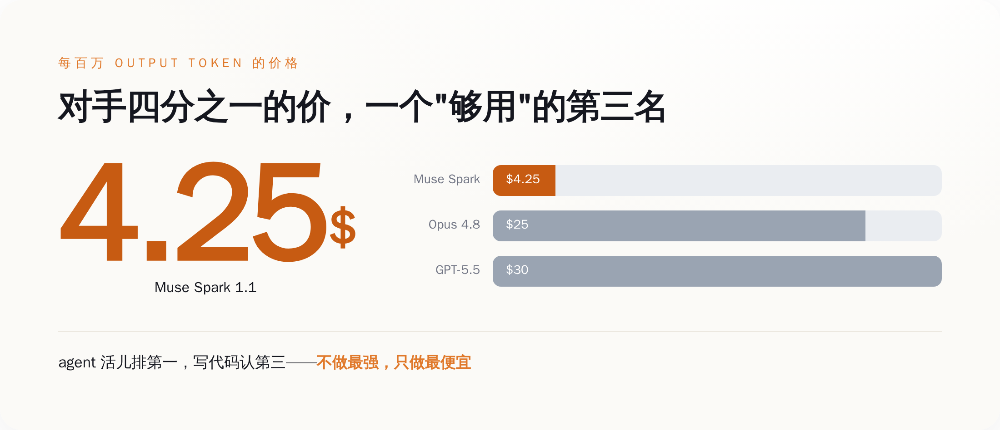

# "开源是唯一出路"喊了两年，小扎转头把新模型锁进了收费墙

> **发布日期**：2026-07-15 | **分类**：AI 观察

## 导语

2026 年 7 月 9 日，Meta 发了个叫 Muse Spark 1.1 的模型。付费，闭源，每百万输出 token 收你 4.25 美元。

扎克伯格接受彭博采访时，亲口给这事定了性——这是我们"第一次做正经的 API"（"the first time that we're doing a real serious API"）。他补了半句解释：因为"这不是一个开源模型"。

翻译成人话：以前那些免费送你的开源模型，在他心里，都不算正经生意。

而两年前，2024 年 7 月，同一个人，发过一封公开信，标题叫《开源 AI 是唯一出路》（Open Source AI Is the Path Forward）。

两年，一个人，一封信打自己另一封信的脸。今天我们不请专家、不找爆料，就用他自己写下的两段话，把这张脸拆开看看。

---

## 一、他给这事，亲手盖了个戳

先把发布这天的事说清楚。

*图注：2024 年他说开源是“唯一出路”，2026 年给旗舰模型上锁收费——变的不是信仰，是牌桌上的位置*

Muse Spark 1.1 是 Meta 超级智能实验室（Meta Superintelligence Labs）交出的东西，挂帅的是 Alexandr Wang——扎克伯格去年花了约 143 亿美元投资 Scale AI，顺手把这个人请来当了首席 AI 官。模型本身规格不小：专有闭源，一百万 token 的上下文窗口，主打 agent 编排、工具调用、写代码这类"能干活"的场景。定价是这样的——每百万输入 token 1.25 美元，每百万输出 token 4.25 美元，缓存输入 0.15 美元，新注册的开发者送 20 美元额度试用。

这是一份很标准的商业模型发布。标准到，如果发布方换成别的任何一家公司，都不值得单写一篇。

值得写的是扎克伯格给它配的那句话。**"real serious API"**——正经的、认真的 API。你把这个措辞放到显微镜下看：serious，认真。言下之意再清楚不过——过去这些年他免费撒出去的那一整个 Llama 家族，是不认真的、闹着玩的、随手施舍的。

一家公司，把自己的模型免费发到全世界下载了十几亿次，然后老板转过身来告诉你：那些都不算"正经生意"，这次收钱的才算。

这话你挑不出错。它甚至相当诚实。它只是诚实得有点扎人——原来在他自己的账本里，"开源"这两个字，从来没进过"生意"那一栏。就这。

## 二、两年前那封信，其实早把话说明白了

要理解他今天为什么能这么坦然地翻脸，得回去读那封被无数人转发、被供成"开源信仰圣经"的信。

奇怪的地方在于：这封信里，一句信仰都没有。

通篇他掰扯的全是生意。他解释 Meta 为什么要把 Llama 开源，用了一个直到今天读起来都很冷的类比——原话是，**"如果只有 Meta 一家在用 Llama，这个生态起不来，那我们的下场不会比那些闭源版本的 Unix 好到哪去"**（"If we were the only company using Llama, this ecosystem wouldn't develop and we'd fare no better than the closed variants of Unix."）。

你品这句话。他担心的根本不是"人类的 AI 会不会民主化"，他担心的是自己会不会变成下一个被历史淘汰的私有 Unix。开源在这封信里，从头到尾是一个防止自己出局的战术。

那这个战术是怎么算账的？信里也讲了：Meta 不靠卖模型访问权赚钱。它靠的是上面那层——社交、广告、硬件。所以把"大模型"这一层免费发出去，Meta 一分钱本来该赚的都没少赚；而那些指着卖模型 API 收费的对手，得眼睁睁看着自己收费的东西被人做成了免费的地基。你收 30 美元一百万 token，我这儿 0 美元管够，你这生意还怎么做？

*图注：Meta 不靠卖模型赚钱，所以开源送出去不疼，还顺手把对手的收费产品打成免费——这套算盘叫 commoditize your complement*

经济学里这套路子有个老名字，叫 commoditize your complement——把你的互补品做成白菜价。对 Meta 来说，"大模型"就是那棵别人指着卖钱、而它自己不靠它吃饭的白菜。开源，就是把这棵白菜免费堆到全世界门口，堆到没人愿意再为它单独付钱为止。

所以那封信没骗你。它甚至比后来所有转发它、把它读成理想主义宣言的人都清醒。它明明白白告诉你了：我开源不是因为爱你，是因为我不靠卖模型赚钱，送出去我不疼，还顺手能把靠卖模型的对手的价格，摁到地板上。

**他没骗你——真正骗你的是标题。**"唯一出路"这四个字，让你以为这是一条道德的路、一条为了全人类的路。不是的。那是 2024 年那个还没追上第一梯队的 Meta，在牌桌上唯一能出的那张牌。

## 三、那今天为什么又收费了？因为他这次觉得能卖了

信仰没变，牌桌上的位置变了。

看 Muse Spark 1.1 这次交出的成绩，你就明白 Meta 底气从哪来。在 agent 和工具调用这类"能不能自己干活"的评测上，它是真第一——比如 MCP Atlas 工具调用拿到 88.1 分，压过了对手。但你把它拉到纯写代码的赛道上，它就露怯了，稳稳的第三名：Terminal-Bench 2.1 上它 80.0 分，Claude Opus 4.8 是 82.7，GPT-5.5 是 83.4，它两个都没打过。

所以这次媒体评价直接劈成两半：有的标题写"击败了 Claude 和 GPT"，有的标题写"扎克伯格烧钱烧出来的第一个模型，全面落后于对手"。两边都没说谎，它们只是各自挑了对自己叙事有利的那半张榜单。

*图注：Muse Spark 每百万输出 token 4.25 美元，约为 Opus 4.8、GPT-5.5 的四分之一；agent 活儿第一，写代码第三*

真实的 Muse Spark 是什么？是一个不做最强、只做最便宜的"够用"的模型。价格是对手的四分之一——它 1.25/4.25，Claude Opus 4.8 是 5/25，GPT-5.5 是 5/30。一个在 agent 活儿上能排第一、写代码老老实实认第三、但只要你四分之一钱的模型。

这打法眼熟吗？这就是把 agent 这一层，也做成白菜——熟悉的配方，熟悉的味道（笑）。唯一的区别是：2024 年那棵白菜是免费送的，2026 年这棵，开始收四分之一的钱了。

**开源是打不赢时的免费；等到你觉得打得赢了，免费就成了"少赚"。**

而且他现在特别需要"少赚"变成"多赚"。Meta 把 2026 年的资本开支指引，从 1150 亿–1350 亿美元一路上调到了 1250 亿–1450 亿美元。这是什么概念——2025 年全年 Meta 的资本开支是 722 亿美元，2026 年这个数字差不多是它的两倍，比 2024 和 2025 两年加起来还多。财报公布那天，盘后股价一度跌超 6%，因为华尔街开始追着问同一个问题：钱砸进这么多数据中心，回报在哪？

一年往 AI 里砸一千多亿的时候，董事会不会跟你聊"开源是唯一出路"，他们只问一句：钱呢？**信仰是要恰饭的。**于是那条"唯一出路"上，就长出了一个岔路口，岔路口立着块牌子，上面写着 4.25 美元。

## 四、更何况，这张开源牌本来也快打不动了

就算不缺钱，Meta 这时候收手，也是精算过的。因为它手里那张免费牌，正在贬值。

Llama 的下载量，一直是 Meta 挂在嘴边的开源勋章。它官方宣布 2025 年 3 月突破 10 亿次下载，一个多月后又更新到 12 亿次，逢人就讲"几千个开发者、几万个衍生模型、每月几十万次下载"。这套数字，它当"开源领导力"的证据用了整整两年。

问题是，2026 年 7 月，这顶帽子被人摘走了——阿里的 Qwen 下载量超过了 Llama，成了全世界下载量最高的开源模型。

开源这张牌为什么曾经好用？因为你的免费模型得是所有人的默认地基，生态才会长在你家门口，你才有资格谈"标准由我定"。可当"最受欢迎的开源模型"这个位置被 Qwen 拿走，Meta 手里这张免费牌就变得两头不是人了：它换不来一分钱，又不再是那个人人都得用的标准。

留着它，图啥？一个既不赚钱、又不再当霸主的开源战略，在财务报表上就是纯支出，是每季度都得跟股东解释的一笔糊涂账。所以闭源、收费、做便宜的第三名，不是什么背叛信仰的大事，它就是一次冷静的止损。

**开源信仰的退潮，和这张牌不再好用，是同一件事的两个说法。**

## 五、所以别信厂商的"信仰"，信它的资产负债表

把这两年连起来看，结论其实特别朴素。

一家公司开不开源，从来不是一道价值观题，是一道算术题。变量只有两个：一，它靠什么赚钱；二，它手里的模型排第几。

第一个变量决定它开源要不要脸疼——如果它不靠卖模型吃饭（像 Meta 靠广告、像谷歌当年靠搜索），那它开源就是在砸别人的饭碗、顺手攒自己的生态，一点不疼。第二个变量决定它什么时候翻脸——模型排在后面，免费送出去，叫"建生态"；一旦追上来了、觉得能卖了，同一个免费动作就成了"白白少赚钱"，那就该收费了。

所以下次再有哪个大厂老板，站在台上跟你谈"我们开源是为了 AI 民主化、是为了全人类"，你不用跟他辩，你就默默去查这两个数。数一对上，他的"信仰"是真是假，一目了然。

说到底，扎克伯格反倒是这群人里最诚实的一个。他没在那两封信里藏着掖着——2024 年那封，他把 commoditize 的商业算盘打得清清楚楚，白纸黑字；2026 年这次，他一句"这不是开源模型，所以第一次正经做 API"，也把话说到底了。从头到尾把你带偏的，不是他，是我们自己——我们把一份写得明明白白的商业计划书，读成了一份理想主义宣言。

那封信的标题，到今天该改一个字了。

开源不是"唯一"出路。开源是打不赢时的那条路。打赢了，路口有个收费站，每过一百万 token，收你 4.25 美元。

---

## 数据来源

- [Mark Zuckerberg, Open Source AI Is the Path Forward（Meta 官方公开信，2024-07）](https://about.fb.com/news/2024/07/open-source-ai-is-the-path-forward/)
- [Bloomberg Law: Zuckerberg Sets Aggressive Price With Meta's Pay-to-Use AI（含扎克伯格 "real serious API" 原话及 Muse Spark 定价，2026-07）](https://news.bloomberglaw.com/ip-law/zuckerberg-sets-aggressive-price-with-metas-pay-to-use-ai)
- [Meta 官方：Celebrating 1 Billion Downloads of Llama（2025-03）](https://about.fb.com/news/2025/03/celebrating-1-billion-downloads-llama/)
- [Meta Q4 2025 业绩与 2026 资本开支指引（SEC 8-K Exhibit 99.1）](https://www.sec.gov/Archives/edgar/data/1326801/000162828026003832/meta-12312025xexhibit991.htm)
- [Anthropic 官方定价（Claude Opus 4.8，$5/$25 每百万 token）](https://www.anthropic.com/pricing)
- [OpenAI 官方 API 定价（GPT-5.5，$5/$30 每百万 token）](https://developers.openai.com/api/docs/pricing)
- [阿里 Qwen 下载量超越 Meta Llama 成为最受欢迎开源模型（2026-07）](https://www.opensourceforu.com/2026/07/alibabas-qwen-crosses-one-billion-downloads-eclipsing-metas-llama/)
