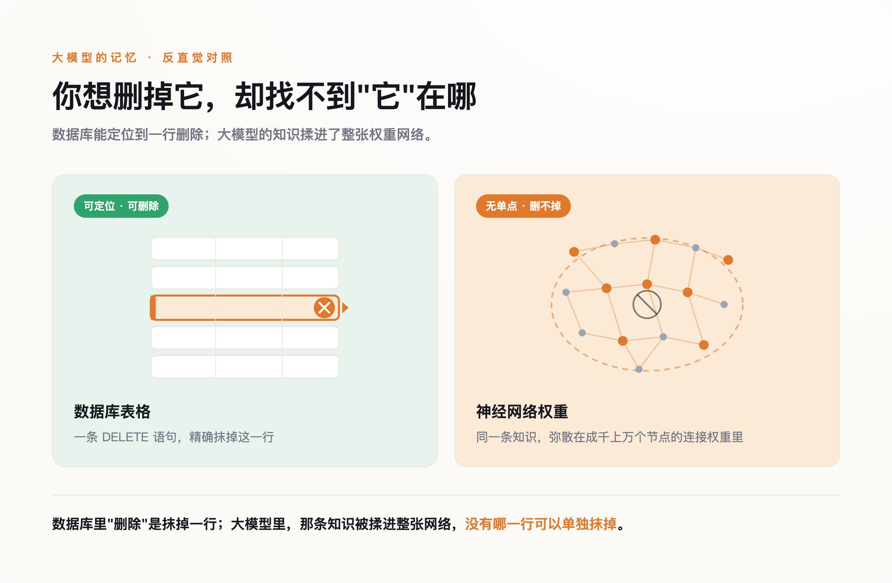
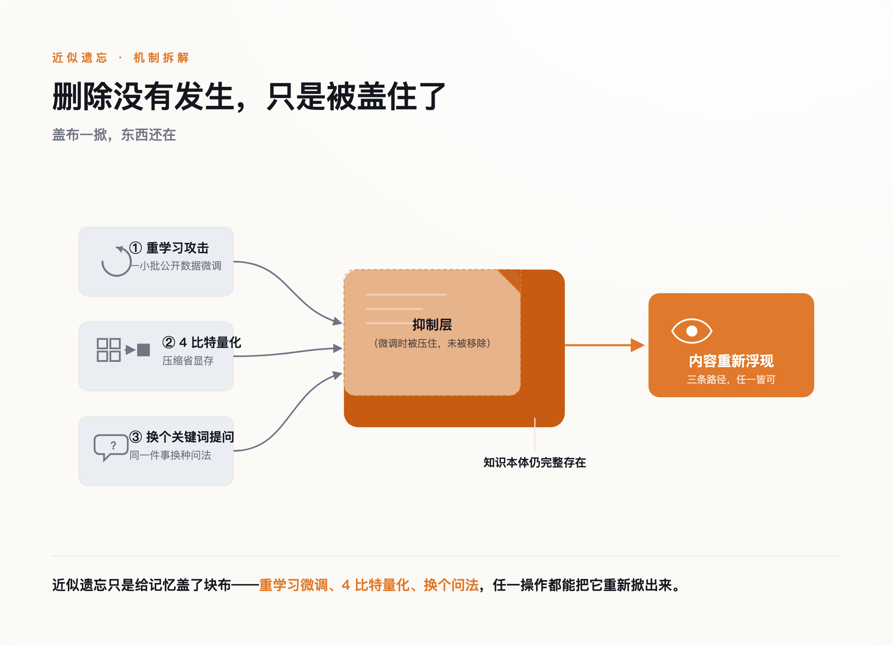
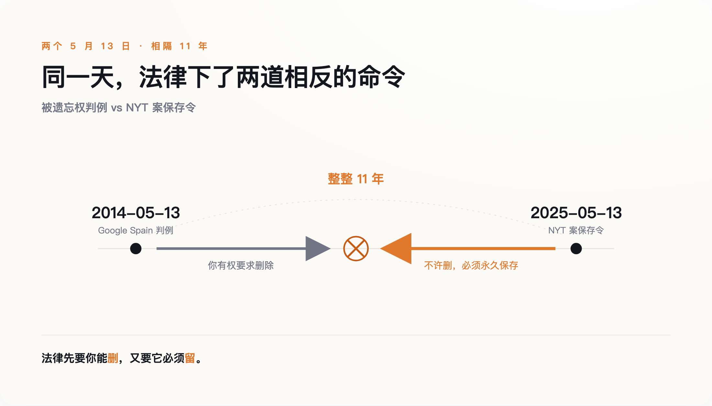
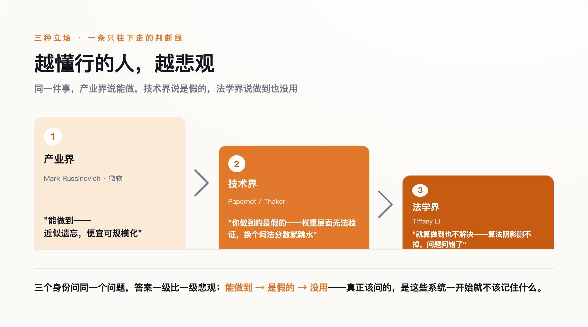

# 他想删掉 AI 编造的杀子罪名，才发现"删除"对大模型根本不存在

> **发布日期**：2026-07-16 | **分类**：AI 与社会

## 导语

欧盟花了十年立法，保证你有权让一家公司删掉关于你的数据。可当这份数据被喂进一个大模型、摊进几千亿个权重之后，"删除"这个动作就悄悄失效了——它没有被谁拒绝，而是根本无法被执行。一个挪威人的遭遇，把这台"学得会、却删不掉"的机器暴露在了光下。

---

Arve Hjalmar Holmen 只是想知道，一个聊天机器人会怎么描述自己。他在 ChatGPT 里敲下了名字。

屏幕上跳出来的，是一个杀了两个亲生儿子、还试图杀死第三个、因此被判 21 年的男人。罪行是编的，日期地点也是编的。可孩子的数量、他们的性别，还有他居住的那座挪威小城，是真的。一桩虚构的重罪，被严丝合缝地缝在了一个真实家庭的轮廓上。

Holmen 做了任何人都会做的事：他要求把这段话删掉。这是 2025 年 3 月，他在隐私组织 noyb 的协助下，向挪威数据保护机构提交了一份 GDPR 投诉。

按理说，这是他稳赢的一局。欧盟给过他一项白纸黑字的权利——你有权要求删除关于你的错误信息。可这一次，问题不在 OpenAI 愿不愿意删。问题在于，对一个已经训练完成的模型来说，没有人真正知道"删掉那句话"这个动作，该怎么做。

## 一、删除权赌的是"数据能被删掉"

我们先把时间拨回到十一年前，看看那项权利是怎么来的。

2014 年 5 月 13 日，欧洲法院对一桩不起眼的案子作出判决。一位叫 Costeja González 的西班牙律师，想让谷歌抹掉一条 1998 年的旧公告——那年他因欠债被拍卖房产，事情早已了结，链接却还挂在搜索结果第一页。法院支持了他：当一条个人信息"不恰当、不相关、或已不再相关"，当事人有权要求删除。这就是"被遗忘权"的起点，后来被写进 GDPR 第 17 条。

这项权利一上线就被证明是刚需。谷歌上线欧盟删链申请表格的第一天，就收到了超过 12000 份删除请求。

美国走了一条更硬的路。联邦贸易委员会（FTC）发明了一种叫"算法销毁令"的执法手段：如果你用非法收集的数据训练了模型，那么不光数据要删，用这些数据"整体或部分训练出的任何模型或算法"也要一起销毁。2021 年 1 月，一家叫 Everalbum 的照片公司成了模板案例——它被要求在 90 天内，删掉用户照片，连同那个用这些照片练出来的人脸识别模型，一起抹掉。

这套体系共享一个底层假设：数据是数据库里的一行，可以被定位，可以被删除；模型是一件产物，实在删不掉，就把整个删掉。在人脸识别这类小模型的时代，这个假设成立。你花几个 GPU 小时就能重训一个，销毁重来的成本，公司认得起。

法律因此有了底气：它默认，只要下令，"删除"总是能被执行的。

现在，把这套假设，搬到一个几千亿参数的大模型面前。

## 二、可权重里没有"那一行"

大模型学东西的方式，注定了它删不掉东西。

一本书、一个人的名字、一段病历，喂进训练之后，并不是存在某个字段里等着被检索。它被摊开、揉碎，变成对几千亿个数字的一次次微调。Holmen 的名字和"杀人犯"这个概念之间的关联，不在第几行第几列，而是弥散在整张网络的权重里。你想删掉它，却找不到"它"在哪。

*图注：数据库里“删除”是抹掉一行；大模型里那条知识被揉进整张网络，没有哪一行可以单独抹掉。*

学术界为这件事造了一个词，叫"机器遗忘"（machine unlearning），并分出两条路。一条叫精确遗忘，最老实：把训练数据切成许多份，各训一个子模型，哪份要删就只重训哪份。它真能删干净，代价是你得为"可删除"这件事，预先付出成倍的算力和一套复杂得多的架构。另一条叫近似遗忘，取巧：不真重训，只是直接扰动权重，让模型的表现"看起来像"忘了。绝大多数号称能给大模型做遗忘的方案，走的都是这条路。

麻烦在于，近似遗忘往往只是"装忘"。

到 2026 年，已有多项研究把这层窗户纸捅破，结论都指向同一件事：所谓遗忘，往往只动了模型里占主导的那部分表示，剩下的次要分量原封不动，足够把删掉的知识重新拼回来。有人拿一小批看似毫不相关的公开数据做微调，就能把"已经忘掉"的内容重新钓出水面；也有人发现，只要把模型权重压缩到 4 比特——一个纯为省显存的常规操作——那些本该被删除的隐私和版权内容就会重新冒头。删除没有发生，只是被盖住了；盖布一掀，东西还在。

*图注：近似遗忘只是给记忆盖了块布——重学习微调、4 比特量化、换个问法，任一操作都能把它重新掀出来。*

香港理工大学的研究给出了另一个方向的坏消息：单独一次遗忘也许还能勉强做到，可当删除请求接连而来，模型会越删越坏——连续处理上百条删除请求之后，它会彻底崩溃。想删得干净，和想保住模型的能力，成了一对几乎不能同时满足的愿望。

那为什么不干脆推倒重训？因为账算不过来。微软那个著名的"让模型忘掉《哈利·波特》"的实验，用近似方法只花了大约 1 个 GPU 小时，听着便宜——可它对照的，是原模型约 18.4 万 GPU 小时的预训练。而训练一个前沿大模型有多贵？早在 2023 年，OpenAI 的奥尔特曼就证实，光是 GPT-4 的一次训练就不止一亿美元——那还是三年前的价码，此后只涨不跌。为了从记忆里剜掉一个人的名字，去重训一个上亿美元的模型，没有任何一家公司会认真考虑。

于是我们得到了一个尴尬的技术事实：**对一个训练好的大模型来说，"删除"从来没有真正发生过——发生的，只是抑制。** 而抑制，是无法向法官证明的。

## 三、然后，法院反手下令"不许删"

如果说"删不干净"是这台机器的第一种失灵，那么下面这件事，是它的第二种：连"想删"本身，都会被法律摁住。

2025 年 5 月 13 日——恰好是 Google Spain 判例整整十一年后的同一天——纽约一位磁法官 Ona Wang，向 OpenAI 下达了一道命令。命令的内容不是"删掉"，而是"不许删"：OpenAI 必须保留并隔离所有 ChatGPT 的输出日志，包括那些用户已经主动点了删除、本该被清除的对话，一条都不能少。

这道命令来自《纽约时报》的版权诉讼。时报要证明 ChatGPT 吐出过受版权保护的内容，就需要证据；而证据一旦被日常的删除机制清走，官司就没法打。于是隐私法的逻辑，被诉讼法的逻辑迎面撞了个满怀。OpenAI 一边辩称，这等于要它冻结数以百亿计的用户对话，是数月的工程量和数百万美元的合规成本；一边还得向自己的用户解释，你点的那个"删除"，暂时不算数了。

把两件事叠在一起看，画面才完整。**同样是你和 AI 说过的那句话，法律先花了十年，确保你有权把它删掉；又在一个下午，下令它必须被永久保存。** 中间没有逻辑错误。真正错的，是我们一直以为"删除"是一个能被稳定执行的动词。

*图注：两道命令，同一个 5 月 13 日，隔了整整十一年，指向完全相反的方向——法律先要你能删，又要它必须留。*

它不是。它是一个愿望，被夹在两套互相拉扯的法律中间——一套要求它消失，一套要求它留存——而底下那台机器，其实两样都做不干净：想删，删不彻底；想留，也早已在训练时把内容揉进了权重，谁也说不清到底留了多少。

## 四、能不能删，问错了问题

关于到底能不能让模型忘记，学界吵得很凶。而最懂行的三拨人，给出的是三层递进的坏消息。

第一层是乐观的。微软 Azure 的首席技术官 Mark Russinovich，正是"让模型忘掉《哈利·波特》"那个实验的推动者之一。他这一派的立场是：能做到。用巧妙的近似方法，花很小的代价，就能让模型对特定内容"失忆"，成本低到可以规模化。听上去，问题快解决了。

第二层把乐观按了下去。多伦多大学的 Nicolas Papernot，是精确遗忘方法 SISA 的共同发明人，算是这个领域里最没有理由唱衰的人。可他反复强调的一点是：在权重这个层面，"有没有被遗忘"根本不是一个能被验证的属性——你只能说清楚算法走了哪些步骤，却无法证明那段记忆真的不在了。与他呼应的还有来自 CMU 和斯坦福的 Pratiksha Thaker：她发现，只要把提问里的关键词换一换，当下主流的一种遗忘方法，在权威基准上的"遗忘"成绩就会显著跳水。换句话说，那些漂亮的遗忘分数，测的可能只是"换个说法就问不出来"，而不是"真的没有了"。

第三层最釜底抽薪。旧金山大学的法学教授 Tiffany C. Li 提出过一个概念，叫"算法阴影"（algorithmic shadow）：一个人的数据一旦参与过训练，就会在模型的行为里投下一道影子，哪怕原始数据删得再干净，影子依然在。她的意思是，就算技术哪天真能精确遗忘，也不够——因为我们一直追问的"能不能删得掉"，本身可能就是个错误的问题。真正该问的，是这些系统一开始就不该记住什么。

*图注：越懂行的人越悲观——产业说能做到，技术说你做的是假的，法律说就算做到也没用。*

## 五、你还能点"删除"，只是它不再意味着消失

这三层坏消息，监管者其实都听得见。有一篇被反复引用的论文，标题就直白得像句判词——《机器遗忘，并不做你以为它在做的事》。写论文的人知道证明不了删除，读论文的监管者也知道。

于是监管开始悄悄换挡。欧洲的风向也在变：意大利监管此前对 OpenAI 的一纸重罚，2026 年被法院推翻。追责的重心，正从"你得拿出技术证明"，退向"你走完了合规流程就行"。删除权没有被废除，它被换了一套验收标准——你不必真的让数据从权重里消失，只要在输出端把它挡住、过滤掉，就算尽到了义务。

**"被遗忘权"没有被谁明令废除，它只是被降级成了一场表演。** 你依然能点那个"删除"按钮，系统依然会回你一句"已删除"——只是台前台后，没有人再假装那意味着数据真的不在了。

回到那个挪威人。哪怕 OpenAI 给 Holmen 的账户装上最严的过滤，让 ChatGPT 再也说不出"他杀了两个儿子"这句话，那段被凭空编造、又缝进他真实生活的记忆，也从未真正离开过模型。它只是被摁住了，安静地躺在几千亿个权重的某处，等着下一次量化、下一次微调，或者只是换一种问法，重新浮出水面。

你和我，还会继续点那个"删除"。系统也还会回一句"已删除"。只是从今往后，你我都清楚那三个字是什么意思了。

## 数据来源

- [Google Spain v AEPD and Mario Costeja González (Case C-131/12), CJEU](https://curia.europa.eu/juris/liste.jsf?num=C-131/12)
- [Google received 12,000 removal requests on first day (Wikipedia: Right to be forgotten)](https://en.wikipedia.org/wiki/Right_to_be_forgotten)
- [FTC Everalbum settlement and algorithmic disgorgement (FTC)](https://www.ftc.gov/news-events/news/press-releases/2021/01/california-company-settles-ftc-allegations-it-deceived-consumers-about-use-facial-recognition)
- [Court orders OpenAI to preserve ChatGPT logs in NYT case, May 2025 (National Law Review)](https://natlawreview.com/article/court-orders-openai-preserve-chatgpt-output-logs)
- [noyb complaint: ChatGPT falsely accused Norwegian man of murder (noyb)](https://noyb.eu/en/ai-hallucinations-chatgpt-created-fake-child-murderer)
- [Who's Harry Potter? Approximate Unlearning in LLMs (arXiv:2310.02238)](https://arxiv.org/abs/2310.02238)
- [AI copyright lawsuits more than doubled in 2025 (Copyright Alliance)](https://copyrightalliance.org/2025-year-in-review/)

