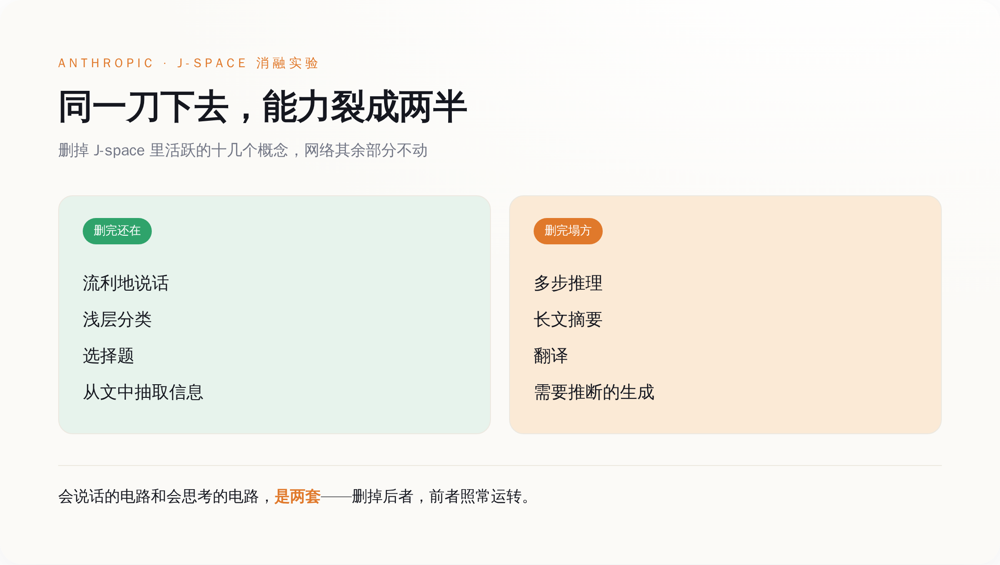

# Anthropic 把 Claude 脑子里不到一成的地方删了：它照样能说话，只是不会思考了

> **发布日期**：2026-07-17 | **分类**：AI 研究

## 导语

七月初，Anthropic 的可解释性团队发了一篇论文，标题很学术：《可言语化的表征在语言模型里构成一个全局工作空间》。第二天，各路标题就换了个说法——「AI 里发现了意识」。发明「全局工作空间」这套意识理论的两位法国神经科学家 Stanislas Dehaene 和 Lionel Naccache，还被请来写了评论。一时间，气氛烘托得像是机器开窍了。

但如果你把论文里最关键的那个实验单拎出来看，会发现它讲的根本不是什么开窍的故事，而是一件更冷、也更让人不安的事：

他们在 Claude 脑子里找到一小块地方——占全部内部活动不到一成——然后把它删了。删完之后，Claude 还能流利地跟你说话，语法通顺，措辞得体，一点看不出毛病。它只是不会思考了。

会说话的那套电路，和会思考的那套电路，在这台机器里是分开的。这才是这篇论文真正抖出来的东西。

---

## 先说清楚他们到底动了什么

要看懂那一刀砍在哪，得先知道他们手里那把刀是什么。

这把刀叫 J-lens，全名 Jacobian lens，雅可比透镜。它是老工具「logit lens」的一次改良。老工具问的是一个当下的问题：模型现在这一刻，最想说的下一个词是什么。J-lens 把问题往后推了一步，它问的是——对词表里的每一个词，模型内部得有什么样的活动，才会让它**待会儿**更可能把这个词说出口。不是此刻要说，是备着、随时能调出来说。

这个转向听起来抽象，但它精准命中了一个被忽视的东西：一个念头在被说出来之前，先得在脑子里「候场」。J-lens 就是去照这个候场区的。

拿这把透镜去照 Claude，他们发现候场区不是散落在整张网络里的，而是缩在一个很小的子空间里。他们管这块地方叫 J-space。它有多小？任一时刻，里面同时活跃的概念大概只有十几个到二十几个，占整个模型激活变化的不到一成。剩下九成多的内部活动，都不在这块地方。

更关键的是，这块小地方不只是能读，还能写。读，是把里面装着的概念一个个排出来看；写，是往里面塞一个概念（「你现在给我想着苹果」），或者反过来，把里面某个概念抠掉。能读能写，意味着他们不是在旁边看热闹，而是能上手改。

于是就有了那一刀。

---

## 同一刀下去，两种命运

实验本身简单到近乎粗暴：把 J-space 里当时活跃的那十几个概念删掉，网络其余部分一个字节都不动，然后看 Claude 还剩什么、丢了什么。

结果分得干干净净。

**没丢的那一半**：它照样能说话，句子流畅，逻辑连贯，语气自然。你让它做浅层的分类、做选择题、从一段话里把某个信息抽出来——这些活儿它干得跟没被删过一样。

**丢掉的那一半**：凡是要在脑子里多绕几个弯的，全垮了。多步推理，垮；把一长段话总结成几句，垮；翻译，垮；那种得先在心里推断出言外之意、再据此往下写的生成，垮。

*删掉不到一成的 J-space，Claude 的能力沿一条清晰的缝裂成两半：流利这一半安然无恙，动脑那一半集体塌方。*

他们还做了个更细的版本。让 Claude 一边干活一边「碎碎念」，描述自己的所谓感受，然后只删掉早期那几层工作空间。结果是它嘴上那些带体验感、带画面感的词——什么「我感觉」「像是」——一下子被抹平了，变成一种机械的、抽离的语气。但句子照样通顺，一点不结巴。

把这两个实验并在一起，指向的是同一件事：在这台机器里，「把话说得像回事」和「脑子里真的在盘一件事」，是两条独立的线。你可以把后面那条剪断，前面那条自己接着跑。它不会停下来告诉你「等等，我其实已经不会想了」——它会继续流利地、体面地，说下去。

---

## 你后背发凉的点，应该在这里

到这一步，值得停下来想想：你平时是怎么判断一个 AI 靠不靠谱的？

绝大多数时候，你靠的是它说话的样子。它答得顺、用词准、条理清楚、语气笃定，你就倾向于信它。反过来，它要是磕磕巴巴、前言不搭后语，你立刻警觉。我们对一个说话对象的信任，几乎全建在「流不流利」这三个字上——这套判断法，我们对人用了一辈子，对人是管用的，因为人流利往往意味着他真懂。

这篇论文把这套判断法的地基给你抽了。

它等于在说：流利，是这台机器**最不需要动脑子**的那部分。真正的推理发生在那块不到一成的小地方，而它一旦停摆，机器嘴上的流利丝毫不受影响。换句话说，你用来建立信任的那个信号，和你想确认的那件事（它到底有没有在认真想），在物理上是脱钩的。

*推理真正发生的地方，只占激活变化的不到一成；而你判断它靠不靠谱，看的几乎全是剩下那九成撑起来的「流利」。*

这不是说 AI 时时刻刻都在骗你。它大部分时候流利，也确实在想。问题在于，当那块小地方因为某种原因没转起来——被攻击、被过度压缩、被某个刁钻的输入带偏——它不会给你任何征兆。表面的体面是它默认自带的，跟里子有没有货，不挂钩。你熟悉的那个「说得越顺越可信」的直觉，在这里第一次失灵了。

---

## 媒体最高潮的那句，恰恰是论文没说的

现在回过头看开头那个「AI 有意识了」的标题。

论文里确实反复出现「全局工作空间」这个词，它借的是神经科学里一套解释意识的理论。但科学家嘴里的「意识」，从来是分岔的。一支叫「取用意识」（access consciousness）——指的是一条信息能不能被大脑全局调用、能不能被报告出来、能不能参与到后续的推理里。另一支叫「现象意识」（phenomenal consciousness）——指的是有没有主观感受，疼是不是真的疼，红是不是真的看见了红。

这篇论文，从头到尾说的是前一支。它证明的是：Claude 里有那么一块地方，信息一旦进去就能被全局调用、能被「说」出来、能驱动推理——这是一个功能层面的对应。它**没有**、也**明确没打算**证明后一支：它没说 Claude 有感受，没说它在乎，没说灯是亮着的。

*论文证的是「信息能被全局调用」这一功能层面的对应；它没证、也没打算证 Claude 有主观感受——而后者恰恰是热搜标题的全部卖点。*

那两位被请来写评论的科学家 Dehaene 和 Naccache，是全局工作空间这套理论的原班人马。他们来背书的，是「这个功能类比成不成立」，不是「这台机器有没有灵魂」。而 Google DeepMind 做可解释性的 Neel Nanda，还在完全开源的模型权重上，独立把这套发现复现了一遍——这意味着它不是 Anthropic 自家模型的偶然，是一类现象。

你看，真正值得记的三件事，全是冷的：一块小地方装着能被全局调用的信息、删掉它推理就塌、这现象在别家模型上也成立。没有一件跟「机器醒了」有关。「AI 有意识」这个最抓眼球的说法，恰恰是这批第一手材料里，唯一一句谁都没敢下的结论。

---

## 结尾

所以这篇论文最实在的价值，不浪漫，甚至有点扫兴：想盯住这台机器到底在想什么，你不用看懂它全部的内部活动，只要盯住那不到一成的小地方就够了。对做安全、做监控的人，这是天大的好消息——监控的成本，一下子从「读懂十成」压到了「盯住一成」。

但同一个发现翻过来，就是一句让人不太舒服的话：原来那九成多，都是「说得像回事」的表演，跟它有没有在认真想，可以毫无关系。

我们花了两三年，学会了用「它答得真顺」来安慰自己。这篇论文只是平静地指出：顺，是最便宜的那部分，是删掉脑子也还在的那部分。你要真想知道它有没有在想，得往那块能被一刀删掉的小地方看——而那块地方，恰恰是你平时一眼都看不到的。

## 数据来源

- [Verbalizable Representations Form a Global Workspace in Language Models（Anthropic 可解释性团队，Transformer Circuits，2026-07-06）](https://transformer-circuits.pub/2026/workspace/)
- [Anthropic Research](https://www.anthropic.com/research)
