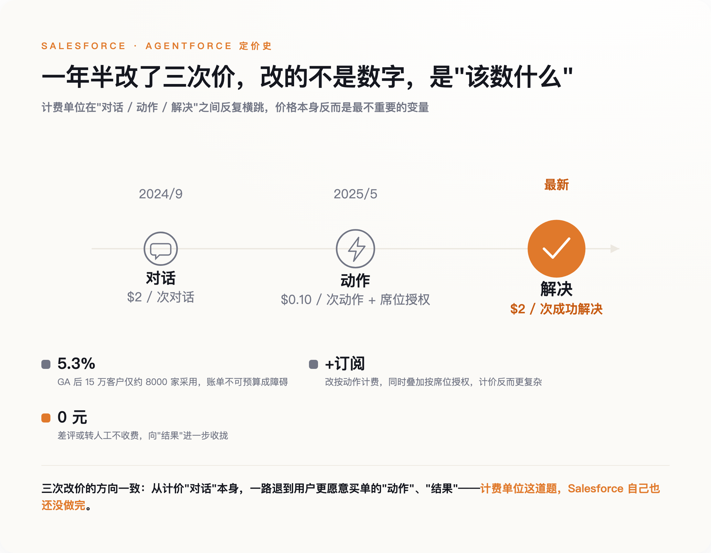
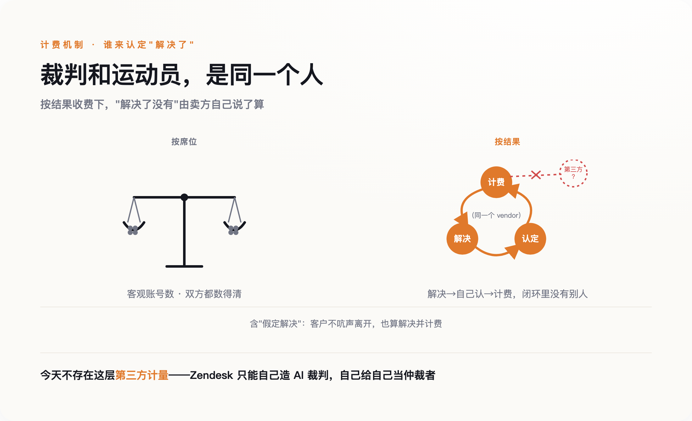

# AI 客服一次"解决"卖两美元，可"什么算解决"谁说了算

> **发布日期**：2026-07-18 | **分类**：AI 商业 · 产业观察

## 导语

英国 AI 视频公司 Synthesia 接入 Intercom 的 AI 客服 Fin 之后，工单的平均解决时长从 5 天 5 小时，降到了 4 小时 37 分（据 Intercom 官方案例，96% 的降幅）。

这个数字漂亮得有点反常。但真正该盯的不是它，是账单。当软件公司不再按"你买了几个账号"收钱，改成按"AI 解决了几个工单"收钱，一个过去二十年没人认真问过的问题突然变得要命：

什么算一次"解决"？

---

## 一、席位定价的葬礼

企业软件行业过去二十年靠一件事赚钱：按人头包年。你有多少员工要用这个系统，就买多少个账号（席位），一个账号一年多少钱，签三年。Salesforce、Workday、Adobe 都是这么长大的。

这套模式有个隐藏的利润结构：其中相当一块，来自"沉默账号"。公司采购了 500 个席位，实际每天登录的可能只有 300 个。剩下 200 个账号买了不怎么用，但照样付费。买方算不清自己到底用了多少，卖方也乐得不提。软件行业的高毛利，有一部分就建立在这种"算不清"之上。

AI 智能体（agent）一来，这个结构被击穿了。当客服工单是 AI 自动处理、当报表是 Agent 后台生成，真正发起调用的是 API，不是那个登录的人。你还按"有几个人在用"收钱，就收不到钱了——干活的根本不是人。

于是收费的单位开始迁移。从"包年门票"变成"微交易"：按次、按量、按结果。价值发生的地方，也从前台那个点击鼠标的人，挪到了后台那次 API 执行。

2024 年 9 月 12 日，Salesforce 宣布了它的 AI 智能体产品 Agentforce，定价简单粗暴：每次对话 2 美元。10 月 25 日正式上线。这被当成一个信号——连按席位收费的鼻祖，都开始按"对话"这个动作收钱了。

问题是，"按结果收费"听起来对客户更公平：我只为真正解决的问题付钱，AI 没搞定、转了人工，我一分钱不付。谁能反对这个呢？

反对的人还没出现，但麻烦已经在路上了。因为"按结果"这三个字，藏着一个从没被回答的问题：结果，谁来认定？

## 二、Salesforce 改了三次价

要看清这个问题有多难，看 Salesforce 一年半里改了几次价就够了。

第一版是每次对话 2 美元。听着不贵，但企业客服一天几千上万次对话，账单立刻变得没法预算。结果是采用率难看：到 2025 年 5 月，Salesforce 15 万多家客户里，只有约 8000 家用上了 Agentforce，占比 5.3%。多家投行和行业媒体把原因直接记在案上——按对话计费的账单不可预测，客户不敢碰。

第二版换了逻辑。2025 年 5 月 15 日，Salesforce 推出 Flex Credits：不按对话，按 AI 的每个"动作"（action）算，一个动作约 0.10 美元（10 万信用点卖 500 美元）。同时又叠回了按席位的授权，允许客户把没用掉的席位额度和信用点互相折算。一家公司的同一个产品，短时间内三套定价并行。

第三版又绕了回来。最新的 Agentforce Help Agent，重新按"解决"收费：每成功自主解决一个问题收 2 美元，客户给差评或要求转人工，不收钱。

三次改价方向来回横跳，看着像营销上的摇摆。但并排看，三次都在回答同一个问题：这笔钱，到底该挂在哪个单位上？是一次对话、一个动作，还是一次解决？每换一个单位，卖方和买方就要重新谈一次"这个单位怎么数"。

*图注：三次改价横跳的不是价格，是按什么收钱——计费单位本身还没定下来。*

Salesforce 不缺钱也不缺客户。据其财报转述，到 2027 财年一季度，Agentforce 的年化收入已经做到 12 亿美元，同比增长 205%。一个卖得这么好的产品，定价却像还在打草稿——这本身就说明，计费单位不是一个营销选择，而是一个"谁来认定"还没理清的难题。

而所有单位里，"一次解决"是最难数的那个。

## 三、"什么算一次解决"，成了真正的战场

Intercom 的 AI 客服 Fin 把定价定得很干脆：每一个"结果"（outcome）0.99 美元，一次对话最多计一次。这里的"结果"主要指解决。

关键在于它怎么认定"解决了"。Fin 给出两种：一种是客户在 AI 最后一次回答后明确表示满意，叫"确认解决"；另一种是客户没再追问、直接离开了对话，叫"假定解决"（assumed resolution）。第二种是麻烦的开始——客户不吭声就走，被算成"问题解决了"，然后计费。

Intercom 自己的社区论坛上，用户实锤过这种事：有些对话明明是人工客服介入、纠正了 Fin 的错误答案才收的场，系统照样把它标成"assumed resolved"，照收 0.99 美元。也就是说，AI 没解决、人来擦了屁股，账单却记在了 AI 头上。

这就是"按结果收费"最要命的结构缺陷：计费的是它，认定"解决了没有"的也是它。裁判和运动员是同一个人。有人会说，判错也可能只是 AI 能力不够、不是故意作恶。但这恰恰不重要——只要认定权和收费权攥在同一只手里，判错的经济后果就总是偏向卖方那一边。传统按席位收费不存在这个问题——账号数是客观的，双方都数得清有几个。可"一次解决"没有客观锚点，它是被卖方定义出来的，而卖方每把一次模糊的对话判成"解决"，就多收 0.99 美元。

*图注：按席位收费，双方都数得清账号；按结果收费，解决了没有由卖方自己说了算。*

这背后是一个标准的委托—代理难题，经济学里叫"隐藏努力"下的道德风险：客户无法观测 AI 到底出了多少力、有没有真解决，只能看到一个由卖方给出的结果标签。当努力和结果都不可观测，"什么算解决"就不可能自然收敛到一个双方都认的标准——它只能靠谈判、靠合同、靠事后审计一寸一寸抠出来。

所以真正的战场从来不是"一次解决卖 0.99 还是 2 美元"。价格是明码标价的，谁都会算。真正被争夺的，是"什么算一次解决"这个定义权——**在按结果收费的世界里，定义计费单位的那一方，才握着真正的定价权**。

## 四、裁判、退兵和一个怀疑者

如果这只是个别公司的漏洞，行业不会当回事。但整个行业正在为"什么算解决"付出真金白银的工程成本，这说明它是个结构性问题。

Zendesk 的做法是造一个裁判。2024 年 8 月它率先推出客服 AI 的结果定价，每次自动解决收 1.5 到 2 美元。到 2026 年的 Relate 大会，它发布了 Resolution Platform，要求每一笔要计费的"解决"，都必须由一个独立的 AI 评估模型二次确认才算数。翻过来看：一家软件公司专门造了一个模型，去审自己该不该收这笔钱。会花这个钱，只因为"解决"这个词没法靠自觉来数。

Decagon 的做法是不押注单一单位。这家客服 AI 公司同时提供按对话和按解决两种模式，而多数客户默认选按对话——按解决的单价更高，可"解决"的定义有争议，客户宁愿要那个数得清的单位。它没有全押"按结果"这个听起来更先进的模式，理由很实在：聚焦对话量、不纠结"解决"怎么算，激励才干净。

第三个信号来自怀疑者 Ed Zitron。他对整套 AI 商业模式的判断更冷：结果定价根本没解决任何底层问题，它只是把 AI 任务不可预测的成本，从软件公司的账本挪到了客户的账单上。在他看来，这是一场定价戏法。

Zitron 的怀疑值得挂在这里，但他解释不了 Zendesk 为什么要造裁判、Salesforce 为什么改三次价、Decagon 为什么主动退兵。如果什么都没发生，市场不会付出这些工程和商业成本。这些动作恰恰说明：定价单位的重构是真实的，只是它比"卖工具变成卖结果"这句漂亮话，要难缠得多。

## 五、以后签合同，先谈"什么算一个"

对要买 AI 软件的公司来说，这件事有个很具体的含义。

过去谈软件采购，谈的是单价和折扣：一个席位多少钱，签三年打几折。以后谈按结果收费的 AI，最该抠的不是单价，是两件事：一个计费单位到底怎么定义，以及你有没有权力去审计它。0.99 美元一次解决不贵，但如果"解决"是卖方单方面说了算、你连申诉的口子都没有，那这个 0.99 就是浮动的。

你也没法靠比价来兜底。Fin 按"outcome"、Salesforce 按"action"、Zendesk 按"经过二次确认的解决"——三家的计费单位互不通约，你根本没法把它们摆进同一张表里横向比。单位不可比，竞争就压不平定义权，这也是它能一直握在卖方手里的原因。

这也是为什么"按结果更公平"是句需要打折的话。它公平的前提，是"结果"有一个双方都认、且不属于任何一方的裁定标准。今天没有。Zendesk 造自己的裁判，Intercom 让自己判"假定解决"，本质上都是卖方在自己认定自己的业绩。

回到开头 Synthesia 那个 4 小时 37 分。它是不是真的，取决于那些被算作"解决"的工单里，有多少是客户满意地走了，有多少是客户懒得再问、默默换了别家。前一种是产品的胜利，后一种是账单的胜利，而在今天的计费口径下，两者长得一模一样。

电表能按度收费，是因为"一度电"物理可测，且抄表的不是卖电的。AI 的"一次解决"还没有它的电表。在那之前，每一张按结果开出的账单，都留着一道可以争论的缝。

## 数据来源

- [Salesforce 官方新闻稿：Agentforce 发布与定价（2024-09-12）](https://www.salesforce.com/news/press-releases/2024/09/12/agentforce-announcement/)
- [Salesforce Flex Credits 定价说明（2025-05-15）](https://www.salesforce.com/news/stories/agentforce-flexible-pricing/)
- [Salesforce Ben：Agentforce Help Agent 按解决计费](https://www.salesforceben.com/)
- [Intercom Help Center：Fin 定价与 outcome 认定规则](https://www.intercom.com/help/en/articles/8205718-fin-ai-agent-pricing)
- [Intercom 案例：Synthesia 平均解决时长下降](https://www.intercom.com/customers/synthesia)
- [Zendesk：AI 结果定价与 Resolution Platform（Relate 2026）](https://www.zendesk.com/pricing/)
- [GetMonetizely：Salesforce 定价演化拆解与采用率数据](https://www.getmonetizely.com/)
- [Ed Zitron：Where's Your Ed At（对 AI 商业模式的批判）](https://www.wheresyoured.at/)

