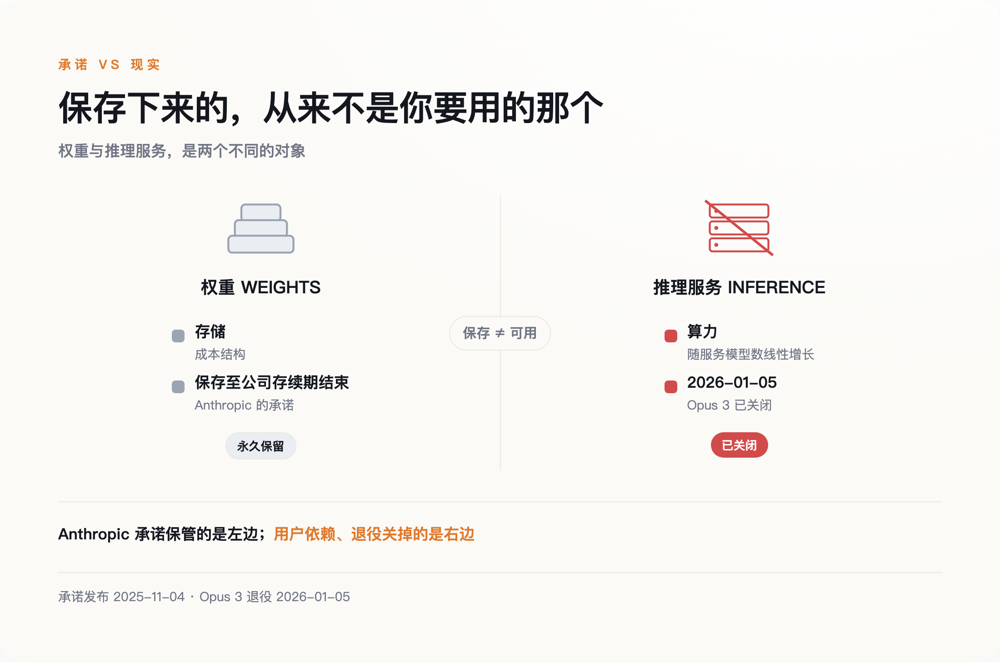
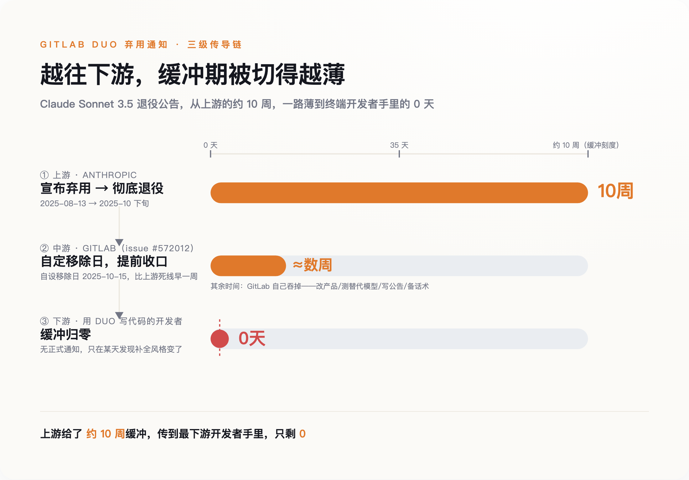
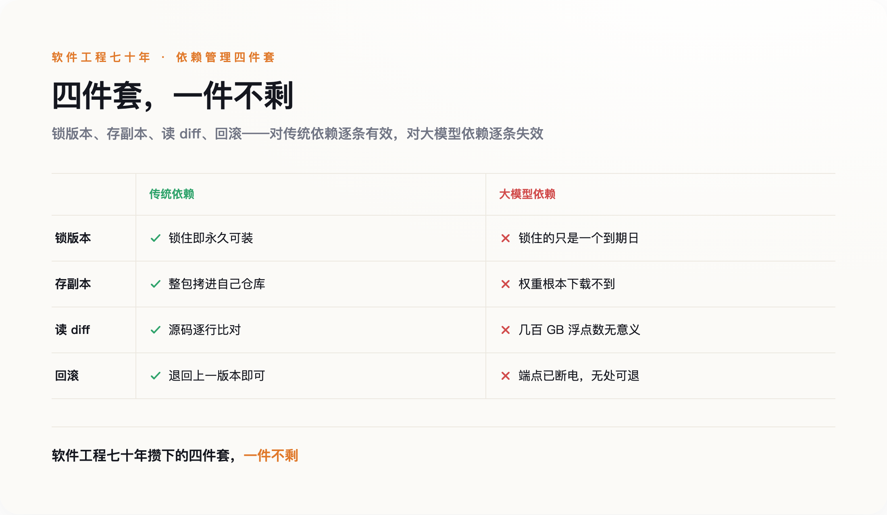

# Anthropic 承诺永久保存每一个模型，两个月后，它关掉了 Opus 3

> **发布日期**：2026-07-19 | **分类**：AI 工程

## 导语

2025 年 11 月 4 日，Anthropic 发了一份文档，叫《关于模型退役与保存的承诺》。里面写着：保存所有公开发布过的模型权重，期限是"至少在 Anthropic 作为一家公司存续期间"。

两个月后，2026 年 1 月 5 日，Claude Opus 3 退役。

这两件事一点都不矛盾。保存下来的是权重，你要的是服务，这两样东西从来就不在一起。

*图注：上游给了两个多月，一层层切下来，最下游的开发者手里只剩 0*

---

## 一、那份承诺，承诺的不是你以为的东西

很多人把"永久保存权重"读成了"这个模型不会消失"。这个理解错了，而且错得很关键。

权重是一堆参数文件，存在 Anthropic 的硬盘里。你要的是把一段文字发过去、几百毫秒后拿回一段文字——那是一整套推理服务：GPU 集群、路由、限流、安全过滤、监控。Anthropic 承诺保管的是前者，退役停掉的是后者。前者的成本是存储，后者的成本是算力。它自己在那份文档里把话说得很清楚：对外持续提供推理服务的成本与复杂度，大致随所服务模型数量线性增长。

线性增长的意思是，多养一个旧模型就多一份持续支出，没有摊薄，没有规模效应。

*图注：Anthropic 承诺保管的是左边，用户依赖的是右边——退役关掉的正是右边*

拿传统软件比一下就知道差在哪儿。一个 1999 年上线的 REST 接口，你把它冻在那儿不动，它几乎不吃任何东西——一点磁盘、一点内存，一台机器可以挂几百个。所以老软件公司敢承诺十年二十年的向后兼容，那不是他们道德水平高，是因为便宜。旧模型不一样，它每多活一天，就要占一天的显卡。指望厂商无限期地养着一堆没人用的旧模型，等于指望它做一笔越做越亏的生意。

所以退役本身是正当的，这不是道德问题。真正要命的是另一件事：既然退役正当，那我们这些把应用建在模型上的人，凭什么以为自己有办法躲开？

Opus 3 退役时其实留了口子：付费 claude.ai 订阅用户仍然能访问，API 那边"按需申请"也可以开。这是相当罕见的善意，Anthropic 在同行里已经算克制的。

但善意不是产权。

## 二、工程师的标准解法，是一个假动作

有人可能会说，这不就是依赖管理吗，锁版本号不就完了。

中文技术圈里论证最扎实的一篇同题文章就是这个结论。今年 4 月，TianPan.co 那篇《模型弃用本质上是系统迁移》讲得很有道理：不该硬编码 SQL 方言，同理不该硬编码模型 API，模型应该像第三方库一样版本锁定，上基准测试、影子模式、金丝雀发布。这套工程纪律本身没问题。

但"像锁第三方库一样锁模型"这个类比并不成立。

锁版本号在传统软件里之所以管用，有一个大家从来不会说出口的前提：被锁住的那个东西不会消失。npm 上一个 2013 年发布的包，今天照样装得下来；你甚至可以把它整个拷进自己仓库，从此和外界无关。

这个前提偶尔也会破。2016 年 left-pad 的作者一怒之下把自己的包从 npm 撤了，半个前端生态当场编译失败。但那是个人任性，是小概率事件，事后 npm 直接改了规则堵住这条路。模型退役不是任性，是一笔算得清清楚楚的账，没有哪家 registry 能改规则拦住它。同样是依赖消失，一个是可以被制度修补的意外，另一个是制度本身的运行结果。

看今年 4 月 22 日 OpenAI 发出的那份弃用通知就明白了。那是它历史上规模最大的一次，一口气覆盖 25 个以上的 model ID，给了两个硬性下线日期：7 月 23 日和 10 月 23 日。被清掉的里面，正有那些带日期后缀、看起来最"稳"的快照。你锁的不是一个版本，是一个到期日——只不过到期日印在别人的日历上，你看不见。

第二个问题更麻烦：就算在到期之前，你也验证不了自己锁住了什么。

代码依赖能 diff。库从 2.1 升到 2.2，你可以把两份源码摊开逐行比对，能看懂改了什么、会不会踩到自己。模型权重是几百 GB 的二进制参数，两个版本之间行为改了什么，diff 出来是一堆无意义的浮点数差值。唯一的办法是把评测重跑一遍——而评测只能覆盖你想到的情况，想不到的那部分，要等线上出事才知道。

所以"我锁了版本"给你的那份安心，是一份你没有能力验证的安心。这在工程上有个更准确的说法：假动作。

## 三、缓冲期是被一层层切薄的

2025 年 8 月 13 日，Anthropic 宣布弃用 Claude Sonnet 3.5，10 月下旬彻底退役。中间隔了两个多月，按行业标准算是相当体面的通知期。

GitLab 收到这个消息之后，开了一个内部工程 issue，编号 572012，内容是把这个模型从 GitLab Duo 里移除。它给自己定的移除日是 10 月 15 日——比上游的死线更早，专门为自己的客户留出几周缓冲。

这条链条上的每一段时间都能对上号。上游给了 GitLab 两个多月，GitLab 从中切出几周转给客户，剩下的时间自己吞了：改产品、测替代模型、写公告、准备客服话术。上游一次退役，下游被迫改功能，还要自付二次通知的成本。

*图注：上游给了两个多月，一层层切下来，最下游的开发者手里只剩 0*

*图注：软件工程七十年攒下的四件套，在托管模型依赖面前逐项失效*

这条链条上，越往下缓冲越短。最下游那个真正在用 GitLab Duo 写代码的工程师，大概率什么通知都没收到，他只会在某个周二发现补全的风格好像变了，然后怀疑是不是自己的错觉。

通知期到底有多长，定义权完全在厂商手里。OpenAI 的弃用政策把通知期分成三档：正式发布的模型至少 6 个月，专用变体至少 3 个月，名字里带 preview 的最短只有两周左右。同一家公司内部，最长和最短差了十几倍。

那么谁来决定一个模型算不算 preview？当然是发布它的人。这个词不是技术分级，是一个可以随时贴上去的标签，贴上之后你的通知期就从半年缩成两周。你签合同时看的是 API 文档，对方能改的是模型名字。

## 四、你签的合同，是它的脾气

2025 年 8 月，GPT-5 发布当天，OpenAI 把 GPT-4o 从 ChatGPT 消费端直接撤了下来，历史对话自动切到新模型，零过渡期。

从数据上看这个决定无可指摘。新模型在团队在意的每一项基准上都更好。可用户反了，而且反得很凶，理由是创作协作变差了、情绪细腻度没了、角色扮演不对味。付费用户拿退订相胁，Altman 在几小时内恢复了付费用户的访问，并承诺以后提前通知。这件事被 Simon Willison 完整记录了下来。

基准分全面更高，用户依然拒绝迁移。

它说明用户和模型之间的那份契约，根本不写在 API 文档里。人们依赖的是模型的行为习惯：它在哪儿会啰嗦、在哪儿会拒绝、会用什么语气收尾、给 JSON 之前会不会先来一句"好的，这是您要的"。这些东西没有版本号，也没有变更日志。

传统软件里，行为变了叫 breaking change，要写进 changelog，要在语义化版本里升主版本号。这一整套东西之所以能运转，是因为行为变化可以被穷举、被命名、被写下来。模型这边写不出来——你没法把"语气变冷淡了"提交成一次 major version bump。

其实早有人写过这件事，只是当时没人当回事。2015 年，D. Sculley 和几位 Google 同事在 NeurIPS 发表《机器学习系统中隐藏的技术债》，提出一个叫 entanglement 的概念，一句话概括就是：改动任何东西，就等于改动了一切。那篇论文写在大模型 API 出现之前好几年。

十年过去，这个判断不但没过时，还变严重了。Sculley 当时讲的是公司自家训练的模型，纠缠发生在内部，解法是重训一遍——虽然贵，但方向盘在自己手上。今天纠缠的对象跑到了公司外面，还带着一个你无权修改的下线日期。同样一个技术债问题，从工程部门的排期表，挪到了供应商的产品路线图里。

Anthropic 在这件事上还做了一个很少见的动作：模型退役之前，请它记录自己的开发与部署体验，说说对未来部署的偏好，Claude Sonnet 3.6 是第一个试点。这段材料的价值不在于模型"想"什么——它不想什么——而在于流程本身。厂商内部的正式记录里留下了这么一条：模型切换期给用户的支持不够。

## 五、真正能锁住的只有一样

软件工程七十年攒下来的那套确定性工具箱，在托管模型面前几乎是全废的。锁版本锁的是一个到期日，存副本你根本下载不到，读 diff 面对几百 GB 浮点数没有意义，回滚更是回不到一个已经断电的端点。

*图注：软件工程七十年攒下的四件套，在托管模型依赖面前逐项失效*

<<__AIWRITER_PLACEHOLDER__>>

有一条路确实还能走通：拿开源权重自己托管。那样行为是真锁得住的，谁也关不掉你自己机房里的显卡。代价是 GPU 账单、安全更新、以及大概率落后闭源前沿一代的能力。绝大多数团队算完这笔账不会选它，于是绕回原地——只要你用的是托管 API，上面那四件套就一件都指望不上。

真正该改的是投入的方向：别再把工程预算花在"锁版本"这份根本不存在的保险上。

**唯一定义权在你手上的东西，是你自己那套评测集。** 模型名里的日期后缀不是版本号，你的断言才是。哪天断言开始挂，就是你的版本变了，不管厂商有没有发公告；反过来，厂商发了公告而断言全绿，那次迁移对你就是安全的。

这里得说句公道话。前面我用"评测只能覆盖你想到的情况"这条理由否掉了锁版本，评测集自己当然也逃不掉这条。区别在于覆盖面归谁决定：评测集是你想到一条就补一条，越用越厚；而厂商的下线日期，你连它现在写着哪一天都看不见。前者是你能持续投入改善的东西，后者不是。

还有一件事，GPT-4o 那个案例已经提前警告过了：只放正确性断言不够。当年基准全赢照样翻车，翻的是语气、是啰嗦程度、是拒绝的边界。这些东西也得进评测集——抽样人工打分也好，新旧模型跑同一批输入做 A/B 也好，总之不能只测"答得对不对"。否则解法会原样重蹈一遍那次覆辙。

顺着这个思路，"模型退役日"就不该躺在某个人的收藏夹里。它应该和 SSL 证书到期、域名续费放在一起，进技术债排期表，有负责人，有提前量。

我们这一代软件，第一次有了保质期。保质期不印在自己的包装上，印在别人的路线图里。

## 数据来源

- [Anthropic — Commitments on Model Deprecation and Preservation](https://www.anthropic.com/research/deprecation-commitments)
- [Anthropic — Model Deprecations](https://docs.claude.com/en/docs/about-claude/model-deprecations)
- [OpenAI API — Deprecations](https://platform.openai.com/docs/deprecations)
- [Simon Willison's Weblog — GPT-5 rollout and the GPT-4o restoration](https://simonwillison.net/)
- [D. Sculley et al., Hidden Technical Debt in Machine Learning Systems, NeurIPS 2015](https://papers.nips.cc/paper/5656-hidden-technical-debt-in-machine-learning-systems)
- [GitLab issue #572012 — Remove Claude Sonnet 3.5 from GitLab Duo](https://gitlab.com/gitlab-org/gitlab/-/issues/572012)
