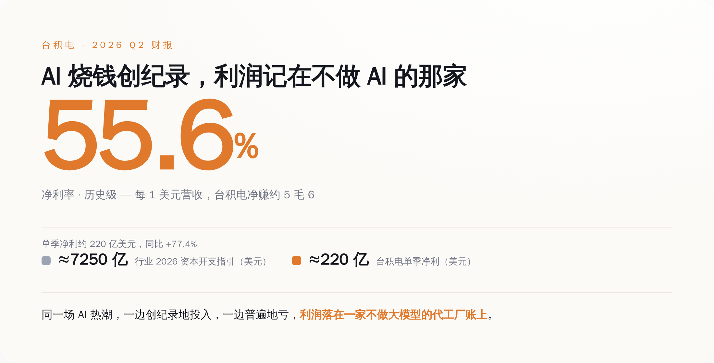
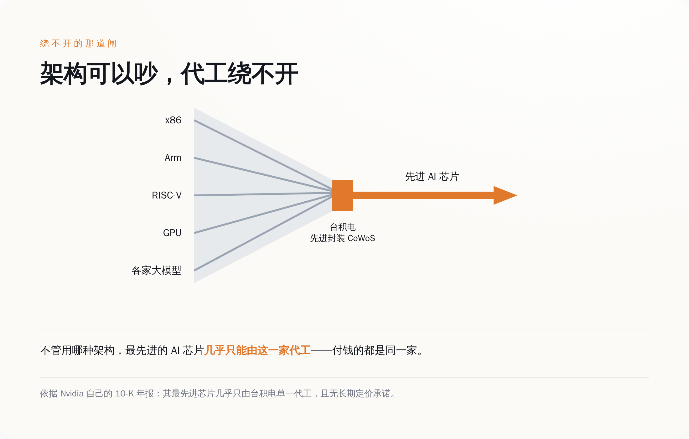
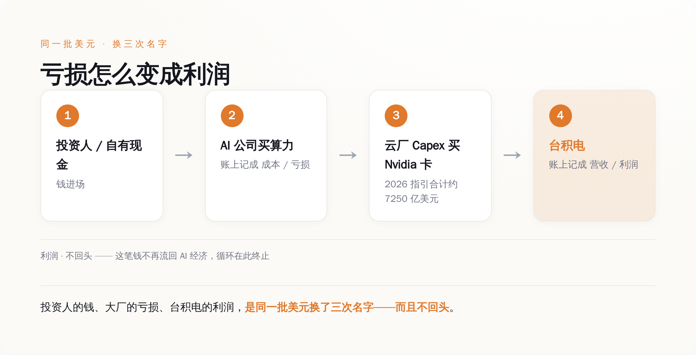

# AI 公司亏掉的钱，正在变成台积电的利润

> **发布日期**：2026-07-20 | **分类**：AI 产业

## 导语

2026 年 7 月 16 日，台积电公布第二季度财报。单季营收 402 亿美元，净利润同比涨了 77.4%，一个季度净赚约 220 亿美元。毛利率 67.7%，是它有史以来最高的一次。

同一个市场里，OpenAI 到今天没盈利；亚马逊、微软、谷歌、Meta 四家，把 2026 年的资本开支指引加到了合计约 7250 亿美元。

翻译一下：一群还在亏钱、或者刚开始赚钱的公司，正创纪录地往里砸钱。而这场 AI 热潮里，把钱实打实变成利润、还数到手软的，是一家一个大模型都不做的代工厂。

这不是两条新闻，是同一笔钱的两个方向。

---

## 一、账先摆出来：AI 里到底谁赚到了钱

先看台积电这份财报，数字都是它自己发的，不用别人转述。

第二季度，营收 402 亿美元，同比涨 33.7%；净利润按新台币算 7065.6 亿，同比涨 77.4%。注意这两个增速：营收涨三成多，利润涨快八成。利润跑得比营收快一倍多，意思是每做一块钱生意，它留下的钱越来越多。

留下多少？毛利率 67.7%，营业利益率 60.3%，两个都是历史新高。净利率 55.6%——一块钱营收进来，扣掉所有成本、税、七七八八，还剩五毛六是净赚的。这是一家重资产、要买最贵的光刻机、盖几百亿美元厂房的制造业公司的净利率。软件公司看了都得沉默一下。

这份财报里，高性能计算这个板块——也就是装 AI 芯片的那一类——占了营收的 66%。一年前这个数字是 60%，上个季度是 61%。手机呢，占 22%，是唯一一个环比在往下掉的板块。台积电的身体，正在肉眼可见地从"给手机做芯片"换成"给 AI 做芯片"。

现在把镜头转到对面。

买这些 AI 芯片、烧这些算力的公司，账本是另一个样子。四大云厂 2026 年的资本开支指引，是它们各自在财报电话会上自己说的：亚马逊约 2000 亿美元，微软约 1900 亿，谷歌母公司约 1800 亿，Meta 一千出头，加起来约 7250 亿美元。这是史上最大的一轮资本开支，比上一年又猛涨了一截。

砸钱砸出利润了吗？至少最靠前的那家没有。OpenAI 到今天没有盈利。Sam Altman 自己 6 月在采访里说，对 AI 花这么多钱、却看不清什么时候回本的担忧，是"眼下对 AI 最公道的批评"。这话是他本人说的，不是外人黑他。

所以这一轮 AI 的账，摊开来就是这样：投入是创纪录的，声量是创纪录的，估值也是创纪录的——而落到利润这一栏、真金白银记成正数的，是一家不训练任何大模型的公司。

*同一场 AI 热潮，投入创纪录，利润落在一家不做大模型的代工厂账上*

这里得先堵一个反驳：台积电赚钱不是新闻，它做代工，行业景气它就赚，这有什么好说的？

对，也不对。台积电赚钱不新鲜，但 67.7% 的毛利率、77.4% 的利润增速不是"景气"两个字能解释的。景气顶多让它多卖货，卖货是营收的事；能让利润涨得比营收快一倍、还把毛利率顶到历史新高的，是另一样东西——定价权。而定价权是从哪来的，才是这篇文章真正想说的。

## 二、它卖的不是芯片，是"你绕不开"

一家公司能把毛利率做到 67.7%，只有一种可能：它卖的东西，客户没有第二个地方买。

台积电就是这个位置。今天全世界最先进的 AI 芯片，从设计图变成能插进服务器的实物，中间那道最窄的关口叫先进封装——把一堆芯片和高带宽内存拼装到一起的工艺，行业里叫 CoWoS。这道工艺的产能，绝大部分捏在台积电手里。芯片再牛，卡在这一步出不来，就是一堆沙子。

这不是我说的，是英伟达自己在年报里承认的。英伟达最新一份提交给美国监管机构的 10-K 年报，白纸黑字写在风险提示里：它最先进的芯片基本上只由台积电这一家代工，没有长期的最低采购量、也没有锁死的价格；想换供应商、建新产能，得等好几个季度。翻译成大白话：全球市值最高的芯片公司之一，把自己的命脉，交在一家它管不着、也没法讨价还价的代工厂手上。

更狠的是，这道关口不挑架构。

台积电 CEO 魏哲家在这次财报电话会上说了一句话，值得一字不差地抄下来：不管用哪种 CPU 路线，是 x86、是 Arm、还是 RISC-V，"它们几乎全都是台积电的客户"。

你品品这句话的意思。芯片行业吵了几十年的架构之争、路线之争，Intel 和 Arm 谁取代谁，RISC-V 能不能翻身——这些台面上打得头破血流的对手，回到台积电这里，是排队交钱的同一批客户。谁赢谁输，对台积电来说区别不大，反正芯片都得从它这儿流片出来。

*架构可以吵，代工绕不开——最先进的 AI 芯片几乎只能由台积电一家造出来*

**这就是为什么它敢把毛利率定在 67.7%。** 不是它人品好或者人品坏，是客户真的没有 plan B。你可以骂它贵，但你骂完还得下单，因为不下单你连芯片都造不出来。定价权不是谈出来的，是"没有替代品"这五个字长出来的。

大模型公司卖的，是"AI 会成"这个赌注。这个赌注可能赢，也可能是场泡沫，收入随时可能被下一个更便宜、甚至免费的模型冲掉。台积电卖的是产能——晶圆一旦排进产线、封装一旦占了机台，那就是确定要付的钱，不管你那个模型最后成没成。

一个卖的是未来会不会兑现，一个卖的是当下绕不绕得开。市场给后者的定价，永远更实。

## 三、同一笔钱，两个方向：亏损怎么变成利润

现在把这两件事接起来看，你会看到一条很干净的资金链。

第一步，钱进场。投资人的钱、大厂账上的自有现金，涌进 AI 这个赛道。

第二步，AI 公司拿这笔钱去买算力。买英伟达的卡、租云厂的机器。在它们的账本上，这笔支出记成成本，规模足够大、收入还跟不上的时候，就记成亏损。OpenAI 的红字，很大一块就是这么来的。

第三步，云厂为了接住这波需求，疯狂扩数据中心。那 7250 亿美元的资本开支，绝大部分变成了对英伟达芯片、以及各家自研芯片的订单。

第四步，英伟达、谷歌、博通这些设计芯片的公司，转头把订单交给台积电代工。到了台积电的账本上，同一笔钱换了个名字——它记成营收，扣完成本记成利润，一个季度净赚 220 亿。

*同一批美元换三次名字：在 AI 公司叫亏损，到台积电叫利润，而且不回头*

看明白了吗。投资人的钱、大厂账上的亏损、台积电账上的利润，**是同一批美元换了三次名字。** 在 AI 公司那一栏它叫"烧钱"，在云厂那一栏它叫"资本开支"，到了台积电这一栏，它叫"净利润"。

而且——这是最关键的一点——这不是一个转圈的游戏。

前些年大家爱讲 AI 行业的"循环融资"：A 投 B，B 拿钱买 A 的服务，钱在几家公司之间转一圈又回到起点，谁也没真赚到。这次不一样。钱流到台积电，就沉下来了，变成一家台湾公司资产负债表上实打实的利润，不再流回 AI 经济里去接着烧。它不是账面上的白条，是可以分红、可以再投资、可以盖厂的真钱。

这条链上还有个细节能坐实它的确定性。英伟达最新的 Blackwell 芯片，已经开始在台积电的亚利桑那工厂投产，第一批"美国制造"的晶圆下了线；谷歌自己设计、用来对抗英伟达的 TPU，也是台积电代工的。也就是说，连那些想摆脱英伟达、自己搞芯片的巨头，绕了一圈，芯片还是从台积电这个院子里出来。它们想绕开的是英伟达，绕不开的是台积电。

所以台积电这个季度把两个数字往上调了：全年营收增速指引，从"超过 30%"提到"略高于 40%"；2026 年的资本开支预算，从 520 到 560 亿美元，加到 600 到 640 亿美元。它等于把整个行业的"投入热情"，直接翻译成了自己账本上确定要收的钱。

## 四、房东经济学：它不赌谁赢，只赌总得有人买算力

财报当天，台积电还宣布了一件事：追加 1000 亿美元投资美国亚利桑那州。加上之前承诺的，它在美国的总投资承诺来到了 2650 亿美元——盖更多 2 纳米的晶圆厂、两座先进封装厂、一个研发中心。这是美国历史上最大的一笔外商绿地投资。

魏哲家给这笔钱的理由是：为美国"领先客户"多年的强劲需求扩产。

请注意他没有说"为 OpenAI 扩产"，也没有说"为谷歌扩产"，他说的是"客户"——一个不指名的复数。这个措辞不是外交辞令，是它的商业模式本身。

台积电从头到尾没有押注哪个大模型会赢。它不关心最后是 OpenAI、是 Anthropic、是谷歌、还是某个突然杀出来的中国开源模型登顶。它只押一件事：不管谁赢，这场仗都得靠芯片打，芯片都得从它这里流出来。这就像一场淘金热里，它不去猜哪个矿工能挖到金子——它把整片矿区唯一的那台采矿机租给了所有人，谁挖到都得先交租，谁没挖到也得付租金。

魏哲家还有一句话，把这层意思说得更透。他说，公司对"多年 AI 大趋势的信心，依然非常高"。信心非常高——对一个卖产能的公司来说，这句话真正的意思不是"我看好 AI 会改变世界"，而是"我看好你们会接着买"。AI 到底能不能兑现那些宏大叙事，跟他关系不大；你们为了这个叙事继续下订单，才跟他有关系。

这也是为什么 2650 亿美元这个数字重要。有人会说台积电这波只是周期性的景气，芯片行业一直是潮起潮落，等这轮 AI 热退了它照样掉下来。可你不会为了一个你认为两年后就退潮的需求，签下一笔十年才能建完、两千多亿美元的厂。这么大的前置投入，赌的不是这一两个季度的行情，是"未来很多年，全世界都得从我这里买最先进的算力"这个结构性判断。

它把话说得很含蓄——"信心非常高"。它把钱砸得很实——2650 亿。这两样放在一起，比任何一份行业预测都诚实。

## 五、看 AI 生意，别看谁声量大，看钱沉在哪

回到开头那个问题：AI 这场热潮，钱到底去哪了。

声量在模型公司。发布会、跑分、估值、融资额，天天上头条的都是它们。但声量不等于利润。到目前为止，这场热潮里最确定、最巨大、还在加速的利润，记在一家你可能一年都想不起来一次、一个大模型都不做的代工厂账上。

不是模型公司在给台积电打工这么简单。更准确的说法是：整个 AI 行业砸下去的钱，有很大一块，在流经这条链条的过程中，被这个物理瓶颈截了下来，沉淀成了利润。你亏的、你投的、你烧的，其中一部分没有消失，它只是换了个名字，落在了一张不做 AI 的资产负债表上。

AI 是不是泡沫，能不能兑现那些宏大叙事，这个可以再吵十年。但有一件事现在就是确定的：只要这台机器还在转，转出来的钱，会先经过台积电的账，再谈别的。

想看懂这一轮 AI 谁真赢了，别盯着谁的模型分最高、谁的发布会最炸。盯着钱最后沉在哪一个环节。

这一轮，那个环节姓台积电。

## 数据来源

- [TSMC — Second Quarter 2026 Results（官方财报新闻稿）](https://pr.tsmc.com/english/news/3326)
- [TSMC — Form 6-K, Q2 2026 Results with Guidance（SEC EDGAR）](https://www.sec.gov/Archives/edgar/data/0001046179/000104617926000451/a2q26e_withguidancexfinal.htm)
- [TSMC — 追加 1000 亿美元投资亚利桑那（公司公告）](https://pr.tsmc.com/english/news)
- [NVIDIA — Form 10-K, FY2026（风险因素：单一代工依赖，SEC EDGAR）](https://www.sec.gov/cgi-bin/browse-edgar?action=getcompany&CIK=0001045810&type=10-K)
