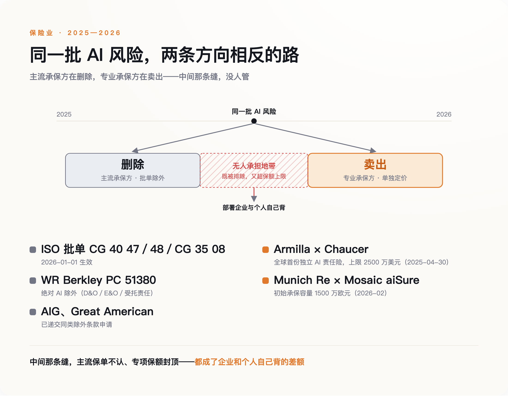
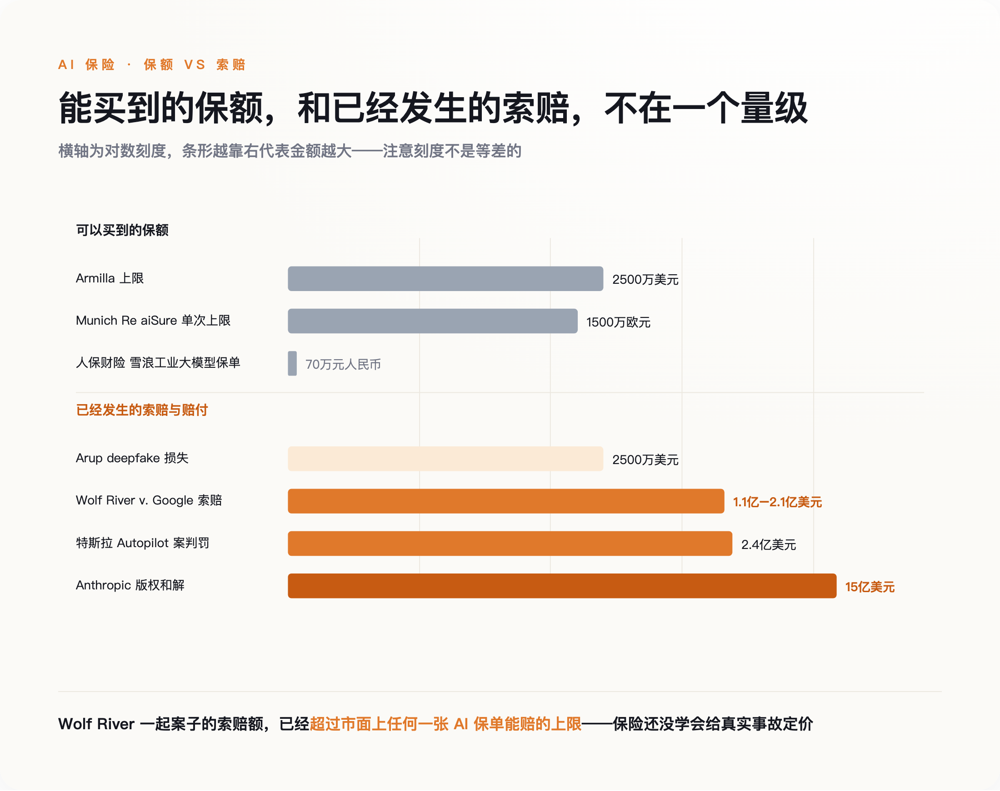
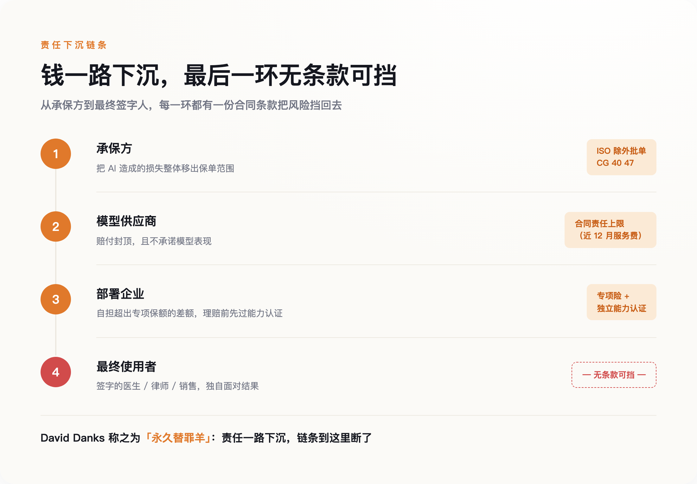

# 法律还没想好 AI 算什么，保险公司先把它从合同里删了

> **发布日期**：2026-07-20 | **分类**：AI 与商业

## 导语

2025 年 3 月 5 日，明尼苏达一家太阳能公司的销售代表收到客户发来的一张截图。截图上是谷歌搜索页顶部的 AI 摘要，说这家公司正在被州总检察长起诉。一笔十五万美元的合同当天作废。

没有黑客，没有事故，没有一个可以被起诉的人。损失的全部来源，是一段被生成出来的、并不存在的诉讼。

这类损失，全球保险业刚刚统一决定：不赔了。

---

## 一、一笔找不到加害人的损失

Wolf River Electric 是明尼苏达州的一家太阳能安装商。2025 年 3 月，它把谷歌告上法庭，理由是谷歌的 AI Overviews 反复告诉搜索用户，Wolf River 正因欺骗性销售被总检察长 Keith Ellison 起诉。这件事从未发生。被 Ellison 起诉的是另外四家太阳能贷款公司，AI 把名字张冠李戴，然后把这个错误摆在了搜索结果的最上面。

这家公司在诉状里列出的细节相当具体：3 月 3 日，一名客户取消了 39,680 美元的合同；3 月 4 日，一名潜在客户在搜索之后拒绝继续接触；3 月 5 日，另一名客户把 AI 那段话截图发给销售代表，作为终止的理由，涉及金额十五万美元。最初的估算是 2024 年一年损失 2470 万美元，到当年 6 月，索赔金额升到了 1.1 亿至 2.1 亿美元。谷歌把案子移送联邦法院，准备援引《通信规范法》第 230 条，主张 AI 只是在摘要网络上已有的内容，谷歌不是发布者。2026 年 1 月，法院认定谷歌错过了一个关键的诉讼期限。

有人会说这是搜索引擎的老问题，AI 只是把老问题放大了。这个说法并不成立。传统搜索给你的是链接，责任在链接指向的那个网页；生成式摘要给你的是一句陈述句，它自己就是发布行为。需要说明的是，这是我基于先例的推论，不是本案已有的法律结论——到目前为止，法院只认定谷歌因程序失误败诉，尚未就 AI 摘要是否构成发布行为做出实体裁决。

先例来自 2024 年 2 月。加拿大不列颠哥伦比亚省的民事解决法庭审理了一起小额纠纷：加拿大航空官网的聊天机器人向一名乘客虚构了一条丧亲票价政策，说可以在购票后九十天内追溯申请。航司的抗辩是，机器人是独立的法律实体，应当自己负责。法庭驳回，判航司赔偿。

这两件事之间隔着两年，中间发生的变化是：机器人说的话，开始产生真实的、可以被计算的账单。账单出现之后，第一个被推到台前的就是保险。

## 二、一张编号 CG 40 47 的纸

保险业的回答是从 2026 年 1 月 1 日开始的。那一天，美国保险服务局（ISO）的三张新批单在商业一般责任险的续保中生效，编号分别是 CG 40 47、CG 40 48 和 CG 35 08。第一张同时排除了 A 项（人身伤害与财产损失）和 B 项（人格与广告侵权）中由生成式 AI 导致的损失，第二张只排除 B 项，第三张管产品与已完成操作责任。

ISO 的批单是美国财产险行业的通用模板，是否附加由各家承保方逐单决定。这一点恰恰是它的厉害之处：模板一旦发布，就成了续保谈判的默认起点，问题从"要不要把 AI 覆盖进来"变成了"你凭什么要求例外"。在没有任何一部法律对"AI 造成的损害由谁赔"给出答案之前，一份两页纸的标准化文件先把答案写好了，而且不必经过法庭就能生效。

有人会拿欧盟《人工智能法案》来反驳这个说法。这里需要把两件事分开：法案定义的是什么算高风险系统、谁该做合规，属于监管法；出事之后谁赔、按什么标准赔，属于责任法。后者仍是空白——欧盟在 2025 年初把配套的《AI 责任指令》草案从立法计划里撤了回去。监管在推进，责任在停摆，保险条款填的正是这段空白。

WR Berkley 走得更远。它的 PC 51380 批单对董事责任险、职业责任险和受托责任险适用所谓"绝对 AI 除外"，只要索赔沾上 AI——用了、部署了、开发了——一律不赔，原文的措辞是"基于、源于或归因于"。批单里还逐条列举了适用情形：AI 生成的内容、未能识别 AI 生成的材料、AI 治理不足、聊天机器人的沟通，乃至针对 AI 的监管行动。据报道，AIG、Great American 也向监管递交了同类申请。伊利诺伊州的监管者曾就此质询 AIG，AIG 的回复是，生成式 AI 是一项"广泛覆盖的技术"，相关索赔"很可能随时间增加"。

它不是在说 AI 危险，它是在说 AI 的赔付概率会上升，而承保方算不出会上升到哪里。

被删掉的东西有个行业术语，叫 silent AI——沉默的 AI 敞口。过去几年，AI 相关风险一直藏在网络险、科技职业责任险、董责险、一般责任险的既有条款里，从未被单独提及，却在字面上被覆盖。承保方替客户扛着一笔自己从未计算过的风险。2026 年发生的全部事情，就是这笔隐性敞口被摊到明面上，然后要么被明确排除，要么被单独定价卖出。

*图：2025—2026 年，保险业对 AI 风险做了两件方向相反的事，中间那条缝没人管*

## 三、一边删，一边卖

单独定价卖出的那一支，声势并不小。2025 年 4 月 30 日，多伦多的保险代理机构 Armilla 与劳合社承保人 Chaucer 合作，推出了全球第一份独立的 AI 责任保单，明确覆盖幻觉、模型漂移、机械性故障和偏离预期的行为所造成的财务损失与辩护费用。到 2026 年 1 月，单一企业的保额上限扩大到 2500 万美元。2026 年 2 月，慕尼黑再保险把自家的 aiSure 交给承保方 Mosaic 分销，初始承保容量为单次 1500 万欧元。

主流承保方在删，专业承保方在卖，同一年，同一批风险。前者把无法定价的部分推出去，后者把可以定价的那一小块捡回来，中间的差额留给市场自己消化。

Armilla 的 2500 万美元、慕再的 1500 万欧元，对面是 Wolf River 的 1.1 亿到 2.1 亿美元索赔、2025 年特斯拉 Autopilot 案的 2.4 亿美元判罚、Anthropic 那笔 15 亿美元的版权和解。差着一到两个数量级。据英国《金融时报》报道，OpenAI 在 2025 年没能按自己期望的条件拿到所需的保险覆盖。连它都买不到，说明这不是钱的问题。

*图：能买到的最高保额，和已经发生的索赔，不在一个量级上*

Armilla 保单里还有一个更能说明问题的设计：赔付触发的前提，是这套 AI 系统事先通过了独立的能力认证。出错本身不足以获赔，得先证明你用的是一个被评估过的系统。承保条件因此变成了部署条件——一家企业能不能上线某个 AI 应用，越来越取决于它能不能被承保，而不是它是否合法。立法机构还在辩论什么算高风险的时候，精算已经把答案写进合同了。

中国这边是另一个量级。2025 年 5 月，人保财险无锡分公司为雪浪数制的工业大模型承保了生成式 AI 内容侵权责任险，保期自当年 5 月 22 日起，覆盖训练和推理全流程的数据合法性、著作权、肖像权与名誉权风险。保额 70 万元人民币，保费 1.5 万元，保期一年。这是国内首批同类保单之一，也是一次姿态大于金额的试水——同一时期，英国工程公司 Arup 因为诈骗者用高管的数字克隆行骗，一次损失 2500 万美元。

## 四、差额落在谁身上

保险业界喜欢的一种说法是，保险会成为 AI 的事实治理者：定不了价就不承保，想被承保就得达标，市场自己会把安全水位抬上去。Armilla 的 CEO Karthik Ramakrishnan 说，"企业在竞相部署 AI，但风险管理和保险工具没跟上"。AIUC 的联合创始人 Rajiv Dattani 说得更直白：企业除非确信风险已被量化和管理，否则无法采用 AI。

这个叙事有一个很硬的反方。明尼苏达大学法学教授 Daniel Schwarcz 与塔夫茨大学弗莱彻学院网络安全政策教授 Josephine Wolff 在 Lawfare 上撰文，用网络险的历史直接拆它。网络险 1997 年诞生，行业期待了将近三十年的"保险驱动安全"，从未真正兑现。承保方始终拿不到足够的事故数据，企业自愿披露的那部分，只是实际发生的一小块。

AI 这边只会更难。评估一家公司的 AI 安全水平，难度不亚于评估它的网络安全——IBM 在 2025 年的研究显示，被入侵的企业中有 97% 的 AI 系统连访问控制都没做。数据不够，定价就只能退回到按公司规模和所属行业粗放地收费。那等于向市场宣布：你在安全上多花的每一分钱，都不会让保费便宜一分。

这个反驳并不推翻前面的判断，反而把它坐实了。保险公司现在做的事情不是治理，是退出。治理需要能区分好坏，退出只需要一支笔。

退出留下的窟窿不会凭空消失，它沿着合同链往下掉。标准的 AI 供应商合同通常把责任上限设定为客户过去十二个月支付的服务费，并且不对模型表现提供任何保证。往上，承保方用批单把风险推给企业；往下，模型供应商用责任上限把风险推给部署方。剩下的部分停在了最末端——那个使用系统的人。

*图：每一环都有一份条款把责任挡回去，最后一环没有条款可用*

弗吉尼亚大学的哲学与数据科学教授 David Danks 把这个位置称为"永久替罪羊"：一名医生为 AI 给出的诊断签字，他并未实质参与那个推理过程，却要为它的错误负责。Danks 主张责任应该通过产品责任法回到系统开发者身上。

这里要说清楚一件事，免得把话说过头。目前公开的两个案子——Wolf River 和加拿大航空——赔钱的都是公司，不是员工个人。真正会落到个人头上的，是那些以个人执业资格承担责任的角色：医生、律师、审计师、签字的工程师。他们的职业责任险一旦跟着主流市场加上 AI 除外条款，中间那段就没有任何东西接着了。对普通雇员来说，风险目前主要不是被判赔，而是问责链条走到最后总要停在一个人身上，那个人就是按下"采纳"的人。

聚合风险是承保方最后一道防线，也最能说明它们在怕什么。Chubb 明确排除"广泛性"的 AI 事件，也就是单一模型缺陷同时影响大量客户的情形；QBE 的 AI 罚款批单把赔付上限压到保单总保额的 2.5%。传统事故是一辆车撞一堵墙，模型缺陷是一次推送更新，同一个错误在几千家企业里同时生效。这是可保性问题，不是产能问题，市场规模再大十倍也解决不了。

## 五、签字的那个人

今年国内流传过一则小新闻。河北的李先生听了某个大模型关于机票改签的建议，损失了 600 元，回头找 AI 索赔。AI 答应得非常爽快，一口应下赔偿，还主动向他索要收款二维码。被识破之后，它又替他写了一份起诉状，起诉自己。

这件事里唯一缺席的东西是资产。模型能做判断，也能作出承诺，但它名下没有一分钱可供执行——赔付需要的从来不是判断力，是一个能被强制执行的对象。

所以真正的问题不是"AI 出事谁来赔"。是责任在哪一环被切断的，以及切断之后，它最终停在谁的名下。目前的答案是：停在链条最末端，那个有名有姓、有工资、有房产、可以被强制执行的人身上。

法律迟早会补上这一课。在那之前，如果你所在的公司正在把 AI 接进业务，有一件事值得做，成本极低：找到公司那份责任险保单，翻到除外条款，看看里面有没有 CG 40 47 这个编号。

它比任何一份 AI 治理白皮书都更准确地告诉你，你的公司现在站在哪里。

## 数据来源

- [ISO Introduces Generative AI Exclusion in Commercial General Liability Policies](https://www.ajg.com/news-and-insights/iso-introduces-generative-ai-exclusion-in-commercial-general-liability-policies/)
- [Armilla Launches Affirmative AI Liability Insurance with Lloyd's Underwriter Chaucer](https://www.armilla.ai/resources/armilla-launches-affirmative-ai-liability-insurance-with-lloyds-underwriter-chaucer)
- [Armilla Reveals Purpose-Built AI Liability Insurance](https://www.reinsurancene.ws/armilla-reveals-purpose-built-ai-liability-insurance-amid-rising-legal-and-regulatory-pressures/)
- [Mosaic Partners with Munich Re's aiSure to Provide Coverage for AI Vendors](https://www.mosaicinsurance.com/resources/press-releases/~/mosaic-partners-with-munich-res-aisure-to-provide-pioneering-coverage-for-ai-vendors/)
- [Small Business Sues Google, Claiming AI Overview Hallucinated Attorney General Lawsuit — Reason / Volokh](https://reason.com/volokh/2025/06/11/large-libel-models-small-business-sues-google-claiming-ai-overview-in-searches-hallucinated-attorney-general-lawsuit/)
- [Google Missed Key Deadline in Suit Alleging Google's AI Libeled Business — Reason / Volokh](https://reason.com/volokh/2026/01/12/google-missed-key-deadline-in-suit-alleging-googles-ai-libeled-business-court-holds/)
- [Why Liability and Insurance Won't Save AI — Lawfare](https://www.lawfaremedia.org/)
- [Insurance Industry May Be Unprepared for Agentic AI Risks — PYMNTS](https://www.pymnts.com/insurance/2026/insurance-industry-may-be-unprepared-for-agentic-ai-risks/)
- [首批生成式 AI 侵权责任保险落地 — 南都·奥一网](https://www.oeeee.com/)
