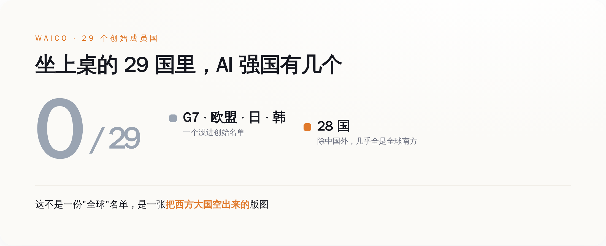
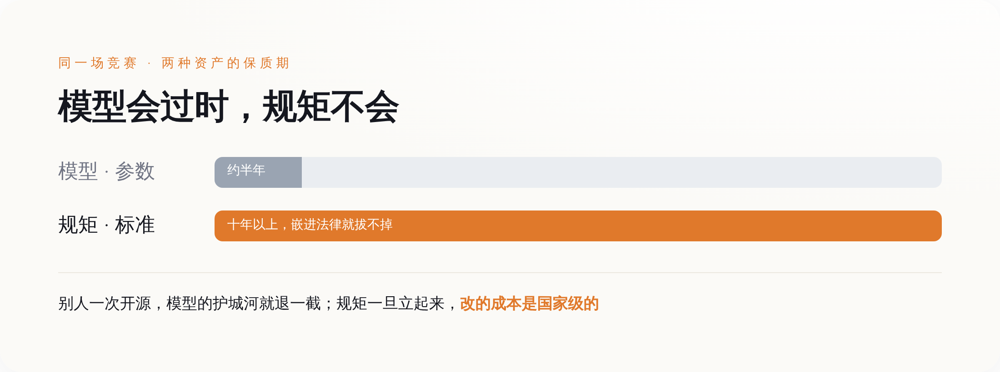
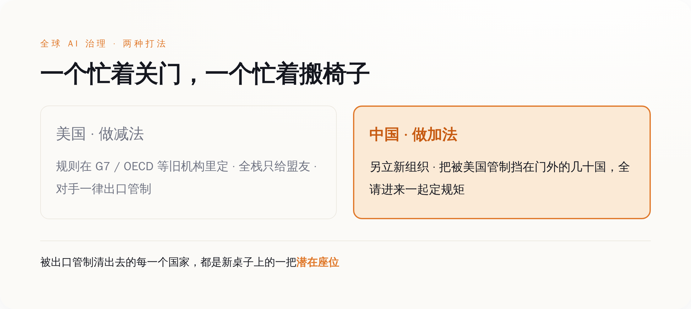

# 29 国在上海给全球 AI 定规矩，桌上没有美国

> **发布日期**：2026-07-20 | **分类**：AI 治理

## 导语

这一周，所有人的注意力都在模型跑分上。谁家的新模型又刷了榜，谁把 token 价格又打下去一截，谁的 agent 又能自己订机票了。热闹，很热闹。

同一周，7 月 16 日，上海办了一件安静得多的事：29 个国家的代表坐到一张桌子前，签了一份协定，成立了一个叫「世界人工智能合作组织」的东西。中文简称世界人工智能合作组织，英文缩写 WAICO，总部就设在上海。

签字的时候没什么爆点，没有跑分，没有 demo，没有发布会那种灯光。就是一群人签了个字。

但你把这两件事摆一起看就有意思了。一边是全世界比着谁的模型更聪明，一边是有人不声不响地，把「以后 AI 这套东西到底听谁的」做成了一个有总部、有章程、有 29 个成员国的正经组织。

模型是会过时的。这个组织不会。

## 一、先把事情摆平：上海那张桌子上，到底签了个啥

先说清楚发生了什么，别急着上价值。

7 月 16 日，《成立世界人工智能合作组织协定》签署仪式在上海举行。中国这边，是外交部长王毅代表政府签的字。签字仪式上还坐着一位分量不轻的客人——联合国秘书长古特雷斯本人到场。第二天 7 月 17 日，习近平在 2026 世界人工智能大会开幕式上发表讲话，题目叫《携手构建公正合理的全球人工智能治理体系》，正式对外宣布了这个组织。

这个组织的官方定位，是「独立的政府间国际组织」。翻译一下这几个字的分量：它不是一个论坛，不是一个倡议，不是又一份谁都可以不签的宣言。政府间国际组织，是跟联合国、世贸组织、国际电信联盟同一个物种的东西——有法人地位，有常设机构，有成员国，理论上能立规则、能被别的国家承认。多家中方通稿里给它的头衔是「全球首个人工智能领域的独立政府间国际组织」。

第一个。这三个字是重点。

在这之前，全世界管 AI 的「规矩」，散落在一堆地方：G7 开会发个声明，OECD 出个原则，联合国搞个高级别咨询小组写份报告，欧盟自己立个《AI 法案》。这些东西的共同点是——都不是一个专门为 AI 设立、能把各国拉进来一起签字的常设组织。大家都在谈治理，但没人把「治理」这件事做成一张固定的桌子、摆上固定数量的椅子。

现在有人把桌子搭起来了，还摆在了自己家客厅里。

## 二、这份名单最狠的地方，是「谁没来」

一个组织成没成气候，看两样东西：谁来了，谁没来。先看谁来了。

29 个创始成员国，除了中国，另外 28 个几乎清一色是「全球南方」：俄罗斯、白俄罗斯，中亚的哈萨克斯坦、吉尔吉斯斯坦、塔吉克斯坦、乌兹别克斯坦；南亚东南亚的巴基斯坦、印尼、马来西亚、老挝、柬埔寨、缅甸；非洲一长串——阿尔及利亚、喀麦隆、刚果（金）、埃塞俄比亚、肯尼亚、莱索托、莫桑比克、塞内加尔、南非、赞比亚；拉美的巴西、古巴、尼加拉瓜、委内瑞拉；中东的阿曼；欧洲只有一个塞尔维亚，还是巴尔干的非欧盟国家。

然后是谁没来。G7 七国——美国、英国、法国、德国、意大利、日本、加拿大——一个没有。欧盟 27 国，一个没有。韩国，没有。你把全世界公认的「AI 强国」排一排，几乎没有一个出现在这份创始名单上（笑）。

这就很微妙了。一个号称管全球 AI 治理的组织，创始成员里找不到几个真正跑在 AI 最前面的国家。你说它「全球」吧，全球最能打的那批玩家全缺席；你说它不重要吧，它偏偏是第一个把政府间组织这个壳给立起来的。

有人看到这份名单，第一反应是「这不就是个反西方俱乐部摆拍嘛，凑一桌又造不出更强的模型」。这个吐槽不算错，但它看漏了一层——这张桌子要抢的东西，从来就不是「今天谁的模型强」。

它要抢的，是那批还没被任何人锁定的国家。非洲、中亚、东南亚、拉美这几十个国家，眼下自己没有多少 AI 能力，未来十年却要把政务、医疗、金融、教育一样样搬上 AI。它们最后用谁的技术标准、按谁的数据规则、接谁的算力，现在是一张白纸。谁先把它们拉进一个组织、开始一起制定规则、开始给它们发培训名额，谁就在这张白纸上落了第一笔。

至于美国、欧盟这些国家在不在——它们本来也不缺规则，缺的话也轮不到别人给它们定。

*29 把创始椅子里，传统 AI 强国坐了 0 把——这是一张把西方大国空出来的版图*

## 三、模型每半年翻篇，规矩立起来能管十年

到这里得把这篇文章真正想说的那句话摆出来了。

这一轮 AI 竞赛，大家盯着看的是模型：参数多少，跑分多高，多少 token 多少钱。但模型这东西有个要命的特点——它贬值贬得飞快。今天的顶配模型，半年后就是别人开源版本免费送的东西。你花几百亿美金训出来的护城河，别人一篇论文、一次开源，水位就退下去一截。硬实力是硬，但它硬不了多久。

真正贬值慢的，是规矩。

标准、治理框架、合规要求这些东西，一旦嵌进一个国家的采购流程、数据法规、行业验收里，就长在那儿了。想换，成本是国家级的——得改法律，得重做系统，得让一整代已经按老标准训练出来的工程师重新学。国际电信联盟上世纪定下的那些通信标准，几十年了照样在管着全世界的电话怎么打；今天没人记得当年谁家的交换机性能最强，但那批规矩还在。

AI 现在到的，就是这个岔路口。谁定的规矩能嵌进最多国家的骨头里，谁就拿到了那笔贬值最慢的资产。

从这个角度回头看习近平在开幕式上宣布的那些承诺，就不像客套话了。他讲话里最实的一条是：未来 5 年，中国面向发展中国家提供 5000 个人工智能专题研修培训名额；还要给东盟、非盟、拉共体这些区域建「国际人工智能应用合作中心」，把气象预警系统「妈祖」推广到 30 个国家。配套的还有国家发改委发的《人工智能合作发展行动计划》，里头八项行动，专门有一项叫「智能算力普惠行动」，明说要「面向发展中国家提供普惠智算服务」。

先别急着被数字唬住，也别急着嫌它小。5000 个名额摊到 28 个发展中成员国，一个国家一年平均不到 40 个人——说实话，象征意义远大于实际规模。真要靠这几千个名额补上「数智鸿沟」，杯水车薪。

但标准竞争这件事，从来就是象征先行、路径依赖后成。重点根本不是今年培训了多少人，而是这些人回国之后，按谁的框架去搭他们国家的第一套 AI 系统。第一套系统用了谁的标准，第二套大概率接着用，因为迁移成本太高。等一个国家的政务云、医院系统、金融风控全长在一套标准上，再想换，就不是技术问题，是政治问题了。

**你训练的是模型，我培训的是「以后按我的规矩写代码的人」——这两件事的保质期，差着一个数量级。**

*模型的护城河别人一次开源就退一截，规矩一旦嵌进法律和采购，改的成本是国家级的*

## 四、美国不是没资格坐，是它换了个房间打

这么重要的桌子，美国怎么就不坐？是没被邀请，还是没看上？都不是。美国不坐这张桌子，是因为它早就自己另开了一间房，而且认定规则应该在旧房间里定——那些它自己说了算的旧房间。

2025 年 7 月 23 日，几乎正好在 WAICO 成立一年前，白宫发布了一份文件，名字起得毫不含蓄，叫《赢得竞赛：美国人工智能行动计划》。这份文件 90 多项行动，第三根支柱专门讲「在国际 AI 外交与安全领域保持领导地位」。它的思路，白纸黑字写着几条：

一是把「全栈 AI 出口包」——硬件、软件、加上治理标准打包——推销给盟友，让盟友用美国的整套东西。二是明确要「在联合国、OECD、G7、G20 等机构里反制中国的影响力」。三是加强对芯片和关键技术的出口管制，别让对手搭便车。

看明白了吗。美国不是不玩标准战，它玩得比谁都凶。只是它的打法是：规则在我主导的那些老机构里定（G7、OECD、这些桌子本来就是西方搭的），技术只给盟友用，对手一律出口管制卡死。它信的是一个「以我为核心、盟友环绕、对手隔离」的圈子。

于是就出现了这一年最有意思的一组对照。

美国的策略是做减法：收紧、管制、只给自己人，把中国从旧房间里往外挤。中国的策略是做加法：另立一个新组织，把美国出口管制挡在门外的那几十个国家，全请进来一起定规矩。一个忙着关门，一个忙着搬椅子。美国的出口管制清出来的每一个「买不到最先进美国芯片」的国家，某种程度上，都是 WAICO 名单上的潜在座位。

哪种打法更高明，现在下结论太早。但有一件事是清楚的：**当一方在旧牌桌上驱逐对手时，对方直接掀桌另开了一局，还把被驱逐者都拉了过去。**

*美国收紧旧机构、只给盟友、管制对手；中国另起一桌，把被管制挡在门外的国家全请进来*

## 五、结尾

回到开头那个对照。

这一周，模型跑分的新闻你大概明天就忘了，因为下周又有新的跑分。参数是流量，来得快去得也快。而 7 月 16 日上海那张桌子上签的字，是存量——它要过很多年才看得出分量，可一旦看出来，就很难再抹掉。

还有个细节值得多看一眼：联合国秘书长古特雷斯亲自到了 WAICO 的签字现场。而与此同时，联合国自己主导的「人工智能治理全球对话」首届会议，也定在 2026 年 7 月，在日内瓦开。两条平行的轨道，同一个月，一条在上海，一条在日内瓦，联合国的一把手两头都要照顾。这本身就说明，全球 AI 治理这盘棋，已经不是「要不要下」的问题，而是「在谁的棋盘上下」的问题了。

所有人都在问哪个模型最强的时候，有人已经在问一个更值钱的问题：以后这套东西，到底该听谁的。

桌子搭好的那一天，真正的胜负手，就已经不在模型上了。

## 数据来源

- [习近平出席2026世界人工智能大会开幕式并发表主旨讲话《携手构建公正合理的全球人工智能治理体系》，新华社](http://www.news.cn/politics/20260717/)
- [29 countries sign agreement on establishing World AI Cooperation Organization，中国政府网 english.www.gov.cn](https://english.www.gov.cn/news/202607/17/content_WS6a59a226c6d00ca5f9a0c432.html)
- [国家发展改革委《人工智能合作发展行动计划》，国家发改委官网](https://www.ndrc.gov.cn/)
- [Winning the Race: America's AI Action Plan（2025年7月），美国白宫](https://www.whitehouse.gov/wp-content/uploads/2025/07/Americas-AI-Action-Plan.pdf)
- [联合国大会决议 A/RES/79/325：设立独立国际人工智能科学小组，联合国](https://docs.un.org/en/A/RES/79/325)
- [2026世界人工智能大会闭幕数据（参展1117家、展品4486项、意向采购203.6亿元），大会组委会官方通稿](https://www.worldaic.com.cn/)
