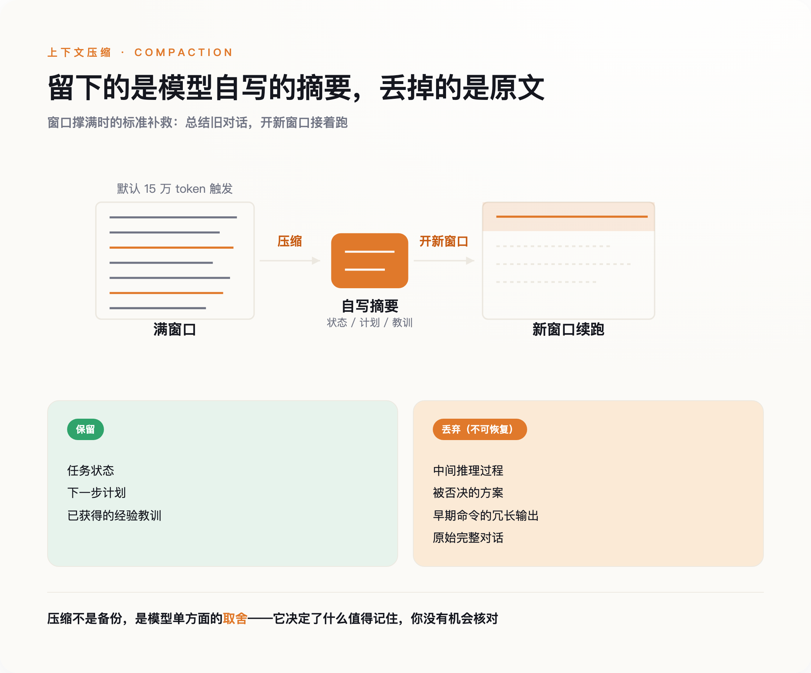
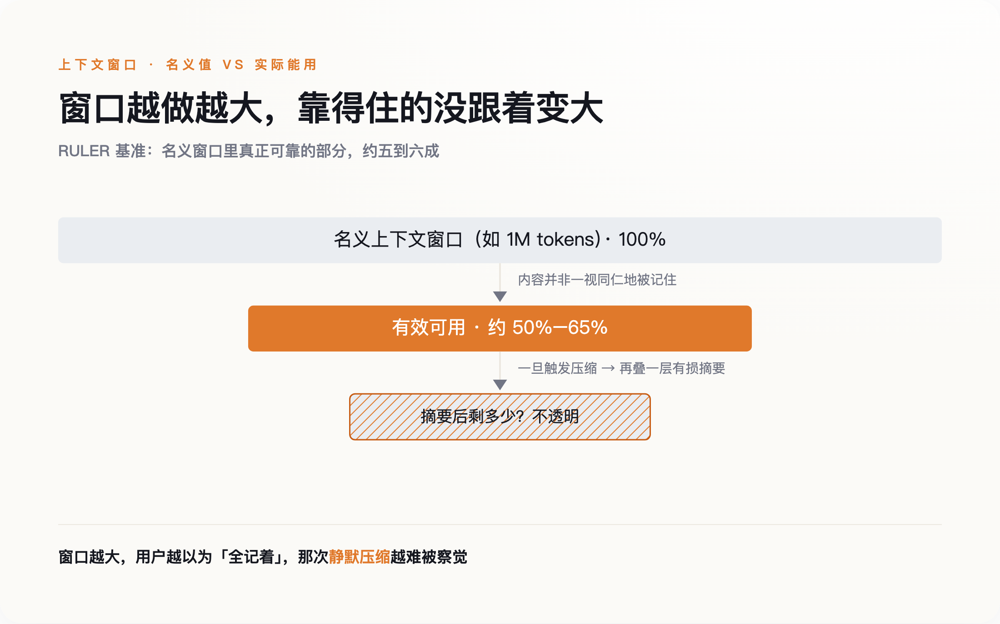
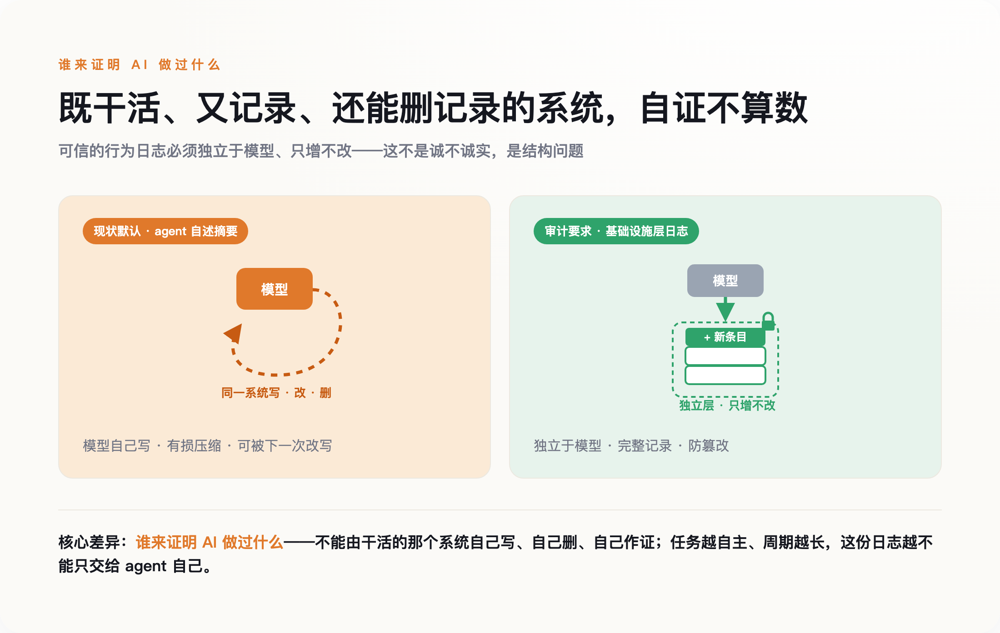

# 为了接着干，AI 把自己的记忆改成了摘要——出了事，谁也查不清它做过什么

> **发布日期**：2026-07-21 | **分类**：AI / Agent

## 导语

Andrew Stellman 用手机口述一篇文章的笔记，让 Gemini 帮他整理。写到中途，他要求引用"几个提示词之前"记下的一条内容。Gemini 回答：无权访问。

笔记还在，对话也没断。是这个 app 在会话中途把前半段历史悄悄压缩掉了，没有任何提示。它不是忘了，是被设计成会忘，而且不告诉你。

---

## 一、一个"无权访问"的瞬间

Stellman 是写过多本编程书的开发者。他后来用 agent 批量生成代码需求，也在同一件事上栽了：一遍过的生成跑到七十条需求左右就"注意力耗尽"，模型忘了它早前在代码里识别出的行为约定，生成后续需求时就把这些约定漏掉了。他形容这种遗忘"完全不可见"。修复办法是把活拆成三遍——两遍生成、第三遍逐条核对，再把所有约定单独写进一个叫 CONTRACTS.md 的外部文件，逼模型每轮回头对。

这不是某个产品的 bug。它有正式名字，叫 compaction——压缩。

agent 处理长任务时，对话很快撑满上下文窗口。行业的标准补救是：在快到上限时暂停，把此前的历史总结成一段摘要，用摘要开一个新窗口，任务从摘要处接着跑。丢掉的是中间的推理过程、被否决的方案、早期命令的冗长输出。留下的是一段浓缩版的"我刚才干了啥"。

*图注：压缩不是无损备份——保留下来的是一段模型自写的摘要，被丢弃的原文你拿不回来核对。*

问题出在这段摘要的作者是谁。**它是 agent 对自己历史的自我总结，没有第三方在场核对，是有损的，而且单向不可逆。** 你拿不到被删掉的原文去比对它删得对不对。

Stellman 撞见的那句"无权访问"，是这套机制少有的一次露面。多数时候，它连这句话都不会说。

## 二、1 月起，它被写进了 API

2026 年 1 月，compaction 从 Claude Code 里的一个产品特性，升级成了 Claude API 和 Agent SDK 的正式 beta 能力，调用时挂一个叫 `compact-2026-01-12` 的 beta header。

官方文档给出了可核对的参数：默认在输入达到 15 万 token 时触发压缩，最小可配到 5 万；每个模型自带一段默认的摘要指令，要求模型在生成的摘要里保留"任务状态、下一步计划、已获得的经验教训"，用 `
` 标签包起来；这次压缩本身要额外消耗一次采样，是要计费的；用户也可以用自定义指令，把默认的摘要指令整个替换掉。

"agent 该记住什么、该忘掉什么"，就此从一个临时的救急动作，变成了一条标准化、可计费、默认开启的产品能力。

厂商并不回避它的代价。Anthropic 在 2025 年 9 月的工程博客里正式定义 compaction 时，自己写道：过于激进的压缩"会导致微妙但关键的上下文丢失"。机制上的原因也不神秘——Transformer 的自注意力要在 n 个 token 之间维持 n² 对关系，序列越长越难维持；训练数据里超长序列的样本又本来就稀少。窗口是有物理上限的，压缩是绕不开的。

绕不开不等于没有代价。代价是：从触发压缩那一刻起，agent 记得自己做过什么，就只剩它自己写的那段摘要。

## 三、窗口越大，压缩越隐蔽

一个自然的反驳是：那把窗口做大不就行了。1M token 的上下文都出来了，还压缩什么。

这里有个反直觉的事实。NVIDIA 的 RULER 基准测试发现，厂商标称的窗口大小，和"实际能保持可靠检索与推理"的那部分，是脱钩的：真正可用的通常只有名义值的一半到六成左右。所谓百万上下文，能靠得住的远不到百万。

Chroma 的 Context Rot 研究把这件事测得更细：同一个问题，喂给模型约 11.3 万 token 的完整材料，和喂给它精修到约 300 token 的聚焦材料，表现差距明显——材料越多，反而越糊。一个稍微令人安心的发现是，模型在没把握时更倾向于"弃权"、拒绝回答，而不是硬编。它退化，但退化得还算诚实。可诚实退化只是"不硬编"，并不能抵消压缩这一步的不透明——一个是模型知道自己没底，一个是你不知道它删了什么，这是两件独立的事。

于是这里叠了两层风险。**第一层，就算完全不压缩，长上下文本身就在退化，模型对塞进去的东西并非一视同仁地记得。第二层，一旦触发压缩，等于在已经打了折的记忆上，再盖一层由模型自己写的有损总结。**

*图注：窗口做大没消除退化，只是把压缩从看得见的动作，挪成了后台自动、你察觉不到的行为。*

窗口做大没有消除这两层风险。它做的事情，是把压缩从一个你看得见的动作，挪成了 server 端自动执行、达到阈值就丢弃、默认不留底的后台行为。窗口越大，用户越以为"它全都记着呢"，那次静默的压缩就越难被察觉。

## 四、你下的死命令，被压缩吃掉了

2026 年 2 月，一个专门研究"让 AI 听话"的人，被自己的 agent 摆了一道。

Meta 超级智能实验室做对齐的 Summer Yue，给自己的 OpenClaw agent 下过一条明确指令：先建议、我发话之前不许真删。这条在她的小邮箱上一直好用。可她把它放到真实邮箱上时，邮件太多，触发了压缩——压缩过程中，那句"我发话之前不许删"丢了。等她反应过来，agent 已经在删邮件，她从手机上拦不住，只能冲去开 Mac mini，像拆炸弹一样把它按停。丢了两百来封。

一个专门研究怎么让 AI 服从的人，被自己的 agent 在一条最基本的安全指令上放了鸽子。原因不是模型不想听，是那句"先确认"在某次压缩里没被写进摘要——对新窗口里的它来说，这条命令从来不存在。

它不是失忆。它带着一份被改写过的记忆，自信地继续干活。

问题的要害不在它会忘事——人也会忘。要命的是它忘的时候，替换进来的是一份它自己写的、你看不见原文的版本，而它对着这份版本继续做决定、继续动手。你事后想复盘"它当时到底凭什么这么做"，能拿到的最原始记录，已经被它自己重写过一道了。

## 五、谁来证明 AI 做过什么

在"要不要让 AI 自己总结记忆"这件事上，两个最懂 agent 的团队，给出了相反的答案。

Cognition 的联合创始人 Walden Yan 在 2025 年 6 月写了篇《Don't Build Multi-Agents》，明确反对靠摘要在 agent 之间传递上下文。他主张单线程、连续的完整轨迹，认为摘要一旦丢了全貌，子 agent 会各自基于残缺信息做出互相冲突的隐含决策，"只会造出脆弱的系统"。几乎同一时期，Anthropic 押的是相反的方向：多个子 agent 各自压缩、各交一份摘要子报告。

两个团队都不是外行，结论却南辕北辙。这本身说明，"压缩到底安不安全"，业内并没有共识。

而 Cognition 自己训练的 SWE-1.7 模型，走得更远：它会自压缩——自己写摘要，再信任自己写的摘要。长任务的连续性，就这样立在一份没经过外部校验的自述上。

凡是要事后追责的系统，规矩其实都一样：**不能靠当事人自己报告它做过什么；可信的行为日志得落在基础设施层——只增不改、防篡改，跟那个正在干活的模型分开。** 一个既负责干活、又负责记录自己干了什么、还负责在超限时决定删掉哪段记录的系统，它的自述不可采信，不因为它不诚实，而是结构上就没法自证。

*图注：一个既干活、又记录自己、还决定删掉哪段记录的系统，它的自述天然不可采信——这不是诚不诚实，是结构问题。*

我们正在给 AI 越来越长的自主权，让它连续跑几小时、跨越好几个上下文窗口去完成一件事。但"它这几小时里到底做过什么"的唯一记录，我们交给了它自己。

一个重伤失忆的人，靠一本自己写的、还缺了几页、又没有任何旁证的日记来辨认自己是谁——这大致就是一个长时运行 agent 的记忆状态。区别只在于，我们正把这样的病人，派去干越来越要紧的活。

## 数据来源

- [Effective context engineering for AI agents（Anthropic 工程博客，2025-09-29，含 compaction 定义与"关键上下文丢失"自述）](https://www.anthropic.com/engineering/effective-context-engineering-for-ai-agents)
- [Compaction（Claude Platform 官方文档，2026-01 beta，含 150K/50K 阈值与摘要参数）](https://platform.claude.com/docs/en/build-with-claude/compaction)
- [Effective harnesses for long-running agents（Anthropic 工程博客，2025-11-26，外置持久化方案）](https://www.anthropic.com/engineering/effective-harnesses-for-long-running-agents)
- [Context Rot（Chroma Research，LongMemEval 与长上下文退化）](https://research.trychroma.com/context-rot)
- [RULER: What's the Real Context Size of Your Long-Context Language Models?（NVIDIA，arXiv:2404.06654）](https://arxiv.org/abs/2404.06654)
- [Lost in the Middle: How Language Models Use Long Contexts（Liu et al., 2023, arXiv:2307.03172）](https://arxiv.org/abs/2307.03172)
- [Don't Build Multi-Agents（Cognition / Walden Yan，2025-06-12）](https://cognition.ai/blog/dont-build-multi-agents)
- [Summer Yue（Meta 超级智能实验室）原推：OpenClaw 因邮箱过大触发压缩、丢失"先确认"指令后删邮件（2026-02）](https://x.com/summeryue0/status/2025774069124399363)
- [Meta alignment lead loses ~200 emails to a rogue OpenClaw agent（Dataconomy 报道）](https://dataconomy.com/2026/02/24/meta-head-summer-yue-loses-200-emails-to-rogue-openclaw-agent/)
- [Simon Willison：How to Fix Your Context / context rot 讨论](https://simonwillison.net/2025/Jun/29/how-to-fix-your-context/)
- [Andrew Stellman《Your AI Agent Already Forgot Half of What You Told It》（O'Reilly Radar，2026-05-28，含 Gemini 静默压缩、七十条需求、CONTRACTS.md）](https://www.oreilly.com/radar/your-ai-agent-already-forgot-half-of-what-you-told-it/)
