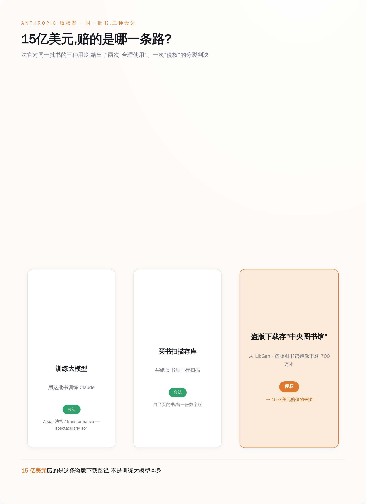
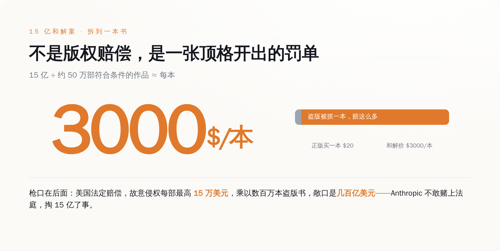
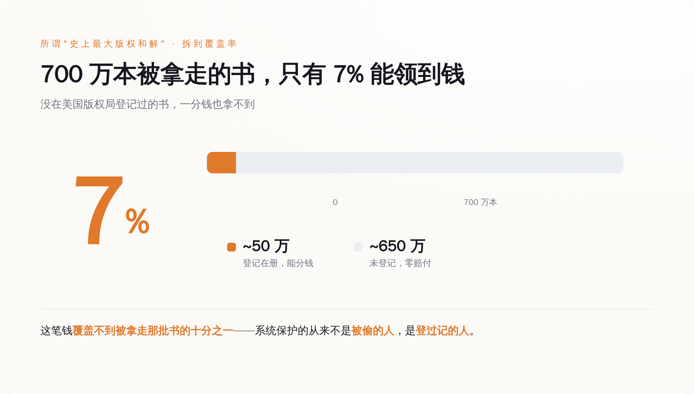

# 用盗版书训练 AI，法院判合法；Anthropic 还是赔了 15 亿——罚的是它没花钱买书

> **发布日期**：2026-07-21 | **分类**：AI / 版权

## 导语

15 亿美元。这是 7 月 20 日旧金山联邦法院敲定的数字，美国版权史上最大的一笔和解，赔给那些被 Anthropic 拿去训练 Claude 的作家。

听上去像是「用你的书喂 AI，终于要付钱了」。可你要是真去翻这个案子，会撞见一件拧巴到好笑的事：早在一年前，同一家法院就白纸黑字判过——用这些书训练 AI，合法。

这 15 亿，一分钱都不是为「训练」付的。

---

## 一、15 亿到底买的是什么单

先把两件事分开。这是整个案子最要命、也最少人讲清的地方。

Bartz 诉 Anthropic，2024 年立案，原告是三个写书的：小说家 Andrea Bartz、写非虚构的 Charles Graeber，还有《The Feather Thief》的作者 Kirk Wallace Johnson。他们告的核心就一句话：你没经我同意，拿我的书训练了你的 AI。

2025 年 6 月 23 日，主审的 William Alsup 法官出了一份判决。这份判决拆成三瓣，瓣瓣都值钱：

第一瓣，拿书去训练大模型，是合理使用。原话是「transformative — spectacularly so」，转化性的，而且转化得惊人。说白了，AI 读你的书学写作，跟盗印你的书去卖，是两码事，前者不算侵权。

第二瓣，Anthropic 后来花钱买了几百万本纸质书，拆开、裁边、逐页扫描成电子版存进自己库里——这个动作，法院也判它是合理使用。你买的书，你想怎么数字化是你的事。

第三瓣，问题出在这儿：Anthropic 早期图省事，直接从 LibGen 和 Pirate Library Mirror 这两个盗版书库，下载了七百多万本书，攒成一个「中央图书馆」。这一下载，Alsup 判它不是合理使用，还甩了个定性——「Napster 式的下载」。

*同一批书，三种拿法，法院给了两个「合法」一个「侵权」——15 亿赔的就是那条盗版下载路径*

看明白了吗。同样一本书，Anthropic 拿去训练 AI，法院说没事；买来扫描，法院说没事；从盗版站下下来存着，法院说这个要命。

所以这 15 亿，赔的从来不是「训练了 AI」。赔的是它当年为省几个买书钱，去盗版站薅了七百万本。**AI 学没学你的书，法律不管；Anthropic 有没有花钱买书，法律要命。**

讲白了，这是一张「没买书」的罚单。

## 二、为什么非赔不可：15 万一本的枪口顶在脑门上

有人会问，不就盗了几本书，至于赔 15 亿吗。

至于。

美国版权法里有个东西叫法定赔偿——只要作品登记在案，权利人不用证明自己实际亏了多少，直接按「每部作品」要钱，故意侵权的，最高每部 15 万美元。

你把 15 万，乘以数百万本盗版书，自己算算那是个什么量级。Anthropic 自己在庭上估过，理论上的赔偿敞口是几百亿美元起步，往上不封顶。这不是罚款，这是能把一家公司直接抬走的数字。

Alsup 本来把「盗版」这一瓣的庭审排在了 2025 年 12 月 1 日，交给陪审团去定 Anthropic 到底赔多少。一边是几百亿的敞口，一边是陪审团这种谁也说不准的东西。Anthropic 没赌，2025 年 9 月 5 日，开庭前抢先和解，掏 15 亿了事。

15 亿听着吓人，可你把它摊到具体的书上：约 50 万部符合条件的作品，每部大概 3000 美元。

*正版一本二三十美元，盗版被判一本 3000——这不是版权赔偿，是顶格开出的超速罚单*

正版买一本书多少钱，二三十美元。盗版被逮住，一本赔 3000。

这哪是什么版权赔偿，这就是一张顶格开出的超速罚单——你抄了近道，被拍下来了，一本一本地补票，外加罚金。早知今日，当初老老实实按标价买书，省下的这 15 亿够买回一整座图书馆还有富余。

## 三、「史上最大」这四个字，水分不小

媒体标题都在喊「美国史上最大版权和解」。数字是真的，但有一层没人愿意细说的东西。

Anthropic 从盗版站下了七百多万本书。最后能进这场和解、能分到钱的，只有约 50 万本。

七百万分之五十万。剩下那六百五十多万本呢？一分钱拿不到。

原因不复杂，也很冷酷：想分钱，你的书必须在美国版权局登记过——有正经的出版编号，而且得在 Anthropic 下载之前、或者首次出版后三个月内就完成登记。没登记，你的书就算实打实被人从盗版站薅走了，也不在这份「史上最大和解」的名单上。

*七百万本被下载，只有约 50 万本拿到钱，覆盖不到被偷的十分之一*

所以所谓「史上最大」，赔付覆盖的其实不到被拿走那批书的十分之一。已登记的那 50 万本里，据作家协会（Authors Guild）的数据，91.3% 被人认领了钱；剩下那六百多万本的作者，连桌子都上不了。

**系统保护的从来不是「被偷的人」，是「填过表、登过记的人」。** 这话冷，但这就是版权法运转的方式。

## 四、认怂，但一个字没认错

和解归和解，Anthropic 的姿态值得玩味。

它的副总法律顾问 Aparna 的官方回应，一个字都没提「我们错了」。她说的是：我们 2025 年就和解了，那是在法院作出里程碑式裁决——用书训练 AI 属于合理使用——之后；那条，至今仍是法律。

这话的意思是：训练那一仗，我们赢了；这 15 亿只是买盗版留下的旧账，跟我们的 AI 合不合法没关系。

和解条款里还有一条硬的：最终判决下达后 30 天内，Anthropic 必须销毁那批从 LibGen 和 Pirate Library Mirror 下来的原始文件以及一切衍生副本，并书面认证销毁完毕。盗版库，物理意义上得没。

还得记一笔：这是一份和解，不是判决，不构成任何有约束力的先例。法院并没有替整个行业盖章说「训练 AI 就是合理使用」——那只是 Alsup 一个人在一个案子里的意见。别的官司照打。就在这次终审前六天，7 月 14 日，一批出版商刚把 Google 告了，理由是 Gemini 拿他们的书训练。

真正该被这 15 亿吓一跳的，不是 Anthropic 一家，是所有在搭模型的公司。

因为这案子把话说得再清楚不过：让你倾家荡产的，大概率不是「你训练了什么」，而是「你的数据是怎么来的」。训练这一仗，Anthropic 帮全行业赢了；它自己却栽在最不起眼的地方——当年图省事，没花钱买书。

**模型不是护城河。一条干净的、每一本书都拿得出发票的数据供应链，才是。**

买书。留好凭证。就这。

## 数据来源

- [TechCrunch — Anthropic's landmark $1.5B copyright settlement is approved](https://techcrunch.com/2026/07/20/anthropics-landmark-1-5b-copyright-settlement-is-approved/)
- [Authors Guild — Bartz v. Anthropic Settlement: What Authors Need to Know](https://authorsguild.org/advocacy/artificial-intelligence/what-authors-need-to-know-about-the-anthropic-settlement/)
- [Authors Guild — Settlement Update: 91.3% of Books Claimed](https://authorsguild.org/news/anthropic-settlement-update-91-percent-of-books-claimed/)
- [Goodwin — District Court Issues AI Fair Use Decision (Alsup, June 2025)](https://www.goodwinlaw.com/en/insights/publications/2025/06/alerts-practices-aiml-district-court-issues-ai-fair-use-decision)
- [Kluwer Copyright Blog — The Bartz v. Anthropic Settlement](https://legalblogs.wolterskluwer.com/copyright-blog/the-bartz-v-anthropic-settlement-understanding-americas-largest-copyright-settlement/)
- [Susman Godfrey — Secures $1.5 Billion Settlement in Landmark AI Piracy Case](https://www.susmangodfrey.com/wins/susman-godfrey-secures-1-5-billion-settlement-in-landmark-ai-piracy-case/)
- [Courthouse News — Anthropic to pay $1.5 billion copyright settlement](https://courthousenews.com/anthropic-to-pay-1-5-billion-copyright-settlement-to-authors-publishers/)
- [TechCrunch — Google faces AI training lawsuit from major publishers](https://techcrunch.com/2026/07/14/google-faces-another-ai-training-lawsuit-from-major-publishers/)
