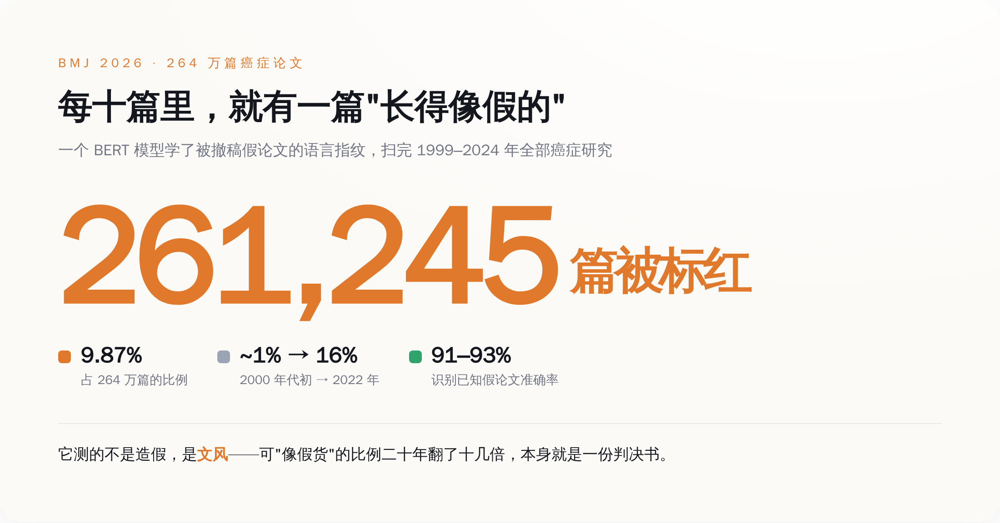
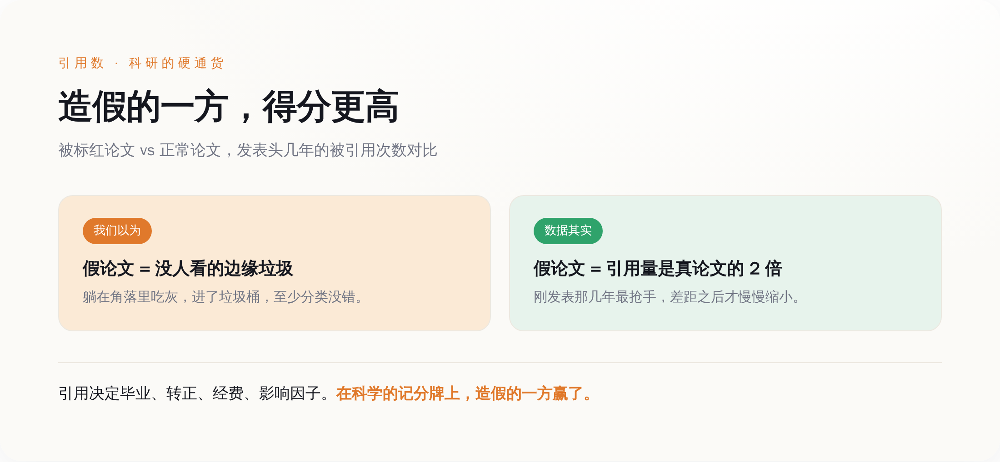
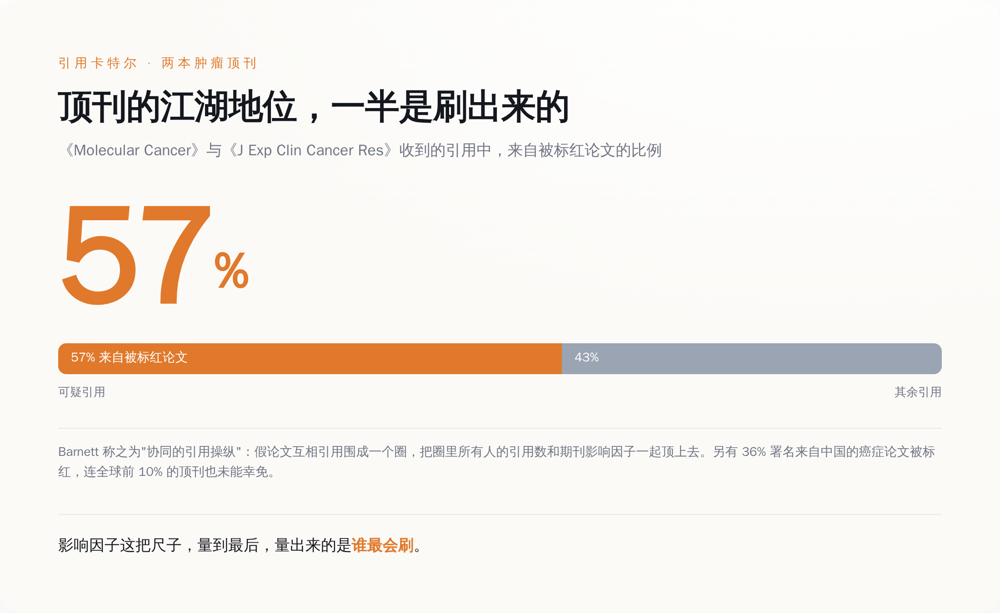

# 25 万篇假癌症论文被 AI 一次揪出，可最受同行欢迎的，恰恰是这些假的

> **发布日期**：2026-07-22 | **分类**：AI / 科研诚信

## 导语

一个澳大利亚统计学家，用一个 AI，扫完了 264 万篇癌症论文。

它标红了 261,245 篇——差不多每十篇癌症研究里，就有一篇，写得跟那些已经被撤稿的假论文一模一样。

你以为这就是丑闻了。不。真正让人后背发凉的，是他顺手算出来的另一个数：这些被标红的论文，被同行引用的次数，是正常论文的两倍。

老实做实验的人，在自己的行当里，跑输给了一条流水线。

---

## 一、这个 AI 抓的不是造假，是文风

先把事情说清楚，别被"AI 揪出 25 万篇假论文"这种标题带沟里去。

干这事的人叫 Adrian Barnett，昆士兰科技大学的统计学家。他的东西发在《英国医学杂志》上，编号 BMJ 2026;392:e087581，白纸黑字，谁都能查。他没干什么惊天动地的事，他训练了一个 BERT——一个学语言规律的模型——喂给它的，是一批已经被期刊撤稿、坐实了跟"论文工厂"有关的假论文，让它去记这些假论文长什么样。

记的是什么？是文风。是那些工厂流水线上反复出现的措辞、句式、套路。Barnett 自己在论文里把话说得很死：这个工具指出来的，是"可疑"，不是"造假"；是"长得像不像假的"，不是"到底是不是假的"。这两件事，差着一条人命关天的距离。

然后他把这台机器放出去，扫了 1999 到 2024 年间的 2,647,471 篇癌症论文。标红了 261,245 篇，占 9.87%，置信区间卡在 9.83% 到 9.90% 之间——统计学家干活，连误差都要给你算得明明白白。这台机器在测试里，认已知假论文的准确率是 91%，换一批外部数据是 93%，判"好人"的特异度超过 96%。

数字之外，还有一条更难看的曲线：世纪初，被标红的癌症论文占比大概 1%；到 2022 年，这个数字爬过了 16%。二十年，翻了十几倍。

它测的不是造假，是文风。可一个行业里，"长得像假货"的东西二十年从 1% 涨到 16%，这本身就是一份判决书。

---

## 二、真正吓人的，是造假的被引用了两倍

如果假论文只是躺在角落里没人看，那还算科学界的体面——垃圾进了垃圾桶，至少分类是对的。

问题是它们没进垃圾桶。Barnett 顺手比了一下引用：那些被标红的论文，被别人引用的次数，最高能到正常论文的两倍。而且这个差距，在论文发表后的头几年最大，之后才慢慢缩小。

翻译成人话：一篇可疑论文刚出生的时候，比一篇老实巴交的真论文，更抢手。

你得明白引用在科研里是什么。它不是点赞，它是硬通货。引用数决定一个博士能不能毕业，决定一个讲师能不能转副教授，决定一个课题组下一笔经费拿不拿得到，决定一本期刊的影响因子是往上走还是往下掉。整个学术界的账本，就是拿引用来记的。

现在这本账告诉你：最会来事的那批论文，账面最漂亮。

**在科学的记分牌上，造假的一方，得分更高。**

一个真研究员，招人、跑实验、等三个月养细胞、被审稿人打回来改五遍，熬一年出一篇。工厂那头，扒公共数据库、套标准化的分析模板、让大模型写引言和讨论、拿软件批量画图，一天出一沓。你让这两拨人在"引用数"这一个指标上赛跑，结果早就写好了。老实人跑不过流水线，这不是意外，这是设计。

---

## 三、顶刊的江湖地位，一半是假论文互相点赞刷出来的

赢，是有办法的。

Barnett 扒引用来源的时候发现一件更绝的事：这些可疑论文，特别爱引用另一些可疑论文。它们抱团。以《Molecular Cancer》和《Journal of Experimental & Clinical Cancer Research》这两本肿瘤分子领域的期刊为例——都是影响因子高到能让人换一套职业生涯的顶刊——它们收到的引用里，有 57% 来自被标红的论文。

一多半。这两本顶刊的江湖地位，一多半是被"疑似造假"的论文互相引用刷出来的。而期刊本身，可能到现在都不知道自己是被谁抬上轿子的。

这就是行话里说的"引用卡特尔"：一群假论文，你引我、我引你、你再引它，围成一个圈，把这个圈里所有人的引用数和这本期刊的影响因子一起顶上去。Barnett 的原话是，这是"协同的引用操纵"，正在给分子肿瘤学这一整个领域的期刊指标注水。

**影响因子这把尺子，量到最后，量出来的不是谁做得好，是谁最会刷。**

而且这事没有国界，也没有阶层豁免。这套模型标红了 36% 署名来自中国的癌症论文——这个数字后面站着的是全球最大的"发论文"压力池。但别急着甩锅给某一个地方：连全球排名前 10% 的顶级期刊，都没能在这台机器面前干干净净地过关。论文工厂不挑客户，它只挑肯付钱、又急着要一行简历的人。这种人，哪儿都有。

---

## 四、AI 能把它标红，可它一篇都撤不掉

到这儿，你可能觉得，抓出来了就好办了，撤了不就完了。

撤不了。

这 25 万篇，最老的已经在文献库里躺了二十多年。这二十多年里，它们被真论文引用过，被写进过综述，被塞进过临床指南，被拿去申请过经费，甚至可能左右过某个病人的用药方案。一篇论文一旦发出去、被别人引上，它就长进了整棵知识树的根系里。你现在拿把 AI 的手电筒照见它是脏的，可你没有那把能把它连根拔掉的铲子。

撤稿这件事有多难，看行业自己的战绩就知道。2024 年 Wiley 处理 Hindawi 那批论文工厂产物，是学术出版史上最大的一次撤稿，前后撤了八千多篇，关掉了 19 本期刊，自己认赔三四千万美元的年收入。那已经是全行业能拿出来的最狠的一次动作了——可它连一年的假论文产量都追不平。八千对二十五万，你算算这个比例。

更别提这里面还有一层黑色幽默：造这些假论文的，和这台抓假论文的，用的是同一类技术。工厂那边早就用上大模型批量写引言、编数据、造引用了。造假的一方永远用着更新一代的模型，查假的一方永远慢一拍——因为你得先等假货攒够了、被撤稿了，才能拿它去训练你的检测器。这是一场结构性地注定要落后半步的追赶。

所以 Barnett 这台机器，最大的价值不是"抓假",是"报数"。它把一个所有人都隐约知道、但没人敢量的窟窿，第一次量了出来：将近一成，261,245 篇，还在涨。

科学一直被当成一套能自我纠错的系统——错了会被人发现，发现了会被改正。这台 AI 干的，恰恰是拆穿了这套叙事最体面的那一半：错的确实能被发现了，AI 一次能发现二十五万个。可发现之后呢？没有下文。

**科学没有撤销键。AI 能让你看清水有多脏，它擦不掉。**

你现在知道了，每十篇癌症研究里，可能有一篇写得像假的；你也知道了，最会来事的那些，恰恰混得最好。知道完了，你还得接着在这套账本里过日子——因为除了这套脏账，你也没有别的账本可用。就这。

## 数据来源

- [Machine learning based screening of potential paper mill publications in cancer research（BMJ 原文，PMC 全文）](https://pmc.ncbi.nlm.nih.gov/articles/PMC12853418/)
- [Paper mill cancer studies get double the number of citations as genuine papers（Nature 报道）](https://www.nature.com/articles/d41586-026-01908-8)
- [New tool exposes scale of fake research flooding cancer science（QUT 官方发布）](https://www.qut.edu.au/news?id=203173)
- [AI flags more than 250,000 suspicious cancer research papers（ScienceDaily）](https://www.sciencedaily.com/releases/2026/07/260714225538.htm)
- [Revealing the Paper Mill Iceberg: AI-Based Screening of Cancer Research Publications（bioRxiv 预印本）](https://www.biorxiv.org/content/10.1101/2025.08.29.673016v2.full)
