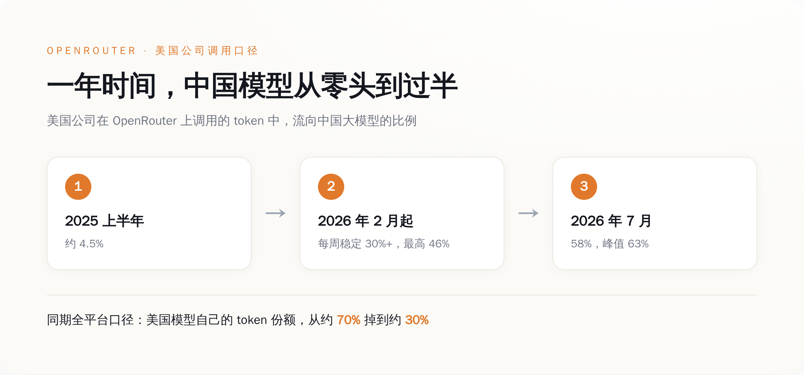
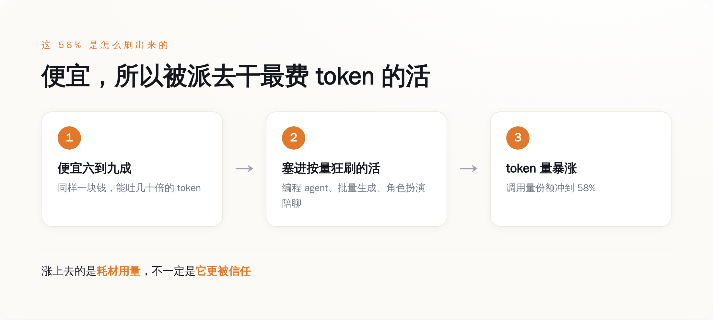
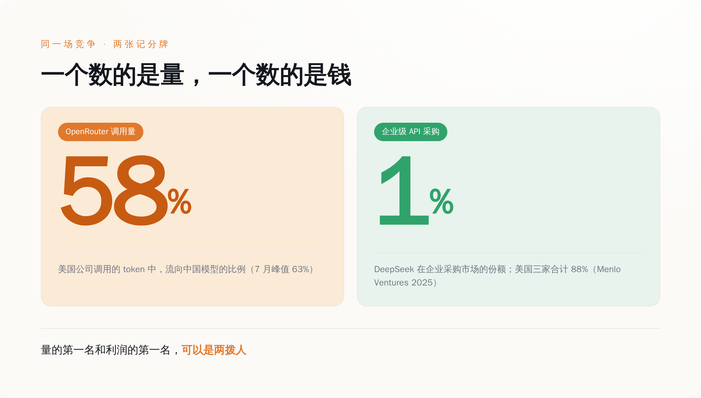

# 美国人把 58% 的 token 喂给了中国模型，却把 88% 的账单付给了自己人

> **发布日期**：2026-07-23 | **分类**：AI 行业观察

## 导语

7 月，一个数字在中文 AI 圈刷屏：在模型中转平台 OpenRouter 上，美国公司调用的 token 里，58% 流向了中国大模型，7 月第一周一度冲到 63%。标题清一色是「反超」「碾压」「中国 AI 拿下美国」。

同一个平台，同一批模型，还有另一个数字没人裱起来：在企业真金白银的 API 采购市场上，DeepSeek 的份额是 1%，美国三家吃掉 88%。

两个数字都是真的。区别只在于，一个数的是调用量，一个数的是钱。

---

## 58% 是真的，这一年确实塌方了

先把这个数字说清楚，别急着高兴，也别急着不服。

OpenRouter 是个模型中转站：你办一把 API 钥匙，就能调用上百个厂商的模型，OpenAI、Anthropic、谷歌、DeepSeek、通义千问，随便切，还能比价。开发者图它省事，2026 年 5 月它融资时披露，月处理量已经到了约 100 万亿 token。这个体量，足够当一个观察窗口。

窗口里的景象，对美国模型确实不好看。2025 年上半年，中国模型在美国公司调用里的占比还是 4.5%；2026 年 2 月 8 日之后，这个数字每周稳稳站在 30% 以上，最高见过 46%；到 7 月，58%，峰值 63%。换个更狠的口径——不分调用方国籍、只看全平台——美国模型自己的 token 份额，从一年前的约 70% 掉到了约 30%。2026 年 2 月 9 日到 15 日那一周，中国模型在全平台的周 token 量是 4.12 万亿，第一次压过美国模型的 2.94 万亿。光 DeepSeek 一家，平台份额约 17.6%，吐出来的 token 比谷歌加 OpenAI 加起来还多。

这个方向是实打实的，不是营销通稿刷出来的。美国开发者用中国模型，用得越来越顺手，这点没得洗。

*图注：一年时间，中国模型在美国公司调用里的占比从 4.5% 冲到 58%——这个方向是真的。*

## 但「用得多」不等于「选了它当主力」

问题出在，58% 这个数，量的是「谁在被大量调用」，不是「谁被谁选成了看家的那个」。这两件事，被标题党一锅烩了。

先看这个 58% 是谁贡献的。OpenRouter 上泡着的，并不是「美国企业」。摩根大通、沃尔玛这种巨头要用 AI，要么私有部署，要么直接和 OpenAI、微软 Azure 签企业协议，走的是能坐下来谈价的专线，根本不从公共中转站按量零买。真正天天挂在 OpenRouter 上的，是没有议价权、也懒得挨个和厂商签约的独立开发者、初创团队和个人玩家。把「美国企业正在抛弃 OpenAI」这句话，还原成「一群对价格敏感的散户开发者，发现了更便宜的够用货」，气势立刻就泄了一半。

再看这些 token 是被拿去干什么活的。OpenRouter 自己的排行显示，吃掉平台绝大部分 token 的，是命令行里的编程 agent 和各种自动化工具——这类工具干一个任务甩出去几百万 token 是家常便饭，OpenRouter 官方博客有篇文章标题直接就叫《DeepSeek V4 正在赚走 agentic token 份额》。另一大块是角色扮演、AI 陪聊、创意写作——OpenRouter 那份百万亿 token 的用量研究里说，这类消费级用途的占比「超出了很多人的预期」。

这些活有个共同点：要么高度自动化、按量狂刷，要么价格敏感、图个便宜够用。中国开源模型便宜多少？多家媒体测算，比 OpenAI、Anthropic 的旗舰便宜六到九成（这个口径很粗，各家测法不一，当量级看就行，别当审计报告读）。同样一块钱，中国模型能吐的 token 是美国旗舰的几十倍。

所以 token 份额暴涨，第一层意思从来不是「它更好」，是「它更便宜，而且正好被派去干了最费 token 的那批活」。

*图注：便宜六到九成，就被塞进编程 agent、批量生成、陪聊这些按量狂刷的活里——涨上去的是耗材用量，不一定是信任。*

## 钱去哪了：量的第一名和利润的第一名，是两拨人

调用量是一张记分牌，收入是另一张。这两张牌，在 OpenRouter 上就已经对不上了。

有人在同一个平台上算过账：Anthropic 的 token 量份额只有约 12%，可它拿走的收入份额接近一半。这个「接近一半」目前主要来自单一信源，我不把它当钉死的精确数，但方向是价格差直接决定的数学结果——一个 token 卖你几十倍的价，量少、收入高是必然，不需要任何情怀来解释。

换到企业正式采购这张更硬的表上，反差更刺眼。Menlo Ventures 在 2025 年底发布的《企业生成式 AI 现状》报告，抽的是企业级 LLM API 的真实采购与使用。结果是：Anthropic 40%、OpenAI 27%、谷歌 21%，美国三家合计 88%。DeepSeek，年初闹出那么大动静，企业份额 1%。而企业一年砸在 AI 上的钱，从 2023 年的 115 亿美元涨到了 2025 年的 370 亿美元，翻了三倍多——这笔快速膨胀的预算，几乎没往中国模型这边流。

两个市场，并排长着。一个是「谁便宜谁赢」的商品化层：代码补全、批量生成、陪聊，中国开源模型在这里称王，量大管饱。另一个是要可靠性、要合规、要企业级支持、要最强推理的高端层，还在心甘情愿付溢价，定价权还攥在美国手里。OpenRouter 那 58% 的量，落在第一个市场；Menlo 那 88% 的钱，落在第二个市场。

**58% 是省钱省出来的，不是打赢打出来的。**

*图注：同一场竞争，两张记分牌——OpenRouter 调用量中国模型占 58%，企业采购市场 DeepSeek 只占 1%，美国三家合计 88%。*

## 别把装机量当利润

全球每卖十台手机，七台是安卓，可手机行业的利润大头，长期躺在苹果的口袋里。量的霸主和利润的霸主，从来可以是两拨人。把 token 的「装机量」当成利润来读，是自己骗自己。

更能说明问题的，是中国厂商自己的动作。2026 年，阿里把通义千问的旗舰型号从开源转成了闭源付费 API，4 月还砍掉了给开发者的免费编程调用额度。免费开源是攻城的云梯，攻进城之后，梯子是要收起来的——连最积极开源的那家，都不打算永远靠免费把量堆下去。

OpenRouter 自己也提醒过别过度解读。它的官方博客写过，DeepSeek 的份额一度被上下夹击、跌到 5% 左右，几个月后才回到近 20%，起起伏伏，不是一条单向碾压的直线。平台创始人的说法是，「挑单一模型的时代已经结束了」——他卖的是「随便你用谁都行」，不是「中国赢了」。

中国大模型这一年在 OpenRouter 上的窜升，是实打实的：便宜、开源、够用，这条路走通了，值得认。但「58%」这个数字，量的是省下来的钱，不是拿下来的心智。哪天企业采购那张表上，DeepSeek 从 1% 变成两位数，再喊「反超」也不迟。

在那之前，这 58% 最诚实的读法是：美国人找到了一件干粗活的廉价工具，然后把最贵的那批活，还是留给了自己人。

## 数据来源

- [Chinese AI Models Overtake US Rivals as Token Share Among American Firms Hits Record 58%（Benzinga，引 The Kobeissi Letter）](https://www.benzinga.com/markets/tech/26/07/60543652/chinese-ai-models-overtake-us-rivals-as-token-share-among-american-firms-hits-record-58)
- [Chinese AI Models Now Capture Up to 46% of US Enterprise Token Usage（Yahoo Finance）](https://finance.yahoo.com/technology/ai/articles/chinese-ai-models-now-capture-020440715.html)
- [Share of US Models on OpenRouter Has Collapsed From 70% to 30%（OfficeChai）](https://officechai.com/ai/share-of-us-models-being-used-on-openrouter-has-collapsed-from-70-to-30-over-the-past-year/)
- [Chinese AI models overtake US peers in token consumption, OpenRouter data shows（Dealroom）](https://app.dealroom.co/news/note/chinese-ai-models-overtake-us-peers-in-token-consumption-openrouter-data-shows)
- [DeepSeek V4 Is Earning Agentic Token Share（OpenRouter 官方博客）](https://openrouter.ai/blog/insights/deepseek-v4-adoption)
- [State of AI: An Empirical 100 Trillion Token Study with OpenRouter（arXiv）](https://arxiv.org/html/2601.10088v1)
- [2025: The State of Generative AI in the Enterprise（Menlo Ventures）](https://menlovc.com/perspective/2025-the-state-of-generative-ai-in-the-enterprise/)
- [Alibaba pushes Qwen toward paid APIs after open-source surge（AI Weekly）](https://aiweekly.co/alerts/alibaba-pushes-qwen-toward-paid-apis-after-open-source-surge)
