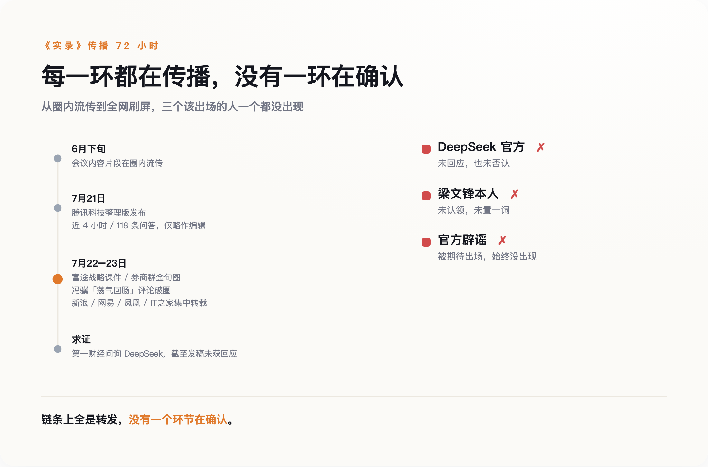

# 梁文锋刷屏 72 小时：有人求证，有人等辟谣，没人等到回应

> **发布日期**：2026-07-23 | **分类**：AI 行业观察

## 导语

《梁文锋四小时投资人会议实录》刷屏三天，被拆成战略课件、截成金句图、捧成「中国故事」。第一财经拿着它去向 DeepSeek 求证，截至发稿，官方未有回应；微博上有人断言「一看就是 AI 写的，坐等辟谣」，辟谣也没有来。文档里说了什么不重要，没有一方愿意出来确认才是正题——以及沉默这件事本身，值多少钱。

---

## 一份谁都在转、谁都没认的实录

刷屏第三天，终于有人去求证了。回应是：没有回应。

《梁文锋四小时投资人会议实录》，近四小时对话压成 118 条问答，腾讯科技整理发布，编辑说明写的是「文本尽可能保留原意，仅略作编辑」。片段 6 月下旬就在圈内流转，整理版 7 月 21 日前后一出，三天烧遍全网：富途把它拆成战略课件，券商群把它截成金句图，《黑神话：悟空》制作人冯骥发文说「大半夜看得我荡气回肠」，媒体把这句浓缩成标题——「这就是中国故事」。

被引用最多的几句，都带着圣经体的干净：「最强的模型也会开源，因为看不到闭源有什么必然的好处」「克制是一种战略，用来换取做成 AGI 的概率」「只要我能保持团队的稳定性，我一定能做成 AGI」。

质疑也有，但方向说明了问题。英语教师何凯文在微博上写：「一看就是 AI 写的。坐等辟谣。」第一财经就交流会内容向 DeepSeek 求证，截至发稿未获回应。也就是说，这份材料被全网当逐字原话引用了三天，而它的三个关键相关方——DeepSeek 官方、梁文锋本人、被期待出场的「辟谣」——集体缺席。

*图注：实录刷屏 72 小时，每一环都在传播，没有一环在确认。*

## 没人有动机出来确认

按惯常剧本，公司内部沟通外流，公关部门要么辟谣要么灭火。DeepSeek 两样都没做，连「不予置评」四个字都省了。

这场会议的背景是 DeepSeek 成立以来第一轮外部融资。据多家媒体报道，总额超 500 亿元人民币，投前估值约 3675 亿元，出资方名单里有腾讯的 100 亿、宁德时代的 50 亿、网易京东 IDG 各 30 亿，梁文锋个人跟了 200 亿。连这些数字也没有官方版本——500 亿量级的融资，DeepSeek 同样没出面确认过；市场传公司在筹备内地 IPO，一样查无官方说法。什么都不说，是这家公司此刻的统一姿态。

在这个节点上，一份把创始人塑造成「克制的理想主义者」的文档满天飞，每一条转发都在替公司做投资者教育——不花一分钱，不落一个字的官方口径，将来内容出了偏差，还可以指出这只是转述稿。辟谣是成本，沉默是资产。

媒体这边的账更简单。「梁文锋」三个字在 7 月下旬就是流量本身，新浪、网易、凤凰、IT 之家在 22 日到 23 日集中转载，没有一家等到官方确认——等确认的那家会错过整个热点周期。

还有第三本账：情绪。冯骥那句评论把一份融资会议纪要推出了科技圈，变成民族叙事的素材。到这一步，文档真不真已经不重要了，重要的是它足够好哭。

## 失真已经开始

当真引用是有代价的，围绕 DeepSeek 的二手信息已经有现成的失真样本。V4 发布后，曾有技术解读文章把 API 价格写成 0.3 美元每百万 token；DeepSeek 官网挂出的定价是 0.435 到 0.87 美元。一个打开官网就能核对的数字，尚且传成这样——一份没有官方版本可核对的转述稿，失真只会更快。

连反方也在用同一份材料打架。钛媒体的分析说，「克制」人设是人才流失、产品停滞之下的现实所迫，DeepSeek 是「用模型时代的思维打生态时代的仗」。这刀够锋利，但它批判的对象，同样是那份未经确认的转述稿。正方反方吵得热闹，引的是同一份没人认领的稿子。

## 把它当广告读，别当实录读

这份文档大概率不是伪造的——腾讯科技的整理有编辑说明，多家机构的转载有来源链条，内容与 DeepSeek 历次公开动作对得上。问题从来不是「假不假」，是「准不准」，以及「谁从不准里受益」。

四小时的对话压成 118 条问答，每一次压缩都是一次编辑，每一次编辑都有立场。你读到的「克制」，可能是原话，可能是整理者的提炼，也可能是传播链条集体挑选的结果——三种情况读起来一模一样。

所以实用的读法只有一种：把它当一份写得很好的战略广告读。广告里有真实信息，值得看；但没人会把广告词当合同条款引用。**在任何一方出来背书之前，这份文档的每一句金句，法律效力约等于一张海报。**

哪天 DeepSeek 官方逐条确认或更正，或者梁文锋公开认领，这篇作废。到目前为止，他们选择了对自己最有利的做法——什么都不说，让你们接着转。

## 数据来源

- [梁文锋四小时投资人会议实录（腾讯新闻）](https://news.qq.com/rain/a/20260722A0FZM500)
- [第一财经向 DeepSeek 求证未获回应（网易转载）](https://www.163.com/dy/article/L2H3RL9A05568W0A.html)
- [冯骥评《梁文锋四小时投资人会议实录》（新浪科技）](https://finance.sina.com.cn/tech/roll/2026-07-23/doc-iniitzpk7739837.shtml)
- [梁文锋融资会议内容疑 AI 写（新浪新闻）](https://www.sina.cn/news/detail/5323803601144310.html)
- [梁文锋四小时投资人会议实录转载（富途）](https://news.futunn.com/post/76458063/liang-wenfeng-s-four-hour-investor-meeting-transcript-4-hours)
- [DeepSeek API 官方定价文档](https://api-docs.deepseek.com/)
