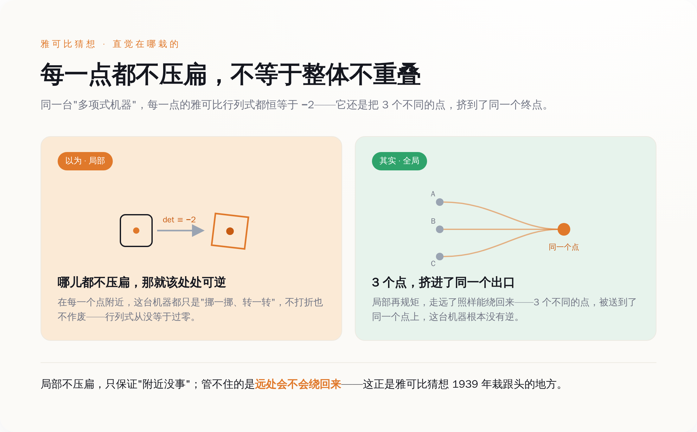
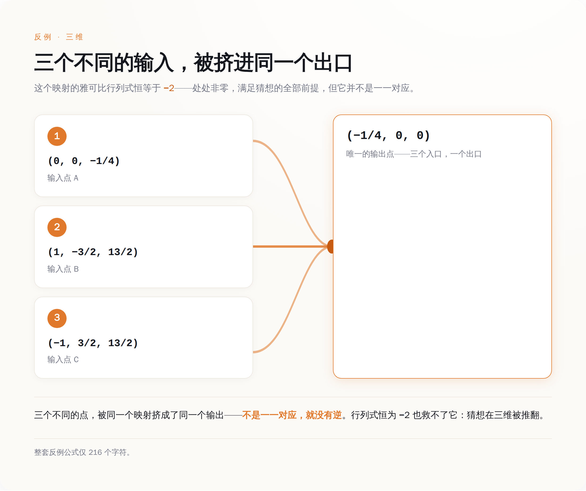

# 87 年，全世界都在想办法证明这道数学题是对的；一个 AI 花了场球赛的工夫，找到了它是错的

> **发布日期**：2026-07-27 | **分类**：AI 行业观察

## 导语

7 月 20 日凌晨，西班牙和阿根廷正在踢世界杯决赛。一个叫 Levent Alpöge 的数学家在 X 上发了一句话：「hello there the jacobian conjecture is false thanx」——你好，雅可比猜想是错的，谢啦。他顺手感谢了两个人，一个是给他出题的同行，另一个叫「fable」，说它在比赛期间帮忙干了活。fable 不是人，是 Anthropic 刚放出来没几周的模型 Claude Fable 5。一条 1939 年提出、卡了整整 87 年的数学猜想，就这么被一个 216 个字符的公式，在三维和更高维度上全给推翻了。所有人都在惊叹 AI 破解了世纪难题。可这题真正的诡异之处不在这儿——在于那个反例简单到，一个研究生一下午就能验完。

---

## 这道题到底在问什么，我给你翻译成人话

先把题目说清楚，不然后面没法聊。

想象一台机器，你喂进去几个数，它按一组多项式公式算一算，吐出来同样多的数。数学家关心一件事：这台机器可不可逆？也就是，你能不能从吐出来的结果，反推回当初喂进去的是什么——而且反推的公式也得是多项式，不能耍赖。

判断可不可逆，有个局部的体检指标，叫雅可比行列式。你可以把它粗暴理解成：这台机器在每一个点附近，有没有把空间「压扁」。行列式不等于零，就说明这一点附近没压扁，局部是好的、能反推的。

1939 年，一个叫 Ott-Heinrich Keller 的德国数学家提了个特别自然的问题：如果这台机器在**每一个点**上都不压扁，而且这个行列式还不是随便的非零，是个**固定的常数**——那它整体上，是不是就一定可逆？

直觉当然说：是啊，必须是。每一点都好好的，整个不就好好的吗。这就是雅可比猜想。

它出名不是因为难懂，恰恰相反，是因为题面太好懂了。有个叫 Abhyankar 的数学家专门拿它当例子，说这玩意儿用高中微积分就能听明白，可就是难到没人碰得动。87 年里，无数人往上扑，发过无数篇论文，连最简单的二维情形都没人能给个准话。所有这些功夫，方向都是一个：**证明它是对的**。

因为大家打心眼里相信它是对的。

*局部每一点都不压扁，也挡不住整体把三个点叠到一起——直觉正是在这栽的*

## 反例长什么样——这一段我自己算了一遍

Alpöge 甩出来的东西，是一台三维的机器。三个输入 x、y、z，三个输出，公式是这样：

> P = (1 + xy)³·z + y²(1 + xy)(4 + 3xy)
> Q = y + 3x(1 + xy)²·z + 3xy²(4 + 3xy)
> R = 2x − 3x²y − x³·z

我没敢直接信网上的转述，把这三行公式抄进电脑，用计算机代数自己跑了一遍。两件事都对上了。

第一，它的雅可比行列式，算出来**恒等于 −2**。不是某个点等于 −2，是所有点都等于 −2，一个不多不少的非零常数。也就是说，Keller 那个前提，它满分满足，一条不差。

第二，也是要命的地方：我拿三个不同的点喂进去——(0, 0, −¼)、(1, −³⁄₂, ¹³⁄₂)、(−1, ³⁄₂, ¹³⁄₂)——它们仨吐出来的结果，一模一样，全是 (−¼, 0, 0)。

三个不同的东西进去，同一个东西出来。这台机器就没法反推了：你拿到 (−¼, 0, 0)，根本不知道当初喂的是三个里的哪一个。不能反推，就是不可逆。前提全满足，结论却塌了。雅可比猜想，在三维（以及更高维）上，就这么错了。

*三个不同的输入，被这台机器挤进同一个出口——所以它没有逆，猜想在三维塌了*

整个反例，连标点带公式，216 个字符。

**难了 87 年的东西，验证它只要一个下午。** 这不是我吹，是这题的性质决定的——反例这种东西，天生比证明好查。证明要保证对所有情况都成立，反例只要拿出一个活生生的坏样本，当场一算就见分晓。三个点代进去，算不算得出同一个结果，一个大二学生用草稿纸就能完成。

## 陶哲轩连夜把它嚼了一遍：这么简单的东西，凭什么藏了 87 年

菲尔兹奖得主陶哲轩第二天就在自己博客上，把这个反例从头到尾重构了一遍，标题就叫「一次消化」。

他讲清了这台机器背后的门道。说穿了，它其实是个「多项式乘法」的把戏：一个一次式乘一个二次式，得到一个三次式。局部看，这个乘法是一一对应的；可全局不是——因为同一个三次式，可以拆成好几组不同的「一次式 × 二次式」。三种拆法，就对应三个不同的输入，最后乘出来同一个三次式。三进一出，就是这么来的。

这里藏着整件事最反直觉的一句话：局部处处成立，推不出全局成立。每一点都不压扁，不代表整张纸卷起来之后不会有两个点叠到一块儿。人的直觉在这栽了 87 年，就是默认「局部都好，整体就好」。

可陶哲轩重构完的东西，说白了并不深。里头没有什么人类想不到的天外飞仙定理，用到的都是学过代数几何的人能看懂的结构。

那问题就来了：既然这东西不深，一个下午能验，凭什么它藏了 87 年？

答案有点扎心。**卡住人类的从来不是算不出，是没人肯往「它是错的」那边看。** 87 年里，绝大多数聪明脑袋都朝着「证明它对」使劲，因为大家相信它对；那片「万一它是错的呢」的搜索空间，被集体直觉判了死刑——没戏，别去了，浪费时间。于是那个反例，就一直安安静静躺在没人愿意翻的地方。

## AI 到底干了什么，先别急着喊天才

看到这儿，很容易滑向两个极端。

一个极端是喊 AI 是天才，凭一己之力想出了人类想不到的深刻数学。这个，陶哲轩的重构已经否了——背后的结构并不神。

另一个极端是嗤之以鼻，说不就是台机器暴力枚举嘛，谁给它算力谁都行。这个也不对。Alpöge 不是把「找个反例」四个字丢给模型就完事了。他动用了自己的代数几何功底，把「该往哪儿找」框成了一个具体的、可搜的空间——是他问对了问题，圈对了地方。

真实的分工，是这么两半：人负责给方向，AI 负责不知疲倦地把这片方向里的东西，一寸一寸搜完。人给的是那份「往这儿找」的判断，机器给的是那份「不嫌烦、不觉得没戏、真就把它搜到底」的耐力。Alpöge 自己在帖子里，是把 fable 当**合作者**写的，不是当工具。

*AI 没比数学家聪明，它把人类嫌笨、直觉判"没戏"的那片搜索，一步步走完了*

顺带说一句能压住吹嘘的事实：这台反例是三维的，n≥3 的情形塌了，但最原始、很多人认为才是真正硬核的**二维**情形，到现在还开着，没人解决。这恰恰印证了前面那句——难的部分从来不在「算」，而在「去搜那片没人肯去的地方」。三维这片，方向对了、搜到底了，反例就出来了；二维那片，还没等到那个对的方向。

所以这事真正的启示，不是「AI 要取代数学家了」这种耸人听闻的话。是它像面镜子，照出一件我们一直不太愿意承认的事：**很多难题的难，不难在智力，难在那件又笨又重复、直觉还一口咬定没戏的苦力活，没人愿意干。**

人类嫌弃这活嫌弃了 87 年。现在有台机器，不嫌。

那个凌晨，球还在踢，一个人给了方向，一台机器把剩下的路走完了。第二天醒来，一条 87 岁的猜想没了。

## 数据来源

- [雅可比猜想（Jacobian conjecture）—— Keller 1939 原始表述与历史](https://en.wikipedia.org/wiki/Jacobian_conjecture)
- [Terence Tao《A digestion of the Jacobian conjecture counterexample》（菲尔兹奖得主本人对反例的逐步重构）](https://terrytao.wordpress.com/2026/07/21/a-digestion-of-the-jacobian-conjecture-counterexample/)
- [Secret Blogging Seminar《The new counterexample to the Jacobian conjecture》（数学家给出的显式反例多项式）](https://sbseminar.wordpress.com/2026/07/20/the-new-counterexample-to-the-jacobian-conjecture/)
- 反例的雅可比行列式恒等于 −2、以及三点 (0,0,−¼)、(1,−³⁄₂,¹³⁄₂)、(−1,³⁄₂,¹³⁄₂) 均映到 (−¼,0,0)，为本文作者用计算机代数（SymPy）独立验算所得
