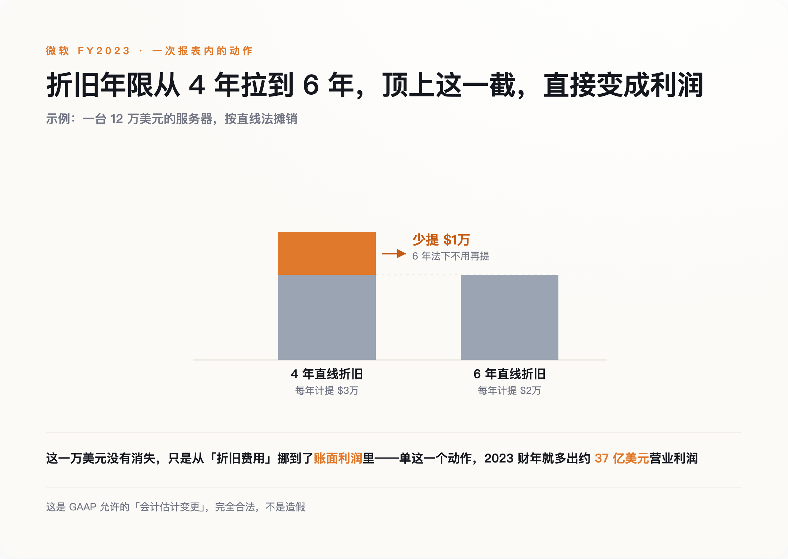
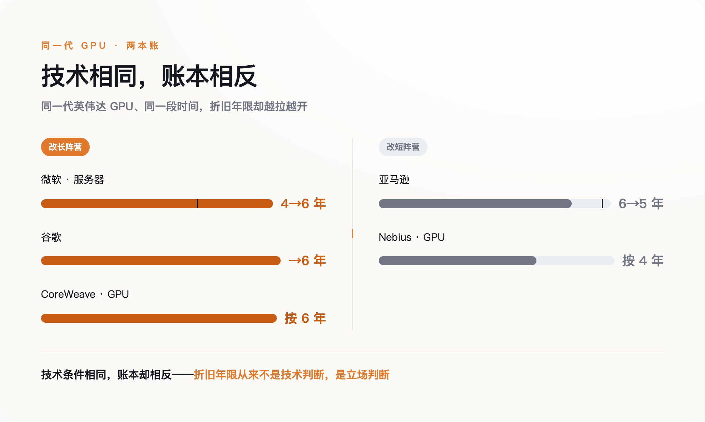
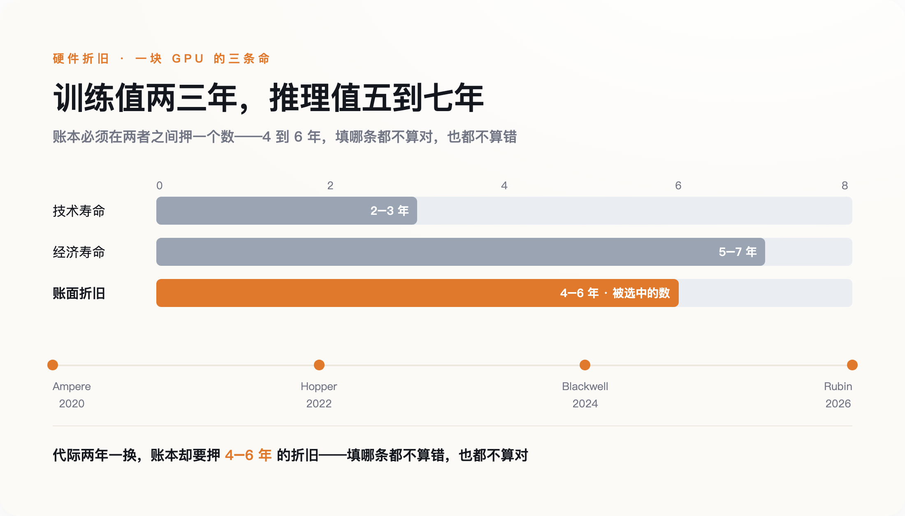

# 一台服务器该折旧 4 年还是 6 年，藏着 AI 是不是泡沫的答案

> **发布日期**：2026-07-28 | **分类**：AI 商业观察

## 导语

2025 年 11 月，一个久违的名字又出现在做空者的名单上。

Michael Burry——就是《大空头》里那个提前赌垮美国房市、当年被同行骂成疯子的基金经理。这一次，他没有做空哪家公司的产品，也没有唱衰哪项技术。他瞄准的，是一行几乎没人会读的东西：财报附注里的「服务器折旧年限」。

一个会计名词，怎么会值得一位传奇空头专门开枪？因为在他看来，判断这轮 AI 到底是真投资还是大泡沫，答案不在模型有多强、算力有多猛，而恰恰藏在这行没人读的小字里。

---

## 一行没人读的附注，凭空变出 37 亿

2022 年年中，微软悄悄改了一个数字。

它把数据中心里服务器和网络设备的账面使用寿命，从 4 年拉长到了 6 年。没有发布会，没有新闻稿，只在季度财报的附注里写了一句：得益于软件效率的提升，这些设备能用得更久了。

这个改动的分量，得先弄懂「折旧」是怎么回事。一台服务器几万美元，公司不能在买下的当年就把这笔钱全记成成本，而要摊到它的可用年头里，一年记一点——这就是折旧。摊 4 年，每年扣的多；摊 6 年，每年扣的少。设备没变、电费没变、跑的活也没变，只是账上「每年该扣多少」这个数变小了，省下来的那一截，直接变成了利润。

微软这一改，效果立竿见影：光是 2023 财年，这个动作就给营业利润凭空添了约 37 亿美元，其中头一个季度就贡献了约 11 亿。几乎同一时间，谷歌也把服务器寿命改成了 6 年，同样因此少提了数十亿美元的折旧。

*图注：同一台服务器，账面多折两年，每年扣的折旧就少一截——这一截，就成了利润*

**设备没换，活没变，利润却多出一大块——差别只在账本上那一个数字。**

而这里最要命的地方在于：它没有任何造假。会计准则（GAAP）本来就允许管理层根据自己的判断，去修改「使用寿命」这样的会计估计。一个 CFO 说「我认为这批机器能多用两年」，审计师几乎无从反驳——这是判断，不是事实。

所以当 Burry 后来跳出来，说这是「现代最常见的欺诈手段之一」时，他其实撞上了一个尴尬的事实：他指控的这一切，从头到尾，完全合法。

## Burry 的那一枪：1760 亿，和一个合法的漏洞

2025 年 11 月，Burry 先做了件反常的事。他注销了自己基金 Scion 的投资顾问注册——从此不必再定期向监管报告，却不影响此前每个季度已经交上去的持仓文件。然后，他跑到一个新开的博客上，起名叫「Cassandra Unchained」——挣脱枷锁的卡珊德拉，那个在神话里说真话却没人肯信的预言者。

然后他甩出了一个数字。他测算，到 2028 年，这些科技巨头靠着把折旧年限拉长，会累计少记约 1760 亿美元的折旧费用。换句话说，这 1760 亿会换上「利润」的名字，出现在本不该有它的地方。

他押了真金白银。三季度末的持仓文件显示，他买入了做空英伟达约 1.87 亿美元、做空 Palantir 约 9.12 亿美元的看跌期权。一个赌 AI 芯片、一个赌 AI 软件，赌的都是「现在的账，好看得不真实」。

但 Burry 这一枪，打在一个奇怪的位置。他喊的是「欺诈」，可他列举的每一个动作——微软改 6 年、谷歌改 6 年——都是财报里披露过、审计师签过字、完全合规的会计估计变更。没有人藏账，没有人伪造凭证。

真正让人不安的，恰恰不是有人在造假。造假会被抓，会被罚，会有人进监狱。而是这一切根本不需要造假：一个合法的数字选择，就足以让整个行业的利润，凭空好看起来。

问题在于：服务器到底能用几年，这件事，未必真的存在一个标准答案。

## 同一块芯片，两本相反的账

就在微软和谷歌把服务器寿命改长、对外宣布「能用 6 年」的同时，亚马逊往相反的方向走了。

2024 年 1 月，亚马逊才把一部分服务器的寿命从 5 年延长到 6 年，光这一下，就给当年的营业利润添了约 32 亿美元。结果仅仅一年之后，2025 年初，它又把同一批机器的寿命缩回了 5 年。理由写在年报里，一字未改：「技术发展的步伐在加快，尤其是人工智能和机器学习领域。」这一缩，2025 年的营业利润要减少约 7 亿。

同一批机器，同一家公司，隔了一年，判断就反了过来。

云计算创业公司这边更直白。同样是英伟达的 GPU，CoreWeave 按 6 年折旧，它的同行 Nebius 按 4 年折。差这两年，摊到一个上万张卡的集群上，一年的账面费用能差出几千万美元。同一代芯片，一个说六年，一个说四年，谁的利润率好看，一目了然。

*图注：技术条件相同，账本却相反——折旧年限从来不是技术判断，是立场判断*

连买家自己都承认这里面有矛盾。微软 CEO 纳德拉在一档播客里说得很坦白：他不愿意「被困在某一代芯片上，背着它四五年的折旧」。翻成大白话就是——他也怕手里的卡还没折完，就已经过时了。

如果「能用几年」真是一道纯技术题，那么同样的技术、同样的芯片摆在面前，答案不该南辕北辙。它之所以能相反，是因为它从一开始就不是技术题，而是立场题：你想让今年的利润好看，就把年限拉长；你想给往后留点余地，就把它缩短。

你可能会说，折旧不过是账面数字，一分钱现金流都不动——年限拉长，公司口袋里的钱一块没多，这算哪门子泡沫？没错，它确实不动现金。可也正因为不动现金，它才是一场纯粹的表态：一家公司敢把服务器折旧拉到六年，等于当着所有人的面下注，这些卡六年后还在创造价值、不会那么快被淘汰。账面利润好不好看是果，敢不敢赌这些芯片不过时，才是因。

可一块冷冰冰的芯片，它的寿命，怎么会因人而异？

## 一块 GPU 的三条命

因为一块 GPU，其实同时活着三条不一样的命。

第一条是「技术寿命」。当它站在最前线训练大模型时，寿命短得残酷——也就两三年，英伟达的新架构一发布，它就从冠军变成了千年老二。

第二条是「经济寿命」。当它退到二线去跑推理——也就是回答你问 AI 的每一个问题——对性能没那么苛刻，它还能再干上好几年，五年、七年都有可能。

第三条，才是账本上那条「折旧寿命」，被各家公司定在 4 到 6 年之间。

而英伟达，正在亲手把前两条命的差距越拉越大。它把代际更新踩得越来越快：Ampere（2020）、Hopper（2022）、Blackwell（2024），到 2026 年的 Rubin，一代压着一代往前赶。前沿越卷，一块卡「当冠军」的日子就越短，可它「还能凑合用」的日子，并没跟着一起缩短。

*图注：训练时值两三年，推理时值五到七年，账本却只能填一个数——填哪条都不算错，也都不算对*

这就是为什么 Burry 和英伟达永远吵不出结果——他们说的，根本不是同一条命。英伟达 CFO 科莱特·克雷斯回击 Burry 时说：多亏了 CUDA，我们六年前出货的 A100，今天还在满负荷运转。（顺带一提，A100 其实是 2020 年发布的，到她说这话时才五年半，她也顺手把年头往长里说了。）她没说错。但那块满负荷运转的 A100，跑的是推理，不是训练。它物理上还在转，不等于它还在创造当年那份价值。

账本没有选择，它必须在这三条命里挑一条，填进那个空格。填哪条都不算错，也都不算对。这不是会计的失职，而是会计面对一个没有标准答案的问题时，唯一能做的事——押一个数。

而这，还只是那些已经在机房里转起来的卡。真正更大的一笔账，还没开始记。

## 折旧墙：更大的账还没开始记

另一位做空传奇吉姆·查诺斯，盯的就是这笔还没记的账。

巨头们为 AI 砸下的钱，很大一部分此刻还趴在财报的一个科目里，叫「在建工程」。厂房没盖完、机器没装机的资产，按会计规则暂时不必计提折旧。可一旦这些数据中心建成、GPU 插上电、正式投入使用，沉睡的折旧费用会集中涌出来——查诺斯把它叫作一堵正在逼近的「折旧墙」。

也就是说，我们今天在财报上看到的这些漂亮的 AI 利润，享受的还是「折旧管够便宜」的红利期。那几千亿美元的在建算力，账单只是被推迟了，并没有消失。等它们集中转固的那一天，同一个问题会以更大的规模重演一遍：这些卡，到底该按几年折？

所以 Burry 那一枪，瞄准的根本不是哪一家公司，而是一个我们都默认了的假设：AI 的成败，写在模型的参数里，写在跑分榜的名次上。

## 数据来源

- [CNBC：AI 圈都在问的问题——GPU 多久会折旧完？（2025-11-14）](https://www.cnbc.com/2025/11/14/ai-gpu-depreciation-coreweave-nvidia-michael-burry.html)
- [CNBC：英伟达反驳「大空头」Burry 的看空逻辑（2025-11-20）](https://www.cnbc.com/2025/11/20/nvidia-refutes-big-short-investor-burrys-bear-case-what-the-company-says.html)
- [The Register：亚马逊把服务器寿命延长到六年（2024-02-02）](https://www.theregister.com/off-prem/2024/02/02/amazon-extends-the-life-of-its-servers-to-six-years/835320)
- [Calcbench：关于亚马逊与服务器寿命](https://www.calcbench.com/blog/post/blogger141924366623734345/On-Amazon-and-Server-Lifespans)
- [Dwarkesh Patel 播客：Satya Nadella 专访（2025-11-12）](https://www.dwarkesh.com/p/satya-nadella-2)
- [wccftech：CoreWeave 按 6 年折旧 GPU，同行 Nebius 用 4 年](https://wccftech.com/coreweave-crwv-depreciates-its-gpus-over-6-years-while-its-competitor-nebius-uses-a-4-year-depreciation-period/)
- [Amazon FY2024 10-K（SEC）](https://www.sec.gov/Archives/edgar/data/1018724/000101872425000004/amzn-20241231.htm)
