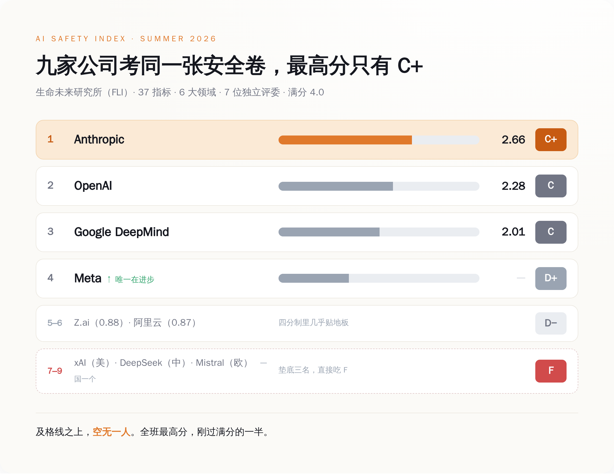
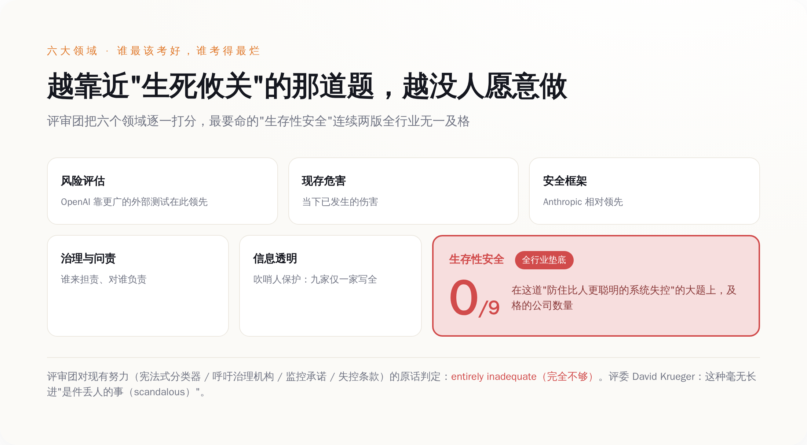
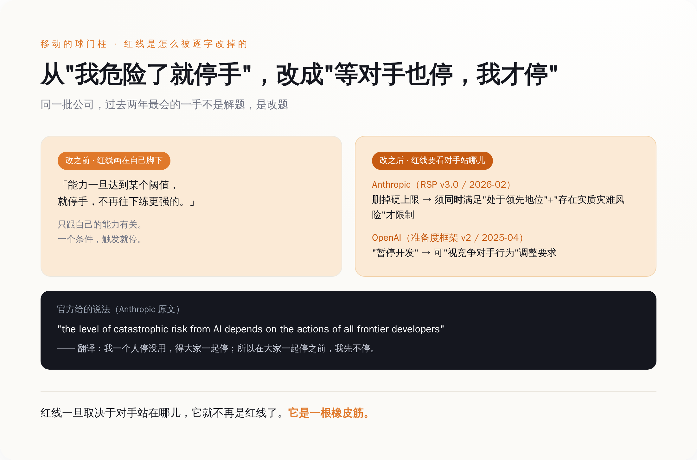

# 当年说"到红线就停手"的 AI 公司，现在把这句话改成了"等对手先停"

> **发布日期**：2026-07-28 | **分类**：AI 行业观察

## 导语

七位独立专家，把全世界九家最重要的 AI 公司拉过来考了一张卷子。三十七道题，六个大项，满分四分。

考完，最高分是 Anthropic，2.66 分，折算成等级是 C+。

C+ 什么概念，就是那种你拿回家不太好意思给爸妈看、但又不至于挨打的分数。而这，是全班第一。往下数，OpenAI 和谷歌 DeepMind 都是 C，再往下 Meta 一个 D+，然后是两家 D−（四分制里考了 0.88 和 0.87，约等于交白卷，评委手一抖没舍得直接判死）。垫在最底下的，是三个 F，美国、中国、欧洲各摊上一个。

这张卷子叫《AI 安全指数》，出题的是生命未来研究所（Future of Life Institute），今年夏天已经是第四版。分数难看，本身不算新闻——去年就难看。真正值得说的是另一件事：这帮公司一边被打分，一边在干一件特别有意思的活儿。它们把自己当年写下的那句"模型危险到某个程度，我就停手不往下练"，逐字逐句地，改成了"等别的公司也停，我再停"。

红线没有被谁跨过去。红线自己，往后挪了。

---

## 一、先看清楚这张成绩单有多难看

把数字摆齐，你才知道"全班最高 C+"是个什么样的场面。

评的是九家：Anthropic、OpenAI、谷歌 DeepMind、xAI、Meta、DeepSeek、Z.ai、阿里云、Mistral。指标三十七个，分在六个领域里，满分四分制，A 到 F。打分的不是媒体也不是网友，是一个七人独立评审团，里面有伯克利的 Stuart Russell、蒙特利尔的 David Krueger 这种搞了一辈子 AI 的人。评的依据一半是公开材料，一半是研究所专门发问卷、逼着这些公司自己交代的东西——比如你们家内部有人看不下去了，能不能安全地把话说出去，这种平时没人会主动公开的事。

结果是这样的：

- **Anthropic：C+（2.66）**，全场第一，六个领域里领先五个。一家把"安全"写进公司招牌的公司，考了个 C+。
- **OpenAI：C（2.28）**，从上一版的 C+ 掉下来一个档，但在"风险评估"这一项上反超了 Anthropic，靠的是它测试模型的花样更多、找的外部人更杂。
- **谷歌 DeepMind：C（2.01）**，紧咬着 OpenAI，第三。
- **Meta：D+**，全场唯一一个在往上走的，从第六爬到第四。
- **Z.ai、阿里云：D−**，四分制里考了 0.88 和 0.87，约等于交白卷。评委没舍得直接判死，捏着鼻子给了个 D−（毕竟 D− 好歹还是 D，听着没那么惨）。
- **xAI、DeepSeek、Mistral：F**，一个美国的、一个中国的、一个欧洲的，凑齐了一套全球挂科套餐，稳稳垫在最后三名。xAI 尤其惨，上一版还能排进前四，这一版直接掉进 F 区。

*九家 AI 公司的安全成绩单：满分四分，最高分 Anthropic 只拿到 2.66，及格线上方空无一人*

你把这张表多看两眼，会发现问题不在某一家特别烂。问题在于，整张卷子的最高分，刚过满分的一半——这不是某个差生偏科，是全班一起交了张烂卷。

一个每天被写进新闻、被塞进医院、被接上电网、被拿去当自动干活的智能体的行业，集体交出来一张没人及格的卷子。就这。

## 二、最该考好的那道大题，全班交了白卷

六个领域，分数最难看的是哪个？不是隐私，不是版权，是那个名字听起来最像科幻、其实最要命的——**生存性安全**（Existential Safety）。

翻译成人话：万一哪天造出来一个比人还聪明、还不太听话的系统，你有没有一套靠谱的办法，能保证它不脱离控制。就这一项，连续两版指数，没有一家公司拿到过高于 D 的分。所有人，在这道决定生死的大题上，交的都是白卷。

报告没绕弯子。它承认这些公司不是完全没动手——Anthropic 搞了"宪法式分类器"，OpenAI 呼吁建治理机构，谷歌 DeepMind 承诺做监控，Meta 写了失控条款。评审团把这些努力一条条看完，给的结论是四个字：完全不够（entirely inadequate）。

评委之一、蒙特利尔大学的 David Krueger 说得更直接。原话是："AI companies' lack of progress towards credible AI Safety plans is scandalous."——这些公司在拿出可信的安全方案上毫无长进，是件丢人的事。scandalous 这个词，不是"有待改进"，是"丢人现眼"。一个学者愿意在一份正式报告里用这个词，你大概能想象他有多想拍桌子。

*六大安全领域的分布：越靠近"生死攸关"的维度，分数塌得越狠，生存性安全全行业无一及格*

这里有个特别拧巴的规律：**越是决定生死的那道题，越没人愿意做。**

好做的题——比如"你有没有发布一份透明度报告""你有没有做点红队测试"——大家多少能捞两分，因为这些东西写个 PDF 就有了，还能拿去发新闻稿。可"怎么防住一个比你聪明的东西造反"这种题，做了也没法立刻变现，还得承认自己现在根本做不到。于是这道分值最高的大题，成了全班默契绕开的那一道。

但你要是以为这道题空着，是因为它太难做不出来，那就把这些公司想天真了。他们对付难题，还有一手更省事的——不做题，改题。把"什么算危险、危险了该怎么办"这条线，自己往后挪一挪。这才是这份报告里最该被看见的东西。

## 三、移动的球门柱：红线是怎么被逐字改掉的

报告给这套操作起了个名字，叫"移动球门柱"（moving the goalposts）——听着像体育术语，干的其实是"你射门的时候我把门框往旁边挪"的事。评审团点了四家的名——Anthropic、OpenAI、谷歌 DeepMind、Meta——说它们都弱化或者干脆作废了此前"触及红线就单方面停手"的承诺。我挑两家原文能查到的，给你逐字拆开看。

先看第一名 Anthropic。它有一份叫"负责任扩展政策"（Responsible Scaling Policy）的文件，是它安全招牌的地基。2026 年 2 月 24 日，这份文件更新到 3.0 版。改动里最关键的一条：原来那个"能力一旦达到某个阈值，就硬性禁止再往下训练更强模型"的上限条款，被删掉了。

删了之后换成什么？换成一个要同时满足两个条件才触发限制的新机制：第一，你得"处在 AI 竞赛的领先位置"；第二，得"存在实质性的灾难风险"。两个条件缺一个，就不用停。

你品品这个逻辑。原来的红线是"我危险到这个程度，我就停"，一个条件，画在自己脚下。新的红线是"我又危险、又还领先的时候，我才考虑停"。它给自己找的说法是——原文我给你抄下来——"the level of catastrophic risk from AI depends on the actions of all frontier developers"，AI 带来的灾难风险，取决于所有前沿开发者的共同行为。

听着特别有担当，对吧，讲的是"集体行动问题"。翻译过来其实就一句：**我一个人停没用，得大家一起停；所以在大家一起停之前，我先不停。**

再看 OpenAI。它那份对应的文件叫"准备度框架"（Preparedness Framework），2025 年 4 月更新到第二版。新版里加了一段意思差不多的话：留出余地，可以"根据竞争对手的行为"来调整自己的安全要求。同时，把原来那种硬邦邦的"暂停开发"，重新措辞成了软乎乎的"开发过程中的安全保障措施"。

一个删掉硬上限，一个给自己留下"看对手脸色再定"的活扣。两家做的是同一件事：把一条画在自己脚下、只跟自己有关的线，改成了一条要看别人站在哪儿、才决定自己站在哪儿的线。

*承诺前后对比：从"我危险了就停手"，改成了"等我不再领先、或者对手也停，我才停"*

这就是"移动球门柱"最阴的地方。它不违约，它修约。违约你还能骂它不讲信用，修约呢——人家白纸黑字改了新版，程序正当，甚至还配了一篇讲"集体行动困境"的博文，显得特别深思熟虑。

可红线这东西，一旦它的位置取决于对手站在哪儿，它就不再是红线了。它是一根橡皮筋。

## 四、说好不碰军火的，后来都排着队进了五角大楼

同一批公司身上，还有另一条被"更新"掉的线。

2024 年之前，Anthropic、OpenAI、谷歌、Meta，都曾经在自家条款里，明明白白写过限制甚至禁止把技术用于军事。到了 2024 到 2026 这两年，这几家一个接一个把这条松了、撤了，加入了本来就在做国防生意的 xAI 和 Mistral 的队伍。这是安全指数报告里点出来的行业转向。

有意思的是转向的姿势。2026 年 2 月，Anthropic 跟五角大楼因为一份合同的措辞公开顶起来——国防部要一句"任何合法用途"（any lawful use）的无限制授权，Anthropic 不干，坚持排除国内大规模监控和全自主武器。这听着挺有原则。紧接着 OpenAI 也签了国防部的机密网络单子，Sam Altman 说自家合同同样排除了监控和自主武器，用的词是"所有合法目的"（all lawful purposes）。

两家隔空吵得挺凶，争的是 any 和 all 的分别（你没看错，就是"任何"和"所有"这点差别）。可吵归吵，合同都签了。谁也没真站在原地——都在盯着对方那份合同怎么措辞，再决定自己这份怎么写。这跟第三节的红线是同一套逻辑：不是我先划死一条底线，是我看你签到哪儿，我才敢签到哪儿。

军事这条线的故事，落到最后是一句话：**禁令不是被谁打破的，是被"更新"掉的。**没有谁公开宣布"我们现在支持把 AI 用于战争了"，那多难看。大家用的都是同一套体面话术——我们只是"更新了使用政策""明确了适用范围""在严格约束下拓展了合作场景"。线还在那儿，只是往后挪了挪，挪到了合同能签得下去的位置。

## 五、九家里，只有一家写全了"内部人能不能说话"

报告里还藏着一个小到容易被忽略、但特别能说明问题的指标：吹哨人保护。

就是你公司内部，万一有工程师发现某个模型的测试结果被压下来了、某条安全流程被跳过了，他能不能不担心被开除、被起诉，安全地把这事捅出来。生命未来研究所这次专门发问卷去戳这个透明度缺口，问九家：你们的吹哨人保护政策，能不能公开、完不完整。

九家里，把完整政策拿出来的，只有一家——OpenAI。

我知道你可能会愣一下，就是那个前两年因为逼离职员工签"不许说公司坏话否则没收股权"的协议、被前员工公开怼、最后 Altman 出来道歉的 OpenAI。偏偏是它，在这一项上成了九家里唯一交出完整作业的。这事真正扎人的不是 OpenAI 有多好，而是它衬出来的背景板——**连"让看不下去的人把话说出来"这种最基本的事，剩下八家要么没写，要么写了一半。**

一个行业，最能自我纠错的机制，本来就是内部那个愿意说真话的人。九家最重要的 AI 公司，八家没给这个人留一条能安全说话的路。你就知道所谓"我们内部有严格的安全审查"，含金量大概几何。

## 结尾

这份报告最狠的地方，不是它给谁判了 F。F 是差生的事，差生哪个班都有。

它最狠的地方是证明了一件事：**当没有外部约束的时候，"自律"这两个字会自动漂移。**它不会停在原地。它会先变成"我领先的时候才自律"，再变成"等对手也自律我才自律"，最后变成一根谁都不肯先松手的橡皮筋。红线还画着，位置每季度往后挪一点，程序全部正当，博文写得比谁都恳切。

还有一个细节，我留到最后说。这份指数收集证据的截止日是 2026 年 6 月 3 日。等它七月发出来的时候，里面写的东西，已经有一部分过时了——因为这些公司改承诺、签合同的速度，比一份严肃报告能追上的速度还快。

一份给 AI 安全打分的成绩单，自己都追不上被打分的人。这大概是关于这个行业，今年最诚实的一句话。

## 数据来源

- [AI Safety Index — Summer 2026，Future of Life Institute（报告主页）](https://futureoflife.org/ai-safety-index-summer-2026/)
- [AI Safety Index Summer 2026（完整报告 PDF）](https://futureoflife.org/wp-content/uploads/2026/07/AI-Safety-Index-Summer-2026-Digital.pdf)
- [Anthropic Responsible Scaling Policy（负责任扩展政策原文）](https://www.anthropic.com/responsible-scaling-policy)
- [OpenAI Preparedness Framework v2（准备度框架第二版 PDF）](https://cdn.openai.com/pdf/18a02b5d-6b67-4cec-ab64-68cdfbddebcd/preparedness-framework-v2.pdf)
- [OpenAI 关于与美国国防部合作的说明](https://openai.com/index/our-agreement-with-the-department-of-war/)
