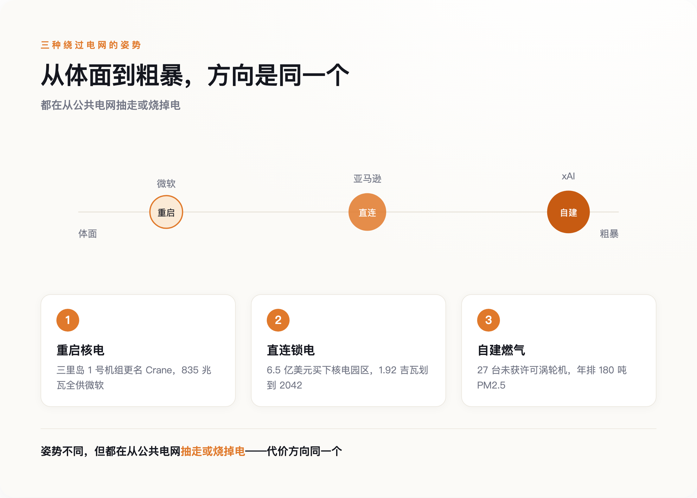
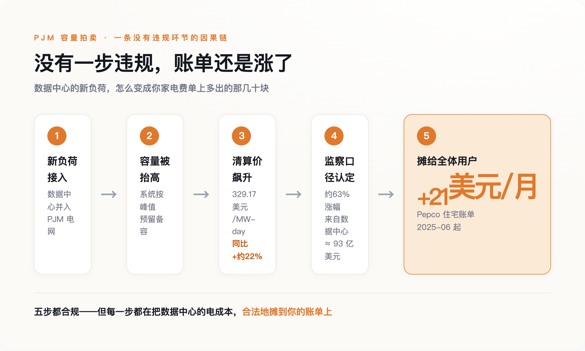
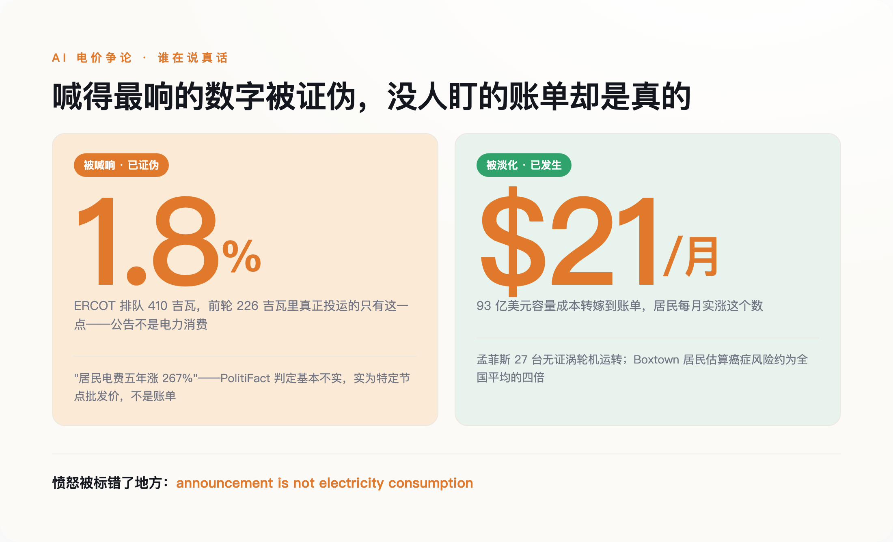

# 为 AI 重启一座核电站，账单却寄给了从没用过 AI 的人

> **发布日期**：2026-07-29 | **分类**：AI 与能源

## 导语

华盛顿特区一户人家，2025 年 6 月起，每月电费单上多出了大约 21 美元。他们没有买过一张显卡，没有跑过一次大模型，家里最费电的东西还是那台老空调。可这 21 美元的另一端，是几十英里外一座数据中心——里面塞满了为别人的 AI 昼夜运转的机器。

这不是谁偷了电，也没有人违规。这 21 美元是通过一套完全合法的定价机制，被规规矩矩地摊到了账单上。今天真正值得讲的，不是"AI 有多耗电"这句人人都在说的话，而是一个更冷的问题：这笔电费，最后是谁替谁付的。

---

## 一、瓶颈换了，但没人告诉用户

过去两年，AI 竞赛的瓶颈悄悄换了一次。芯片依然紧张，但真正卡住脖子的，变成了电。

一座数据中心大约两年就能盖好，可给它供电的电网升级要五到十年。这两个周期对不上，后果直接写在了并网排队的时间里：一份 arXiv 上的综述（《Electricity Demand and Grid Impacts of AI Data Centers》）统计，数据中心从提交并网申请到真正通电，平均等待时间已经从 2008 年的不到两年，拉长到 2025 年的超过八年。

八年，对一家想在这一轮 AI 里抢身位的公司来说，等于出局。于是巨头们不再排队。他们开始绕过电网，直接去锁定电源本身——哪座电厂能马上发电，就把哪座电厂的电，整个买下来。

这里要先泼一盆冷水。谈到 AI 耗电，最流行的说法是"吞电巨兽""耗电堪比一座中型城市"。这些说法里有一半是真的，另一半是被夸大的公告。数据中心能耗研究的先驱之一 Jonathan Koomey——1999 年他曾戳穿"互联网十年内将耗尽美国一半电力"那个著名的错误预言——在 2026 年的报告里留下一句话："announcement is not electricity consumption"（公告不等于耗电量）。一家公司宣布"我要建一座 500 兆瓦的数据中心"，只是对电力提出了一个申领，不是它真的开始耗电。

先记住这个瓶颈：**AI 的智能最终是电，而电，是有物理地址的。**

---

## 二、三条路，一个方向：把电从公共的池子里抽走

绕过电网抢电，眼下有三种姿势，恰好排成一条从体面到粗暴的光谱。

*图注：三种姿势排成从体面到粗暴的光谱，但方向同一个——电被从公共池子里抽走或烧掉。*

最体面的一头，是微软。2024 年 9 月，发电商 Constellation 与微软签下一份 20 年的购电协议，重启三里岛核电站的 1 号机组——注意，是 2019 年因为不赚钱而关停的那台，不是 1979 年出过事故的 2 号机组。重启投资约 16 亿美元（含核燃料），835 兆瓦的发电量，将来全部供给微软一家。协议里还有一个容易被略过的细节：这座电厂被改名为"Crane Clean Energy Center"。"三里岛"三个字，是美国核事故的代名词；把这个名字换掉，本身就是一次操作——它决定了这段历史该被谁记住，又该被谁悄悄忘掉。

中间一段，是亚马逊。2024 年，AWS 花约 6.5 亿美元（3.5 亿首付、3 亿托管）买下 Talen 能源旗下、与 Susquehanna 核电站直连的一处数据中心园区；2025 年 6 月，双方又签了一份供电至 2042 年的长期协议，从这座总装机 2.5 吉瓦的核电站里，划出 1.92 吉瓦专供 AWS。这里没有新建一度清洁电。它做的是把一座已经在运行、本来并入公共电网的无碳核电，整块抽出来，接到自己的机房上。别人电网里的清洁电，少了这么一大块。

最粗暴的一头，是 xAI。它连核电的谈判周期都等不及，直接在孟菲斯城郊自己烧气发电。2026 年 4 月，NAACP 联合南方环境法律中心和 Earthjustice，在密西西比北区联邦法院把 xAI 及其子公司 MZX Tech 告上法庭，指控它在 Southaven 运行着 27 台未取得空气许可证的燃气涡轮机。起诉书称，这批涡轮机每年可能排放 180 吨 PM2.5、500 吨一氧化碳和 19 吨甲醛（一种致癌物）。它们所在的 Shelby 县和 DeSoto 县，都被美国肺脏协会评为臭氧污染 F 级，孟菲斯近来有个别称叫"哮喘之都"。而涡轮机排放最先落下的地方，是南孟菲斯一个叫 Boxtown 的历史黑人社区——据多家媒体转引当地居民的说法，xAI 来之前，这里方圆已有 17 处排放有毒物质的设施，居民自己估算当地癌症风险约是全国基准的四倍。

三种姿势天差地别，但方向是同一个：把电，从所有人共用的那个池子里，锁走、抽走、或者就地烧掉。池子小了，或者脏了，代价留给还在用这个池子的人。

---

## 三、账单是怎么合法地转到别人头上的

开头那 21 美元，不是从三里岛或孟菲斯直接寄来的账，中间隔着一层几乎没人看得懂、也几乎没人违规的机制——容量市场。

美国最大的电网运营商之一 PJM，覆盖 13 个州加华盛顿特区。它每年办一次"容量拍卖"，本质是提前花钱买一份保险：付钱让各家电厂承诺，到用电高峰那天有足够的发电能力顶上，别停电。这份保险的钱，最终摊进每个用户的电费里。逻辑本来没问题，问题出在需求端突然多了数据中心这个新玩家。

数据中心的负荷一进来，整个系统需要预留的容量就被抬高，拍卖的清算价随之飙升。PJM 2026–27 交付年度的容量清算价冲到 329.17 美元每兆瓦·天，比上一年度（2025–26）的 269.92 美元涨了约 22%；到 2025 年 12 月，再下一个交付年度（2027–28）的拍卖结果公布，价格同样顶到了 333.44 美元的上限。据 PJM 独立市场监察机构的口径，这一轮容量涨价里约 63% 来自数据中心负荷，折算成钱，是约 93 亿美元通过更高的电价，从全体用户身上收了回来。落到具体一户上，据华盛顿特区消费者顾问办公室测算，Pepco 住宅用户从 2025 年 6 月起月账单平均多了约 21 美元，其中约一半直接来自容量市场价格上涨。

*图注：没有一步违规——数据中心抬高容量需求，清算价飙升，成本按规则摊给每个用户。*

请注意这中间没有任何一步是违法的。没有人操纵市场，没有人偷电，数据中心也确实为自己用的电付了钱。转嫁是通过规则本身完成的——容量成本本来就是所有人分摊的，只要把总需求推高，账单自然会替所有人一起涨。伤害不需要恶意，一套设计于 AI 出现之前的定价规则，就足够把成本安静地外部化出去。

监管者不是没看到。电力公司开始给 50 兆瓦以上的大负荷客户单设一种"大负荷关税"，要求它们自担前期电网基建、承诺至少 85% 的最低用电量、约定爬坡时间表、签下违约退出费——试图把成本和风险推回给开发商自己。但这套补丁在各州的推进快慢不一，往往是账单先涨上去，规则才慢慢补上来。等补丁到位，前面那几年多付的钱，不会退回来。

---

## 四、被喊错的那笔账

关于 AI 电价，被喊得最响的那些数字，往往是假的；被压低声音的那些，反而是真的。

*图注：喊得最响的数字被证伪，真正扎实、已发生的代价反而没人盯。*

被喊响的一头，是得州。ERCOT 电网截至 2026 年 4 月，收到的大负荷并网请求超过 410 吉瓦，其中 87% 来自数据中心。这个数字听着像末日——相当于凭空要再造好几个得州的用电量。但据行业媒体 Latitude Media 梳理，这里面绝大多数是"幽灵需求"：上一轮 226 吉瓦的排队请求里，最后真正投运取电的只有 1.8%。开发商在好几个市场重复申请、抢占"带电的土地"排队位，一块地同时挂在三家电网的队列上。回到 Koomey 那句话——公告不是耗电。这 410 吉瓦是 410 吉瓦的申领，不是 410 吉瓦的账单。用它来预测"AI 要把电网烧穿"，多半会算错。

另一头，2026 年 6 月，PolitiFact 核查了参议员 Elizabeth Warren 的一个说法——"数据中心附近的居民，电费五年最多涨了 267%"，评级为"基本不实"。那个 267%，是某个特定节点的批发电价涨幅，不是居民账单。真实的居民电价五年涨幅是：华盛顿特区约 94%，全国平均约 42%。

喊到 267% 的那个数字，站不住；可当它被证伪，很容易连带着让人觉得"看，AI 涨电费也是夸大的"。而真正扎实、已经发生的代价，反而因为不够耸动，没什么人盯。一类明码写在拍卖的清算表上——93 亿美元的容量成本、每月多出的那笔钱；另一类不进任何账单，却落在真实的人身上——孟菲斯那 27 台没许可证的涡轮机，Boxtown 居民头上被估到四倍的癌症风险。两条渠道不一样，却由同一种监管上的默许，一起放行。

愤怒被标错了地方。人们对着一个夸大的百分比争吵，却对一套安静运转的定价机制视而不见。**被喊得最响的数字是夸大的，被压下去的账单反而是真的。**

---

## 五、代价不是物理必然，是谁没去付

有人会说，别急，效率在追上来。这话有依据。谷歌公布过，Gemini 处理一次查询的中位能耗只有 0.24 瓦时，一年里降了 33 倍。单看每一次调用，AI 正在变得越来越省电。

但省下的电，不一定意味着总量下降。经济学里有个杰文斯悖论：蒸汽机效率提高后，英国的煤炭消耗不降反升，因为便宜刺激了更多的用。ACM FAccT 2025 的一篇论文正是拿这个悖论提醒——单次能耗越低，用的人和次数越多，总耗电反而可能爆炸。"AI 会越来越省电所以别担心"这句话，逻辑上是漏的。何况说这话的，多半是卖 AI 的一方。

那么代价该记在谁头上？哈佛法学院电力法倡议的主任 Ari Peskoe，审过 50 起相关监管程序后给出的答案是：别急着怪 AI。在他看来，这些成本外部化不是什么物理必然，而是监管被俘获的结果——FERC 的输电定价规则、各州公用事业委员会的默许，本可以要求数据中心承担它引发的全部成本，却没有这么做。他直接点名白宫牵头、号称要挡住大负荷客户推高居民电价的那份"电价保护承诺"，对消费者"毫无实质帮助"。换句话说，那 21 美元的去向，是一个可以改的规则，不是一条不可违抗的物理定律。

---

## 数据来源

- 微软—Constellation 20 年 PPA、三里岛重启并更名 Crane Clean Energy Center（CNBC / World Nuclear News，2024-09）：[CNBC](https://www.cnbc.com) ｜ [World Nuclear News](https://www.world-nuclear-news.org)
- AWS 约 6.5 亿美元收购 Talen/Susquehanna 数据中心园区、2025-06 签供电至 2042 年 1.92GW 协议（Utility Dive / DCD / Talen 投资者关系）：[Utility Dive](https://www.utilitydive.com) ｜ [Talen Energy IR](https://www.talenenergy.com)
- NAACP 联合 SELC、Earthjustice 起诉 xAI 及 MZX Tech 孟菲斯燃气涡轮机（2026-04，含 180 吨 PM2.5 等排放数据）：[CNBC](https://www.cnbc.com) ｜ [NAACP](https://naacp.org)
- Shelby/DeSoto 县臭氧 F 级评级（美国肺脏协会《State of the Air》）：[American Lung Association](https://www.lung.org/research/sota)
- PJM 2026-27 容量拍卖清算价 329.17 美元/MW-day（较 2025-26 年度 269.92 涨约 22%）、约 63% 涨幅来自数据中心、约 93 亿美元转嫁、Pepco 住宅月账单 +21 美元（其中约一半来自容量市场，DC 消费者顾问办公室口径）（PJM 独立市场监察 / IEEFA / Utility Dive）：[Utility Dive](https://www.utilitydive.com) ｜ [IEEFA](https://ieefa.org)
- 数据中心"幽灵负荷"与并网排队（ERCOT 410GW、前轮 226GW 仅 1.8% 投运，Latitude Media）：[Latitude Media](https://www.latitudemedia.com)
- PolitiFact 核查 Warren"居民电费五年涨 267%"为"基本不实"（2026-06）：[PolitiFact](https://www.politifact.com)
- Gemini 单次查询中位能耗 0.24 瓦时、一年降 33 倍（Google 官方博客）：[blog.google](https://blog.google)
- AI 能效与杰文斯悖论（ACM FAccT 2025 / arXiv 2501.16548）：[arXiv:2501.16548](https://arxiv.org/abs/2501.16548)
- 成本外部化系监管俘获、批评白宫"电价保护承诺"，Ari Peskoe（哈佛法学院电力法倡议）：[EELP Harvard](https://eelp.law.harvard.edu)
- 并网排队从 <2 年拉长至 >8 年、AI 数据中心电力需求综述（《Electricity Demand and Grid Impacts of AI Data Centers》，arXiv 综述）：[arXiv](https://arxiv.org)
