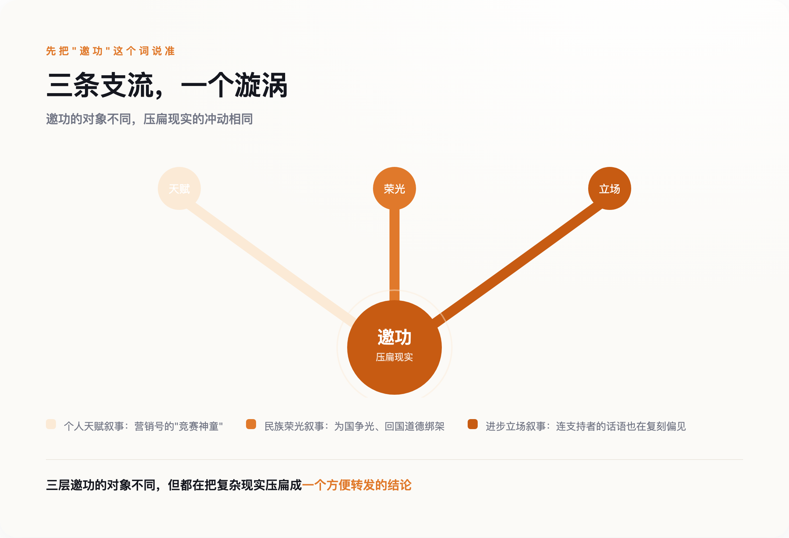

# 王虹、邓煜双双拿下菲尔兹奖：这场全民狂欢里，谁在抢着邀功？

> **发布日期**：2026-07-29 | **分类**：科技人文

## 导语

丘成桐说，王虹"甚至超过许多男数学家"。这句话是在夸她，但仔细读一遍：它默认的基线是，数学能力这件事，男性天生更强，王虹是个例外。一句用来打破偏见的表扬，句子内部却装着偏见本身——这可能是这一整场全民狂欢里，最值得停下来看一眼的细节。

7月23日，国际数学家大会在费城公布本届菲尔兹奖，北京大学2007级校友王虹、邓煜双双获奖，一届出了两个北大校友。接下来几天，中文互联网上能看到的几乎全是同一套叙事：天才、寒门、十年磨一剑、为国争光。真正该被追问的问题，反而没人问——不是他们有多厉害，是这场狂欢里，谁在抢着邀功。

---

## 一、先把问题说清楚：他们到底解决了什么

大部分报道停在"这是大新闻"，没有一篇讲清楚这两个问题到底难在哪。补上这一课，才有资格谈后面的事。

王虹和加拿大英属哥伦比亚大学的乔什·扎尔（Josh Zahl）合作证明的，是三维挂谷猜想。这里要先拆开两个容易被混为一谈的东西：1917年，日本数学家挂谷宗一提出一个几何问题——一根长度为1的针，在平面上360度转一圈，扫过的面积最小能有多小？这是"挂谷针问题"，早已解决。今天被叫作"挂谷猜想"的，是另一件事：如果一个集合在每个方向上都包含一条单位线段（这样的集合叫挂谷集），这个集合能被压缩得多"薄"——用数学语言说，它的维数是不是仍然等于所在空间的维数，也就是说，这个集合虽然看起来稀疏，实际测量出的"占空间程度"能不能被压得比整个空间更低。二维情形1971年就解决了：答案是不能被压低。三维情形悬置了半个多世纪，直到王虹和扎尔给出证明：同样不能。莱斯大学数学家内茨·卡茨（Nets Katz）的评价是"百年一遇"（once in a century）。

邓煜和密歇根大学的扎希尔·哈尼（Zaher Hani）、马骁合作解决的，是希尔伯特第六问题的一个受限版本。1900年希尔伯特提出23个问题，第六个要求"物理学的公理化"，其中一个子问题是：能不能从牛顿力学的微观粒子系统，严格推导出宏观的玻尔兹曼方程？1975年，奥斯卡·兰福德（Oscar Lanford）证明了这件事——但只在极短的时间窗口内成立。此后五十年，把"极短时间"推广到"任意长时间"，一直是这个领域最深的坎。邓煜团队做的，是首次建立起从牛顿力学系统，到玻尔兹曼方程，再到欧拉方程和纳维-斯托克斯方程的完整长时间推导链条——用数学的方式，回答了"为什么可逆的微观世界，会涌现出不可逆的宏观热力学"这个问题的一部分。

这两个证明，一个关于空间能被压缩到多小，一个关于时间箭头从哪里生出来。放在一起看，比"两个中国人拿了奖"这句话有意思得多。

*图：王虹解决的是空间维度问题（集合能被压缩得多薄），邓煜解决的是时间维度问题（不可逆性从哪里涌现）。*

## 二、第一层邀功：把成就装进"天才"的模子里

先把"邀功"这个词说准：它指的是急着找到一个可以把这份成就据为己有、或者用来证明自己一贯正确的主体——不管这个主体是一个人的天赋、一个民族的荣光，还是一种立场。三层邀功共享同一个心理动力：比起搞清楚事情本身，更想要一个现成的、能往自己身上贴的结论。

*图：三层邀功争夺的对象不同，但共享同一个冲动——找一个可以居功的主体。*

第一层最省事：把两个人都塞进"竞赛神童"模子。邓煜确实符合这个模子——2006年国际数学奥林匹克金牌保送北大，在北大数学系读了两年后转学麻省理工完成本科，自述"有点社恐""喜欢自己一个人"，是一份现成的天才叙事素材。

王虹的路径和这个模子对不上。她16岁以653分考进北大，天赋毋庸置疑，但她走的不是竞赛保送、从小被专门认证为"数学天才"的那条路——读的是地球与空间科学学院，大二才自学转进数学系；后来在法国读研期间，她一度花了半年时间转向建筑学、还去事务所实习了一个月，最后才决定回到数学；她自己形容，在人才云集的数学学院里，自己是个"小透明"。

把这两条性质不同的路径，硬塞进同一个"天才"模子，抹掉的恰恰是最有信息量的那部分——一个人是靠什么走过"我是不是不够擅长这件事"的自我怀疑期，比"她从小就是天才"这句话，值钱得多。营销号选择讲后者，不是因为后者更真实，是因为后者更省事：不用解释，直接感叹就行——这正是"邀功"心态的第一种表现：把复杂路径压扁成一句可以转发的赞叹。

## 三、第二层邀功：把成就装进"民族"的账本

第二层邀功更隐蔽。获奖之后，舆论场里出现了两种声音，方向相反，逻辑相同：一种是"中国数学的伟大突破"，把两位现在分别任教于纽约大学和芝加哥大学的数学家，收编进"为国争光"的叙事；另一种更刺耳，质疑"他们在国外工作，还算不算中国数学家"，暗示他们该"回国"才算数。

凤凰网"风声"专栏的一篇评论把这层逻辑拆穿了：多少位诺贝尔奖得主全职加入中国的高校和研究机构，从没有人追问他们"忠诚"够不够；反过来，中国人在海外做出成就，却总要先自证一遍"没有忘本"。这不是爱国，是一种地理决定论——好像一个人的贡献，非要绑定在他此刻的工位坐标上才算数。真正该被追问的，不是"他们该不该回国"，是这种追问本身，暴露的是一种深层的不自信：仿佛不把成就攥在自己手里邀功，这份成就就不算数。

## 四、第三层邀功最隐蔽：连想打破偏见的人，都在用偏见的语言

前两层邀功争的是"这份成就该记在谁头上"，第三层邀功争的东西不一样——它要占用的不是成就本身，而是这件事能不能证明"我们已经很进步了"。这层最隐蔽，因为它常常藏在最善意的表扬里。

丘成桐评价王虹时说，她的能力"甚至超过许多男数学家"，希望她能证明"女孩子也可以将数学念好"。这句话的动机大概率是真心的欣赏——但它的句法结构出卖了一个默认设置：要证明女性能把数学学好，参照系仍然是男性；夸赞一个女数学家优秀，仍然要靠"比男的还强"这个比较级来完成，而不是就事论事地说她解决了一个悬置半个世纪的问题。这不是要苛责丘成桐个人，而是这句话被当作"数学界已经足够多元、足够进步"的例证时，没有人停下来看一眼它内部的悖论：一句用来展示进步的话，句子本身还在替旧逻辑的语法站台。想要为"进步"邀功的人，最容易忽略的，恰恰是自己说话时用的还是旧词典。

## 五、真正的伯乐，是没人能拎出来邀功的东西

三层邀功，指向的都是同一个冲动：找到一个可以居功的主体——某个人的天赋、某个民族的荣光、某种进步立场——然后把这份成就据为己有。凤凰网另一篇评论问了一个更准确的问题："谁是真正的伯乐？"给出的答案是：不是北大，不是任何一个培养计划，是过去几十年的开放本身——是让一个16岁考进地空学院、后来在异国读研期间转向建筑又转回数学的年轻人，能够自由地转专业、出国、进入全球学术共同体这件事本身。这个答案的狠劲在于：它没有一个可以被拎出来颁奖的对象。开放不是一个人，不是一个机构，没法上台领奖，也就没法被任何一方独占。

这份"没人能独占"的属性，甚至延伸到了证明本身。邓煜团队的工作也不是一个可以被供起来的完美神话——2025年4月，就有同行发表评论文章，对证明里一个关键设定提出了技术性质疑，认为它是否真正触及问题最初设想的物理情形，还有讨论空间。截至目前，这场学术争议还没有定论。这恰好是"邀功"逻辑的反面：没有人能把这个证明单方面宣布为盖棺定论的神迹，它还悬在同行审视的过程里，随时可能被继续推敲、修正——而这正是数学共同体健康运转的样子，不是瑕疵。

丘成桐那句"超过许多男数学家"，最该被记住的不是它证明了什么，而是它暴露了什么：就算是最想打破套路的人，也很容易在无意间，把自己嘴里的话，说回旧套路本身。这篇文章同样逃不掉这个陷阱——写这些文字的人，此刻大概率也在某处，把一个更复杂的现实，压扁成了一个方便转发的判断。真正对得起这场"百年一遇"的，从来不是找到一个可以邀功的立场，是愿意为一件事多花五分钟，把它讲得准确一点。

## 数据来源

- [Josh Zahl and Hong Wang Prove the Kakeya Conjecture in Three Dimensions (UBC)](https://www.math.ubc.ca/news-events/news/mar-4-2025-josh-zahl-and-hong-wang-prove-kakeya-conjecture-three-dimensions)
- ['Once in a Century' Proof Settles Math's Kakeya Conjecture (Quanta Magazine)](https://www.quantamagazine.org/once-in-a-century-proof-settles-maths-kakeya-conjecture-20250314/)
- [Hong Wang (Wikipedia)](https://en.wikipedia.org/wiki/Hong_Wang)
- [Hilbert's sixth problem: derivation of fluid equations via Boltzmann's kinetic theory (arXiv)](https://arxiv.org/abs/2503.01800)
- [Comment on "Hilbert's Sixth Problem..." by Deng, Hani, and Ma (arXiv)](https://arxiv.org/pdf/2504.06297)
- [2026 Fields Medals Awarded to Four of World's Top Mathematicians (Simons Foundation)](https://www.simonsfoundation.org/2026/07/23/2026-fields-medals-awarded-to-four-of-worlds-top-mathematicians/)
- [中国数学家王虹、邓煜双双获得菲尔兹奖，均系北大校友（澎湃新闻）](https://www.thepaper.cn/newsDetail_forward_33645576)
- [风声｜王虹、邓煜同获菲尔兹奖，谁是真正的伯乐？（凤凰网）](https://news.ifeng.com/c/8v1N00AaxlK)
- [王虹、邓煜获奖后，有些声音略显刺耳（凤凰网）](https://news.ifeng.com/c/8v1JiU8l1DY)
- [对话菲尔兹奖首位华人得主：王虹和邓煜是伟大的突破（科学网）](https://news.sciencenet.cn/htmlnews/2026/7/568839.shtm)
- [从大学同窗到菲尔兹"双星" 王虹与邓煜的数学追梦路（新京报）](https://www.bjnews.com.cn/detail/1785025211129602.html)
