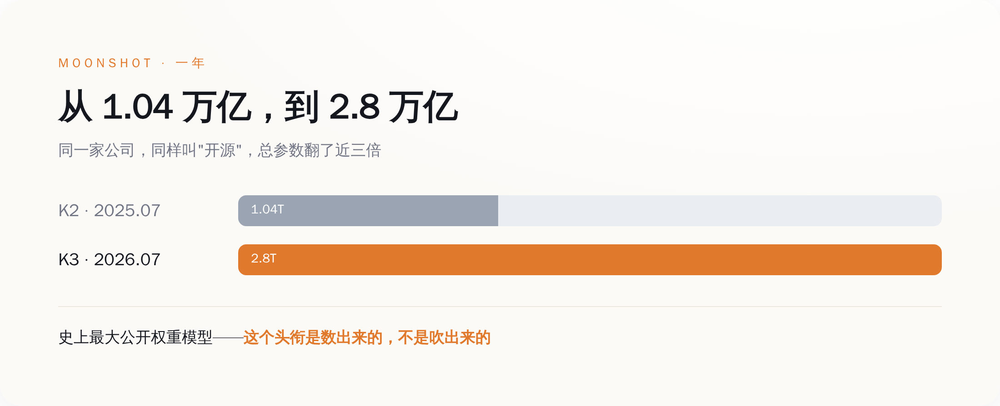
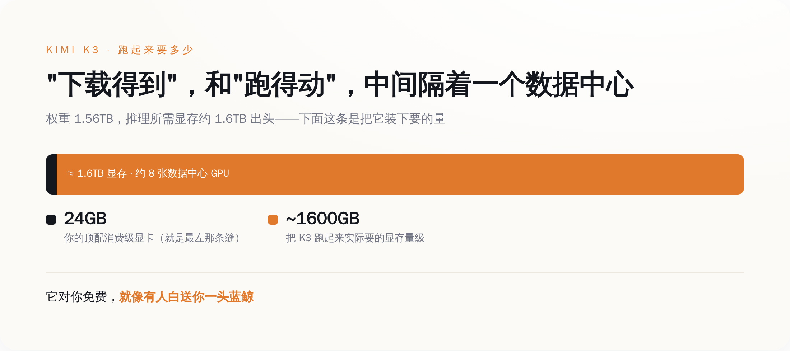
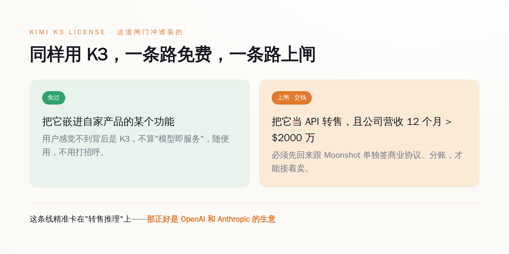

# 2.8 万亿参数的 AI 免费开源了，你却根本跑不动——跑得动的，正好被它收费

> **发布日期**：2026-07-30 | **分类**：AI深度报道

## 导语

去年 7 月，这家中国公司把自己最强的模型按 MIT 协议白送出去，谁想拿去商用都行，一分钱不要。今年 7 月，还是这家公司，还是"开源"，还是号称"免费"——只是这一次，它悄悄给"免费"这两个字，装了一道闸门。

7 月 27 日，Moonshot（月之暗面）放出 Kimi K3：2.8 万亿参数，是人类到目前为止，公开权重最大的一个 AI 模型。中文和英文的科技圈同时开始欢呼开源的胜利，标题里全是"史上最大""碾压""追平闭源"。这些都没说错。但如果你真的把这份"免费"从头到尾读一遍——不是读新闻，是读它的许可证、看它的体积——你会发现一件有点扫兴的事：这份白送，砸向的根本不是你。你连捡，都捡不起来。

---

## 一、先把东西说清楚：2.8 万亿参数，到底是个什么概念

大部分报道停在"史上最大"这四个字，没人告诉你大在哪、意味着什么。补上这一课，后面的话才立得住。

Kimi K3 是一个混合专家（MoE）模型：总参数 2.8 万亿，但每处理一个词，只激活其中约 1040 亿个——它内部养着 896 个"专家"，每次只喊醒 16 个干活。上下文窗口 100 万 token，原生就能看图，不是外挂一个视觉模块。按 Moonshot 自己技术报告里的说法，靠着两套新架构（他们管一套叫 Kimi Delta Attention，一套叫 Attention Residuals），K3 的整体"scaling 效率"比上一代 K2 提高了约 2.5 倍。这句是我在它披露的所有数字里，交叉核到最实的一条。

参照物是它自己一年前的样子。2025 年 7 月的 Kimi K2，总参数 1.04 万亿，激活 320 亿，上下文 25.6 万。一年，总参数翻了将近三倍。放到整个开源阵营里比，它比 DeepSeek 那一系更大，比 Meta 早年放出来的更大——所以"史上最大公开权重模型"这个头衔，不是营销号吹的，是按参数量数出来的事实。

到这里为止，一切都很励志：一家被卡着脖子的中国公司，一年之内把开源模型的天花板顶到了 2.8 万亿。但你先别急着感动。先记住两个数字——1.04 万亿变成 2.8 万亿，这是它想让你看到的；而另一个数字，1.56TB，它没怎么拿出来说。这第二个数字，才是这篇文章真正要讲的东西的开始。

*图注：一年时间，Kimi 把开源模型的总参数从 1.04 万亿顶到 2.8 万亿——这是它想让你看到的那个数字。*

## 二、"免费"的第一层：白送你的东西，你家的电脑连接都接不住

我们先把"开源"这个词拆开。它拆出来是两件事：一件是"权重公开"，你能下载到这个模型的全部参数；另一件是"你能用它",你真的能把它跑起来。大部分人以为这两件事是一回事。在 K3 这里，它们中间隔着一整个数据中心。

Moonshot 传到 HuggingFace 上的这份权重，有多大？1.56TB。你没看错，是 T，一点五六个 T。它被切成了近百个分片文件。而且这已经是压缩过的——他们用了一种叫 MXFP4 的量化方式训练，权重平均每个参数只占约 4.5 个比特。换句话说，这是"瘦身版"，原始的还要更胖。你要下载它，先得去买块硬盘；你家那台游戏本，光是把文件存下来这一步，就已经输了。

存下来只是第一关。真正要命的是跑。把这么大的权重装进显存里推理，按公开的部署资料，需要的显存是 1.6TB 出头的量级——大致等于八张顶配的数据中心 GPU 拼在一起，或者一个几十张卡的高带宽超级节点。有社区高手用极限的 1-bit 量化，硬是把它压到了约 594GB，听着少了很多，可 594GB 是什么概念？还是得好几张专业卡加一堆内存来伺候。作为对比，你能买到的最好的消费级显卡，显存也就 24GB、32GB。

所以"免费开源"这四个字，在你身上是不成立的。它对你免费，就像有人白送你一头蓝鲸：确实一分钱没要，可你既没有海，也没有码头，你家浴缸装不下它的一根舌头。真正能把这头鲸接住的，是那些本来就养着一片数据中心的公司——云厂商、推理平台、有钱烧卡的大厂。这份"人人可得"的开源，从物理上，就只对少数人可得。

**开源不等于免费，免费不等于你能用，你能用，也不等于你不用付钱。** 前两层刚讲完，第三层，藏在许可证里。

*图注：权重装进显存要 1.6TB 出头，约等于八张数据中心卡；你的消费级显卡 24GB，在这张图里连一条缝都占不满。*

## 三、"免费"的第二层：许可证从"随便用"，改成了"看营收收费"

这一层，是整件事最有意思、也最少人真读的地方。绝大多数转发"开源万岁"的人，没打开过那个 LICENSE 文件。我替你打开了。

先看去年的 K2。K2 用的是一份"改良版 MIT 协议"——MIT 是开源世界里最宽松的那一档，意思基本就是"随便你，商用、改、卖，都行，我只要求你别把我的名字抠掉"。K2 在这个基础上只加了一条：如果你的产品做到了每月一亿活跃用户、或者每月两千万美元收入这种巨无霸体量，得在界面上把"Kimi"这个名字亮出来。除此之外，你拿 K2 去干任何生意，都不用回来找 Moonshot 打招呼。这是真·大方。

再看今年的 K3。它不叫"改良版 MIT"了，它有了一份专门定制的、单独署名的《Kimi K3 License》。宽松的那部分——一亿用户/两千万月收入才要求署名——原样保留了下来。但它新加了一条以前从来没有过的东西，行话叫"模型即服务"（Model-as-a-Service）条款。翻译成人话是这样：

如果你把 K3 当成一个 API 卖出去——就是让别人调用你部署的 K3 来做推理或者微调——并且你公司（连同关联公司）在任意连续 12 个月里，总营收超过了 2000 万美元，那么对不起，你必须先回来跟 Moonshot 单独签一份商业协议，才能接着卖。而如果你只是把 K3 悄悄嵌进自己产品的某个功能里，用户根本感觉不到背后是它，那不算"模型即服务"，你不用管这条。

你把这两条对着读一遍，就能看清这道闸门是冲谁装的。它精准地卡在"把模型当 API 转售"这一个动作上，而且那个 2000 万美元的门槛，低到几乎是个摆设——但凡是个像样的云平台、推理服务商，营收随手就过线。换句话说，凡是靠"卖别人调用我家模型的算力"吃饭的公司，用 K3 到了一定规模，都得回来跟月之暗面分账。而"把模型当 API 卖推理"这门生意，全世界最大的两家玩家，一家叫 OpenAI，一家叫 Anthropic。

**这份许可证真正的读者，从来不是你，是那些靠卖 token 收租的公司。** 一年前 Moonshot 还在用最宽松的 MIT 白送，一年后模型强到能真正威胁到闭源大厂了，它就顺手把"开源"这两个字，改造成了一台针对同行的收费机器。免费给全世界用，但你要是敢靠转售它赚大钱，先过路，先交钱。

*图注：同样一份权重，两条路——嵌进自家产品的功能里，免过；把它当 API 转售且公司营收过 2000 万美元，必须先回来跟 Moonshot 签协议、分账。*

## 四、把三件事连起来看：开源，是一把递出去的刀

现在，把前面三个事实摆到一张桌子上：第一，K3 强到能跟最顶尖的闭源模型掰手腕（在前端代码这类评测里，它的分数已经排到第一，压过了 Claude 那一档）；第二，它把这么强的模型免费开源了；第三，它的许可证专门给"转售推理"这门生意装了收费闸。这三件事单看都不稀奇，连起来看，就是一套设计得相当冷静的打法。

对闭源大厂，K3 是一发砸向价格的炮弹。OpenAI 和 Anthropic 的核心生意，是按 token 收租——你每用一次，付一次钱，模型的重量在人家自己手里，你只能租，不能买。K3 直接把一个能打的模型的权重，摊在桌上白送。任何一家养得起数据中心的公司，都可以把 K3 自己部署起来，从此按 token 付给 OpenAI 的那笔月租，理论上归零——在你营收摸到那条 2000 万美元的红线之前，你为这个模型付出的授权费，是零。这不是省一点，这是把闭源大厂那张按次收费的账单，从根上抽掉一大块。

对那些真能跑得动它的中大型公司，K3 又是一个漏斗。先用"免费"这块糖，把你从 OpenAI 的怀里挖过来；等你的生意靠着 K3 做大了、营收过了线，收费闸落下，你已经深度绑定，换不动了，只能回来跟月之暗面谈分账。免费是获客成本，收费是变现节点，这套路数，跟当年多少互联网产品"前期烧钱补贴、后期关门收割"，是同一本教科书。

那对你我呢？对绝大多数既没有数据中心、也不打算靠转售模型赚钱的普通人和小团队，这场仗里，我们既不是买家，也不是卖家。我们是围观的，顶多是这套打法用来证明"开源阵营人多势众"的一个数字。**说到底，在这场价格战里，我们不是受益人，我们是弹药。**

## 五、最拧巴的一处，藏在它没说的地方

关于这个模型是用什么造出来的，Moonshot 自己那份长达几十页的技术报告里，有一个地方特别安静：它详细讲了架构、讲了效率、讲了跑分，却几乎没正面说清楚，训练这么一个 2.8 万亿参数的庞然大物，用的是哪些芯片、多少算力。一份恨不得把每个技术细节都秀出来的报告，偏偏在"用了什么硬件"这一栏留了白。这份沉默本身，在一个被芯片出口管制反复念叨的年份里，就已经很说明问题了——具体的指控和辟谣满天飞，那属于另一篇文章，这里我只说这份报告自己承认和回避了什么。

但你不需要那些捕风捉影的部分，光凭它摆在明面上的东西，这件事已经足够拧巴：一个被卡着算力脖子的公司，造出了一个强到能压过闭源标杆的模型，然后把它免费甩向全世界——甩的方式，是给"开源"装上一台专门朝闭源大厂收费的机器。它用最理想主义的那个词（开源、免费、人人可得），干了一件最生意经的事（砸对手的租金、给自己修漏斗）。这两张脸长在同一个动作上，才是 Kimi K3 这件事里，最值得停下来看一眼的地方。

所以下次再看到"某某大模型免费开源"的标题时，先别急着感动着去转发。打开它的体积，你会发现你根本抱不动；打开它的许可证，你会发现真正的账单不写给你。开源当然是好事，把最强的模型摊开给同行研究、给行业压价，客观上确实推着整个世界往前走。但"免费"这两个字上面的那层滤镜，该摘还是得摘：这不是有人在用爱发电，这是有人把你当电池，去点亮一场你根本不在牌桌上的价格战。

## 数据来源

- [Kimi K3: Open Frontier Intelligence（技术报告）, arXiv:2607.24653](https://arxiv.org/abs/2607.24653)
- [moonshotai/Kimi-K3 模型卡与权重, Hugging Face](https://huggingface.co/moonshotai/Kimi-K3)
- [Kimi K3 License（许可证原文）, Hugging Face](https://huggingface.co/moonshotai/Kimi-K3/blob/main/LICENSE)
- [Kimi K3 官方发布博客, kimi.com](https://www.kimi.com/blog/kimi-k3)
- [Kimi K2 LICENSE（改良版 MIT，用于对比）, GitHub](https://github.com/moonshotai/Kimi-K2/blob/main/LICENSE)
