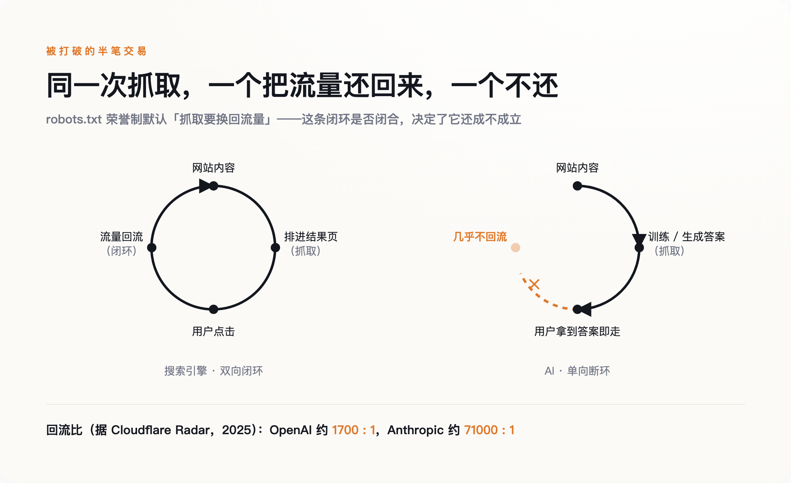
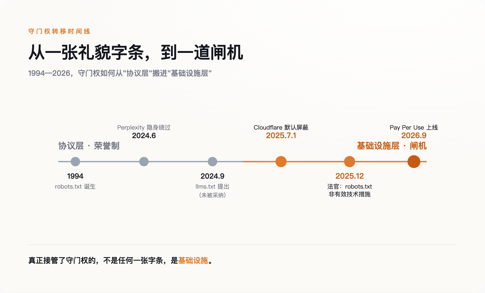
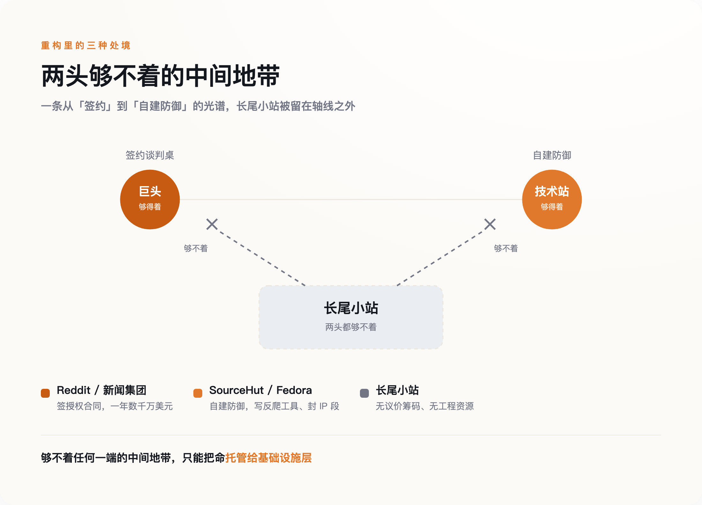

# robots.txt 死了，llms.txt 没能接班

> **发布日期**：2026-07-31 | **分类**：科技观察

## 导语

2024 年 6 月，一个叫 Robb Knight 的开发者搭了个测试网站，在根目录放了一行字：禁止抓取。这行字叫 robots.txt，互联网用了三十年。他盯着服务器日志，发现 Perplexity 用一个没有公开的 IP 段绕过那行字，把整站读了一遍。《连线》杂志随后验证了这件事：它自家网站早就屏蔽了 Perplexity 的爬虫，结果 Perplexity 照样能把它的文章总结得一清二楚。

那行字没有牙齿——它从来就没有过。三十年里它管用，不是因为它拦得住谁，而是因为爬虫愿意停下来。现在，爬虫不愿意了。

---

## 一张贴了三十年的告示牌

robots.txt 的发明者是荷兰工程师 Martijn Koster，时间是 1994 年。它的全部内容，就是网站主在根目录放一个文本文件，一行一行写明哪些目录欢迎爬虫、哪些别碰。它没有锁，没有密码，任何爬虫都可以看一眼然后当没看见。

它能约束住整个互联网三十年，靠的不是技术，是一笔没人正式写下来的交易：搜索引擎抓走你的内容，把它排进结果页，再把点进来的人还给你。抓取换导流。你让渡内容的可见性，换回访问量，这笔交易两边都划算，所以两边都守规矩。

这种"规矩"到底有多脆，2025 年 12 月才被正式确认。一名美国法官裁定，robots.txt 不构成《数字千年版权法》意义上"有效的技术保护措施"——绕过它去抓取，不违反反规避条款。翻译成大白话：它不是锁，是一张告示牌。你可以选择看不见它，法律不会因此罚你。三十年来所有人都默认它是一扇门，直到有人推了一下，发现那只是贴在墙上的一张纸。

## 契约是怎么破的

AI 公司打破的，正是"抓取换导流"这半笔交易。

*图：搜索引擎是“抓取换导流”的双向闭环，AI 抓取几乎不回流——被打破的是这半笔交易*

搜索引擎抓走内容，好歹把人还回来。AI 抓走内容，是拿去训练模型、或者直接在对话框里把答案吐给用户——用户拿到答案就走了，不再点进你的网站。据 Cloudflare Radar 2025 年的统计，老牌搜索引擎 Google 大约每抓十四个页面带回一次访问，OpenAI 是一千七百个页面换一次回流，Anthropic 更悬殊，约七万比一。抓十四页还你一个人，和抓几万页还你一个人，是两种生意。方向很清楚：单向。

承受这一击的不是大网站。3D 模型素材站 Triplegangers 被 AI 爬虫从六百个 IP 同时抓取，六万五千个产品页在短时间内被扫空，服务器直接瘫痪。维修教程站 iFixit 说，ClaudeBot 在二十四小时内访问了它近一百万次。维基媒体披露，自 2024 年 1 月起它的多媒体带宽消耗涨了一半，机器人贡献了 35% 的浏览量，却占掉 65% 的高成本流量。

开源开发者的处境最能说明问题。一个叫 Xe Iaso 的开发者，因为 AmazonBot 反复把他的 Git 服务器打宕机，写了篇近乎求救的博文，然后干脆做了个工具 Anubis，用工作量证明拦爬虫，几天内涨了两千颗星。SourceHut 的负责人说，他每周要花两成到全部的时间对抗激进爬虫。Fedora 的管理员被逼到直接封掉整个巴西的 IP 段。

这些人没有一个是想跟 AI 作对。他们只是想让自己的服务器别再崩。

## 想接班的新字条，也没活成

既然挡不住，那就换个思路——不挡了，主动配合。

2024 年 9 月，Answer.AI 的联合创始人 Jeremy Howard 提出了 llms.txt。它长得和 robots.txt 很像，同样是放在网站根目录的一个文本文件，但方向相反：robots.txt 告诉爬虫"别进来"，llms.txt 告诉爬虫"进来，内容我给你整理好了，用 Markdown 写成一份干净的导航，你别费劲去解析我那堆乱糟糟的 HTML"。

这是一次姿态上的转向，也是一次真诚的合作提议。它假设 AI 爬虫和网站可以是朋友：你想要干净的数据，我正好想被准确地引用，各取所需。

两年过去，它没活成。llms.txt 至今没有被 IETF 或 W3C 任何一个标准组织采纳，主流 AI 爬虫几乎从不主动去读它。你在根目录放了这个文件，绝大多数模型根本不看。

llms.txt 和 robots.txt 得的是同一种病。它们都是礼貌字条——一张写着"别进来"，一张写着"请这样进来"，但都默认对面那个爬虫会低头看一眼，然后照办。robots.txt 三十年的有效期，赌的是爬虫自愿；llms.txt 想接它的班，赌的还是同一件事。而 AI 时代唯一被反复证明的事实就是：爬虫不再自愿了。

**一张没有牙齿的纸，换一句话写，还是没有牙齿。**

## 守门权搬到了闸机上

真正接管了守门权的，不是任何一张字条，是基础设施。

*图：守门权从“礼貌字条”搬到“基础设施闸机”的关键节点（1994—2026）*

2025 年 7 月 1 日，Cloudflare 做了一件在此之前没有主要基础设施商敢做的事：把默认规则从"放行"改成"屏蔽"。在这之前，AI 爬虫默认可以抓，除非你主动设置拦截；这一天之后，在 Cloudflare 保护的网站上，AI 爬虫默认抓不了，除非网站主动放行。一个默认值的翻转，等于替全网几百万个站点，一次性把门关上了。

关键在于，这道门是有牙齿的。Cloudflare 不靠爬虫自觉，它在流量入口处做机器人身份验证——用密钥对给合法爬虫签名，认不出身份的直接拦下。守门这件事，从"协议层的君子协定"搬到了"基础设施层的闸机"。字条靠自愿，闸机靠拦截，这是本质区别。

关上门只是第一步。Cloudflare 同时开了个收费窗口，叫 Pay Per Crawl，复用了一个在 HTTP 协议里躺了二十多年、几乎没被正经用过的状态码：402，Payment Required，需要付费。爬虫想抓，可以，先付钱，最低一次一美分。到 2026 年 9 月，它又把规则升级成 Pay Per Use——不再按抓取次数收费，而是等你的内容真正出现在 AI 的回答里，才结账。

有牙齿的门后面，站着一个收银员。而愿意坐下来谈价钱的，是那些本来就有筹码的大网站。Reddit 在 2024 年 2 月把论坛内容授权给 Google 训练模型，一年约六千万美元。新闻集团在 2024 年 5 月和 OpenAI 签了五年、总额超过 2.5 亿美元的协议，旗下《华尔街日报》《纽约邮报》的内容可以带署名出现在 ChatGPT 的回答里——到 2026 年年中，这仍是 OpenAI 签下的最大一笔出版商授权。

要说清楚，这些授权是出版商和 AI 公司直接坐下来谈的，绕开了 Cloudflare 的闸机。正因为手里有筹码，他们才用不着闸机——闸机是给没筹码的人预备的。这些数字很好看，问题是，能坐上谈判桌的，全是巨头。

## 新收费站，会不会是第二个 Google

那个又当保安、又当收银员的 Cloudflare，会不会长成第二个 Google？

它现在一身三任。保安和收银员的活，前面那道收费闸已经在干；新添的是第三个身份——做市商，撮合 AI 公司和每一个网站之间的每一笔交易。这三个角色落在一家公司身上，天然有利益冲突——它既是规则的制定者，又是规则的收费方。三十年前我们担心搜索引擎决定谁被看见，现在换成另一家公司决定谁能被抓取。**守门人换了，守门这件事没变。**

就算你信任这个新守门人，被它保护的长尾小站也未必得救。他们的麻烦是两头够不着：一头，够不着谈判桌——你不是 Reddit，没有几千万条高质量内容，OpenAI 不会为你单独签约；另一头，够不着自建防御——你不是 SourceHut，养不起天天写反爬工具的工程师。签约的门票太贵，自救的技术太难，中间这一大批网站，只能默认托管给 Cloudflare，把命交出去。

更麻烦的是，他们本来最依赖的那点流量，正在被 AI 直接截走。

*图：三类网站的处境——长尾小站被挤在“签约”与“自救”之间，两头够不着*

Ahrefs 对三十万个关键词的研究发现，触发 Google AI 摘要的搜索里，99.2% 是信息型的提问，而且这些查询更长、更像问句——平均四个词，是普通搜索的两倍，多是冷门的长尾词。那恰好是长尾独立站赖以为生的流量。据 Seer Interactive 实测，出现 AI 摘要的搜索，自然点击率从 2024 年 6 月的 1.76% 跌到 2025 年 9 月的 0.61%，一年多降了六成。人们问完问题，在摘要里拿到答案，不再点进来。

当然，这幅图景也可能被夸大了。有分析指出，所有 AI 平台加起来带来的引荐流量，目前只占出版商总流量的约 1%——但这个数字量的是 AI 新送来多少人，不是它从搜索里截走了多少人，两件事不能混为一谈。真正拉开差距的，是"有忠诚读者的品牌"和"纯靠搜索捡流量的站点"之间那道老裂缝，不全是 AI 的锅。电子前哨基金会（EFF）也提醒，一刀切地要求爬虫全部实名、封杀匿名抓取，会误伤 ProPublica 调查算法、EFF 自己做隐私工具这些正当用途——真正的问题是过度抓取，不是匿名本身。就连 Reddit 那份看着稳当的授权，也在 2026 年 7 月传出续约不确定的消息，股价一天跌了 9%：连巨头的合同，都不是铁饭碗。

所以互联网正在给自己重新装门。只不过这一次，门是别人家的，钥匙也是。你想进，得先问问站在门口收费的那位。

---

## 数据来源

- [Robb Knight: Perplexity AI, Robots.txt, and Other Questions](https://rknight.me/blog/perplexity-ai-robotstxt-and-other-questions/)
- [Wired confirms Perplexity is bypassing website crawler blocks（via MacStories）](https://www.macstories.net/stories/wired-confirms-perplexity-is-bypassing-efforts-by-websites-to-block-its-web-crawler/)
- [Cloudflare Radar: Crawl-to-refer ratios（Google 14:1 / OpenAI 1700:1 / Anthropic ~71000:1）](https://blog.cloudflare.com/ai-search-crawl-refer-ratio-on-radar/)
- [Cloudflare: Content Independence Day — no AI crawl without compensation](https://blog.cloudflare.com/content-independence-day-no-ai-crawl-without-compensation/)
- [Cloudflare: Introducing pay per crawl（HTTP 402）](https://blog.cloudflare.com/introducing-pay-per-crawl/)
- [Cloudflare 从 Pay Per Crawl 转向 Pay Per Use（按 AI 引用付费，2026-09-15）](https://ppc.land/cloudflare-stops-charging-ai-per-crawl-and-starts-paying-per-answer/)
- [The /llms.txt file proposal](https://llmstxt.org/)
- [News Corp and OpenAI sign landmark multi-year global partnership](https://www.newscorp.com/2024/05/22/news-corp-and-openai-sign-landmark-multi-year-global-partnership/)
- [Reuters: Reddit AI content licensing deal with Google](https://www.reuters.com/technology/reddit-ai-content-licensing-deal-with-google-sources-say-2024-02-22/)
- [Ahrefs: I Analyzed 300K Keywords — AI Overviews](https://ahrefs.com/blog/ai-overview-keywords/)
- [EFF Deeplinks: 关于匿名网络爬取与 AI](https://www.eff.org/deeplinks)
