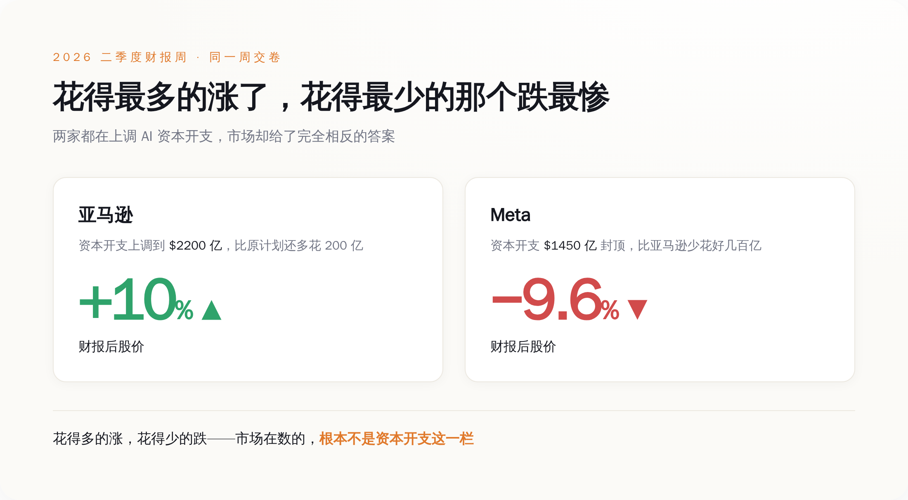
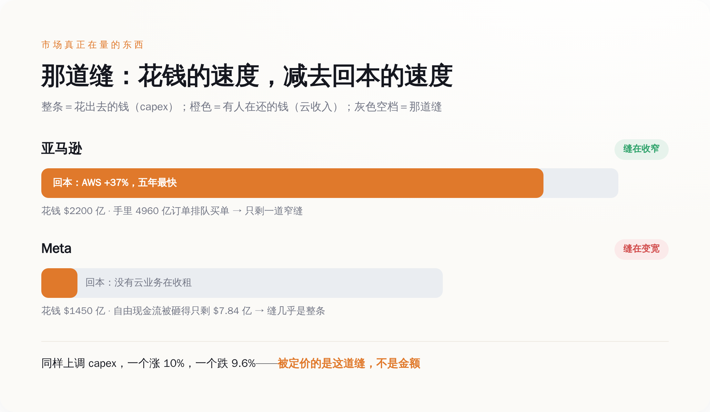
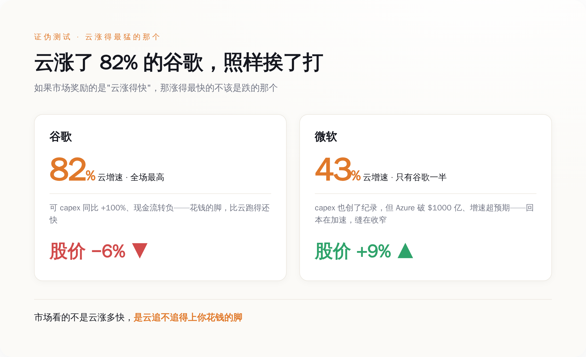

# 同一周，亚马逊把 AI 账单加到 2200 亿反而涨 10%；Meta 加得比它少，一夜跌掉 9.6%

> **发布日期**：2026-08-01 | **分类**：AI深度报道

## 导语

7 月的最后十天，五家全世界最值钱的公司排着队交财报：谷歌 22 号、微软和 Meta 29 号、亚马逊和苹果 30 号。交卷前，市面上所有人都在问同一个问题——AI 烧了这么多钱，华尔街这次会不会终于翻脸。

翻脸了，但翻的方式跟所有人猜的都不一样。同一周，亚马逊把 2026 年的资本开支预算一口气抬到约 2200 亿美元，比原计划还多花 200 亿，财报出来股价涨了超过 10%；Meta 把预算抬到 1300 到 1450 亿——比亚马逊少花好几百亿——盘后一夜跌掉 9.64%。

花得最多的涨了，花得少的那个反而跌成了全场最惨。如果你以为这周市场是在惩罚"AI 花钱太多"，那你把它的算盘打反了。它根本没在数你花了多少。它在数一样别的东西。

---

## 一、先把这一周的账摆上桌：一样地疯狂砸钱，两种截然相反的下场

大部分报道这周的标题，都在一个词上打转：烧钱。谁家 capex 又破纪录了，谁家自由现金流又被吃光了。这些都没错，但把五家公司摆到一张桌子上，你会看见一件用"烧钱"两个字解释不了的事。

先看五张卷子上的数字，都是各家自己财报里报出来的，不是谁的估算——不用记，扫一眼各家的量级和股价方向就行：

谷歌，二季度营收 1198 亿美元，同比涨 24%，云业务涨了 82%——这是全场最猛的云增速。资本开支这一季就砸了 449 亿，同比翻了一倍，全年预算从此前的 1800 到 1900 亿，再往上抬到 1950 到 2050 亿。结果呢？盘后跌了 5% 到 6%。

微软，四财季营收 900 亿美元，同比涨 18%，Azure 云涨 43%，全年首次跨过 1000 亿美元大关。它把下一财年的 capex 指引摆到了 2550 到 2600 亿——五家里最高。结果盘后涨了约 9%，一个晚上市值多出去两千多亿美元。

Meta，二季度营收 608 亿，同比涨 28%，广告依然是台好机器。但每股收益差了预期近 14%，自由现金流被砸得只剩 7.84 亿——这一季 311 亿的 capex 几乎把经营现金流全吃光了。它把全年预算抬到 1300 到 1450 亿。盘后跌 9.64%，全场第一惨。

亚马逊，二季度营收 2006 亿，AWS 云涨 37%，是它五年来最快的一季，积压订单(backlog)堆到 4960 亿。它把全年现金 capex 从约 2000 亿上调到约 2200 亿。盘后涨超 10%，全场第一爽。

苹果算半个局外人，一会儿单说。

你把这四张卷子并排看：花钱指引最高的微软(下一财年 2550 到 2600 亿，口径比别家远一个财年，但方向一样)和当年就把预算加到 2200 亿的亚马逊，涨了；当年封顶才 1450 亿、花得相对最少的 Meta，跌得最狠。就连云增速全场最高的谷歌，也照样挨了打。

如果市场真在惩罚"花钱多"，那挨打的顺序应该正好反过来。现在这个顺序说明，它盯的压根不是 capex 那一栏的数字有多大。

*图注：花得最多的微软、亚马逊涨了，花得最少的 Meta 跌最惨——市场排座次的标准，不是 capex 那一栏。*

## 二、它盯的是一道缝——你花出去的钱，有没有人在还

把这四家重新排一下，不按花了多少排，按"花出去的钱后面有没有人接着还"排，整件事立刻就通了。

先说清楚这道缝是什么。每一家的财报里，其实都藏着两个赛跑的速度：一个是它花钱建 AI 的速度(capex)，另一个是这些钱变成别人付给它的账单的速度(主要就是云收入)。这两个速度之间的差，就是市场这周真正在给每家公司量的那道缝。缝在收窄，说明你花的钱越来越有人接盘；缝在变宽，说明你花得比回本快，钱正悬在半空。

亚马逊为什么涨？不是因为它花得少——它明明加了 200 亿。是因为它那台还账的机器在加速：AWS 增速冲到 37%，是五年来最快，而且是连续第五个季度往上走；手里 4960 亿的积压订单，等于已经有人排好队、签好字，就等它把机房建出来交货。它一边把 capex 加到 2200 亿，一边让你看见后面排着近五千亿的买单人。这道缝，在收窄。

Meta 为什么跌成全场最惨？它的广告机器其实很能打，营收涨 28%。问题是，它这 1400 亿要砸出去的 AI 机房，后面没有一个"云"业务去收租。它建的算力是给自己用的——喂广告推荐、喂那个还没产出任何能开发票的东西的"超级智能"实验室。你在它财报里找不到一栏叫"别人为我的 AI 付了多少钱"，你只能找到一栏叫"我的自由现金流被 AI 吃得只剩 7.84 亿"。它花钱的速度，市场看得清清楚楚；它还钱的人在哪，市场一个都没看见。这道缝，是全场最宽的。

*图注：整条是花出去的钱，橙色是有人在还的钱，灰色空档就是那道缝——亚马逊几乎填满，Meta 几乎全空。*

**同样是上调 capex，一个涨 10%，一个跌 9.6%——市场定价的从来不是那个金额，是金额和回本之间的那道缝。**

## 三、最能说明问题的，是谷歌：云涨了 82%，照样挨打

如果你觉得"缝"这个说法太事后诸葛，觉得市场就是无差别地一见 capex 上调就砸，那谷歌这张卷子，正好是替你做的证伪实验。

谷歌的云增速，82%，是这一周全场最高的，把微软的 43%、亚马逊的 37% 都甩在身后。按"市场奖励有人还账"的逻辑，它不该是涨得最多的那个吗？可它偏偏跌了 5% 到 6%。

差别就藏在两个速度的比赛里。谷歌的云是涨得猛，可它花钱涨得更猛——这一季 capex 同比翻了整整一倍(449 亿)，把自由现金流直接干成了负数。它的还账机器确实在飞奔，可它烧钱的脚更快，两条腿一比，缝是在这一季被拉宽的，不是收窄的。市场量的就是这个差——云的速度，减去花钱的速度。谷歌云跑得快，但没跑过它自己的 capex。

微软是反过来的那一面。别误会，它一点都不省：这一季 capex 同样创了纪录，下一财年的指引还是全场最高的 2550 到 2600 亿。可市场照样给它涨了 9%。为什么？因为它那台还账的机器，看得见地在加速——Azure 一脚跨过 1000 亿美元的年营收线，增速还超了自己先前的指引。花钱一样凶，但市场清清楚楚看见它的回本在往上追，缝在收窄。于是它成了这几家里唯一一个又砸了纪录 capex、又被市场奖励的公司。

*图注：云增速全场最高的谷歌跌了，云增速只有它一半的微软涨了——市场看的不是云涨多快，是追不追得上花钱。*

一个云涨 82% 的公司跌了，一个云涨 43% 的公司涨了。"市场无差别恐慌 capex"解释不了这个分裂，"看那道缝在收窄还是变宽"能。

## 四、再往下拆一层：市场夸的那个"还账人"，自己也在借钱烧

到这儿，故事好像很清爽了：有云去收租的(亚马逊、微软)是好孩子，没云在裸烧的(Meta)是坏孩子。但如果就此打住，你又会被这套叙事骗过去。得再往下抠一层。

市场奖励亚马逊和微软，奖励的是它们云收入在加速——因为这证明"有人在为 AI 付钱"。那么，往云里付钱的这些人，到底是谁？

云上增长最快的那批客户里，站着一整排这两年融资烧得最凶的 AI 公司。它们拿着一轮又一轮的风险投资，转手就交给了 AWS 和 Azure，去租 GPU、租算力。也就是说，微软和亚马逊财报里那条让市场安心的"云收入在加速"，背后有一部分，是别的 AI 公司拿着投资人的钱，替它们付出来的。

这就有点意思了。市场用"有人在还账"这条标准，把 Meta 判了死刑，把亚马逊微软捧上了天。可它捧起来的那个"还账人"，自己账上的钱也不是挣来的，是借来的、是融来的。**这道缝，很可能不是被填上了，只是从微软亚马逊的账本，挪到了它们那些 AI 客户的账本上。** 整个链条还是悬在半空，只是市场这一周，选择只看链条最靠近自己的那一环。

所以别把"云在收租"当成什么坚实的地基。它当下是真的，钱是真金白银进来了；但它脚下站着的，是一整排还没证明自己能自己造血的 AI 公司。市场这周奖励的，与其说是"AI 已经开始赚钱了"，不如说是"暂时还有人愿意接着往里付钱"。这两件事，不是一件事。

## 五、苹果这根反面教材：连"不花钱"也一样挨罚

说回苹果，那个被我晾在一边的局外人。它这张卷子，恰好把市场这周的规矩，从反面又焊死了一遍。

苹果三财季营收 1094 亿，涨 16%，iPhone 涨 22%，服务收入 307 亿创下六月季度新高，各项都超预期。按理说这是张好卷子。可它盘后也跌了，跌 6.65%。理由里除了下季度指引偏软、芯片供应吃紧，还有很关键的一条：投资者不满它那套"租、不建"的 AI 打法——别人都在自己砸机房，苹果选择去租别人的算力。

你看，市场这周这把尺子有多轴：它一边罚 Meta，罚的是"你花了大钱，却没人替你还账"；转头又罚苹果，罚的却是另一件事——你连那台会花钱、也可能会还账的机器，都懒得自己造。说句公道话，苹果的问题其实不在"缝"上——它压根没上桌，谈不上缝宽缝窄；市场嫌的是它连入场的姿势都没摆。可两家一起挨打，指向的是同一件事：这一周，市场眼里只有一样东西——你手里有没有一台正在把钱还回来的机器。花钱还是不花，都不是重点，这台机器在不在、转没转起来，才是。

所以五张财报连起来，就一句话：下次再刷到"某某大厂豪掷千亿投 AI"的标题，先别急着惊叹那个金额有多吓人。**去它财报里翻紧挨着 capex 的另一栏——那台还账的机器，这一季是在加速，还是在减速。** 市场数的从来不是你掏了多少钱出去，是你身后有没有人，正排着队把钱还回来。而这一周它数完，给了两个涨停般的拥抱，和三记响亮的耳光。

## 数据来源

- [Alphabet Announces Second Quarter 2026 Results（谷歌官方财报）](https://abc.xyz/investor/)
- [Google earnings Q2 2026 live updates（云 +82%、capex 上调、股价反应）, CNBC](https://www.cnbc.com/2026/07/22/google-earnings-q2-goog-live-updates.html)
- [Microsoft FY26 Q4 Press Release（微软官方财报）](https://www.microsoft.com/en-us/investor/earnings/fy-2026-q4/press-release-webcast)
- [Microsoft MSFT Q4 earnings report 2026（营收/Azure/capex/股价）, CNBC](https://www.cnbc.com/2026/07/29/microsoft-msft-q4-earnings-report-2026.html)
- [Meta Q2 2026 earnings（营收/FCF/capex 指引/股价）, Meta Investor Relations](https://investor.atmeta.com/)
- [Amazon AMZN Q2 earnings report 2026（AWS +37%、backlog、capex $220B、股价）, CNBC](https://www.cnbc.com/2026/07/30/amazon-amzn-q2-earnings-report-2026.html)
- [Apple Reports Third Quarter Results（苹果官方财报）](https://www.apple.com/newsroom/2026/07/apple-reports-third-quarter-results/)
- [Apple AAPL Q3 2026 earnings live updates（营收/服务/股价/AI 策略）, CNBC](https://www.cnbc.com/2026/07/30/apple-earnings-live-updates.html)
