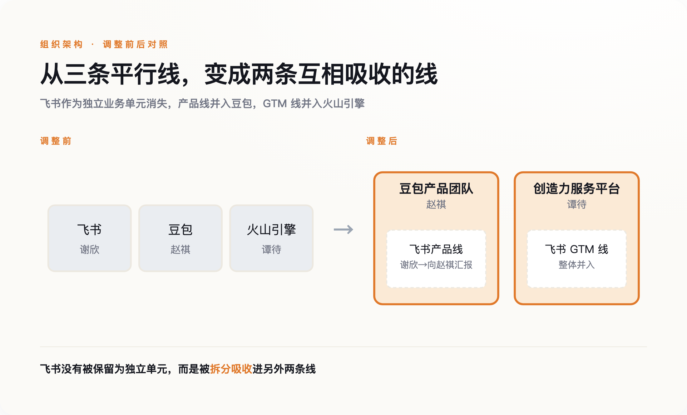

# 一年前，飞书CEO说要打破"一成不变"；一年后，被打破的是飞书自己

> **发布日期**：2026-08-01 | **分类**：科技与组织

## 导语

2025年7月11日，晚点对飞书CEO谢欣做了一次专访。他说，飞书想做的是"下一代Office"，工作方式的改变会重塑组织，"飞书存在的意义，就是为了打破这种一成不变"。他把这个愿景，锚定在2030年。54周后，2026年7月30日，字节跳动一封内部信宣布：飞书产品团队并入豆包，谢欣本人，转为向豆包负责人赵祺汇报。多数报道把这条新闻写成"字节AI战略再升级"。这条判断没有错，但它漏掉了故事里最扎实的部分——这次合并证明的不是字节有多爱AI，是在一家大公司内部，讲故事的业务，天然比赚钱的业务更有资格改写别人的组织架构。

## 一、这次调整到底动了什么

先把架构讲清楚。这次调整分两条线：产品线上，飞书产品团队整体并入豆包，成立新的豆包产品团队，由豆包负责人赵祺牵头，飞书原负责人谢欣向他汇报，飞书从此不再是一个独立业务单元；GTM线上，飞书的市场、销售、客服团队和火山引擎的对应团队合并，成立一个新组织叫"创造力服务平台"，由火山引擎负责人谭待牵头。字节官方给出的说法是"加强豆包、飞书、火山引擎在企业生产力场景的协同"。

*图：飞书没有被保留为独立单元，而是被拆分吸收进另外两条线。*

三个当事人的履历值得对照着看。谭待2008年加入百度，做过首席架构师，2020年加入字节任火山引擎总裁，一路把火山引擎做成了字节内部数得上号的核心业务板块。赵祺是北大计算机博士，早年在豆瓣、豌豆荚待过，也做过"车来了"的联合创始人，2017年加入字节，先后负责增长中台、穿山甲，2022年转岗做过一段时间HR，直到2025年9月才接手豆包产品——距离这次重组，只有十个月。谢欣的履历最老，他是张一鸣在酷讯的老上司，2016年就主笔了飞书前身Lark的产品说明书。三个人的资历排下来，反而是履历最浅、执掌产品线时间最短的赵祺，成了统领另外两条线负责人的那个。

## 二、被合并的一方，恰恰是更赚钱的那个

这是整件事最反直觉的地方。按媒体测算，飞书2025年营收超过30亿元，2026年第二季度ARR同比增速超过100%——这是一门已经跑通、正在加速的生意，客户在续费，收入在增长。如果按常规商业逻辑，一门已经被验证、正盈利增长的现金流业务，通常拥有更大的组织话语权，它能用自己的报表证明自己，不需要靠故事撑着。这次调整反过来了：更确定赚钱的飞书，被并入了豆包。

豆包这边的数字，性质完全不同。字节自己披露的口径是，公司大模型业务ARR达到40亿美元，官方表述称这个数字超过国内其他大模型公司的总和——但字节没有拆分出豆包、火山引擎API调用、企业版各自占多少，这40亿美元衡量的与其说是一门业务的确定盈利，不如说是字节想让外界相信"我们在AI这件事上跑在最前面"的声量。豆包对外承担的，是字节在"中国要不要有自己的ChatGPT"这场全民关注的叙事里的位置，这场叙事目前决定着资本和舆论怎么给一家AI公司估值，而飞书这门扎实的SaaS生意，从来不是这场叙事的主角。

声量的差距，用户规模上更直观。据第三方数据，豆包APP的月活在2026年初就已经突破2.27亿；而飞书作为协同办公赛道的一员，月活量级在3000万上下，即便算上钉钉、企业微信这两个更大的同类产品，整个协同办公赛道的想象力，也很难和一款单季度就能新增几千万用户的AI应用相比。据知情人士估算，飞书团队约4000人，年人力成本在32亿到40亿元之间，和刚过30亿元的营收大致处于同一量级，盈利空间存疑——这门生意扎实，但扎实本身，从来不构成让全公司都跟着讲你的故事的理由。

## 三、一年前，他说要打破"一成不变"

回到开头那场专访，完整看一遍谢欣当时说了什么，会更清楚这次调整的分量。他说"我一直觉得Office是非常伟大的产品"，"飞书想做的，是下一代Office，而Office有上万人"；他说"工作方式的改变，本质上也会影响甚至重塑组织"；他还专门强调，"飞书存在的意义——就是为了打破这种一成不变"。同一次专访里，他把飞书的多维表格功能形容成"至少领先钉钉12个月"。

这里不去揣测谢欣本人现在心里怎么想——没人能替他说他愿不愿意、服不服气，这篇文章也不打算做这种廉价的心理分析。但两个时间点摆在一起，事实本身已经足够说话：一年前，他公开定义了"飞书存在的意义"，把它讲成一场要用十年去打破陈规的运动；一年后，飞书这个业务实体本身，成了被重新安排的对象。他没有被开除，他还在牵头产品，只是从对一个独立业务负责，变成向另一个业务的负责人汇报。这不是失败，但也很难说是他一年前设想的那种"打破一成不变"。

## 四、这不是字节一家的剧本

把镜头拉远一点，这个模式在别处也在发生。2026年，微软把Copilot的商业版和消费版团队合并，统一交给一个人负责，目的是让公司围绕AI首席科学家Mustafa Suleyman，把资源和叙事都收拢到"超级智能"这条主线上；据传后续企业版和消费版Copilot会合并成一个App，和Teams、Microsoft 365捆绑收费——Teams本身没有被裁掉，但它作为独立故事的位置，正在被Copilot这个更大的叙事吸收。Salesforce用277亿美元收购Slack之后，走的也是类似路线：Slack现在更多被描述成Agentforce这套AI体系的"入口"，而不是一个独立发展的产品。

这几个案例放在一起，能看出一条共同的逻辑：不是AI故事讲得好的业务，靠自己的实力吞并了赚钱的业务；是每家公司内部，都需要一个业务去承担"我们没有落后于这场全球AI竞赛"这场叙事，而承担这个角色的业务，会自然而然地获得比它财务表现更大的组织权重，直到有一天，它开始重新安排别人的汇报关系。

这里有两个合理的反驳，都值得正面接住。第一个是：赵祺去年9月才接手豆包，十个月就把它做成了字节对外最重的一张牌，这会不会单纯是他个人能力过硬，公司只是"能者上"，跟"故事重不重要"没有关系。这个反驳站得住一半——赵祺确实有增长和商业化的成功履历，这不是空穴来风的空降。但换个问法就露出破绽：为什么公司选择让一个执掌产品线只有十个月的人，去统领一个执掌了近十年、履历深得多的同事，而不是反过来？答案不在赵祺个人能力有多强，在于他现在手里的这张牌，是这个时间点上公司最需要讲好的那个故事。能力决定了他能不能接住这张牌，但不是这张牌本身为什么会被递到他手里。

第二个反驳更实在：飞书人力成本和营收本来就贴得很近，把GTM团队并进火山引擎，本身就是降本增效的常规操作，不需要"叙事权力"这个中介概念来解释。这个反驳同样只说对了一半——它能解释为什么飞书的销售和客服团队要并出去省钱，却解释不了为什么飞书的产品团队，连同它的负责人，要整体划进另一个业务的名下，而不是继续独立运营、只是精简人力。省钱能解释"合并GTM"，解释不了"谁向谁汇报"。

## 五、组织权力天平往哪边倾斜，从来不是由谁更赚钱决定的

这大概是这次调整留给旁观者最有用的一课。飞书的问题从来不是做得不够好——它增长着、盈利模式在跑通，这些都是真的。它的问题是，它所在的赛道，不是这个时代资本和舆论最想听的那个故事。而豆包所在的赛道，恰好是。

下一次看到一家公司内部把"赚钱的部门"并进"讲故事的部门"，不用急着相信官宣稿里那句"战略协同"。真正决定谁并入谁的，往往不是谁的报表更好看，是谁站在了这个时代最需要被讲述的那个故事里。

## 数据来源

- [字节跳动调整AI业务架构 大模型业务ARR为40亿美元（财新网）](https://www.caixin.com/2026-07-30/102469448.html)
- [飞书年入30亿，还是被豆包"收编"了（虎嗅网）](https://www.huxiu.com/article/4879565.html)
- [飞书走出字节核心圈：一场酝酿了十个月的收编（潮起网）](https://www.ichaoqi.com/guandian/2026/0731/84519.html)
- [聊聊字节的AI调整：两个关键人物和一个新方向（新浪财经）](https://finance.sina.cn/stock/jdts/2026-07-30/detail-inikqupy9647929.d.html)
- [专访飞书CEO谢欣：Office是一个伟大的产品，而我们想做新时代的Office（晚点/编程随想转载）](https://www.bianews.com/news/details?id=215813)
- [飞书2025年营收超过30亿元（新浪科技）](https://finance.sina.com.cn/tech/roll/2026-07-16/doc-inihyiym7998599.shtml)
- [消息称飞书Q2 ARR同比增长超100%（九方智投）](https://9fzt.com/9fztgw_1_top/85377bb4a9c7b68abf6c56632d7818fe.html)
- [Microsoft Reorganizes Copilot Teams Under Single Leadership](https://windowsnews.ai/article/microsoft-reorganizes-copilot-teams-under-single-leadership-to-fix-fragmentation-and-accelerate-in-h.405425)
