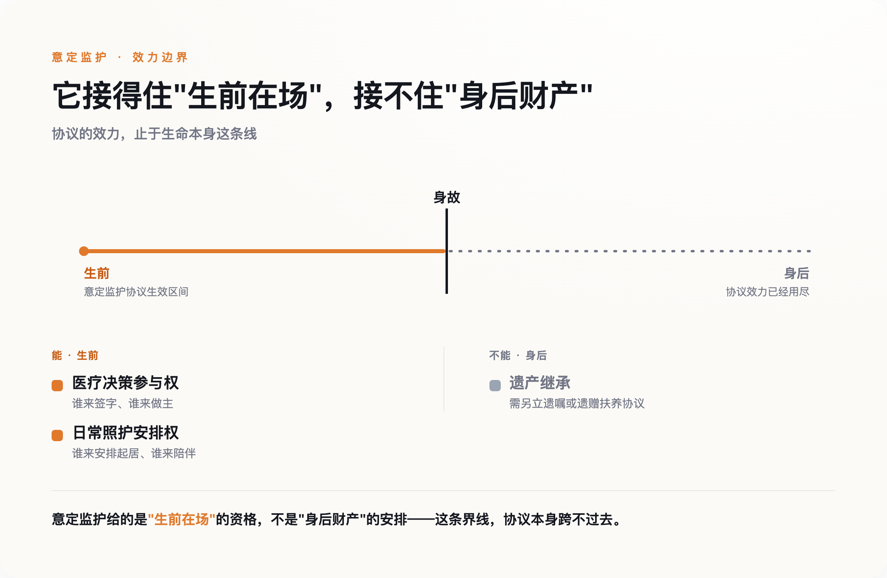

# 告诉李抗美"老李走了"的，不是老李的家人，是一群拍纪录片的陌生人

> **发布日期**：2026-08-01 | **分类**：法律与社会

## 导语

老李去世的消息，最先传到的不是李抗美，是拍摄纪录片的导演团队——他们在一个清晨接到通知，随即赶往洛阳，敲开李抗美家的门时，她还在厨房里张罗一条刚买的鱼，完全不知道自己已经不用再等了。把这件事告诉她的人，不是老李的家人，是一群举着摄像机的陌生人。网上多数评论把这件事读成一个凉薄故事：一个不管李抗美死活的女儿，一个被辜负了18年的女人。这个读法有它的道理，但它遮住了一个更冷、也更值得深究的事实：李抗美缺的不是一个愿意通知她的人，是一张能让她自动被通知的纸。

## 一、18年，一场没有名分的搭伴

李抗美是河南人，老李是上海人。2008年，两人在洛阳相识，都经历过婚姻的结束，觉得投契，决定搭伴走过余生。此后18年，他们在上海一起生活：老李陪她看牙、治腰，带她去海洋馆、金茂大厦、迪士尼，每天早上一句"早上好"，记得提醒她量血压、看天气。这段关系里没有登记结婚，纪录片《前浪》第二季用整整一集讲这件事，标题是《李抗美的决定》。

六年前，老李查出癌症。第一反应不是让李抗美留下照顾，是主动提出分手，把她送回洛阳——他不想拖累她。两年前，老李病重，李抗美主动从洛阳赶回上海，重新接过照顾他的担子，一直到他被送进安宁病房、医生评估生存期只剩38天左右。

就是在这最后的38天里，李抗美做出了她的决定：离开。她给出的理由是腰不好要回洛阳治疗、合租房要续租得签半年合同。真正的理由，纪录片和后续报道都指向同一处：没有名分，留在这里，身份尴尬。走的前一晚，她把老李给她的钱分成两份，悄悄把一份塞进他的枕套里，两人拉钩约定，她会尽快回来。老李去世那天，导演团队一早接到消息，专程飞去洛阳，敲开她家门时，她还完全不知情。

## 二、评论区在骂老李女儿，但真正该被追问的不是她一个人

这段故事传开后，评论区几乎一边倒地把矛头指向老李的女儿：男友都不在了，连一声都不肯知会照顾了他18年的人，这也太凉薄。这个指控情绪上很好理解——目前能看到的记录里，确实没有出现"女儿主动联系李抗美"这件事，最后接到消息、赶去报信的，是这部纪录片的摄制组，不是老李的家人。

但把这件事完全归咎于一个人的凉薄，其实低估了问题的深度。李抗美不是妻子，没有法定的知情权、探视权、决策参与权；她能不能被及时告知，能不能在病房里留下，能不能参与后事安排，全部取决于家属这一方愿不愿意——而这一次，连"愿不愿意"这个问题都没有被认真面对过，事情最后是靠一群恰好在场记录的陌生人补上的。一个人的选择或许可以被谴责，但一个连基本知情权都要靠运气兜底的结构，值得被谴责的范围要大得多。

## 三、这不是没有工具，是工具在另一集里

巧的是，《前浪》第二季第一集《我在天堂等你》讲的正是这件事的解法：意定监护。这项制度写在《民法典》第33条里，允许一个具备完全民事行为能力的成年人，提前指定一个人——不一定是配偶，不一定有血缘关系——在自己丧失或部分丧失行为能力时，作为自己的监护人。这个人可以参与医疗决策、安排日常照护；至于身后事怎么办，监护关系本身随监护对象离世而终止，需要另外在协议或遗嘱里写明，但这至少给了协商的起点，而不是像李抗美这样，连协商的资格都没有。李抗美和老李，恰好是这项制度设计出来要覆盖的那类关系：没有婚姻，却承担了婚姻该承担的责任。

但节目组把这两件事分成了两集来讲，好像它们是两个不同的社会议题——一集讲制度，一集讲感情。目前能看到的报道也基本延续了这个分法：要么专门介绍意定监护这项新制度，要么专门写李抗美的故事，很少有人把两者接在一起问一句：如果李抗美和老李当年办过这份协议，故事会不会不一样。

答案不是简单的"会"或"不会"。意定监护协议如果当年在公证处办过、并且在医院备案，李抗美本可以在老李的病房里，堂堂正正地做医疗决策的参与者，而不是一个随时可能被请出去的外人——她也更有理由被列为第一顺位的知情人，而不必依赖家属想不想得起她。但意定监护解决不了另一件事：继承。协议不会自动让她拥有老李的遗产份额，那需要另立遗嘱或者遗赠扶养协议——如果她图的是这个，这张纸帮不了她；但她图的从来不是这个，她要的只是"在场"的资格，而这恰恰是意定监护能给的。

*图：意定监护给的是'生前在场'的资格，不是'身后财产'的安排——这条界线，协议本身跨不过去。*

## 四、她缺的不是感情的名分，是没人告诉她

这里绕回最该问的问题：为什么这样一对本该是意定监护制度典型受益人的伴侣，最后什么都没办成？

不是因为他们不需要。18年的陪伴，医院里的进进出出，恰恰是这项制度设计出来要解决的场景。合理的猜测是：他们大概率根本不知道这项制度存在，或者知道了也不清楚具体怎么办。这不是苛责李抗美——一个70岁、要靠退休金过日子的老人，没有义务主动去研究民法典第33条。真正该被追问的，是这项已经生效多年的制度，为什么没有在她最需要的时候，出现在她的生活里。

这不是纸面上的担忧。民政部社会福利中心与北京市老龄协会联合做过一份1611人样本的调查：近八成老人担心自己未来的照护问题，长期空巢的约四成，无子女或失独的约四成——这是一大批人，理论上正需要一份意定监护协议来兜底，却大概率从没听说过这四个字。制度写好了，但民政部门、居委会这些和老年人接触最密切的机构，对这项制度的知晓和推广普遍不足，没有一条稳定的通道能把它送到真正需要的人手里。谁最需要知道这件事？恰恰是那些没有律师朋友、不常刷法律科普、每天操心的是腰疼和房租的普通老人——而这群人，往往也是离这类信息最远的人。

## 五、下一个"李抗美"，缺的也会是同一张纸

李抗美最后回了洛阳，逐渐找回了自己的生活节奏，踢毽球、逛公园、喝羊肉汤。这个结尾算不上一个圆满的答案，但至少是她自己选的。真正令人不安的，不是这一段感情有没有修成正果，是下一个处境相似的老人，大概率还是不会知道，除了"留下忍受尴尬"和"离开等一个陌生人来敲门告诉你消息"之外，本来还有第三条路。

意定监护写进法律已经好几年，公证处办一份协议的费用不算高。真正缺的从来不是这张纸，是让这张纸能出现在该出现的地方——出现在社区医院的候诊室，出现在居委会的公告栏，出现在像李抗美这样的人，真正会看到的地方。

## 数据来源

- [纪录片《前浪2》｜第二集《李抗美的决定》他们用18年，完成了最长情的陪伴（澎湃新闻）](https://m.thepaper.cn/newsDetail_forward_33632700)
- [李抗美病房谈分手（新浪新闻）](https://www.sina.cn/news/detail/5324114176773248.html)
- [纪录片《前浪》第二季｜第二集《李抗美的决定》导演手记（腾讯新闻）](https://news.qq.com/rain/a/20260722A0DJ2H00)
- [意定监护、老年情感困境：《前浪2》关注老龄化社会的新问题（腾讯新闻）](https://news.qq.com/rain/a/20260726A0A35300)
- [近八成老人"愁养老"，意定监护如何实现？（新京报）](https://m.bjnews.com.cn/detail/1697803955168880.html)
- [被动陷入监护缺失怎么办？《老年人意定监护服务指引》（新华网）](http://www.news.cn/politics/2023-10/21/c_1129929059.htm)
