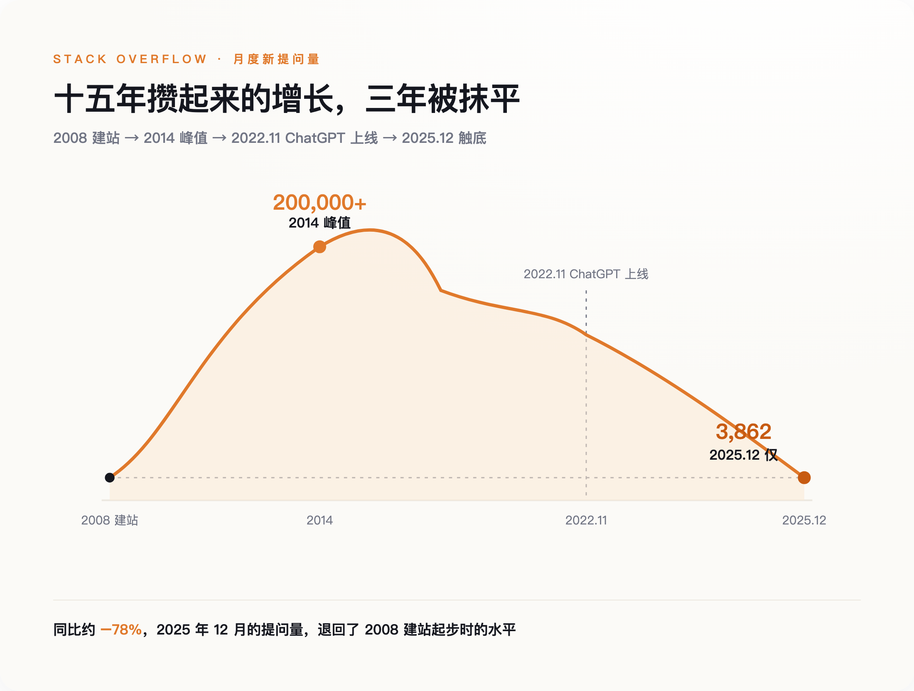
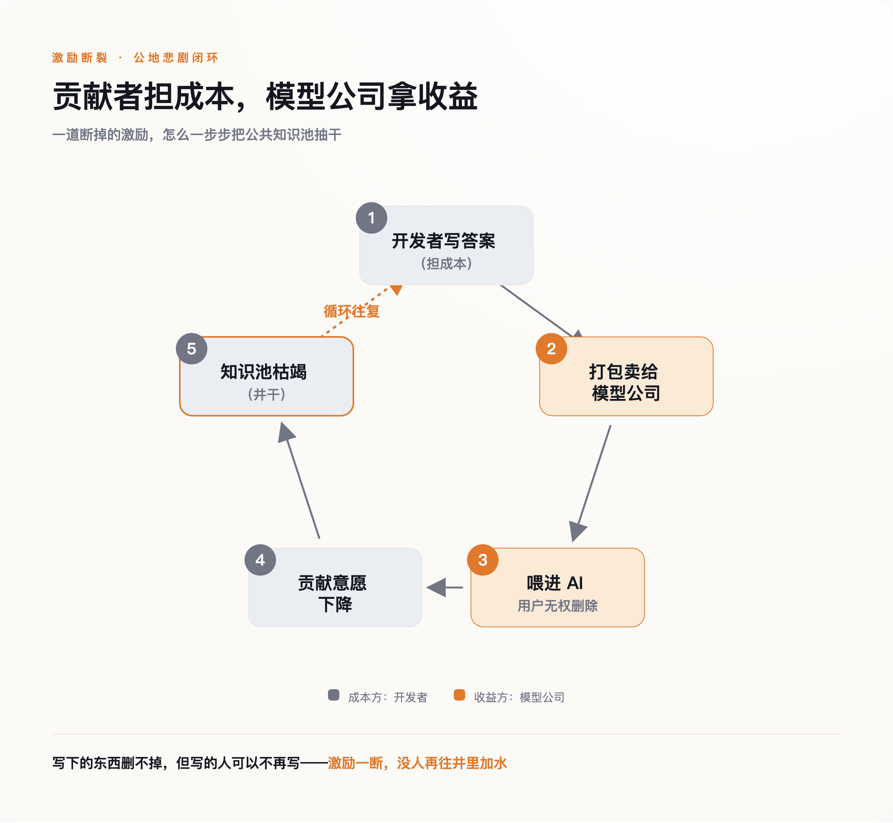

# Stack Overflow 的问答量跌回了 2008 年，它的营收却在逆势上涨

> **发布日期**：2026-08-01 | **分类**：AI 与商业

## 导语

2024 年 5 月的某个下午，一个叫 Ben Ui 的开发者，动手删改了自己写在 Stack Overflow 上的高赞答案。那是他多年前随手留下的东西，帮过不知多少同行。他把内容改成了一段抗议文字。不到一个小时，版主把它改了回来，顺手封了他的账号，七天。

网站给的理由平静得近乎冷酷：这些话一旦发布，就成了"集体成果的一部分"，你无权单方面收回。

Ben Ui 那天撞上的，不是一条社区规则。是一个正在全球程序员身上同时发生、却几乎没人抬头去看的转折——喂大了今天所有 AI 的那口井，正在被抽干，而抽水的人，把井水装瓶卖了个好价钱。

---

## 一、他删不掉自己写下的那句话

促使他动手的，是几周前的一笔交易。2024 年 5 月，Stack Overflow 宣布把自己十五年积攒的问答档案授权给 OpenAI，用来训练模型。对很多老用户来说，这一下把一件他们一直没细想的事摆到了脸上：我十年前熬夜写下、分文没取的那些答案，正被打包卖去，训练一个将来可能让我丢掉饭碗的东西。

Ben Ui 的反应很直接——那就把答案删了，让它失去被喂进模型的价值。在他看来这事没什么可绕的：我熬夜免费写下的东西，凭什么被人打包卖去，喂一个将来可能抢我饭碗的机器，而我连删都删不掉？他不是唯一这么想的人，那几天不少用户尝试了同样的操作。结果他们发现，删除这个动作，在 Stack Overflow 上并不真正存在。你可以点"编辑"，但版主会在几分钟到几小时内把内容回滚，理由是保护"社区共同财产"；坚持删的，账号被暂停。

这里藏着一个大多数人从没读过的条款：你在 Stack Overflow 发的每一个字，都附带一份"永久的、不可撤销的"授权。也就是说，从你按下发布键的那一刻起，那句话在法律意义上就不再完全归你。平时没人在乎这行小字，直到有人想拿回自己的话，才发现门早就锁上了，而且钥匙从一开始就不在自己手里。

Ben Ui 最后没能删掉那段话。它照旧躺在服务器上，照旧被喂进了那个让他不想再写下去的模型。一个人对着一台机器的沉默抗议，就这么被无声地覆盖了。

而他之所以突然想删，是因为他隐约感觉到了一件更大的事：这口井，快没水了。

---

## 二、一口花了十五年才灌满的井，三年就见了底

Stack Overflow 是过去十五年里全世界程序员的公共记忆。谁遇到报错，先去搜一搜，八成有人早在几年前就踩过同一个坑，还把解法一步步写清楚了。这些答案没人付钱，纯靠一群人图个"被认可"和"帮到别人"，一条一条堆出来。到 2014 年前后，这里每个月能接住二十多万个新问题。

然后是 2025 年 12 月：整个 Stack Overflow 全月的新提问，只有 **3,862 个**——同比再砍掉约八成，一路跌回 2008 年它刚建站时的水平。十五年攒起来的势头，三年就被抹平了。

*图注：月提问量从 2014 年峰值的 20 万+ 跌到 2025 年 12 月的 3,862，等于抹平了建站以来十五年的增长*

要把时间线摆正，才不至于误读。提问量的下滑，不是从那笔数据交易开始的，而是从 2022 年 11 月 ChatGPT 上线那天。开发者们发现，与其去论坛发帖、等一个可能几小时后才来的回答，不如直接问聊天框，三秒钟就给你一段能跑的代码。到 2023 年 7 月，Stack Overflow 已经在慌忙自救，推出自己的生成式产品；同年 10 月，它裁掉了 28% 的员工。也就是说，危机在数据交易之前就来了——把档案卖给 OpenAI，是一家现金流吃紧的公司被逼出来的动作，不是什么深谋远虑的生意。

真正要命的是这个循环：开发者不再回来提问，因为答案已经在 ChatGPT 里了；而 ChatGPT 之所以答得出来，恰恰是因为它学过这群人过去十几年写下的每一个答案。人们停止往井里加水的那一刻，正是因为有人从井里抽水抽得又快又便宜。井还在被用，只是没人往里续了。

于是就有了一个诡异的画面：井快见底了，公司却偏偏在这个时候，把井水装进瓶子，摆上了货架。

---

## 三、社区死了，尸体却卖了个好价钱

按常理，一个网站的活跃度跌回建站水平，离关门也就不远了。Stack Overflow 却没有。提问量趋近于零的这两三年，它的营收反而在逆势上涨。

秘密就在那几笔数据交易。2024 年 2 月先给了 Google，5 月轮到 OpenAI，加上卖给企业客户的内部知识库产品，Stack Overflow 找到了新的活法——它不再靠活人来这里问问题挣广告费，而是把过去十五年沉淀下来的那座答案档案，整个打包，按次收费卖给模型公司。

这笔账算得很清楚，也很冷。这家公司真正值钱的资产，早就不是那个活着的、还在互相帮忙的社区，而是这群人多年无偿劳动沉淀下来、如今再没人来补写的那批档案。社区活着的时候，它是负担——要养服务器、养版主、挨骂；社区死了，它反倒成了一批可以反复收费的存货。

经济学里管这个叫"公地悲剧"，但通常的版本讲的是过度使用：一片谁都能放牧的草原，因为每个人都想多放几头羊，最后被啃成秃地。Stack Overflow 演的是它的续集——**围栏立起来、开始收门票的那一天，草原上已经没有草了。** 承担成本的是十几年间无偿写答案的人，收走全部收益的是模型公司，中间那道激励就这么断了：既然写下的东西会被免费拿去喂一个跟你抢饭吃的模型，还删不掉，那何必再写。

*图注：贡献者无偿写、模型公司免费拿走再收费卖，写下的东西还删不掉——激励一断，没人再往井里加水*

这事也不只发生在 Stack Overflow 一家。MIT 一个专门追踪训练数据来源的团队做过审计：短短一年里，那些被 AI 训练集视作最优质的网络数据源，超过 28% 已经用技术手段挂出了"禁止抓取"的牌子。论坛、博客、问答站，一扇接一扇地关门。喂大了这一代 AI 的公共知识池，正在从四面八方同时收紧。

---

## 四、明天的 AI，会不会撞上一道"知识断层"

到这里，有人会说：井干了又怎样，模型都学完了，往后用合成数据不就行了。

这话对一半。已经写下的旧知识，模型确实学得差不多了。问题在还没被写下来的那部分。今天新出的编程语言、新发布的框架，一旦大家习惯了遇事直接问 AI、而不再去公开的地方讨论，那么关于这些新东西的人类经验，就再也不会像过去那样，一条一条沉淀成公开可查的档案。可以想见的一种后果是：未来的模型会对成熟的老技术越来越权威，对最前沿的新技术越来越吃力——中间隔着一道谁也没写过的"知识断层"。这一步目前还是推断，没有哪份研究把它坐实，我得把话说在明处。

顺着这个担忧，很多人会搬出"模型崩溃"这个词。2024 年《自然》上有篇被反复引用的论文说，如果让模型一代代只吃自己生成的内容，错误会累积、罕见信息会永久丢失，几轮之后输出就退化成一堆不相干的胡话——好比一张纸反复复印，越印越糊。

但这个词被用得太狠了，得泼一盆冷水。斯坦福的 Rylan Schaeffer 专门写过一篇文章，标题就叫《模型崩溃并不是你以为的那个意思》。他数了数，学界对"模型崩溃"至少有八种互相打架的定义；那些最吓人的预言，几乎都建立在"只用合成数据、把人类数据全扔掉、还不做任何筛选"这类现实中根本不会发生的假设上。真实的 AI 实验室，一直在把人类数据和合成数据掺着用、层层过滤。所以模型会不会因为近亲繁殖而变傻，远没有传言那么板上钉钉。

真正确定无疑的，其实是一件朴素得多、也不需要靠模型崩溃论来撑腰的事：**人类公开写下新知识的那股动力，正在被一点点抽走。** 这一条不用争论，它有数字——每月 3,862 个问题，就是它跌下来时留在地上的刻度。

---

## 五、一根正在被锯的树枝

回到 Ben Ui。他删不掉的那段话，如今成了某个模型答话时普普通通的一块料；而正是这样的机器，让他不想再写——他少写一条，模型将来就少学一条。

一边嫌 AI 的答案靠不住、一边照用不误，是很多开发者眼下的常态；但没人再回到那个能把知识一条条补写清楚的地方。用的人越来越多，往井里加水的人越来越少，这中间的缺口，没有任何东西在填。

**AI 正坐在一根它自己在锯的树枝上。** 锯子很快，树枝很粗，一时半会儿还听不见响。每月只剩 3,862 个新问题，是这些年里最清楚的一次提醒——往井里加水的人，正一个接一个地离开。树枝会不会断、什么时候断，没人说得准；但锯，还在拉。

---

## 数据来源

- [Stack Overflow monthly questions fall to 2008 levels](https://www.devclass.com/) — devclass / The Pragmatic Engineer（2025 年 12 月月提问量 3,862，同比约 −78%）
- [Stack Overflow users protest OpenAI data deal](https://www.tomshardware.com/) — Ben Ui 删答被封事件报道（2024 年 5 月）
- [AI models collapse when trained on recursively generated data](https://www.nature.com/articles/s41586-024-07566-y) — Shumailov et al., Nature 2024（DOI:10.1038/s41586-024-07566-y）
- [Model Collapse Does Not Mean What You Think](https://arxiv.org/abs/2503.03150) — Schaeffer et al., 斯坦福立场论文
- [Consent in Crisis: The Rapid Decline of the AI Data Commons](https://arxiv.org/abs/2407.14933) — Longpre & Mahari, MIT Data Provenance Initiative（顶级数据源超 28% 被 robots.txt 封锁）
- [Prosus to acquire Stack Overflow for $1.8B](https://techcrunch.com/2021/06/02/) — 2021 年 6 月宣布，约 18 亿美元收购
