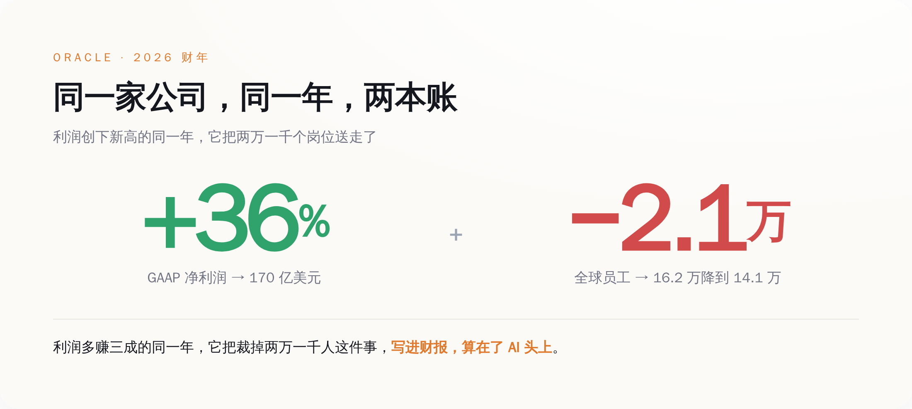
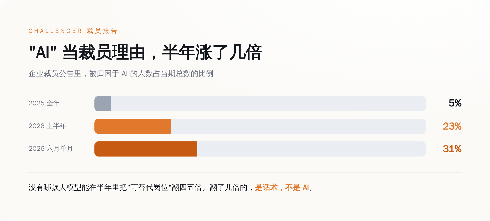
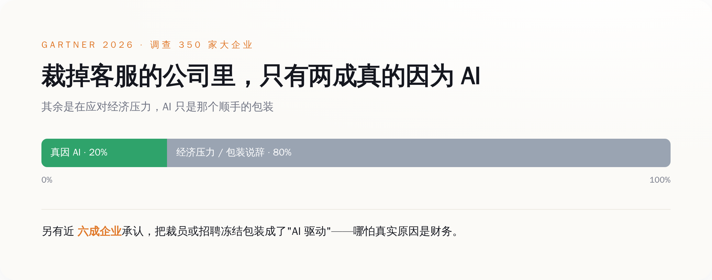
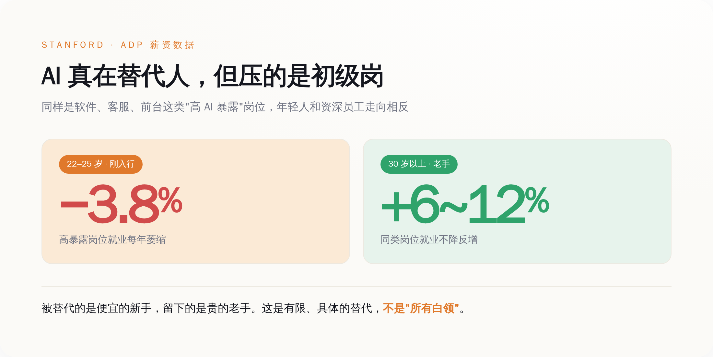

# "AI 优化"，是 2026 年最体面的裁员理由——Oracle 用它一年送走两万一千人，利润反而多赚了三成

> **发布日期**：2026-08-03 | **分类**：AI深度报道

## 导语

甲骨文（Oracle）2026 财年净利润 170 亿美元，比上一年多赚了 36%，可就在同一年，它的全球员工少了整整两万一千人。更微妙的是，它在递交给监管机构的正式文件里，亲手把这次裁员写成了"AI 导致的"。

这一年，"AI 抢走了你的工作"被讲了无数遍。讲的人越来越多，听的人越来越慌。可很少有人回头问一句：说这句话的，到底是谁。大多数时候，是那个刚刚因为裁了你、财报才变得更好看的老板。

---

## 一、先把这份"边裁边赚"的账，拆开看它到底赚在哪

先把甲骨文这组数字放一起看，因为它别扭得很有代表性。

2026 财年，它净利润 170 亿美元，同比多赚 36%；营收 674 亿，涨了 17%；怎么看都是一份好得发光的财报。就在同一年，它的全球员工从 16.2 万人掉到了 14.1 万人——一年少了两万一千人，差不多每八个人里走掉一个。而它在递交监管机构的年度报告（10-K）里，白纸黑字写下了这么一句：AI 技术的采用和部署，"已经、并可能继续导致我们的员工削减"。

把这句官腔翻回大白话就是：这两万一千人不是我们狠心要裁的，是 AI 逼我们裁的。

*甲骨文 2026 财年：净利润多赚三成，员工少了两万一千人——同一家公司，同一年，账面上却像是两家公司。*

问题是，这份财报好看的地方，和它裁人的地方，根本不是一回事。

它这一年赚得多，主要是云和 AI 合约撑起来的：云营收 340 亿，涨了 39%；用来衡量"手里攥了多少还没确认的订单"的剩余履约义务（RPO），一口气冲到 6380 亿美元，同比暴涨 363%，里面大头是那些客户预付、甚至客户自带 GPU 的巨型 AI 训练合约。说白了，甲骨文这一年的暴利，来自它把机房租给别人训 AI，是那个卖水给淘金者的角色。与此同时，它自己也在疯狂砸钱，2026 财年资本开支 557 亿美元，比原先的指引还多花了 50 多亿，全填进了数据中心。

于是别扭的地方就出来了：一家公司，一边靠 AI 相关的订单赚得盆满钵满，一边把两万一千个真人裁掉，然后把这两件事写进同一份文件、用同一个词（AI）串起来，好像它们是一码事。可只要多想一秒就知道，客户排队来租你的算力，和你内部那两万一千个岗位被机器顶替，是完全不搭界的两件事。前者是订单，后者是裁员，中间隔着一整个"因为所以"的鸿沟，而这个鸿沟，被"AI"两个字轻轻盖住了。

顺带说一句，甲骨文这一年为裁员和重组付的遣散成本是 18.4 亿美元。它宁可掏这笔钱把人送走，也要把队伍砍下来——省下的，是往后年年的人力开支。这笔账，AI 帮不帮忙都得这么算，只是这回，账单上多了一个可以背锅的名字。

## 二、"AI 裁员"这个理由，半年里从 5% 涨到了 23%

如果你觉得甲骨文只是个例，那再看一份更能说明问题的数据。

美国有家专门统计企业裁员的老机构，叫 Challenger, Gray & Christmas，它每个月扒公开的裁员公告，把企业自己给出的裁员理由归类。从它的账本里，能看到一条特别刺眼的曲线。

2025 一整年，被企业归因于"AI"的裁员，总共 54,836 人，占当年裁员总数的 5%。到 2026 年 1 月，这个数字是 7,624 人，占比 7%。而到 6 月，单月因 AI 裁掉的就有 14,029 人，占当月的 31%，而且是连续第四个月，"AI"高居企业给出的头号裁员理由。整个 2026 上半年加起来，被算在 AI 头上的裁员是 101,743 人，占上半年总数的约 23%。

从 5% 到 23%，中间只隔了半年多。

现在请回答一个问题：有哪一款大模型，能在半年时间里，把"它能替代的岗位数量"扩大四五倍？

大模型这半年不是没进步，但没有任何一次版本更新、任何一次能力跃迁，能解释归因比例这种涨法。一项技术真要替代掉某类岗位，得先在成千上万家公司里跑通、被验证、被信任，那是以年为单位慢慢渗透的事。而把裁员理由从别的换成 AI，一家公司开个会、改几个字就能完成，一夜之间。

**变的不是 AI 的能力，是企业愿意把裁员算到 AI 头上的意愿。**

*企业给出的"AI 裁员"理由占比：2025 全年才 5%，2026 上半年冲到 23%，6 月单月 31%——半年里翻了几倍的，不是 AI 的能力。*

## 三、为什么"AI 优化"，是这两年最好用的一个裁员理由

一个裁员理由要想好用，得同时满足好几个苛刻条件：不能让公司承认自己经营失误，不能吓到投资人让股价跳水，不能显得管理层冷血无情，最好还能顺手把公司衬得很先进、很有未来。

把市面上所有能用的说法数一遍，你会发现只有"AI"这两个字，同时占全了这几条。

说"经营不善"，等于当众承认自己无能；说"市场不好"，第二天股价就得跌给你看；说"降本增效"，太赤裸，员工只会记恨你；而说"AI 优化"——你被裁不是因为你不行，也不是因为老板要省钱，是因为时代的浪太大了，一台机器学会了你的活。你甚至没处怨，浪潮面前人人平等。体面，太体面了。

这不是我阴阳怪气编出来的诛心之论，是 AI 行业自己的头号人物亲口承认的。OpenAI 的 CEO 山姆·奥特曼（Sam Altman），2026 年 2 月在印度一场峰会上被问到这事，原话是："存在一些'AI 洗白'（AI washing）的情况——有些人把本来就要做的裁员，赖到了 AI 头上。"卖 AI 卖得最凶的人，自己先把这层窗户纸捅破了。

如果说 CEO 的话还带点感性，那机构调查就是硬数字。研究公司 Gartner 在 2026 年调查了 350 家年营收超过 10 亿美元、且已经在部署 AI 的大企业，结论有三条特别扎心：在那些裁掉客服团队的公司里，只有 20% 的负责人承认裁员是真因为 AI，其余都是在应对经济压力，AI 只是个顺手的包装；接近六成的企业（17% 明确承认、42% 部分承认）把裁员或招聘冻结包装成了"AI 驱动"，哪怕真实原因是财务；而最讽刺的是——裁员裁得最狠的公司，和裁得最少的公司，财务回报几乎没有差别，有些裁得少的反而活得更好。

*Gartner 调查 350 家大企业：裁掉客服的公司里，只有两成承认真的因为 AI；近六成承认把裁员包装成"AI 驱动"。*

也就是说，AI 到底有没有帮公司赚到钱，跟公司要不要拿 AI 当裁员理由，是两条互不相干的线。真正决定裁不裁的，是财务；决定对外怎么说的，才是 AI。

## 四、那 AI 到底有没有真的抢工作？有，但和话术不是一回事

把"AI 背锅"说到这儿，得赶紧刹一脚，不然就滑到另一个极端了——说得好像 AI 一个岗位都没动、纯属虚张声势。不是的。

斯坦福大学一个由布林约尔松（Erik Brynjolfsson）带的团队，扒了美国最大薪资服务商 ADP 的工资单数据，发现了一个很具体的现象：22 到 25 岁、干着软件开发、客服、前台这类"AI 高暴露"活的年轻人，就业规模每年在以大约 3.8% 的速度萎缩；可同样是这些岗位，30 岁以上的人，就业反而增长了 6% 到 12%。

这组对照很关键。它说明 AI 真在替代人，但替代的是初级岗位、是刚入行还没攒下经验的年轻人，不是笼统的"所有白领"。企业留下了贵的老手，砍掉了便宜的新手——因为新手干的那些标准化的活，恰好是 AI 现在最擅长顶替的。

*AI 确实在替代人，但压的是初级岗：22–25 岁高暴露岗位每年萎缩约 3.8%，同岗位的资深员工反而增长 6–12%。*

真金白银替代的案例也有。Salesforce 的 CEO 贝尼奥夫（Marc Benioff）就公开说过，公司客服团队从大约 9000 人砍到了 5000 人，活由 AI 客服接了过去。这是实打实的 AI 替代，没水分。可故事往往还有下半段。北欧那家先买后付公司 Klarna，2024 年曾高调宣布 AI 客服顶替了相当于 700 个人的工作量；到 2025、2026 年，它的 CEO 却改了口，承认"成本成了太过主导的考量……最后换来的是质量下降"，转头又悄悄把人工客服招了回来。吹得最响的那个 AI 替代样板，两年后自己打了自己的脸。

再往大了看，AI 到底给企业挣回了多少钱？麻省理工一个叫 NANDA 的项目 2025 年做过一份报告，结论是：企业投进生成式 AI 的 300 到 400 亿美元里，有 95% 没能产生任何可衡量的利润回报，真正跑出显著价值的试点只有 5%。耶鲁大学的预算实验室追踪了 ChatGPT 发布后 33 个月的美国就业数据，说整体劳动力市场看不到能被明确归因于 AI 的结构性冲击，它有一份报告的标题干脆就叫《AI（还）不是劳动力市场走弱的原因》。

把这些拼到一起，真相其实是分层的：AI 在客服、初级岗这些具体的地方确实在替代人，那是一块有限的、集中的、能数得清的替代；而被企业算到 AI 头上的裁员，远远多过 AI 真能替代的那部分。中间那块巨大的差额，就是话术。

## 五、那些"忘了提 AI"的公司，反而说了实话

最能说明问题的，是另一批公司——它们裁员的时候，压根没往 AI 身上扯。

Meta 2026 年裁员的官方备忘录，用的词是"效率"（efficiency）和"抵消我们正在做的其他投资"（offsetting the other investments）。翻过来是：我们要把钱腾出来砸给 AI 基建，所以得先把人裁了。它没说 AI 能干这些人的活，它说的是要拿这些人的工资去买 AI。而且 Meta 2026 年第二季度净利润 158 亿美元，同比反倒跌了 14%（被法律费用和裁员遣散费拖累），可它给 AI 资本开支定的年度指引，飙到了 1300 亿到 1450 亿美元。

亚马逊也是。它 2025 年 10 月和 2026 年 1 月两轮裁掉三万多人，但据 CNBC 报道，公司在这两次裁员公告里，"并没有提及 AI 的影响"——是媒体替它把 AI 这个标签挂了上去。谷歌更直接，一边被传裁工程师，员工总数一年反而净增了 11,830 人，涨到近 19.9 万。

这几家公司，反而比甲骨文诚实。它们把裁员真正的驱动力摆到了台面上：不是 AI 能替代人，是要把钱从人身上挪到机器身上，是季度利润，是一场停不下来的资本开支军备竞赛。在这些故事里，**AI 是收款方，不是背锅侠。**

## 结尾

所以下次再听到"AI 优化""智能化转型带来的人员调整"这类词，别急着焦虑那个会写代码的模型，先去翻一样东西——那家公司的利润表。

如果它一边裁人、一边利润创新高，那么真正裁掉你的，大概率不是 AI，而是一个终于找到了体面说法的季度目标。AI 只是被拉过来站在前面，替它挡一句"你太无情了"。

AI 没那么大本事，能在半年里学会替代掉那么多人。**它这半年真正学会的，是替老板挡子弹。** 这活儿，它干得比谁都好。

## 数据来源

- [Oracle FY2026 Q4 官方财报新闻稿](https://www.oracle.com/news/announcement/q4fy26-earnings-release-2026-06-10/)
- [Oracle FY2026 年度报告（10-K，2026-06-22 提交，SEC EDGAR）](https://www.sec.gov/cgi-bin/browse-edgar?action=getcompany&CIK=ORCL&type=10-K)
- [Challenger, Gray & Christmas 月度裁员报告（Job Cuts Report）](https://www.challengergray.com/blog/category/job-cuts-report/)
- [Gartner 官方新闻稿（2026 年 AI 与裁员调查）](https://www.gartner.com/en/newsroom)
- [MIT Project NANDA《The GenAI Divide: State of AI in Business 2025》](https://nanda.media.mit.edu/)
- [The Budget Lab at Yale《Evaluating the Impact of AI on the Labor Market》](https://budgetlab.yale.edu/)
- [Stanford Digital Economy Lab《Canaries in the Coal Mine?》](https://digitaleconomy.stanford.edu/)
- [Sam Altman 谈"AI washing"（印度 AI Impact Summit，CNBC-TV18，2026-02）](https://www.cnbctv18.com/)
- [Meta / Amazon / Alphabet 2026 官方财报新闻稿（SEC EDGAR）](https://www.sec.gov/)
