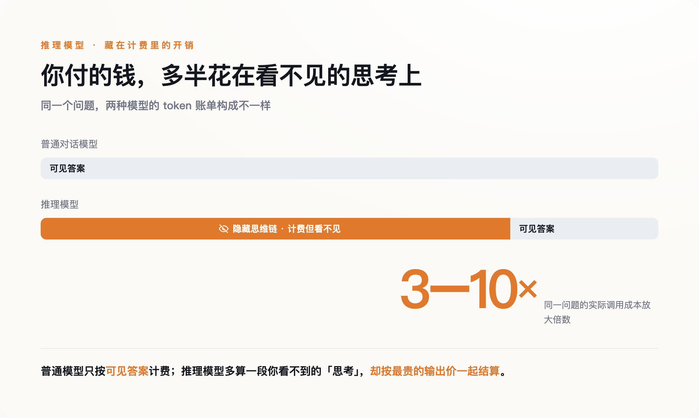
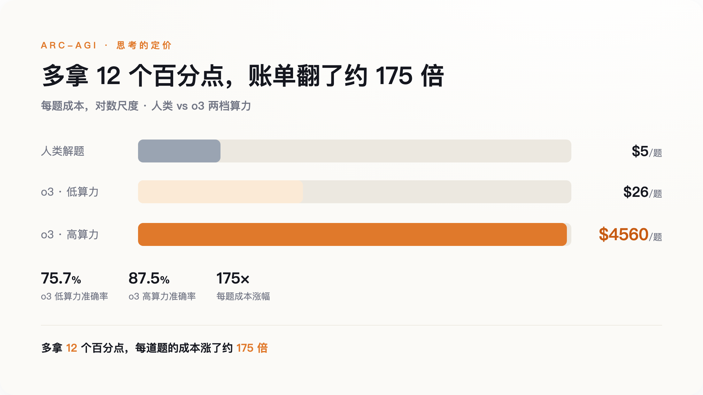
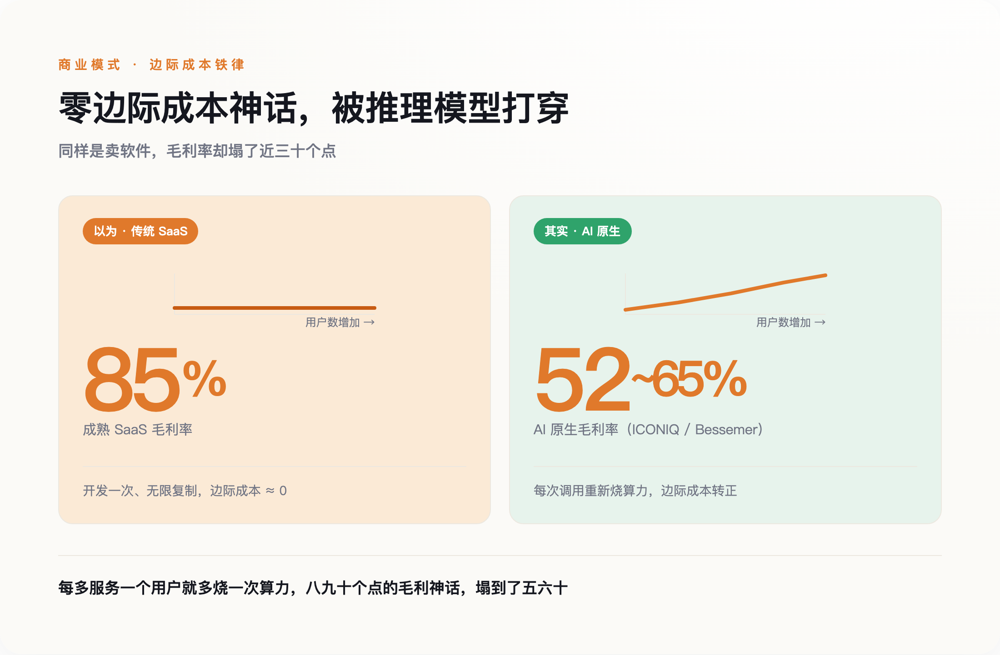

# 一道题"想"掉 4560 美元：AI 正在终结软件的"零成本"时代

> **发布日期**：2026-08-03 | **分类**：AI 深度观察

## 导语

2026 年 6 月 1 日，GitHub Copilot 换了计费方式。此前你每月付 10 美元，写多少代码用多少；这天起，改成按 token 计量，用超了另算。

第一批账单出来，有开发者在 Reddit 上晒图：上个月 29 美元，这个月接近 750 美元。他没多写代码，用法也没变。变的是，他调用的模型开始"思考"了——在给出答案之前，先在后台生成一大段你根本看不见的推理过程，而这段过程，按最贵的输出价，一个字一个字地收钱。

这不是一次普通涨价。这是软件行业默认了三十年的一个假设，第一次不成立了。

---

## 一、那笔看不见的账

过去的大模型只做一件事：你问一句，它答一句，中间没有停顿。2024 年 9 月 OpenAI 发布 o1 之后，主流模型多了一道工序——回答之前，先在内部"想"。它会生成一长串推理过程（业内叫思维链），推翻、重来、再推翻，最后才吐出你看到的那几行答案。

关键在计费。这段推理过程默认不展示给你，但它照样是模型生成的 token，照样按输出价计费，还照样占用上下文窗口。简单粗暴地说，你为一堆自己看不见的字付了钱，而且是按最贵的那档付。这笔隐藏开销，会让一次调用的实际成本，比普通对话模型放大约 3 到 10 倍。

*图注：你付的钱，大部分花在了自己看不见的那段「思考」上*

痛感最先落在离账单最近的人身上。Copilot 那位开发者的账单翻了 25 倍；多份材料一致提到，当 Copilot 调用推理模型而不是普通补全模型时，背后的成本能高出 10 到 50 倍。Cursor 干脆把最烧算力的功能改成按 token 计价，还在供应商成本上加了约 20% 的溢价来对冲风险。这些公司不是想涨价，是扛不住了。

所以问题不是"AI 变贵了"。问题是，"思考"这个动作，第一次有了明码标价。

## 二、4560 美元一道题

2024 年 12 月，OpenAI 拿当时最强的推理模型 o3 去刷一个叫 ARC-AGI 的基准。这个基准的题目是彩色方块拼成的图形谜题，专门设计得让一个没受过训练的人凭直觉就能解出来。o3 也解出来了，准确率 87.5%，超过人类平均。

代价是多少？按 ARC Prize 官方后来重算的口径，高算力模式下，平均每道题烧掉约 4560 美元。同一批题，换成低算力模式，每题约 26 美元，准确率掉到 75.7%。也就是说，为了把成绩从 75.7 提到 87.5，每道题的成本涨了约 175 倍。而一个普通人解同样一道题，成本大约 5 美元。基准的创建者 François Chollet 说得很克制：成本高昂，眼下还谈不上经济划算。

*图注：多拿 12 个百分点，每道题的账单翻了约 175 倍*

让我意外的不是它贵——刷榜本来就不计成本。是它把一件抽象的事第一次变具体了：AI 的"思考"，原来可以逐笔算钱，而且上不封顶。你想让它多聪明一点点，就得为它多"想"的每一秒买单。

这背后是一次范式转向。过去几年，模型变强靠的是"训练时"堆算力——把模型做大、把数据喂多。o1 之后，增长的主轴挪到了"推理时"：不改模型，让它在回答前多想一会儿。OpenAI 负责这条线的研究员 Noam Brown 的立场很直接，大意是思考本就该更贵，未来甚至该让模型想上几小时、几周。这话没错——真要把模型能力推过人类专家，多想几乎是唯一的路。只是它顺带说明了一件事：**从此，"想得更久"和"花得更多"，是同一件事的两种说法。**

4560 美元买到的，从来不是那道题的答案。买到的是"让机器想了很久"这件事本身。

## 三、零边际成本，那个吃下世界的假设

这件事动摇的，不是一张账单，是软件行业赖以立身的根本前提。

过去三十年，软件是一门好生意，靠的是一条铁律：开发一次，无限复制。第一份产品的成本可能上亿，但多服务一个用户、多处理一个请求，成本几乎为零。这就是所谓的"零边际成本"。它撑起了整个行业普遍 80% 到 90% 的毛利率，也是"软件正在吃掉世界"这句话背后的财务前提——只要用户涨，利润就摊薄成本、越滚越厚。

推理模型把这条铁律拆了。它让每一次调用都变成一次真实的算力消耗：你每服务一个用户，模型就得重新"想"一遍，重新烧一遍钱。边际成本不再趋近于零，而是实打实地变正了。反映到财报上，据 ICONIQ 今年 1 月的调查，AI 原生公司的毛利率约为 52%，另一家机构 Bessemer 给出的数字是 65% 上下——无论哪个，都离成熟软件公司的八九十个点很远。

*图注：每多服务一个用户就多烧一次算力，八九十个点的毛利神话，塌到了五六十*

最能说明问题的，是造模型的公司自己也在这条线上挣扎。据报道，OpenAI 2024 年营收约 37 亿美元、净亏约 51 亿；到 2025 年营收涨到约 130 亿，亏损却不降反增。另一个信号来自 Anthropic：它在推出 Opus 4.5 的思考强度参数时给过一组数据——效果打平的前提下，把强度从高调到中，能省下约 76% 的输出 token。连亲手教模型"思考"的人，都在算怎么让它少想一点、又不掉链子。

根基一旦松动，接下来的问题只有一个：降价，能不能把成本重新压回去？

## 四、"变便宜"是个陷阱

乐观的人会说：能。

过去几年，同等能力的 AI，单位价格确实在飞快下降——有测算称大约每年降十倍，GPT-4 级别的能力，从 2023 年到 2026 年年中，每百万 token 的价格跌了几十倍。照这个势头，"思考"再贵，单价也会很快被打到几乎可以忽略。所以他们说，为思考付费只是暂时的阵痛。

这话对了一半，也错了一半。错的那一半，有个一百多年前就有的名字，叫杰文斯悖论：一样东西用起来越便宜，人们反而会用得越凶，总消耗不降反升。放到 AI 上就是——单价一降，大家立刻把省下的钱拿去让模型想得更多、重试得更频繁、上下文喂得更长，再养一堆全天候待命的 agent。省下的那点钱，转头就被更凶的用量吃回去了。结果往往是，单价降了一个数量级，总账单不降反升，甚至涨得更快。

而且，"多想"未必换来"更好"。2026 年 4 月有一篇论文，标题就叫《过度思考有害》，它发现推理模型去算"9900 加 1"这种小学题，也能烧掉好几千个思考 token；更麻烦的是，想得太多，模型有时会把本来答对的题，反复推翻成错的。你不但多付了钱，还买回来一个更差的答案。

所以真正不可逆的，从来不是钱多钱少。**是"边际成本从零变成正"这个性质的改变——从此，"思考"这件事，有了自己的计价单位。**单价可以降，计价器却装上去了，卸不下来。

## 五、谁在给"思考"定价

计价器一旦装上，有些问题就绕不过去了。

第一个问题是公平。当"让模型多想想"变成一次要花钱的决策，深度思考就悄悄变成了一件买得起的人才配拥有的事。一个能随便烧算力的巨头，和一个精打细算的小团队、一个穷国的研究者，从此不在同一条起跑线上。过去我们担心 AI 拉大贫富差距，盯的是谁会失业；现在得再加一条——谁付得起让机器替自己"想得更深"。

第二个问题更该往上问一层：既然每一次"想"都要付费，这笔钱到底流向了谁、又换回了什么？卖算力和卖模型的，当然希望你相信思考越多越值得。但诺奖经济学家 Daron Acemoglu 算过一笔更大的账：他估算 AI 未来十年对美国 GDP 的拉动，只有大约 1.1% 到 1.6%，并提醒人们，围绕 AI 的增长叙事，很多是卖方讲给自己听的。把两头摆在一起——一边是刷一道题就要 4560 美元的"思考"，一边是十年个位数的回报——那句"让模型多想想"，就不只是一个技术选项，而是一笔要问值不值的账。

这不是说推理模型没有价值，它当然有。只是我们在欢呼 AI 终于学会"思考"的时候，没人愿意补上后半句。**这是人类历史上第一次，"想一想"这三个字后面，跟着一张账单。**

---

## 数据来源

- [ARC Prize 官方：OpenAI o3 在 ARC-AGI 上的突破与成本](https://arcprize.org/blog/oai-o3-pub-breakthrough)
- [OpenAI：Learning to reason with LLMs（o1 发布，2024 年 9 月）](https://openai.com/index/learning-to-reason-with-llms/)
- [Daron Acemoglu：《The Simple Macroeconomics of AI》（MIT，2024）](https://economics.mit.edu/sites/default/files/2024-04/The%20Simple%20Macroeconomics%20of%20AI.pdf)
- ICONIQ Growth《2026 AI 报告》与 Bessemer《State of AI》：AI 原生公司毛利率数据
- GitHub Copilot 转按 token 计费引发开发者账单暴涨（据 opentools.ai 等报道，2026 年 6 月）
- CloudZero、TokenMix：推理模型隐藏 token 开销放大实际成本约 3–10 倍（双源核验）
- 论文《When More Thinking Hurts》（2026 年 4 月）：过度思考消耗与答案退化

