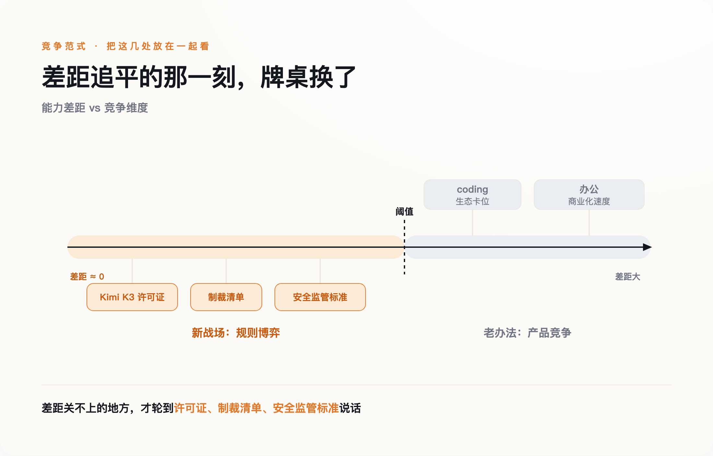

# 当模型分数追平，中美AI比拼的东西，全变了

> **发布日期**：2026-08-04 | **分类**：科技与产业

## 导语

7月下旬，月之暗面开源了新一代旗舰模型Kimi K3，性能被普遍认为已经追近国际一线水平。但真正值得细看的不是跑分，是许可证条款——上一代Kimi K2用的是近乎完全宽松的"Modified MIT"协议，谁都能拿去用；到了K3，年收入超过2000万美元的MaaS厂商，必须单独和月之暗面签约才能用。多数报道只报道了"中国又开源了一个能打的模型"，漏掉了这行改动里藏着的真正信号：当模型能力追近到某个阈值以下，中美真正在比拼的东西，已经从算力和参数，换成了许可证、制裁清单、生态卡位和商业化速度这些看不见的战场。

## 一、"开源"这个词，正在变成一个可以调节松紧的阀门

先把K3的许可证细节讲清楚。月之暗面自己在文档里刻意用"open weight"而不是"open source"——训练数据、训练代码、完整复现流程从来没有公开过，公开的只是权重本身。这个区分很关键：外界习惯把"开源"理解成一种理念声明，仿佛是慷慨地把技术白送给全世界，但K3的许可证条款证明，它更像一个可以按需调节松紧的商业阀门——面向个人开发者和中小企业，几乎完全免费开放，换取全球开发者社区的采用和口碑；面向真正有能力靠它赚大钱的大型MaaS厂商，则收回议价权。开源与否从来不是一个理念问题，是一个策略问题。

月之暗面总裁曾向《财富》杂志表示，公司清楚自己没有单纯堆算力去卷的条件——这句话通常被解读成公司在出口管制压力下的无奈自白，但换个角度看，它也是一句战略宣言：既然算力这条赛道拼不过，就把赛道换成生态渗透和开发者心智，而调节许可证松紧，正是巩固这条新赛道的工具。

## 二、卡技术卡不住了，于是转向卡规则

美国这边的反应，同样没有停留在技术层面。7月21日，财政部长贝森特在Fox Business明确表态，如果发现"海外模型窃取了美国伟大公司的知识产权"，有能力对其实施制裁。这句话值得逐字拆开看：他给出的法理依据是"IP窃取"，不是"国家安全"，也不是意识形态站队——这个措辞选择本身就是在给一项可能违反国际贸易规则的行动，包装上一层技术中立的外衣。

但这个威胁面对一个执行层面的死结：K3的权重已经公开挂在Hugging Face上，任何人都能下载到本地跑起来。一旦模型权重进了某家公司的服务器，制裁清单、准入禁令这些手段就基本失效了——你没法把已经下载完成的文件收回去。美国的反制工具，正在从"卡住你拿不到什么"（芯片出口管制），转向"卡住你被允许用什么"（制裁清单、政府采购禁令、非正式的施压警告）。前者是物理层面的阻断，后者是规则和身份层面的排斥，威慑效果打了折扣，但也说明纯技术手段已经不够用了。

## 三、规则战不是处处都在打——两个还没轮到的领域，反而更说明问题

如果把"竞争已经切换到规则层"当成一个可以套进任何领域的万能框架，会漏掉一个更重要的观察：至少还有两个领域，规则战目前压根没打起来，而这恰恰从反面证明了"阈值"这个条件是真实存在的，不是随口一说。

第一个是coding。国内几家模型在编程类基准测试上追得很紧，但真正决定这个赛道胜负的，还不是模型分数，是工具生态——据行业估算，Claude Code在企业市场拿到了过半的份额，Cursor这样的编程工具年化收入已经达到数十亿美元规模。这些护城河建立在开发者已经把整套工作流迁移过去这个既成事实上，不是靠一次模型发布就能绕开的。

第二个是办公场景。7月30日，字节跳动把飞书产品团队并入豆包，几乎同一时间窗口，阿里被曝在测试"千问办公"，企业微信也在孵化名为WorkBuddy的AI能力，三家大厂几乎同步做出防御性的组织调整——这说明国内的办公赛道还处在"谁来整合谁"这种组织架构层面的自我摸索期。而大洋彼岸，微软Copilot据一篇非权威信源报道已经做到年化超百亿美元的收入规模，早就越过了整合期，进入了规模化变现的下半场。

这两处的共同点是：模型能力和商业成熟度之间，还存在一段真实的、没有被追平的差距——coding领域的生态锁定、办公领域的商业化速度差，都不是靠一次模型突破就能抹平的，需要时间去把产品渗透进真实的工作流里。正因为这段差距还在，谁也没必要跳过"把产品做好、把生意做大"这套老办法，去动用许可证条款或者制裁清单这类新武器。规则战只在能力差距被真正拉平的地方才会爆发；在差距仍然真实存在的地方，胜负依然靠老办法决定。

## 四、连"安全"这个词，两国都吵得不是同一件事

最后一个印证战场转移的地方，反而藏在最容易被忽略的安全领域。据一篇梳理中美官方公开表态的评论文章总结，两国对"最致命的AI风险"清单出人意料地接近——关键基础设施被攻击、生物武器门槛降低、大规模操纵、失控的自主系统，两边点名的高危场景高度重合，甚至连需要重点监管的算力规模量级都接近。认知层面，两国其实趋同了。

真正分道扬镳的是治理哲学。中国的路径是强制性的部署前测试加上行业标准，模型上线前得先过检；美国的路径是自愿框架为主，政府保留事后访问权，但明确拒绝强制性的预先审查。同样认定了差不多的风险清单，一边选择"先审后放"，一边选择"先放后管"——这个分歧不是谁更懂AI安全，是谁更相信用规则去提前设限，谁更相信用市场去事后纠偏。而这条分歧线，恰恰也是一种规则层面的竞争：谁的治理框架先在国际上被更多国家采纳，谁就掌握了未来全球AI监管标准的模板。

## 五、模型追平之后，真正的胜负手是谁先改写规则

*图：差距关不上的地方，才轮到许可证、制裁清单、安全监管标准说话。*

把这几处放在一起看，能看出一条线：Kimi K3的许可证、贝森特的制裁威胁与执行悖论、中美监管哲学的分歧，指向的是同一件事——在模型能力真正被拉平的地方，算力和参数不再是决定性变量，谁能更快地把许可证条款、制裁清单和监管标准，改写成对自己有利的样子，谁才真正占了上风。而coding、办公这两个能力差距尚未被真正抹平的领域，恰恰还在用老办法竞争，这两处"例外"，反过来证明了这条阈值不是凭空画出来的。

下一次看到"中国AI又追上了"或者"美国AI依然遥遥领先"这类标题，不妨先问一句：这次比的，到底还是不是同一件事。

## 数据来源

- [Moonshot's Kimi K3 pushes Chinese AI into Fable-level territory（Fortune）](https://fortune.com/2026/07/16/moonshots-kimi-k3-pushes-chinese-ai-into-fable-level-territory/)
- [Kimi K3: The open-weights escalation（Nathan Lambert / Interconnects.ai）](https://www.interconnects.ai/p/kimi-k3-the-open-weights-escalation)
- [US threatens sanctions against Chinese AI models over IP theft（Yahoo Finance）](https://finance.yahoo.com/technology/ai/articles/us-threatens-sanctions-against-chinese-153705506.html)
- [Trump administration reportedly reviving push to ban Chinese AI models（Tom's Hardware）](https://www.tomshardware.com/tech-industry/artificial-intelligence/trump-administration-reportedly-reviving-push-to-ban-chinese-ai-models-following-kimi-k3-launch-citing-cybersecurity-concerns-downloadable-open-weights-could-make-an-outright-u-s-ban-nearly-impossible-to-enforce-amid-growing-adoption)
- [The U.S. And China Agree On Almost Nothing Except AI's Deadliest Risks（Forbes）](https://www.forbes.com/sites/markminevich/2026/06/30/the-us-and-china-agree-on-almost-nothing-except-ais-deadliest-risks/)
- [State of Open Source on Hugging Face: Spring 2026（Hugging Face官方博客）](https://huggingface.co/blog/huggingface/state-of-os-hf-spring-2026)
- [豆包收编飞书，大厂猛攻AI办公（新浪财经）](https://finance.sina.cn/stock/jdts/2026-07-31/detail-inikstfa9304290.d.html)
