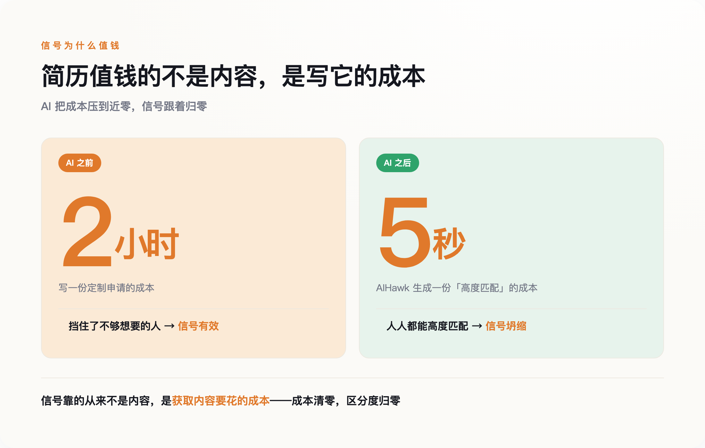
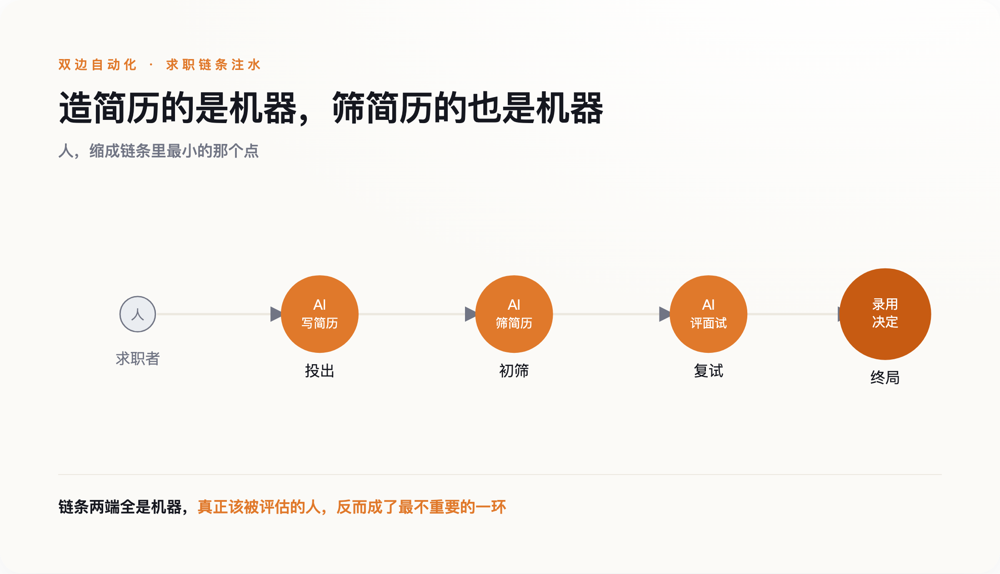
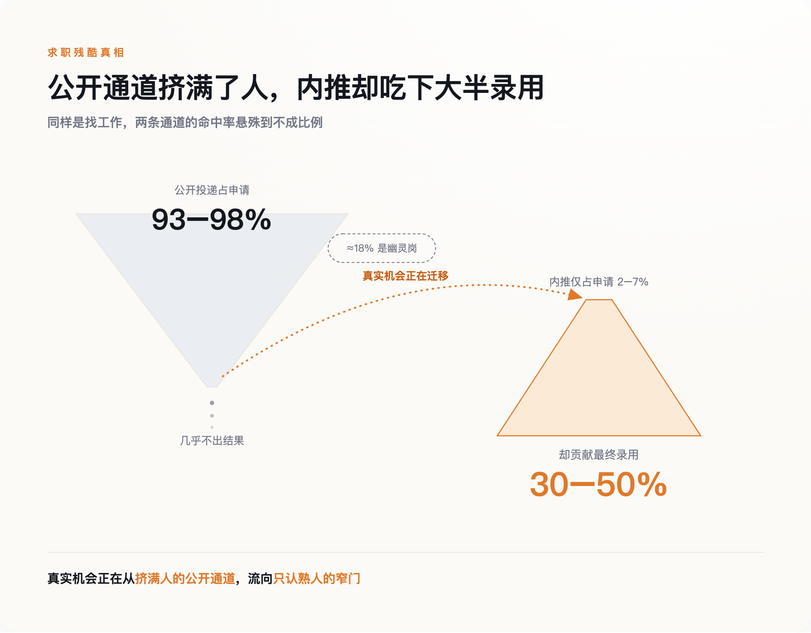

# 当简历不再算数，招聘正在退回"熟人社会"

> **发布日期**：2026-08-04 | **分类**：AI 深度观察

## 导语

Katie Tanner 在美国犹他州做人力资源顾问。2024 年秋天，她替一家客户挂出一个远程技术岗，要求不算高，三年经验。挂出去十二个小时，收到四百份简历；二十四小时，六百份；几天之后，超过一千二百份。她把招聘启事撤了下来。三个月过去，那一千二百份还没筛完。

Tanner 遇到的不是求职者的热情，是机器。那些简历里相当一部分不是人一份一份写的，是自动投递工具替他们批量生成、批量投出去的。她要在一千二百份长得差不多的"高度匹配"里，挑出一个真能干活的人——而这件事 AI 帮不上忙，因为把水搅浑的正是 AI。

这不是招聘效率变差了。是一套用了几十年的筛选机制，第一次不管用了。

---

## 一、一个岗位，一千二百份简历

过去写一份定制求职信，你得读一遍岗位描述，改一版简历，斟酌几句"为什么是我"，前后一两个小时。这个成本现在被压到了近零。

一个叫 AIHawk 的开源工具在 GitHub 上拿了大约三万颗星。你把 LinkedIn 账号连上，它读你的简历和求职偏好，自动去投那些"一键申请"的岗位，还替你生成定制求职信、回答申请表里的问题。404 Media 的记者 Jason Koebler 亲自试过，坐在餐厅里一小时投出十七份，机器现场替他写出"我深深认同贵司在运动营养领域的创新追求"这类车轱辘话——他压根没听说过这家公司。

这不是极客的玩具。Canva 在 2024 年初的一项调研（覆盖八国、五千人）显示，45% 的求职者已经在用 AI 完成求职申请；到 2025 年，这个比例升到 57%。Workday 的《2024 全球劳动力报告》记录到，仅 2024 上半年，求职申请总量就同比增长了 31%，约 1.73 亿份。

数字堆在一起是抽象的，Tanner 那一千二百份是具体的。当投一份申请的成本从两小时变成两秒，理性的求职者当然会多投——不是投给最想去的，是投给所有能投的。海投不再是走投无路的人才做的事，它成了默认动作。

于是招聘方那一端，收件箱被灌满了。

## 二、简历为什么曾经算数

1973 年，经济学家 Michael Spence 发表了一篇叫《求职市场信号》的论文，后来靠它拿了 2001 年的诺贝尔经济学奖。他要解决的问题很朴素：雇主没法直接看到一个人到底能干什么，那雇主凭什么做决定？Spence 的回答是"信号"——一些雇主看得见、又和真实能力相关的东西。但一个信号要有用，有个苛刻的前提：它必须**昂贵，而且对能力低的人更昂贵**。学历之所以是信号，不只因为它证明你学过什么，更因为混到一张文凭对差生比对好学生更费劲。

简历和求职信也一样。它们真正传递的，从来不只是上面写的经历，还有一层藏在下面的意思：这个人愿意为这份工作花一两个小时。愿意花时间的人，大概率比五秒钟群发的人更想要、也更靠谱。这层"愿意付出成本"的间接信号，是雇主在信息不对称里为数不多能抓住的判断依据之一。

生成式 AI 把这个依据抹平了。当写一份"高度匹配"的定制简历只要五秒，愿不愿意花时间就再也区分不出人来。2025 年 11 月，两位经济学家 Galdin 与 Silbert 在一篇预印本论文里给这个现象起了个名字，叫"信号通胀"——就像钞票印多了会贬值，人人都能轻易发出的信号，也就不再值钱。

简历一直是个靠"愿意麻烦"来筛人的机制，而 AI 让麻烦这件事，不再需要任何人真的麻烦。

*图注：简历值钱的从来不是内容，是写它要花的成本——AI 把成本清零，信号跟着归零*

## 三、双边自动化：AI 筛 AI 写的

求职者把成本压到零，招聘方不会坐着挨灌。他们的对策，是也上 AI。

Resume Builder 在 2024 年 10 月对 948 名企业管理者做的调研显示，48% 的招聘经理已经在用 AI 筛简历，他们预计到 2025 年底这个数字会到 83%。LinkedIn 推出了一个叫 Hiring Assistant 的招聘代理，能写职位描述、做初筛、主动给候选人发消息。一部分岗位还在用单向视频面试，求职者对着摄像头回答问题，另一头是算法在打分。

于是招聘变成了一件很荒诞的事：一个 AI 写的简历，投给另一个 AI 去筛；一个 AI 生成的面试回答，交给第三个 AI 去评估。中间那个本该被评估的人，反而成了最不重要的环节。整套仪式还在走，只是走的双方都换成了机器，而机器互相之间比的，是谁的模型更会包装、更会解析——这跟谁更能干活，没什么关系。

*图注：两端都换成了机器，被评估的人反而成了最不重要的一环*

代价不是没有，只是不落在发起自动化的人身上。2025 年 3 月，ACLU 科罗拉多分会向科罗拉多州民权处和联邦平等就业机会委员会（EEOC）提交投诉，指控 Intuit 和 HireVue：一名有听力障碍的原住民员工被要求做单向 AI 视频面试，她请求人工字幕被拒，之后错失了一次晋升（HireVue 否认相关指控，称 Intuit 用的并非它的 AI 评估系统）。这不是孤例。算法筛人时最先出局的，常常是那些不符合训练数据里"标准样子"的人——非母语者、残障者、有就业空窗的人。亚马逊早年那套会自动给含"women's"字样简历降分的系统最后被废弃，只是最早暴露出来的一例。

双方都自动化之后，招聘这道工序没有变高效，只是变贵了——申请量涨了，筛选成本涨了，而筛出来的人未必更对。

## 四、退回熟人：唯一没被伪造的信号

一套信号失灵，雇主会去找下一套。他们找到的，是那套 AI 最难伪造的——熟人。

内推很难被自动化，因为它的成本不在申请者身上，而在推荐人身上。一个人愿意把自己的信誉押上去替你说话，没法五秒钟群发，也没法让机器代劳。当简历、求职信、面试回答一个接一个贬值，推荐人的信誉反而成了通胀里少数还坚挺的东西。按业界普遍估算，内推只占申请总量的百分之几，却贡献了三到五成的最终录用（不同口径差异不小，这是估算区间而非精确统计）——信号普遍失效之后，这个比重只会更高。

*图注：公开通道挤满了人却几乎不出结果，真实机会正悄悄流向只认熟人的窄门*

企业的动作也在往这个方向走。Tanner 撤下那个岗位不是个例，而是海投灌爆公开通道之后的常见反应：与其在一千二百份真假难辨的简历里淘金，不如干脆不公开招。招聘数据平台 Ashby 对两万多个真实岗位的分析显示，约 18% 的岗位最终没有产生录用——里面有暂停、有撤销、有流程中途终止，不能全坐实为存心挂着的空岗，但至少说明，相当一部分公开招聘并没有真正走到录用那一步。

这里得说句公道话。"招聘正退回熟人"，目前更像是结构性压力指向的方向，还不是一个被趋势数据坐实的既成事实。公开通道的信号在坏，这是能证到的；真实机会因此更多流向内推，这一步现在还主要是成本结构推出来的判断。但方向是清楚的：当别的信号都在贬值，招聘会往那个没被拉低成本的地方靠。

牛津的学生媒体 Cherwell 在 2026 年初把这层意思说得更直白：AI 带来的申请洪流，正把雇主推回"雇邻居家的孩子、雇校友"的老路。过去几十年，简历投递、公开招聘、标准化流程，费很大劲才把招聘从"看你认识谁"一点点拉向"看你能干什么"。现在这个方向正在倒回去。

## 五、谁被关在门外

有人会反驳：内推一向重要，这不是 AI 造成的新变化，你把一个老现象赖到 AI 头上。这话对了一半。内推的绝对分量确实一直高，但变的是边际——当公开通道的信号价值坍缩，内推的相对权重就被动抬升，而企业又在主动收缩公开招聘。存量没变，天平却在偏。

也有人会说，2024 年申请量暴涨，主因是经济下行、大家都在找工作，不全是 AI。这也成立。宏观环境确实是一部分。但 AIHawk 的三万颗星、45% 求职者用 AI，是独立于经济周期的另一记成本冲击——两件事叠在一起，不是其中一件替另一件背锅。

真正刺眼的是另一处。这场变化里，最该替 AI 辩护的一方——"AI 降低门槛、帮到没背景的普通人"——恰恰最沉默。你能找到的、来自 MIT 斯隆管理学院、斯坦福以人为本 AI 研究院这些权威机构的证据，几乎一边倒地指向同一个方向：AI 筛选放大而非削弱偏见，对非母语者、残障人士、有就业空窗的人尤其不利。而"AI 净帮弱势群体"这一说，缺少同等分量的背书。

所以把整件事连起来看：AI 本可以让没关系、没名校背景的人，凭一份简历被看见。结果它把公开通道自己灌成了噪音，逼着招聘退回只认熟人的老规矩。对没有熟人的人来说，能走的路不是变多了，是变少了。

## 数据来源

- [Katie Tanner 撤下岗位案例（Fortune / 多家转引）](https://fortune.com/2024/11/21/job-applications-ai-recruiters-hiring/)
- [AIHawk 开源自动投递工具（GitHub）](https://github.com/feder-cr/Jobs_Applier_AI_Agent_AIHawk)
- [Jason Koebler 亲测 AIHawk（404 Media）](https://www.404media.co/i-used-an-ai-tool-to-apply-to-2843-jobs/)
- [Canva 求职者 AI 使用调研（经 eWeek 转引）](https://www.eweek.com/news/ai-job-applications/)
- [Workday《2024 全球劳动力报告》](https://blog.workday.com/en-us/workday-global-workforce-report.html)
- [Michael Spence, Job Market Signaling, QJE 1973](https://www.jstor.org/stable/1882010)
- [Galdin & Silbert, Making Talk Cheap: Generative AI and Labor Market Signaling (arXiv 2511.08785)](https://arxiv.org/abs/2511.08785)
- [Resume Builder 招聘经理 AI 使用调研](https://www.resumebuilder.com/hiring-managers-will-use-ai-to-assess-employees-in-2025/)
- [ACLU 就 Intuit / HireVue 提交投诉（2025）](https://www.aclu.org/press-releases/aclu-files-complaint-against-intuit-and-hirevue-over-biased-ai-hiring-technology)
- [Ashby 幽灵岗位数据分析](https://www.ashbyhq.com/blog)
- [Cherwell: AI and the return of closed hiring networks（2026）](https://www.cherwell.org/)
