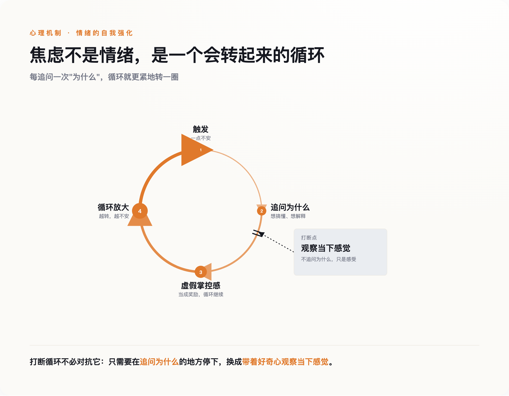

# 他研究焦虑十几年，真正让恐慌停下来的，是他终于不再问"为什么"

> **发布日期**：2026-08-05 | **分类**：心理与思想

## 导语

贾德森·布鲁尔（Judson Brewer）是一名精神科医生，也是研究成瘾和焦虑的神经科学家——按理说，全世界没几个人比他更懂焦虑发作时大脑里到底在发生什么。但在耶鲁大学的住院医师宿舍里，他还是被自己的惊恐发作放倒过。一个每天研究这件事、能在脑海里画出神经回路图的人，遇到自己的恐慌，脑子里的知识没帮上任何忙。真正让恐慌停下来的那一刻，不是他终于想通了自己为什么会这样——是他终于停止了追问为什么。

## 一、一个关于肠胃的意外发现

故事要从更早的地方讲起。布鲁尔在圣路易斯华盛顿大学读医学博士联读期间，被肠易激综合征折磨了很多年，胃肠道时常绞痛、紊乱，看了不少医生也没能根治。后来他才弄明白，这种病和压力直接挂钩——压力上来，肠胃先崩溃。他抱着死马当活马医的心态开始学冥想，起初只是想让自己放松一点，没指望能解决什么根本问题。结果症状真的消失了。

这段经历埋下了一颗种子，但当时他并没有把它当回事：一个学医的人，遇到冥想能缓解自己的躯体症状，最直接的反应是"有点意思"，而不是"我发现了什么"。真正让这件事变得重要，是很多年后发生的另一件事。

## 二、住院医师的深夜，专家自己也扛不住

博士毕业后，布鲁尔进入耶鲁大学接受精神科住院医师训练。这是医生这个职业里压力最集中的几年之一：轮班、值夜、随时可能被叫醒去处理急症，还要在极短的时间里对着病人做出判断——一个刚毕业的新人，却被要求表现得什么都懂。长期睡眠不足叠加这种"必须全知全能"的心理重压，压垮了他。他开始出现惊恐发作。

这里最扎心的细节是：他是精神科医生，他清楚地知道自己正在经历的是什么——心跳加速、呼吸发紧、大脑里那种"要出大事了"的警报，这些机制他每天都在教科书和病人身上见到。可这份清楚的认知，没有让恐慌少发作一次。知道一件事情发生的原因，和这件事情停下来，中间没有任何一条自动生效的因果关系——这一点，是他自己用身体验证出来的。

## 三、把病人的循环、自己的循环、实验室的数据，接到了一起

布鲁尔真正的转折，发生在很多年之后。他的实验室长期研究习惯是怎么形成的：一个触发信号出现，人做出某个行为，行为带来某种奖励感，这个回路重复几次，习惯就刻进去了——抽烟、暴食、刷手机，都是这个结构。多年临床工作里，他一直觉得自己在焦虑病人身上漏掉了什么关键的东西，直到某一天，他把这套"触发-行为-奖励"的习惯回路，套在了焦虑本身上——焦虑不是一个需要被解释的孤立情绪，它本身就是一个会自我强化的习惯循环：一点不安触发了"想清楚到底哪里不对"这个念头，这个念头带来一种"我在处理问题"的虚假掌控感当作奖励，于是循环继续转动，越转越大。

*图：打断循环不必对抗它，只需要在'追问为什么'的地方停下，换成'带着好奇心观察当下感觉'。*

这个结构，佛教心理学里有个专门的词，叫papañca，常被译成"概念增殖"或者"戏论"——一个念头勾连出下一个念头，越滚越大，最后完全脱离了最初那个感觉本身。现代心理学里，这种模式有个更常见的名字，反刍思考、灾难化想象，说的是同一件事：不是感觉本身在伤害你，是你对着这个感觉不停地转圈想，圈子转出来的东西才是真正折磨人的部分。

认知行为疗法的创始人阿伦·贝克晚年也专门写过一篇文章，比较佛教和他自己开创的疗法。他的态度并不干脆，甚至有点自相拉扯：一方面他提到，正念这一派习惯把自己和认知行为疗法区分开——前者盯着念头本身生灭的过程，不评判内容对错；后者盯着念头的内容，去纠正"这个想法对不对、合不合理"；但另一方面他自己又补了一句，说这个"看着念头"的过程，和认知行为疗法里"抽离"技术做的事情，其实看起来很像。连CBT的创始人自己都没法把这条线画得很干净，这至少说明一件事："关注内容"还是"关注过程"，不是两条互不相干的路，布鲁尔和病人们练的，更接近后一种取向——不去判断这个焦虑念头对不对，只是看着它怎么来、怎么走。

## 四、把"停止追问"变成一个可以教给别人的动作

布鲁尔没有停在这个洞察上自我感动，他把它设计成了具体的临床方法，拿去做了严格检验。2011年，他和团队做了一项针对吸烟者的对照实验：正念训练组和美国肺脏协会的标准戒烟项目相比，训练结束17周后的戒烟率是31%比6%，差距有统计学意义。同一年，他的团队在《美国科学院院刊》上发表了一项脑成像研究：经验丰富的冥想者在专注、慈心等多种冥想状态下，大脑里负责"自我参照"的核心区域——内侧前额叶皮层和后扣带回皮层——活跃程度明显低于不冥想的对照组。人在琢磨"这件事对我意味着什么"的时候，恰恰是这几块区域最活跃的时候。

这套机制后来被他用在了自己开发的"解绑焦虑"训练项目上——这部分不是论文数据，是项目参与者留下的用户反馈，但很能说明这套方法具体在做什么："当我真的经历一次完整的惊恐发作时，往内看，那种感觉就自己消融掉了——我在看我正在感受的东西，而不是纠结于我为什么会有这种感受。"另一位参与者说，训练之初自己完全不信"好奇心"这种东西能有什么用，直到某天感觉到一阵恐慌袭来，第一反应变成了"嗯，有意思"，"这一下子就把恐慌的劲儿卸掉了"。这不是"想开了""看淡了"这种模糊的安慰话，是一个具体的、可以重复练习的动作替换：把"这是为什么"换成"现在感觉到了什么"。

## 五、这不是解脱，是一个被诚实标注过边界的工具

先把一个容易被误解的地方说清楚："不追问为什么"不等于"假装问题不存在"。布鲁尔教的这个动作，是主动把注意力转向感觉本身，老老实实地看着它——不是把注意力移开、假装什么都没发生。前者是直面，后者才是逃避，两者看起来都是"不去想为什么"，方向却完全相反。

也要老实说清楚另一件事：布鲁尔做的，是把佛教修行里的一部分具体机制拿出来，剥掉宗教语境，改造成可以在诊室里教、可以用随机对照实验去验证的临床技术。批评的声音一直都在——旧金山州立大学教授、同时也是受戒僧人的罗纳德·珀泽（Ronald Purser）就长期提醒，这种改造抽走了佛教作为一套完整解脱论、伦理体系的核心，只留下一个能帮人在职场里少焦虑一点的自助工具，某种程度上是把结构性的压力问题，简化成了"你还不够会观察自己"这种个人责任。也有心理学者指出，正念疗法相对于运动、健康教育这类主动对照手段，实际效果优势并不像宣传里那么明确。

这些提醒是对的，本文也不打算假装"学会不问为什么"就等于修完了整套佛法。但布鲁尔从自己的惊恐发作里提炼出来的这一个具体动作——不去追问"为什么会这样"，转而只是带着好奇心去观察"现在感觉到了什么"——已经被反复检验过，而且不需要神经科学背景也能上手。下一次恐慌袭来的时候，与其在脑子里继续追问原因，不如试着只是看着这个感觉本身。停止提问，有时候比得到答案更管用。

## 数据来源

- [History of MBSR — MBSR Collaborative](https://mbsrcollaborative.com/history-of-mbsr)
- [The Anxiety Hacker | Brown Alumni Magazine](https://www.brownalumnimagazine.com/articles/2024-03-27/jud-brewer-anxiety-loop)
- [Judson A. Brewer - Wikipedia](https://en.wikipedia.org/wiki/Judson_A._Brewer)
- Brewer, J.A. et al. (2011). *Drug and Alcohol Dependence* — 戒烟随机对照实验（[PubMed](https://pubmed.ncbi.nlm.nih.gov/21723049/)）
- Brewer, J.A. et al. (2011). *PNAS* 108(50):20254 — 冥想者默认模式网络脑成像研究（[PNAS](https://www.pnas.org/content/108/50/20254)）
- [Tangled in Thought - Tricycle](https://tricycle.org/magazine/tangled-thought/) — papañca 佛教心理学概念
- Beck, A.T. (2005). "Buddhism and Cognitive Therapy"（[全文PDF](https://www.nyccognitivetherapy.com/uploads/6/3/4/5/6345727/buddhism_and_cognitive_therapy.pdf)）
- [Ronald Purser - McMindfulness](https://ronpurser.com/mcmindfulness)
- Goldberg, S.B. et al. (2022). *Perspectives on Psychological Science* — 正念疗效系统综述（[SAGE](https://journals.sagepub.com/doi/abs/10.1177/1745691620968771)）
