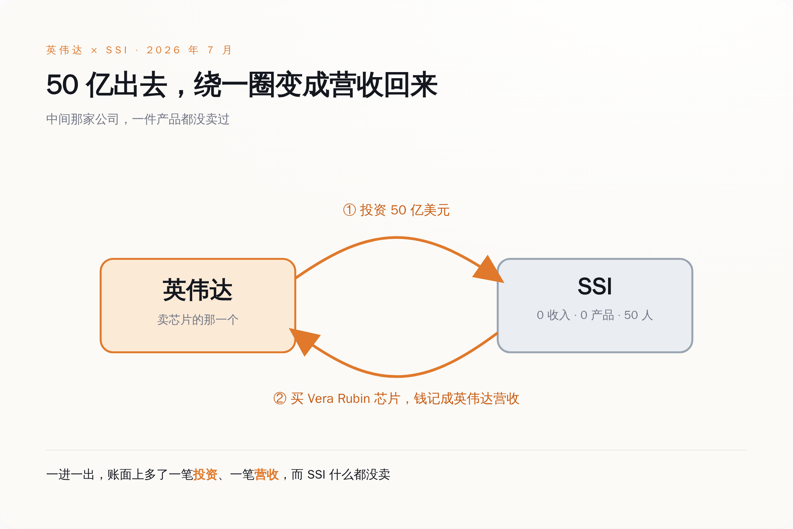
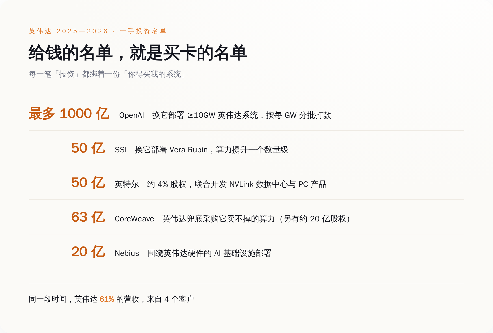
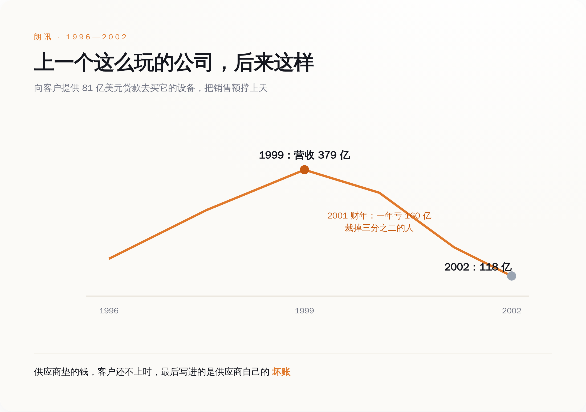

# 英伟达给一家没产品的公司打了 50 亿，这笔钱绕一圈，又变回了它自己的订单

> **发布日期**：2026-08-06 | **分类**：AI与商业

## 导语

先说一家公司。它成立于 2024 年 6 月，到今天满打满算两年出头，大约 50 个人。它没有发布过任何产品，没有 App，没有 API，没有一行能对外收费的代码，官方公开承诺"在造出安全的超级智能之前不发布任何东西"。翻它的财务，收入这一栏写着零。就这么一家公司，估值 320 亿美元。7 月 27 日，英伟达宣布再给它投 50 亿美元——注意是"再"，因为去年那轮 20 亿的融资里，英伟达已经投过一次了。这家公司叫 SSI，Safe Superintelligence，创始人是从 OpenAI 出走的伊利亚·苏茨克维。所有报道都在讲苏茨克维的天才、讲"安全超级智能"的宏大愿景。但这笔钱最有意思的地方，报道里几乎没人说破：英伟达打给 SSI 的这 50 亿，绕一圈，会以订单的形式，变回英伟达自己的营收。

## 一、先把这家拿钱的公司看清楚

苏茨克维是谁不用多介绍，AlexNet 的作者之一，深度学习这波浪潮最上游的那几个人里的一个，从 OpenAI 出来单干，光凭这份履历，融资不难。难的是他给这家公司立的规矩：不发产品，不做迭代，不搞商业化，一门心思憋一个"安全超级智能"，憋出来之前对外什么都不给。

这套打法在投资圈叫"直球"（straight-shot），听着很酷，翻译成人话就是：在一个说不清哪年能到的终点之前，这家公司不产生任何收入。

然后我们看它的融资曲线。2024 年 9 月，成立三个月，融 10 亿，估值 50 亿。2025 年 4 月，融 20 亿，估值直接跳到 320 亿——这一轮的投资方里就有英伟达和谷歌。2026 年 7 月，英伟达单独再追加 50 亿。两年，一件东西没卖出去，估值翻了六倍多，累计募了大约 70 亿美元现金。

**一家公司值多少钱，和它卖过多少东西，在 2026 年可以完全没有关系。**

这句话本身不新鲜，风投行业向来为"未来"付钱。真正值得盯着看的是这次投钱的人是谁。红杉、a16z 投 SSI，是财务投资，赌苏茨克维赌对了能几十倍退出，天经地义。但英伟达不是财务投资人，英伟达是卖芯片的。一个卖铲子的，为什么要往一个还没开始挖矿、明确说了短期不打算挖矿的矿工兜里，塞两次钱？

英伟达自己在新闻稿里给的说法很体面。黄仁勋说："伊利亚从 AlexNet 开始就在现代 AI 的地基上做出了根本性的突破，我们很期待看到 SSI 在我们的 Vera Rubin 平台上跑出新的突破。"苏茨克维那边接得也顺："我们有值得规模化的研究成果，一台大的英伟达计算机能让我们把它跑起来……我们对押注 Vera Rubin 平台很有信心。"

翻译一下这两句官话的交集，就一个词：**Vera Rubin**——英伟达下一代的旗舰芯片平台。英伟达给 SSI 的这 50 亿，附带的条件是 SSI 部署 Vera Rubin 系统，把自己的算力"提升一个数量级"。

钱和货，在同一份新闻稿里，握了手。

## 二、这 50 亿是怎么变回英伟达营收的

把这笔交易拆成两个动作看，就清楚了。

动作一，英伟达从自己账上掏出 50 亿美元，打给 SSI，换来 SSI 的一部分股权。这笔钱在英伟达的报表上，记成一笔"投资"。

动作二，SSI 拿着这笔钱（以及别的钱），去采购英伟达的 Vera Rubin 系统。这笔采购在英伟达的报表上，记成"营收"。

*钱从英伟达出发，绕一圈以订单的形式回到英伟达的营收表；中间那家公司，一件产品都没卖过。*

这个环，英伟达在别处玩得更直白。2025 年 9 月，英伟达和 OpenAI 签的那份意向书里，条款写得明明白白：英伟达将向 OpenAI 投资最多 1000 亿美元，随 OpenAI 每部署 1 吉瓦（GW）算力分批到账；OpenAI 则用英伟达的系统部署至少 10GW、相当于几百万块 GPU。英伟达官方对这套结构的描述是——OpenAI 用现金向英伟达买芯片，英伟达用现金买 OpenAI 的非控股股权。

两笔现金，方向相反，金额挂钩，写在同一份协议里。你付我买卡的钱，我付你股权的钱，谁也没占谁便宜，但账面上，一边多了千亿营收的想象空间，一边多了千亿估值的注脚。

**供应商亲自下场，掏钱给买家去买自己的东西，这不是生意的润滑剂，这就是生意本身。**

## 三、这不是一笔买卖，是一条流水线

如果只有 SSI 一家，你还可以说这是英伟达对老朋友的偏爱。问题是，这样的对象排起来是一长串。

*2025 到 2026，英伟达对外投资和承诺采购的一手名单——每一笔都绑着一份「你得买我的系统」。*

这里面最露骨的是 CoreWeave 那一笔。CoreWeave 是家 AI 云服务商，买英伟达的卡搭数据中心，再把算力租出去。英伟达先投了它约 20 亿股权，然后又和它签了一份 63 亿美元的协议：如果 CoreWeave 建起来的算力，现有客户没租满，英伟达自己把剩下的买单。

一个卖芯片的，一边给你钱买它的芯片，一边承诺"你用我的芯片建的东西如果卖不出去，我兜底"。这已经不是投资了，这是给需求上保险，保的是自己的营收。

单看数字，英伟达在上一个财年里向私营公司投了 175 亿美元，官方口径是"主要支持早期创业公司"。这是它自己交给美国证监会的文件里写的数。而它的营收有多大？2027 财年第一季度（截至 2026 年 4 月 26 日）总营收 816 亿美元，其中数据中心业务 752 亿。营收是投资的四倍多，看着投资只是零头。

但零头不是重点。重点是那 61%——英伟达自己披露，四个直接客户，每个都贡献超过 10% 的营收，加起来占了六成一。你再把上面那张名单摆过来对一眼：这几个大客户里，有好几个的买卡钱，是英伟达先垫进去的。营收高度集中在少数几个买家，而这几个买家，又高度依赖英伟达的投资和担保活着。

这条链子转得越快，账面越好看，也越像一个只能往前不能停的东西。

## 四、这套打法上一次登场，主角叫朗讯

垫钱给客户买自己的设备，好把销售额做上去——这个玩法不是英伟达发明的。上一次它大规模登场，是在 2000 年前后的电信业，主角是一家叫朗讯（Lucent Technologies）的公司。

*朗讯用「借钱给客户买自己设备」把营收冲上顶点，也用同一招把自己送进坑里；六年后营收剩三成。*

朗讯当年做的事，逐字对得上今天：它给买不起设备的电信客户提供贷款，让他们拿这笔钱来买朗讯的交换机、路由器，有时候连安装都替你包了。靠这招，它的账面销售额冲得极猛，华尔街看着漂亮。到 1999 年，朗讯营收冲到 379 亿美元，一度是全美市值最高的公司之一。它累计承诺出去的客户贷款，高达 81 亿美元。

然后周期转向了。它借了 20 亿给一家叫 WinStar 的电信运营商，WinStar 撑不住了，来要最后一笔 9000 万的续贷，朗讯拒了，WinStar 直接破产。这种事一多，那些"销售额"露出了本来面目——它们不是卖出去的钱，是借出去、收不回来的钱。2001 到 2002 两年，朗讯为坏账计提了大约 35 亿美元。2001 那一个财年，它亏了 160 亿美元，裁掉三分之二的员工。到 2002 年，营收从峰值的 379 亿掉到 118 亿，只剩三成，市值蒸发了约 2500 亿美元。

我不是说英伟达就是下一个朗讯。两者有本质区别：英伟达的芯片现在是真的抢手，数据中心是真的在满负荷跑，全球算力是真的短缺——这些需求里有一大块是结结实实的真需求，不是印出来的。朗讯当年的电信设备可没这个待遇。

但朗讯的教训不在"设备卖不动"，在别的地方：当供应商亲自下场给买家垫钱，它自己账上的"营收"和"投资"，就和买家的偿付能力绑死了。买家还得起，这笔生意皆大欢喜；买家还不起，垫出去的钱不会消失，它会换个名字，从"营收"变成"坏账"，回到供应商自己的报表上。SSI 这样的对象尤其值得记着——一家零收入的公司，它拿什么还？它还的是苏茨克维那个终点能不能到。

## 五、真正该担心的，是你分不清哪部分是真的

这套循环玩到今天，已经大到监管和空头都开始盯着看了。做空过 2008 年次贷的迈克尔·伯里，最近直接开炮，说英伟达这种"循环开支"已经到了"圣经级别的规模"，还点出英伟达的五年期信用违约互换（相当于市场给它买的"违约保险"）年内涨了近九成。国际货币基金组织和国际清算银行，也都把 AI 领域的循环融资列进了系统性风险的提示里。

当然有人不同意。有华尔街策略师说得也在理："循环融资是个信号，不是判决"，背后是实打实、长期存在的全球算力短缺。这话没错。算力短缺是真的，英伟达的芯片是真的好，这些都不假。

问题恰恰出在"真的"和"印的"混在了一起、而且账面上长得一模一样。当英伟达给 OpenAI 千亿、给 SSI 两次共几十亿、给 CoreWeave 的过剩算力兜底，这些钱变成的订单，确实会出现在营收里，和一个素不相识的客户真金白银下的单，记在同一栏，一个数，分不出彼此。

**需求可以是真的，也可以是供应商自己印的；在报表上，这两种需求，长得一模一样。**

所以回到开头那家公司。SSI 值不值 320 亿，苏茨克维能不能造出安全超级智能，这些我不知道，也没人现在知道。我只知道一件确定的事：英伟达打给它的 50 亿，会有很大一部分，变成英伟达自己的一笔营收，出现在某个季度的财报里，被算进那个"数据中心业务同比增长 92%"的漂亮数字。

那个数字里，有多少是全世界真的需要算力，有多少是英伟达先把钱塞给买家、再自己买回来的——没有一个投资者能拆得开。而拆不开这件事，比任何一次单独的暴跌，都更值得担心。

## 数据来源

- [Ilya Sutskever's Safe Superintelligence Inc. and NVIDIA Announce Long-Term Strategic Partnership（NVIDIA Newsroom, 2026-07-27）](https://nvidianews.nvidia.com/news/ilya-sutskevers-safe-superintelligence-inc-and-nvidia-announce-long-term-strategic-partnership)
- [OpenAI and NVIDIA Announce Strategic Partnership to Deploy 10 Gigawatts of NVIDIA Systems（NVIDIA Newsroom, 2025-09-22）](https://nvidianews.nvidia.com/news/openai-and-nvidia-announce-strategic-partnership-to-deploy-10gw-of-nvidia-systems)
- [NVIDIA Announces Financial Results for First Quarter Fiscal 2027（NVIDIA Newsroom）](https://nvidianews.nvidia.com/news/nvidia-announces-financial-results-for-first-quarter-fiscal-2027)
- [NVIDIA and Intel to Develop AI Infrastructure and Personal Computing Products（NVIDIA Newsroom）](https://nvidianews.nvidia.com/news/nvidia-and-intel-to-develop-ai-infrastructure-and-personal-computing-products)
- [NVIDIA CORP Form 10-Q, FY2027 Q1（SEC EDGAR，私营公司投资额与客户集中度）](https://www.sec.gov/Archives/edgar/data/0001045810/000104581026000052/nvda-20260426.htm)
- [Safe Superintelligence raises $2B at $32B valuation—with no product yet（CTech）](https://www.calcalistech.com/ctechnews/article/hjfywdtajl)
- [Nvidia takes $5 billion stake in Intel under September agreement（CNBC, 2025-12-29）](https://www.cnbc.com/2025/12/29/nvidia-takes-5-billion-stake-in-intel-under-september-agreement.html)
- [Michael Burry Warns Nvidia's 'Overreaching' Is Pushing Circular Spending to 'Biblical Proportions'（Benzinga）](https://www.benzinga.com/markets/equities/26/07/60749765/michael-burry-warns-nvidias-overreaching-is-pushing-circular-spending-to-biblical-proportions-amid-surge-in-credit-default-swaps)
- [How the Once-Luminous Lucent Got Into Double Trouble（TIME）](https://time.com/archive/6931645/how-the-once-luminous-lucent-got-into-double-trouble/)
- [How Lucent Lost It（MIT Technology Review）](https://www.technologyreview.com/2005/02/01/231676/how-lucent-lost-it/)
