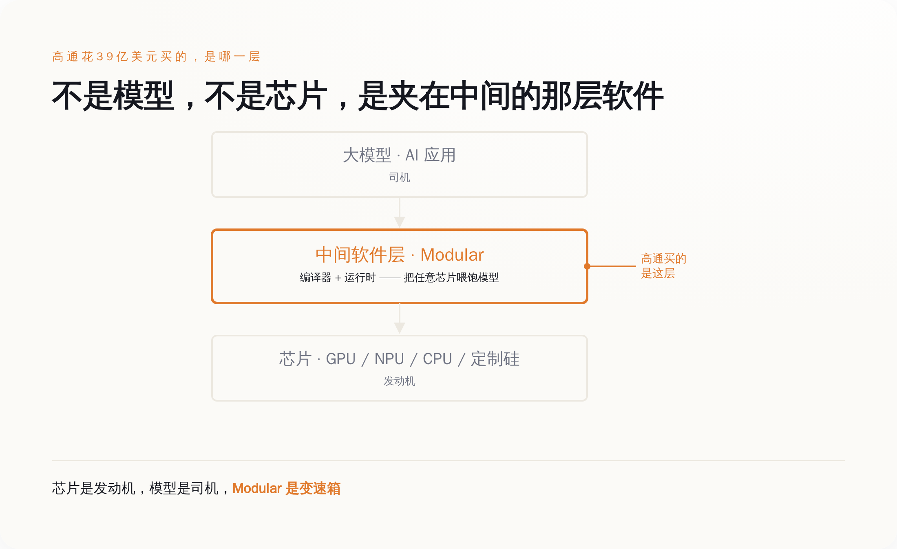
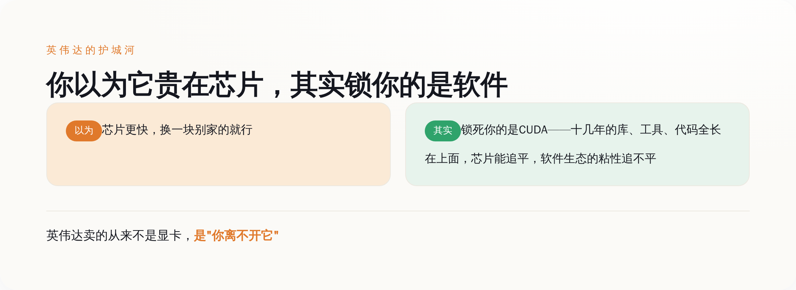
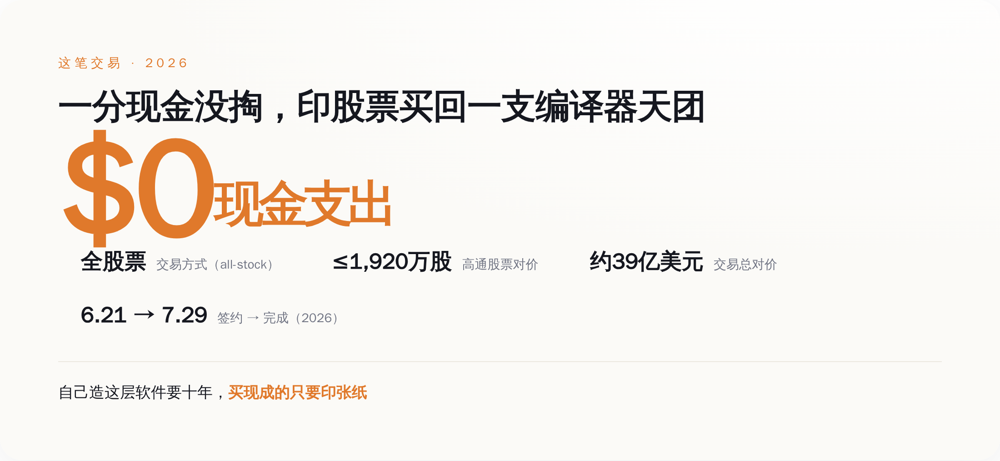
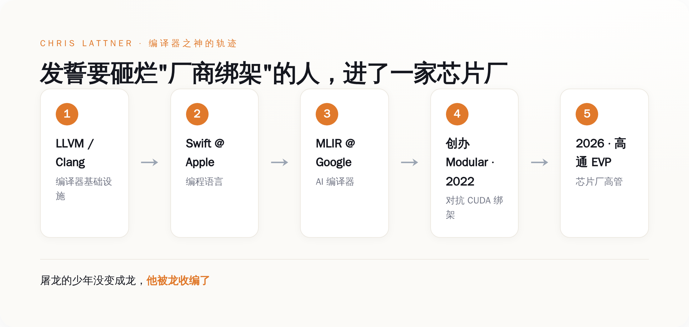

# 英伟达真正的护城河从来不是芯片，是CUDA——高通花39亿，买下了那个发誓要填平它的人

> **发布日期**：2026-08-06 | **分类**：AI 行业观察

## 导语

这个夏天 AI 圈最贵的软件收购，主角不是哪家大模型公司，是高通——一家你印象里做手机芯片的公司。

7 月 29 日，它完成了对一家叫 Modular 的公司的收购，对价大约 39 亿美元。Modular 不做模型，不做芯片，它做的是夹在芯片和模型中间、你平时根本不会注意到的一层软件。

更魔幻的是付款方式：高通一分现金没掏，纯靠印股票——最多 1920 万股——就把这家公司抱回了家。

你可能没听过 Modular，但你一定听过它成立那天就发誓要干掉的东西：英伟达的 CUDA。

这篇文章想说清楚三件事：高通到底买了个啥、这层没人看得见的软件凭什么值 39 亿、以及最讽刺的那一层——一个立志把开发者从"芯片绑架"里解放出来的人，最后是怎么走进一家芯片厂的。

---

*图注：高通买的既不是最上面的模型，也不是最下面的芯片，是夹在中间、把任意芯片喂饱模型的那层软件。*

## 一、先搞清楚高通买了个啥：一家把自己定义成"AI 变速箱"的公司

Modular 这家公司，2022 年由 Chris Lattner 创办。这个名字后面第五节再细说，你现在只要知道他是编译器领域的一尊神就行。

它做的东西，官方自己的说法是"AI 的统一计算层"，他们甚至给自己起了个更狂的外号——"AI 的 hypervisor"。产品有三样：一门叫 Mojo 的编程语言（Python 的语法、C/C++ 的速度）、一个叫 MAX 的推理引擎（对外提供和 OpenAI 兼容的接口）、还有一个管大规模部署的控制面 Mammoth。到被收购前，它一共融了大约 3.8 亿美元，最近一轮 2.5 亿美元，估值 16 亿。

这一堆术语你不用记。你只要抓住它想解决的那个具体问题：今天你想跑 AI，摆在面前的路只有两条。要么绑死英伟达的 CUDA，享受它十几年攒下的现成生态；要么换一家便宜的芯片，然后把自己的代码几乎重写一遍去适配。

Modular 想做的，就是那层"翻译"——让任意一家的芯片都能高效地跑模型，你不用为了换芯片重写代码，也就不用被单一厂商摁在地上摩擦。

**芯片是发动机，模型是司机，Modular 做的是那台没人会拍照发朋友圈的变速箱。**没人关心变速箱长什么样，但没有它，再猛的发动机也只是原地轰油门，一米都走不了。

高通花 39 亿买的，就是这台变速箱。不是发动机，不是司机，是中间那个把动力传下去的东西。

## 二、这层没人看得见的软件，凭什么值 39 亿？因为它就是英伟达护城河的本体

要理解这笔钱花得值不值，你得先接受一个反常识的事实：英伟达那么贵、那么难被取代，真正的原因不是它的芯片。

是 CUDA。

大部分人对英伟达的理解停留在"它家显卡最快"。这话没错，但它不是问题的核心。真正让全世界的 AI 公司换不掉英伟达的，是 CUDA 这层软件——一套积累了十几年的编程生态。你写的每一行 AI 代码、你用的每一个库、每一个工具，几乎都是长在 CUDA 上面的。你想换一家芯片，芯片本身的性能也许别人能追平，但你那一整套已经焊死在 CUDA 上的软件资产，搬不走。

所以英伟达真正的护城河，从来不是"我的芯片比你快多少"，而是"你已经离不开我了"。芯片的领先可以被追平，软件生态的粘性追不平。这是两种完全不同的护城河，后者深得多。

**英伟达卖的从来不是显卡，是"你离不开它"这件事。**

而 Modular 从第一天起要砸的，就是这条河。它要做一层厂商中立的软件，让 CUDA 不再是唯一那条路——你想用别家芯片？可以，代码不用重写，性能也不打折。谁掌握了这层软件，谁就有资格在英伟达的收费站旁边，另开一条路。

一层能绕开英伟达护城河的软件，值不值 39 亿？在 2026 年这个所有人都被英伟达按着交过路费的年份，这个价格甚至算便宜的。

*图注：换掉英伟达难，难的不是找一块更快的芯片，是搬走那套十几年长在 CUDA 上的软件资产。*

---

## 三、那高通图什么？它要一把绕开 CUDA 的钥匙

搞清楚了 Modular 的价值，高通的动机就一目了然了。

高通是做什么的？做手机芯片、做边缘设备上的 NPU 起家的。它现在眼馋数据中心和 AI 推理这块大蛋糕，想挤进去。但它面前横着一堵墙，这堵墙不是"造不出好芯片"——高通造芯片的本事不缺——而是"没有 CUDA 那样的软件生态"。它就算造出再好的 AI 芯片，也没有开发者愿意为它重写一遍代码。芯片再好，没人用得顺手，等于废铁。

自己从头造一层能对抗 CUDA 的软件生态，要多久？十年起步，而且大概率造到一半就被英伟达的生态惯性拖死了。

于是高通做了那个最简单的决定：不自己造，直接买。买下 Modular，等于一次性买来一层"既能把我自己的芯片喂饱、又号称支持所有厂商"的现成软件。

Lattner 本人在收购完成那天，公开说的原话是：这次收购"加速了 Modular 的使命——为所有厂商的硬件提供统一的 AI 软件，超越今天这个碎片化的生态。数据中心是解耦的、异构的，它们理应配得上高质量的软件"。

翻译成大白话：高通买的不是一家公司，**是一张绕开英伟达收费站的月票。**别人还在收费站排队交过路费，高通直接把修路队买回了家。

## 四、最精明的一手：这笔买卖本身，就是一场"零成本"

再看这笔交易的结构，你会更佩服高通的算盘。

全股票交易。没有现金。高通最多增发 1920 万股自己的股票，把这笔账付掉。协议 6 月 21 日签，7 月 29 日就完成了交割。

这是这几年最聪明的收购打法：在自家股价高企的时候，不动用一分现金，用估值被 AI 叙事顶得老高的自家股票，去换一支硅谷最贵的编译器天团。买家印张纸，卖家拿了纸，账面上皆大欢喜。

**自己造这层软件要十年，买现成的只要印一张纸。**

当然，全股票也有另一层潜台词：高通赌的是 Modular 的价值会跟着高通一起涨，用股票把双方绑上同一条船。卖方拿的不是落袋为安的现金，是一张和高通命运挂钩的船票。这既是信任，也是绑定。

*图注：全股票交易，现金支出为零——高通用被 AI 叙事顶高的自家股票，换回了一支编译器天团。*

---

## 五、最讽刺的一层：发誓要砸烂"厂商绑架"的人，进了一家芯片厂的编制

现在该说回 Chris Lattner 了。

这个人的履历，在做底层软件的圈子里近乎神话。LLVM、Clang 是他做的——今天半个软件世界的编译器都建在上面；苹果的 Swift 语言是他做的；Google 那套给 AI 用的编译器框架 MLIR，也是他牵头的。他一辈子干的事，就是给不同的硬件写那层"翻译",让上层的人不用管底下的芯片长什么样。

他 2022 年创办 Modular 的初心，白纸黑字写着：把开发者从"必须选 CUDA"的绑架里解放出来，做一层真正厂商中立的软件。这是一个反垄断色彩极浓的叙事，一个屠龙者的故事。

四年后的结局是：他成了高通的执行副总裁，头衔叫"先进 AI 软件与平台"。一家芯片厂的高管。

那句"厂商中立"，现在还成立吗？

嘴上，Modular 说会继续支持所有厂商的硬件，一个字没改。但你得看清一件事：当这层软件的老板变成了高通的 EVP、它的研发经费由高通结算、它的 KPI 写在高通的财报里——"中立"这两个字的含金量，还剩多少，你自己掂量。一层软件说自己不偏袒任何芯片，可它的东家就是一家芯片厂，这本身就是个需要每天自证的姿势。

**屠龙的少年最后没有变成龙，他被龙收编了，还发了条推特说"这加速了我们的使命"。**使命当然还在，只是使命现在有 KPI 了。

但话说回来，也得给 Lattner 一句公道话。纯中立的中间件，可能压根就没有独立活下去的路。英伟达用免费的 CUDA 把整个生态锁死，你一个想收费的中立软件层，拿什么跟"免费"打？最后的结局往往只有两个：要么在理想主义里慢慢饿死，要么被某一家硬件厂收编，当成它攻打对手的武器。Lattner 选了后者。这不一定是背叛，更可能是那层软件唯一能规模化活下去的方式。

只是这个选择本身，已经把话说得很清楚了：在 AI 这场战争里，纯粹中立的第三方软件，是站不住的。你迟早要选一个东家。

*图注：一个立志让 AI 摆脱厂商绑架的人，四年后成了一家芯片厂的高管。*

---

## 结论

所以别再盯着模型多考了几分、芯片做到了几纳米了。

这个夏天真正把 AI 战争的底牌翻给你看的，不是哪个大模型刷新了榜单，是一家做手机芯片的公司，愿意增发 39 亿美元的股票，去买一层夹在中间、你平时根本不会多看一眼的软件。

因为所有玩家都终于想明白了同一件事：模型会被追平，芯片会被追平，唯一追不平的，是那层把芯片和模型焊死在一起的软件生态。英伟达靠它称王，高通想靠买它翻盘，而那个最想亲手砸烂它的人，最终成了这场围绕它的战争里，一枚被买走的、最贵的棋子。

你以为你在围观一家手机芯片公司搞了笔收购。其实你在看整个行业，第一次这么坦白地承认：真正的收费站，从来都不在你看得见的地方。

就这。

## 数据来源

- [Modular 官方公告：Qualcomm Completes Acquisition of Modular](https://www.modular.com/blog/qualcomm-completes-acquisition-of-modular)
- [高通官方新闻稿：Qualcomm Completes Acquisition of Modular（PR Newswire）](https://www.prnewswire.com/news-releases/qualcomm-completes-acquisition-of-modular-302837286.html)
- [Chris Lattner 本人 X 声明](https://x.com/clattner_llvm/status/2082470088364753289)
- [Modular 官方：Modular Raises $250M to Scale AI's Unified Compute Layer](https://www.modular.com/blog/modular-raises-250m-to-scale-ais-unified-compute-layer)
