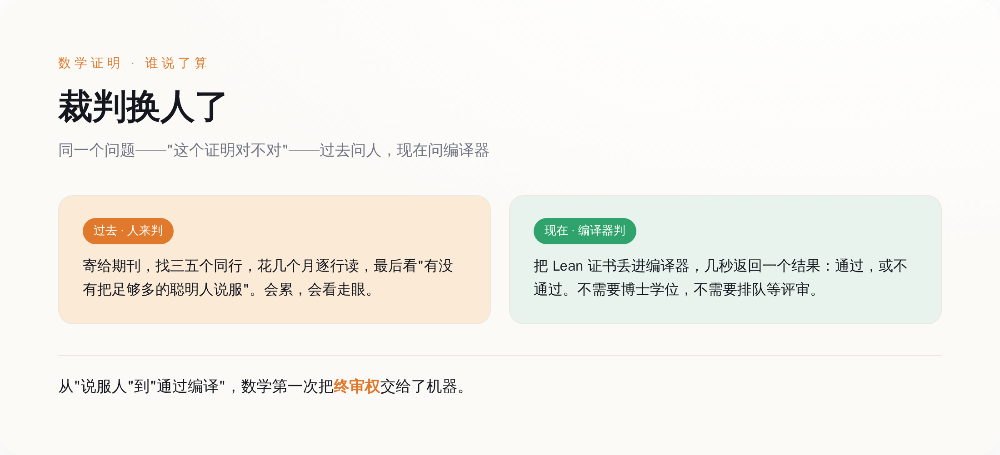
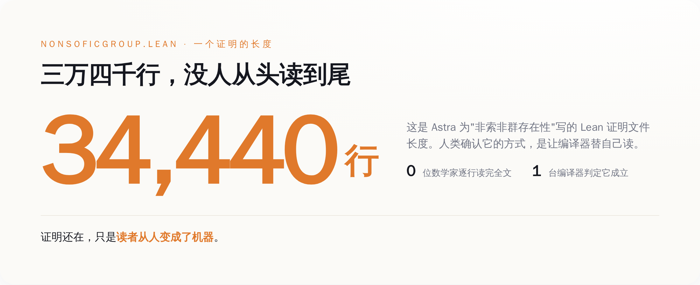
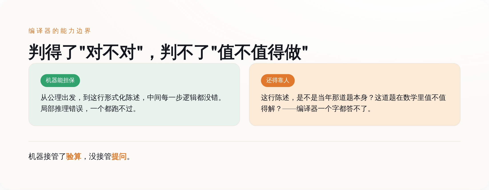

# OpenAI 两千美元解出十道数学难题，但最狠的一刀，是把"判对错"这件事从人类手里拿走了

> **发布日期**：2026-08-07 | **分类**：AI与科学

## 导语

先说结论里最反常识的一部分：8 月 1 日 OpenAI 甩出来的这十个数学证明，最值得记住的不是"AI 会做数学题了"，而是这些证明从头到尾没有一个人类完整读过，判它们对不对的，是一台编译器。你去 GitHub 上把那个叫 `openai/ten-proofs` 的仓库翻开，里面躺着十个 Lean 文件，其中解决群论那道题的 `NonSoficGroup.lean`，光代码就三万四千多行。三万四千行是什么概念？一个数学家一辈子读的论文加起来可能都没这么长。没有人逐行读它，也没有人打算逐行读它——大家的做法是，把它丢进 Lean 4 编译器，等一个二元结果：通过，或者不通过。所有媒体都在惊呼 AI 多聪明，惊呼两千美元多便宜。真正被这件事悄悄换掉的，是那个当了三百多年数学终审裁判的人类（笑）。

## 一、先把这事儿本身说清楚，不吹也不黑

OpenAI 8 月 1 日发的公告叫《数学与理论计算机科学的十项进展》，主角是它还没发布的下一代模型 Astra——注意，是内部版本，你现在买不到，也没有定价。这个内部模型干的事，是在十个数学和理论计算机的公开问题上给出了新结果，并且每一个都配了一份机器可验证的 Lean 证明，全部开源挂在 GitHub 上，用的还是宽松的 Apache-2.0 许可证。

这十道题不是随便凑的。翻仓库的 README，逐条列得清清楚楚：高维球堆积密度的渐近上界改进、二进制码的更强上界、构造出一个"非索非群"、Connes 刚性相关猜想的一个反例、计算积和式的算术电路下界、量子博弈的指数级平行重复、格上最近向量问题的困难性、凸体体积的一个尖锐上界，外加三道 Erdős 老爷子留下的组合难题（题号 146、180、183）。领域横跨几何、群论、量子复杂度、密码学、极值组合——摊子铺得相当开。

其中最招人的两个招牌，一个是群论里的"非索非群"。这个概念是数学家格罗莫夫 1999 年前后提出来的，之后"是不是所有的群都能被有限置换逼近"这个问题就一直挂在那儿，快三十年没人解决。Astra 说它构造出了一个不能被这么逼近的群。另一个是高维球堆积的密度上界——别误会，这不是维亚佐夫斯卡拿菲尔兹奖的那个"精确解出 8 维和 24 维"的工作，而是一个关于足够高维、渐近意义上的上界。这个方向上一次实质性的进展，还得追溯到 1978 年苏联那对搭档给出的界。快半个世纪了。

到这儿为止，都是硬事实，仓库里能查证的那种。被淹没在欢呼声里、真正有意思的东西，从下面才开始。

## 二、真正的主角不是 Astra，是那个叫 Lean 的编译器

数学这个行当，几百年来靠一套很"人"的机制运转：你证明了一个东西，写成论文，投给期刊，编辑找几个同领域的专家（这就是所谓同行评审），他们花几个月、有时候几年，一行一行读你的推导，挑毛病，最后判断——这个证明，能不能把我说服。

注意这套机制的本质：一个证明"对不对"，取决于"有没有把足够多的聪明人说服"。它是社会性的，是靠信任堆出来的。历史上出过不少乌龙，某个证明被顶级期刊接收、大家都觉得对，过几年才发现中间有个洞。人会累，会走神，会碍于情面，会看走眼。

Lean 把这套东西整个掀翻了。Lean 是一个形式化证明系统，你把证明的每一步都翻译成它能理解的、严格到变态的形式语言，然后它的可信内核会去检查：从公理出发，这一串推导是不是每一步都严丝合缝。检查的结果只有两种，通过或者不通过，没有"我觉得大概对"，没有"这一步有点跳跃但应该能补上"。

*图注：同一个问题——'这个证明对不对'——三百年来问的是人，现在问的是一台编译器，几秒钟给你一个通过或不通过。*

这意味着什么？意味着验证一个证明，不再需要那几位稀缺的、忙得要死的顶级专家。任何人，只要把那份 Lean 证书跑一遍编译器，就能独立确认它成立。信任的来源从"某个权威说它对"，变成了"编译器说它对"。数学界过去最贵、最堵的那个环节——靠人评审——被一段程序绕过去了。

**几百年来，一个数学证明的最终裁判是人；从这十个文件开始，最终裁判是编译器。** 这才是这件事真正的分水岭，比"AI 会做题"重得多。

## 三、三万四千行，一个人类从头读到尾的都没有

裁判换成机器，代价是证明本身变得人类读不了了。

再回到那个 `NonSoficGroup.lean`。三万四千四百四十行 Lean 代码，里面定义了一堆诸如 `UnitaryRepresentation`、`KazhdanPair`、`HasPropertyT` 之类的结构，环环相扣。这东西的存在目的不是给人读的，是给编译器读的。你让格罗莫夫本人来，让任何一个在世的顶级群论专家来，逐行读完并独立确认这三万四千行里没有一处逻辑跳跃——现实里没有人会这么干，因为这件事已经交给编译器了，人去逐行读纯属浪费生命。

*图注：三万四千行 Lean 代码，人类读它的方式不是'读'，是让编译器替自己读——证明还在，读者从人变成了机器。*

那人类数学家在这套新流程里干嘛？干翻译。今年 5 月，Astra 的上一个成果——推翻了埃尔德什的单位距离猜想——出来之后，包括菲尔兹奖得主高尔斯（Timothy Gowers）和诺加·阿隆（Noga Alon）在内的九位数学家，专门凑一块儿写了一篇论文（arXiv:2605.20695），干的活就是把那个机器生成的证明，"消化成一个简短的、人类可以核实的版本"。九个顶级大脑，围着一个机器吐出来的证明，做注解、做溯源、翻成人能读的版本。高尔斯本人对那个单位距离的证明评价极高，说他会毫不犹豫地推荐它上《数学年刊》——但那是对五月那道题说的，别跟八月这十道混为一谈。

顺带说一句，机器丢出来的东西是真能激起数学界反应的，不是自嗨。八月一号公告之后第三天，就有数学家挂出了跟进的论文（arXiv:2608.02025，讨论无挠的非索非群）。人类没闲着，只是活儿变了：**从"证明给你看"，变成了"解释给你听机器证了个啥"。**

## 四、OpenAI 只让你看分子，分母它自己收着

现在说说那个被媒体念叨得最欢的"两千美元"。

这个数字来自 OpenAI 研究员诺姆·布朗（Noam Brown）在 X 上的说法：生成这全部十个突破的证明，加起来的算力成本不到两千美元（按另一款已发布模型 Sol 的 API 价格折算的）。听着确实炸——十道悬了几十年的难题，两千块，一顿好点的饭钱。媒体标题里"每道题两千美元""平均一道两百"什么口径都有，反正怎么便宜怎么来。

但同一个人，在同一串帖子里还说了另外半句话，这半句话媒体基本没转：他们也试过别的重大问题，没成功，包括千禧年大奖那个级别的难题，一个都没搞定。换句话说，两千美元是十个"成功案例"的成本。分子给你看得清清楚楚，分母——试了多少道、失败了多少道、烧了多少算力在那些无声无息的失败上——他没说，你也查不到。

这套叙事你熟不熟？把成功的样本挑出来，标上一个惊人的低价，分母那部分安静地留在抽屉里。**任何时候有人只给你看命中率的分子，不给你看分母，你都该多问一句：那没打中的呢。** AI 领域的批评者加里·马库斯（Gary Marcus）给这次事件写的文章标题就一句话戳破了姿态——《OpenAI 那个了不起的、但被严重夸大的新模型 Astra》。了不起和被夸大，一个都不少。

这不是说这十个成果是假的——它们是真的，仓库里躺着，编译器验过。这是说，"两千美元解十道难题"这个被反复传播的爽点，是一个精心修剪过的分子，跟这十个证明本身的分量，是两码事。

## 五、编译器判得了"对不对"，判不了"这题值不值得做"

夸完 Lean、拆完营销，得给这件事一个诚实的边界，不然就成了另一种吹。

Lean 编译器担保的，到底是什么？是"从公理出发，到你写下的这行形式化陈述，中间每一步逻辑都没错"。局部的推理漏洞，一个都跑不过它。这是它的全部本事，也是它货真价实的本事。

但它管不了另外一件同样要命的事：你写下的那行形式化陈述，是不是当年那道题本身？把一个用人话描述的数学问题，翻译成 Lean 能读的形式语言，这一步翻译对不对、忠不忠实，编译器不负责——那还是人的判断。万一翻译的时候悄悄改了个条件，把一道难题变成了一道简单题，编译器照样给你打"通过"，它只认它读到的那行陈述，不认你心里那道题。

*图注：机器接管了'验算'，没接管'提问'——这道形式化陈述是不是原来那道题、这道题值不值得解，编译器一个字都答不了。*

所以数学家没被裁掉，只是他们最值钱的那部分能力，被逼着往上游挪了。逐行验算这件事，交给机器了；剩下的活儿——提出一个值得解的好问题、判断一个结果在整个数学版图里意味着什么、确认形式化的陈述忠实于原来那道题——这些编译器碰都碰不了，反而更稀缺了。今年 6 月，国际数学联盟背书的《莱顿宣言》里几千位数学家（陶哲轩、舒尔茨、阿伦森都在其中）担心的，恰恰是这一层：当一个证明不再是某个人的作品，而是一个没人完全理解的算法产物，出了错谁负责，对了又该算谁的功劳。他们没要求禁止 AI，要求的是在"验证、署名、披露"这些事上把规矩立清楚。

## 结尾

把这几层叠起来看，8 月 1 日这件事的真正形状就出来了：AI 解出十道难题是表皮，两千美元是被修剪过的营销分子，而里子是——数学第一次把"这个证明成不成立"的终审权，从人类手里，交给了一台编译器。

三万四千行代码，没人读，机器说对，它就是对的。这句话里藏着一个所有靠"专家评审"运转的行业迟早都要面对的问题：当验证可以被机器几秒钟完成，那些靠"我读过、我把关、我说了算"吃饭的人，价值到底还剩在哪儿。数学给出的答案暂时是——剩在提问那一端。至于别的行业轮到自己的时候，答案是不是也这么体面，那就是另一回事了（笑）。

## 数据来源

- [Ten advances in mathematics and theoretical computer science（OpenAI 官方公告）](https://openai.com/index/ten-advances-in-mathematics/)
- [openai/ten-proofs（Lean 证明开源仓库，含 NonSoficGroup.lean 等十个文件）](https://github.com/openai/ten-proofs)
- [Noam Brown 关于成本与失败尝试的说明（X/@polynoamial）](https://x.com/polynoamial/status/2083470822258467194)
- [Remarks on the disproof of the unit distance conjecture（九位数学家伴随论文，arXiv:2605.20695）](https://arxiv.org/abs/2605.20695)
- [A torsion-free non-sofic group（后续跟进论文，arXiv:2608.02025）](https://arxiv.org/abs/2608.02025)
- [OpenAI's amazing — but vastly oversold — new model Astra（Gary Marcus）](https://garymarcus.substack.com/p/openais-amazing-but-vastly-oversold)
- [Leiden Declaration on AI and Mathematics（国际数学联盟背书）](https://leidendeclaration.ai/)
