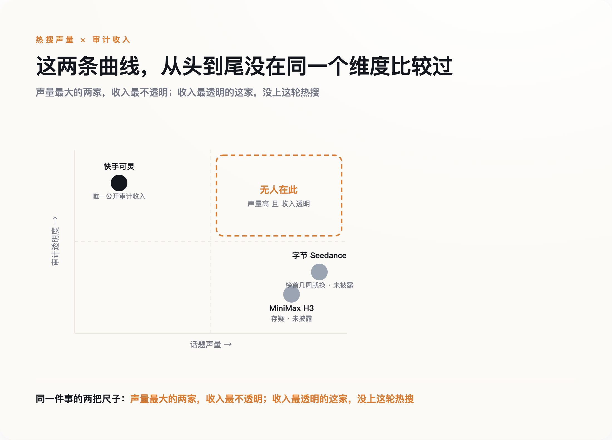

# 同一天发的两颗"国产之光"，一颗被独立测评打趴；真正赚钱的，是没上热搜的第三家

> **发布日期**：2026-08-07 | **分类**：科技与产业

## 导语

7月31日，MiniMax和字节跳动在同一天各自放出了新一代视频生成模型：H3和Seedance 2.5。中文媒体的标题几乎是复制粘贴出来的——"视频核弹""双响炮""国产AI再下一城"。这个统一叙事漏掉了两件事：第一，独立测评机构几天后给出的头对头结果，两者根本不在一个量级；第二，这场发布会热闹归热闹，真正把审计过的收入数字摆到台面上的，既不是MiniMax，也不是字节，是一家没上这轮热搜的公司。

## 一、这不是"中国领先"，是"字节领先MiniMax"

先说清楚两款产品是什么。MiniMax H3是一个全模态生成模型，能从文本、图像、视频、音频混合输入直接生成4到15秒、2K分辨率、带原生立体声的视频。Seedance 2.5是字节Seed团队的第五代视频生成模型，单次生成时长提升到了30秒，能接受的参考图片、视频、音频素材数量上限也高于H3。两者都在同一天官宣，都用了"新一代""突破性"这类词，看上去像是中国AI在同一条赛道上打出了双响炮。

但媒体没有等来的，是几天后专业测评机构Curious Refuge做的头对头实测。这是目前唯一一份公开的独立头对头评测，测试覆盖动作、对话、情感表演、特效四类场景，结论很直白：Seedance在物理真实感、多镜头叙事、角色情感表达上明显更好；H3在大幅度动作场景里频繁出现伪影、纹理不稳定、面部扭曲、构图错乱，测评给出的建议是"可以用来做社交内容，但撑不起高端影视制作"。更尴尬的是，H3宣称"未来几天内"开源的权重，发布三天后仍未兑现；社区里还有观察指出，H3的文本编码器疑似直接复用了阿里的Qwen3-VL，而不是完全自研——这一条目前只是社区观察，官方没有证实也没有否认，但足以让"国产自研"这个说法打上一个问号。

需要公平地说一句：H3不是一无是处，它开源的768p版本确实优于另一款开源模型LTX 2.3，放在"开源模型"这个细分赛道里有自己的位置；而且这份判断目前只来自一家测评机构，不该被当成定论。但至少就这一份现有证据而言，"中国视频生成技术全面领先世界"这句话，一旦落到H3和Seedance这两款同日发布的产品上，讲的更像是"字节明显领先MiniMax"，不是"中国全面领先谁"。

"国产自研"这个说法本身，H3也没能讲得很干净。它在美国、英国、欧盟、韩国目前都无法使用，官方给出的理由是当地监管环境——欧盟AI法案的执行力度和美国的版权诉讼压力都被提及。往前倒两个月看，据报道，好莱坞几家制片厂此前已就生成式视频侵权起诉了MiniMax，今年5月，美国联邦法官驳回了MiniMax撤销诉讼的动议，据称认定制片厂的指控"足够可信"，案子进入了证据开示阶段。这场官司还悬在那里没有结论，H3就在7月底顶着监管压力上线——一边是"全球领先"的宣传语，一边是连自己最大的几个海外市场都进不去，这个反差比任何测评分数都更说明问题。

## 二、"全球第一"这顶帽子，几周就换一次主人

如果只看技术排行榜，会觉得这个赛道日新月异，中国队一直在夺冠。今年2月，Seedance 2.0在独立盲测平台Artificial Analysis的文生视频榜单登顶第一；到了3月，昆仑万维的SkyReels V4又在同一平台的另一项细分榜单（带音频文生视频）冲到第一，同时也报出压过Kling 3.0、Google Veo 3.1和OpenAI Sora 2的成绩。两次"第一"未必是同一张榜单，但中间只隔了几周，谁在哪张榜单上领先，已经换了一轮。

这不是说这些模型不行，是说"全球第一"这顶帽子换主人的速度，快到任何一篇写着"XX登顶全球第一"的报道，等读者看到的时候，多半已经过时了。把这种极不稳定的排名当作"谁真的领先"的判断依据，本身就是一件危险的事——今天的第一，可能只是恰好在这几周的评测周期里表现最好，不代表任何长期意义上的领先地位。

## 三、真正稳定的东西，是审计过的收入

排行榜换庄换得这么快，同一时期，太平洋对岸的OpenAI倒是安静地做了一个相反的动作——把自己的Sora 2悄悄判了死刑，消费端4月就已经下线，API也定在9月24日彻底关停。一边是几家中国厂商挑同一天扎堆发新模型抢头条，一边是曾经的话题之王默默收摊，这条时间线本身已经说明问题：热闹的发布会和留得住的生意，从来不是一回事。

但有一样东西这段时间里没怎么变过方向：谁在真赚钱。目前三家主要玩家里，唯一把收入数字摆到审计财报里的，是快手旗下的可灵——2026年第一季度收入超过6.5亿元，同比增长300%，年化经常性收入约5亿美元，比去年同期增长逾四倍；截至去年底，全球创作者超过6000万，生成视频超过6亿条，付费企业客户超过3万家。这些数字来自上市公司必须披露的季度财报，不是发布会PPT上的自我表述——虽然财报里也没有拆得特别细，"可灵AI"具体占快手整体收入多大比例，同样没有单独列出，但至少这个数字是审计过的、要对股东和监管负责的，跟另外两家完全没有对外公布过一分钱，不是同一个透明度级别。

MiniMax呢？它在今年年初完成了763亿港元市值的港股上市，是目前大模型公司里规模最大的一次IPO，但视频生成业务的收入，被打包进"消费应用"这个笼统类别里，从没单独披露过一分钱。字节的Seedance更彻底，官方从未对外公布过任何和视频生成直接相关的收入数据。技术评分能打出好几个百分点的差距，商业化收入却是"有审计报表"和"完全空白"的差距——这两条曲线，从头到尾就没在同一个维度上比较过。

*图：同一件事的两把尺子——声量最大的两家，收入最不透明；收入最透明的这家，没上这轮热搜。*

## 四、这不是苛求谁必须赚钱，是提醒两件事不能混着看

这里要正面接住一个可能的反驳：MiniMax和字节的视频业务，完全可能是战略性投入，故意不追求短期收入、先抢生态位置再说，用收入去苛责它们并不公平。这个反驳是对的，本文也不是要论证"不赚钱等于技术不行"。真正想指出的是另一件更朴素的事：一款产品的技术评分再高，如果这家公司从不愿意让外界验证它到底有没有在赚钱，那"技术领先"这个说法本身，就缺了一半可以被验证的分量。快手愿意亮出可灵的收入，不代表它的模型技术一定最强；MiniMax和字节不愿意亮出数字，也不代表它们的生意一定不行——但读者至少应该知道，这两件事从来不是一回事，不该被同一篇通稿糊在一起讲。

## 五、下次看到"国产XX全球领先"，先问两句

同一天发布、同样的"突破性"措辞、同样被写成"国产之光"——这套叙事模板几乎每个月都会重演一次。下次再看到类似标题，值得先问两个问题：这个"全球第一"的排名，是不是这几周才刚换的庄？喊得最响的这家公司，愿不愿意把真实收入摆出来给人看。技术Demo有多炫，和这门生意成不成立，从来都是两件需要分开判断的事。

## 数据来源

- [MiniMax H3 Review — Curious Refuge](https://curiousrefuge.com/blog/minimaxh3-review)
- [MiniMax Releases MiniMax H3（MarkTechPost）](https://www.marktechpost.com/2026/08/01/minimax-releases-minimax-h3-an-omni-modal-video-model-that-generates-15-second-2k-clips-with-native-stereo-audio/)
- [4 Things To Know About Minimax H3（Forbes）](https://www.forbes.com/sites/johnwerner/2026/08/03/4-things-to-know-about-minimax-h3/)
- [ByteDance launches Seedance 2.5（TechNode）](https://technode.com/2026/07/31/bytedance-launches-seedance-2-5-video-generation-model/)
- [Official Launch of Seedance 2.0（字节Seed官网）](https://seed.bytedance.com/en/blog/official-launch-of-seedance-2-0)
- [763亿港元大模型公司最大IPO（量子位）](https://www.qbitai.com/2026/01/367789.html)
- [快手2026Q1财报：可灵AI收入超6.5亿元（东方财富网）](https://finance.eastmoney.com/a/202605273751448545.html)
- [杀进全球榜TOP2！国产视频模型黑马（量子位）](https://www.qbitai.com/2026/02/382803.html)
- [What to know about the Sora discontinuation（OpenAI Help Center）](https://help.openai.com/en/articles/20001152-what-to-know-about-the-sora-discontinuation)
