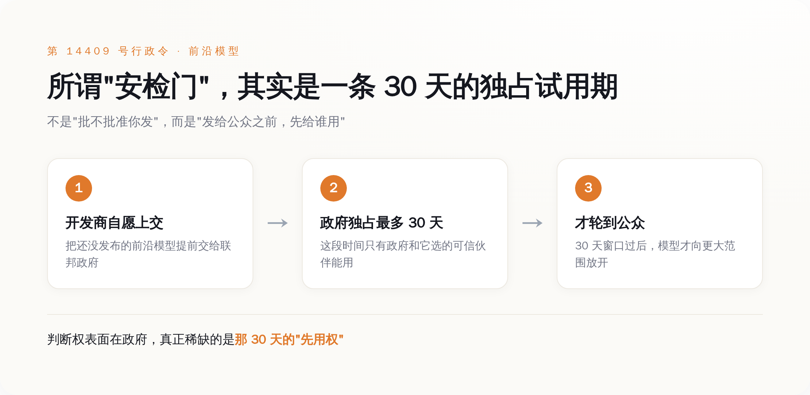
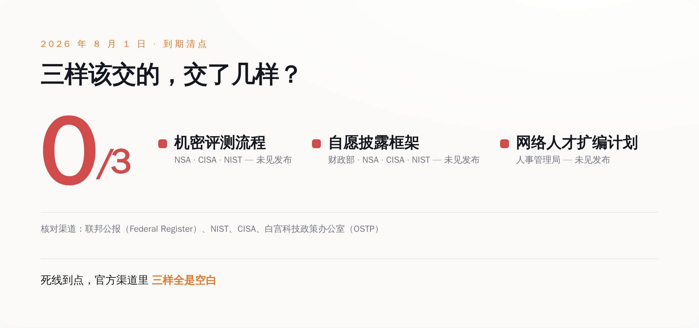

# 美国给 AI 装了道"发布前安检门"，到期这天一份文件都没交，先踩刹车的反倒是 OpenAI 自己

> **发布日期**：2026-08-08 | **分类**：AI与监管

## 导语

先说这事儿最拧巴的地方：所有人都以为，2026 年美国这套前沿 AI 新规上路之后，剧本是"政府在门口设卡，AI 公司排队等审批"。8 月 1 日，就是这套规矩自己定下的交货截止日。那天你去翻联邦公报（Federal Register），一条相关通告都没有；去翻 NIST、翻 CISA 官网，一份文件都没挂；连白宫科技政策办公室（OSTP）都没吭一声。政府那道号称要"审查前沿 AI"的安检门，到了自己的 Deadline，门框都没焊上。而同一个星期，真正把最强模型摁住、宣布"我先不发了"的，是 OpenAI 自己。裁判还没到场，运动员先自己吹哨把自己罚下了。这里面藏着的，才是这一轮 AI 监管真正变了形的地方（笑）。

## 一、先把这道"安检门"到底是啥说清楚

事情的起点是一份行政令。2026 年 6 月 2 日，特朗普签了第 14409 号行政令，名字叫《促进先进人工智能创新与安全》（Promoting Advanced Artificial Intelligence Innovation and Security）。别被这套官话绕晕，它干的核心事就一件：给最能打的那批 AI 模型起了个新名字，叫"受管辖的前沿模型"（covered frontier model），然后要求政府建一套流程，在这种模型发布之前，先过一遍政府的手。

行政令给自己压了个 60 天的表——所有配套的东西，8 月 1 日之前必须交出来。按国会研究服务处（CRS）那份编号 IF13268 的说明文件逐条拆，到期该交的一共三样：一套由国家安全局（NSA）、网络安全和基础设施安全局（CISA）、国家标准与技术研究院（NIST）合建的**机密评测流程**，用来判断哪个模型跨了那条"前沿"的线；一套自愿的前沿 AI 信息披露框架；再加一份联邦网络安全人才的扩编计划。

这里头最关键、也最容易被"审查"两个字带偏的，是那个"先过政府的手"具体怎么过。行政令里写得很清楚：AI 公司自愿把还在开发、够得上"前沿模型"的东西，提前交给联邦政府——**政府拿到手最多可以先用 30 天，之后才轮到其他"可信合作伙伴"**。而且哪些外部伙伴能跟着尝鲜，是开发商和政府一起商量着定的。

*图注：这道'安检门'的真身不是一个红绿灯，而是一条 30 天的独占试用期——政府和它选的人先用，公众最后用。*

还有一个设计，值得单拎出来记住：这条"前沿"的线，画在哪儿，是**机密的**。欧盟那套 AI 法案好歹公开挂了个算力门槛，多少 FLOP 以上算通用大模型，白纸黑字你能自己对照。美国这套偏不，它用的是一套机密评测流程来判定，门槛长啥样、怎么算，开发商自己都看不见。你不知道自己什么时候会踩线，也就只能默认——最好每次发大模型，都先来知会一声。

## 二、Deadline 那天，门框都没焊上

好了，规矩讲完了。接下来是这篇文章第一个反转：**这套流程，到期那天，一个字都没交出来。**

按 6 月 2 日签署、60 天倒计时算，8 月 1 日零点（世界协调时）就是死线。这不是什么"力争完成"的软目标，是行政令白纸黑字压的硬任务。结果到点一看：联邦公报上没有任何相关通告，NIST 和 CISA 没发布任何文件，白宫科技政策办公室没有任何声明。那套该由 NSA、CISA、NIST 合建的机密评测流程，没影；那套自愿披露框架，没影；连人才扩编计划，也没影。

*图注：行政令列了三样该交的东西，到期这天，官方渠道里三样全是空白。*

我知道有人会说，政府办事拖延又不是新鲜事，晚交几天能说明啥。这话对，但你把它放回那个大叙事里看，味道就不一样了。过去大半年，媒体、律所、评论员反复渲染的画面是"美国要给前沿 AI 装闸门了""发布前得过政府这一关了"，一堆合规解读文章看得企业心惊胆战。可到了这套闸门该真正立起来的那一天，它连图纸都没公开。

**一个连自己的交货日都守不住的机构，很难让人相信它能守在门口，逐个拦下那些几万亿参数的模型。** 换句话说，如果监管真的是靠"政府在门口卡审批"这套硬机制运转的，那 8 月 1 日这天，这套机制事实上是失灵的。

到这儿为止，你可能觉得这是个"雷声大雨点小"的老故事。别急，真正有意思的在下一节。

## 三、政府没动，OpenAI 自己先踩了刹车

就在政府那边一片空白的同一周，OpenAI 那边的动作，密集得反常。

8 月 1 日——对，就是死线当天——OpenAI 甩出一篇博客，标题是《数学与理论计算机科学的十项进展》，通篇在讲它怎么解了十道悬了几十年的数学难题。而"下一代模型"这个重磅信息，被塞在正文第三段的一句话里：这些结果，是由"我们的下一代模型 Astra 的一个内部版本"做出来的。一个新一代旗舰模型的名字，就这么轻描淡写地藏在一篇数学捷报里公布了，连个像样的发布会都没有。

比这更值得琢磨的，是发博客之前几天。据报道，Sam Altman 人在华盛顿，关起门来给一圈参议员和政府高官演示了 Astra——名单里有参议员沃诺克、莫雷诺、沃纳，还有财政部长贝森特和商务部长卢特尼克。**公众是从一篇数学博客里第一次听说 Astra 的；而华盛顿的那几位，早就当面上手看过了。** 谁先，谁后，一目了然。

*图注：同一个 Astra，参议员和部长在闭门会上先看了演示，公众几天后才从一篇数学博客的第三段里读到名字。*

然后是 8 月 7 日。Axios 发了篇独家，OpenAI 随后自己也确认了：它"无法排除"Astra 具备"关键级"（critical）的网络攻击能力——具体到什么程度？这个模型可能在没有人类介入的情况下，自己发现并写出零日漏洞利用。因为这个判断，OpenAI 决定放慢 Astra 的开发和发布节奏，暂停那些达不到更严安全要求的内部项目，并且要拉上政府机构和独立安全机构一起做评估，之后才谈更大范围的部署。Altman 本人在周五发帖，一句话概括：**"考虑到它的网络能力，我们需要多花点时间，把这事做安全。"**

你把这两件事叠一块看：政府那道正式的闸门，到期没建起来；而被这道闸门管的公司，主动把自家最强的模型摁住了，还反过来邀请政府进来一起测。**该设卡的没设卡，该被卡的自己把自己卡住了。** 这个顺序，才是这轮监管真正诡异也真正关键的地方。

## 四、真正的闸门不是审查，是那 30 天的"先用权"

那问题就来了：既然政府的正式流程是空的，OpenAI 图什么，非要自己踩刹车、还倒贴着请政府进门？

答案，藏在它上一款模型 GPT-5.6 的发布方式里，那是一次几乎没人当回事、其实已经彩排过一遍的预演。

按 OpenAI 自己公布的记录：GPT-5.6 系列的红队测试，动用了人工红队，外加**超过 70 万 A100 等效 GPU 小时**的自动化对抗测试。测完的结论是，它在网络和生物两个方向的能力都评为"高"，但都没有跨过"关键级"那条线。就是这么一款自评"没越线"的模型，2026 年 6 月 26 日也只是先做了个限量预览，交给一小撮"可信合作伙伴"——而且是应政府要求，这批伙伴的名单还提前跟政府报备了；直到大约两周后的 7 月 9 日，才正式向大众全面开放。

*图注：GPT-5.6 的路径已经把剧本演了一遍——政府点名的一小撮人先用两周，公众最后才拿到。*

把 GPT-5.6 的路径和 Astra 的动作接起来看，那套行政令写的"30 天先用权"，就不再是一纸没落地的空文了——它早就在事实层面运转起来了。政府正式文件交没交，其实没那么要紧；要紧的是，业界已经默认了这套玩法：**最强的模型出来，先让政府和它点名的那批人用一段，公众排在最后。**

这就是我想说的那个真正的变形。过去我们理解的监管，是"你先发，发错了我事后罚你"——它是滞后的、惩罚性的。而现在这套东西，形态彻底反过来了：**监管从"政府事后审你"，悄悄换成了"你抢着把最强的模型先交出去、给政府独家用上 30 天"。** 罚款、审批那套硬机制可以缺席、可以拖延、可以到期空白，都不影响这台机器转——因为它真正的燃料，是那条没人看得见门槛的机密线，和那 30 天独占试用期带来的信息差。

有人把这套框架叫作"纸面上自愿，实践中强制"。这话很准。当门槛是机密的、当行业老大主动带头把模型先交给政府、当上一款模型已经照这个剧本走了一遍，"自愿"两个字就只剩字面意思了。你不来这一趟，不代表你不受管；只代表你不在那张能提前拿到东西的名单上。

**所以闸门到期那天空着，不代表没有闸门——真正的闸门从来不在联邦公报里，在那份没人看得见门槛的名单上。** 下次再有人跟你说"政府开始管 AI 了"，别只盯着有没有新法律、有没有罚款。盯着那 30 天：谁先拿到最强的模型，谁在名单上，谁在名单外。权力这东西，从来不在门框上，在钥匙揣在谁兜里。

## 数据来源

- [白宫第 14409 号行政令《Promoting Advanced Artificial Intelligence Innovation and Security》(2026-06-02)](https://www.whitehouse.gov/presidential-actions/2026/06/promoting-advanced-artificial-intelligence-innovation-and-security/)
- [美国国会研究服务处（CRS）报告 IF13268《Controlling Advanced Artificial Intelligence: Executive Order 14409 Explained》](https://www.congress.gov/crs-product/IF13268)
- [OpenAI《Ten advances in mathematics and theoretical computer science》(2026-08-01)](https://openai.com/index/ten-advances-in-mathematics/)
- [OpenAI 官方 X 帖：GPT-5.6 红队投入逾 70 万 A100 等效 GPU 小时](https://x.com/OpenAI/status/2070555280052826429)
- [OpenAI GPT-5.6 System Card（Deployment Safety Hub）](https://deploymentsafety.openai.com/gpt-5-6)
- [Axios《Exclusive: OpenAI slows release of Astra model citing cyber capabilities》(2026-08-07)](https://www.axios.com/2026/08/07/openai-astra-model-delay-cybersecurity-risks)
