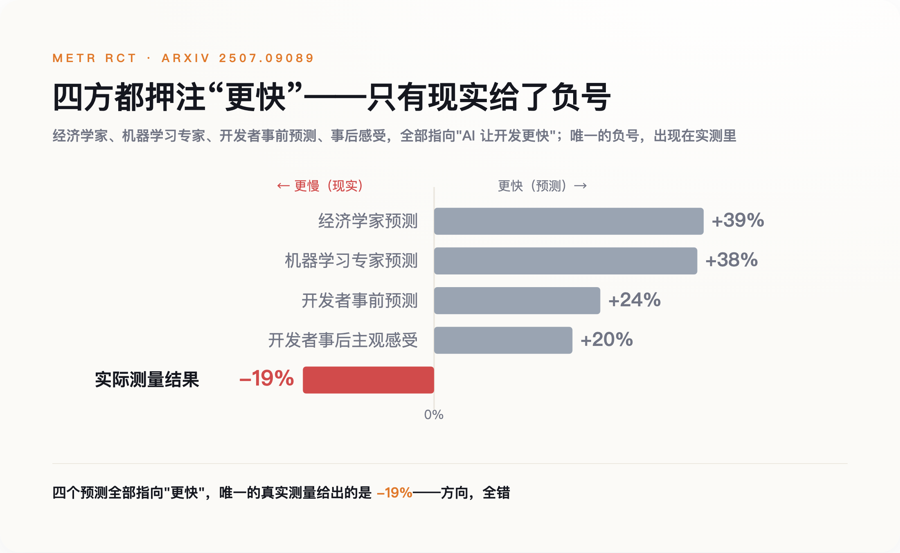
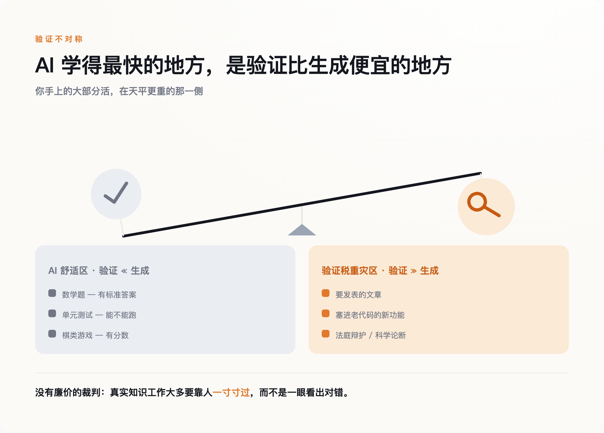
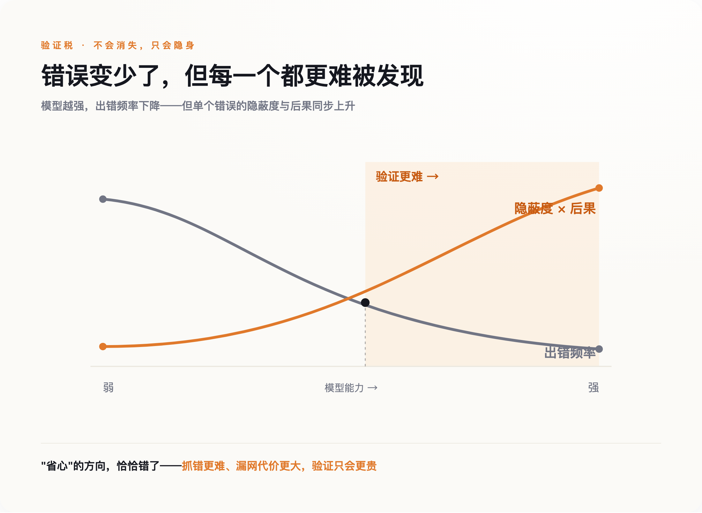

# 16 个资深程序员用上 AI，反而慢了 19%——把时间吃掉的，是没人算过的那道工序

> **发布日期**：2026-08-08 | **分类**：AI 深度观察

## 导语

2025 年夏天，16 个资深程序员参加了一场实验。他们都在自己最熟的开源项目上干活，一半任务允许用当时最好的 AI 编程工具，一半不许用。干完之后，几乎每个人都觉得 AI 帮自己提了速，平均感觉快了两成。计时器给出的是相反的数字：用了 AI 的那批任务，他们平均慢了 19%。

实验开始前，还有人请外部专家预测结果。经济学家赌 AI 会让这些程序员快 39%，机器学习专家赌 38%。没有一个人赌对方向。

要紧的从来不是 AI 到底有没有用。当它把"做"变得几乎免费，真正变贵的是另一件事——检查它做得对不对。这道工序正在悄悄爬成最贵的一道，贵到能把省下来的时间全吃掉，甚至倒贴。

---

## 一、所有人都赌错了方向

那场实验来自一家叫 METR 的非营利机构，2025 年 7 月公开，论文编号 arXiv 2507.09089。设计很干净：16 名资深开发者，246 个真实的开源 issue，随机分配能不能用 AI，工具是当时的第一梯队——Cursor Pro 配 Claude 3.5、3.7。这些人不是新手，改的也不是玩具项目，是他们自己维护多年、闭着眼都熟的成熟仓库。

结果反了。允许用 AI 的任务，平均耗时比不用多了 19%。

真正扎心的不是这 19%，是开发者对自己的判断。动手前，他们预测 AI 能帮自己省下 24% 的时间。干完、亲眼看过计时数据之后，他们依然坚信 AI 让自己快了大约 20%。一个人守着秒表，秒表说他慢了，他的直觉说他快了，最后他信了直觉。

*图注：四方都赌 AI 提速，计时器却给了负号：所有预测，都在错的方向上。*

省下的时间没有凭空消失，它换了个地方待着。AI 几秒钟吐出一段看着像模像样的代码，程序员接下来要做的，是读懂这段自己没写的代码、核对它调用的库对不对、想清楚它有没有绕过某个自己熟悉而它不熟悉的边界情况、发现不对再回去改提示词重来一遍。写的时间省下了，读和查的时间加了回来，而且加得更多。

这笔加回来的账，业界给它起了个名字，叫**验证税**。它不写在任何一张发票上，却真实地从每一次"用 AI 提效"里扣走一块，扣多扣少，取决于这件事有多难检查。

## 二、为什么检查比动手更难

我们的直觉里，检查总是比做容易。一道数独要算半小时，验证答案对不对只要几秒；一道菜做一下午，尝一口就知道咸淡。斯坦福和 OpenAI 的研究者 Jason Wei 把这件事讲透了，他称之为"验证的不对称性"，并顺手总结出一条规律：一项任务上 AI 进步的快慢，和这项任务好不好验证成正比——有客观答案、验证快、能规模化、噪声小，AI 就学得飞快。

数学题、单元测试、有分数的游戏，恰好全落在"验证远比动手容易"这一侧。这也正是这几年大模型进步最猛的地方。人们看着 AI 在这些领域封神，顺理成章地以为它在所有事情上都能这么帮忙。

可你手上的大部分活，恰恰不在这一侧。一篇要发出去的文章、一段要塞进十万行老代码里的新功能、一份要呈给法官的辩护、一个要写进论文的科学论断——这些任务没有一把现成的尺子能几秒钟量出对错。没有廉价的"标准答案"，检查就得靠人一寸一寸地过，而这恰恰是最慢、最贵、最没法外包给机器的部分。

*图注：AI 学得最快的地方，恰是验证比动手便宜的地方；你的活，多在另一边。*

Django 的联合创始人 Simon Willison 把这层窗户纸捅得更直白。他说，这三年里，生成一段代码的成本降了差不多两个数量级，而一个人读懂一段陌生代码的速度，从头到尾没有变快过一分一毫。你并排开两个 AI 代理帮你写，不会让产出翻倍，只会让排在你眼睛前面等着被审的队伍翻倍。

**AI 最擅长的，恰恰是那些验证比动手更容易的活；而你真正头疼的那些活，多半不是。**

## 三、于是，人干脆就不看了

面对一条越排越长、又必须靠人眼审的队伍，人的反应很诚实：不看了，或者假装看了。

这不是道德问题，是被反复研究过的心理机制。2010 年，Parasuraman 和 Manzey 在《Human Factors》上把它命名为"自动化自满"：当一个系统足够可靠、当操作者手上同时压着好几件事、当过去每一次它都没出错——人就会主动减少核查。更让人无力的是，他们发现这个效应在专家和新手身上一样存在，练不掉，也不会因为你"知道要小心"就消失。

这种自满，正在被当成生产力奇迹来庆祝。Spotify 的工程博客公开过一套完全由 Claude 驱动的后台编码系统 HONK：它自己写代码、跑测试、开 PR，上线以来已经合并了一千五百多个改动，公司说如今大约七成的 PR 都有 AI 参与生成。今年 2 月的财报会上，Spotify 高管说，他手下最资深的那批工程师，从去年 12 月起就没再手写过一行代码。写代码，第一次不再是瓶颈了。可代码还是得有人点"通过"。当七成的改动是机器写的、用着你没读过的库、绕过你不熟的边界情况，你按下那个绿色按钮时，赌的究竟是自己看懂了，还是机器大概不会错。

赌注押错的时候，账单会在别处结清。法国学者 Damien Charlotin 维护着一个专门追踪这类事故的数据库，截至 2026 年 4 月，全球已记录 1,313 起法庭案件出现 AI 编造的内容，其中 496 起牵涉执业律师。罚单也在往上走：2023 年的 Mata 诉 Avianca 案，两名律师因提交 AI 虚构的判例被各罚 5,000 美元，打响了第一枪；到 2025 年，同类罚款已经涨进了五位数。这一年 7 月的 Coomer 诉 Lindell 案里，代理方两名律师提交了近 30 处不存在的判例引用，法院撂下一句很重的话：核验的义务，不可转授。10 月，德勤澳大利亚交给政府的一份 237 页报告被查出含 AI 生成的错误，政府要求退款。

代码这边的账更日常。代码审查工具 CodeRabbit 在 2025 年 12 月分析了 470 个 GitHub 上的 PR，发现 AI 生成的代码相比人写的，平均多出约 1.7 倍的问题。也就是说，机器写得越多、越快，需要人瞪大眼睛审的东西不是变少了，是变多了。而人恰恰在这个节骨眼上，选择了少看。

## 四、连证据本身，都没人回头核一遍

还有最后一环，它比上面所有的账单都更彻底——因为这次，欠账的是我自己，也是几乎每一个转发过那个"19%"的人。

那个被引用了大半年的"19%"，后来有了下文。2026 年 2 月，METR 自己发了篇跟进，把实验又做了一轮，结果却分成打架的两组：还是原来那批开发者，测出来依然慢了约 18%，和最初的 19% 几乎一样；换成新招募的一批开发者，则变成慢约 4%，而且置信区间从慢 15% 一直横跨到快 9%——跨过了零，等于没测出显著差别。METR 把话说在前头：这批新数据受到严重的样本自选干扰，只算"非常微弱的证据"，既推不翻也证不实当初那个 19%。于是他们决定把实验推倒重做，而不是急着甩出一个新数字。

第一段话，慢 19%，干脆、反常识、适合转发，传遍了世界。第二段话——两组数字打架、"其实没测准、得重来"——拗口、没有结论、不好讲，几乎没人转。

而这，恰恰是验证税最刁钻的一层。"AI 让人变慢 19%"是一个漂亮的结论，它和 AI 的任何输出一样，看着可信、抓人眼球，然后被成千上万人（包括我）转发、写进 PPT——却几乎没有人回头看一眼，它后来变成了什么样。**我们连一个专门研究"验证"的结论，都懒得去验证一遍。**

所以别误会我的意思。我不是要拿那个 19% 去坐实"AI 让人变慢"——两轮测下来，它到底慢多少、还是根本没差别，至今是笔糊涂账。但有一件事反倒越来越清楚：把一个看着可信的结论真正核实一遍，这件事本身正在变贵，贵到连一份专门研究"验证"的报告，都没什么人愿意回头验证它后来怎么样了。

## 五、模型越强，账单会不会自己变小

一个合理的盼头是：这些不都是模型还不够聪明闹的吗？等模型再强几代，错得少了，不就不用怎么检查了。

这个盼头有它的道理。Honeycomb 的 CTO Charity Majors 就属于乐观这一派，她认为验证税本质是组织纪律问题，靠测试覆盖、灰度发布、自动化护栏，是可以系统性压下去的。也有一种说法是，新手用 AI 提速反而更明显——他们本就没多少"内行判断"会被机器糊弄，于是这笔税主要压在"本来就很强"的专家身上，因为他们的标准高，机器蒙混不过去。

但把盼头寄托在"模型变强"上，可能正好搞反了。纽约大学的 Gary Marcus 反复强调一件事：幻觉不是一个能打补丁修好的 bug，它是概率式架构本身长出来的东西，你压低它的频率，压不掉它的存在。而更麻烦的，是频率降低本身带来的副作用——模型越强，出错越少，可一旦出错，错得越像对的。

想想看，一段十次里错一次、一眼能看出的代码，你会老老实实每次都审；一段一百次里才错一次、错的时候还长得跟对的一模一样的代码，你审到第五十次，多半开始跳着看。可那第一百次的错，埋得最深、最像真的、后果也最重。**模型越强，越难抓错，因为它把错的，写得越来越像对的。**

*图注：错误变少了，但每一个都更难被发现——“省心”的方向，恰恰错了。*

这一步是推断，不是实测。它说的不是验证税一定越来越大，而是它不会因为模型变强就自动消失，只会从"看得见的麻烦"，挪成"看不见的风险"。这个推断也留了个证伪的口子：哪天更强的模型让资深工程师花在核对上的工时实测下降，这一节就算错了。

这件事真正的行动含义，落在怎么衡量工作上。别再问"AI 帮你省了多少时间"——那把尺子，正是让 16 个程序员在慢了 19% 的情况下还坚信自己快了 20% 的同一把尺子。该问的是另一句：你的产出，经得起验证吗？也别因为错误率降了就松开抽检——越是低频、越像真的输出，越值得单设一道独立复核。

回到那个绿色的"通过"按钮。真正的问题从来不是它被点得有多快，而是——如果那段代码真的错了，在按下去之前，有没有人可能把它抓出来。这个问题的答案，才是这场生产力革命最后要交的账。

---

## 数据来源

- [Measuring the Impact of Early-2025 AI on Experienced Open-Source Developer Productivity（METR, arXiv 2507.09089）](https://arxiv.org/abs/2507.09089)
- [METR 官方博客：开发者生产力实验（含 2026 年 2 月跟进）](https://metr.org/blog/2025-07-10-early-2025-ai-experienced-os-dev-study/)
- [Jason Wei：Asymmetry of verification and verifier's law](https://www.jasonwei.net/blog/asymmetry-of-verification-and-verifiers-law)
- [Simon Willison 关于 AI 辅助编程的评论](https://simonwillison.net/)
- [Parasuraman & Manzey, Complacency and Bias in Human Use of Automation（Human Factors, 2010）](https://journals.sagepub.com/doi/10.1177/0018720810376055)
- [法律 AI 幻觉案件追踪数据库（Damien Charlotin 维护，一手数据源）](https://www.damiencharlotin.com/hallucinations/)
- [CodeRabbit：AI 生成代码的 PR 质量分析（2025-12）](https://www.coderabbit.ai/)
- [1,500+ PRs Later: Spotify's Journey with Honk（Spotify Engineering）](https://engineering.atspotify.com/2025/11/spotifys-background-coding-agent-part-1)
- [Spotify Claude Agent SDK case study（Anthropic）](https://claude.com/customers/spotify)
- [Gary Marcus 论大模型幻觉的架构本质](https://garymarcus.substack.com/)
- [Charity Majors 论 AI 与工程组织纪律](https://charity.wtf/)
