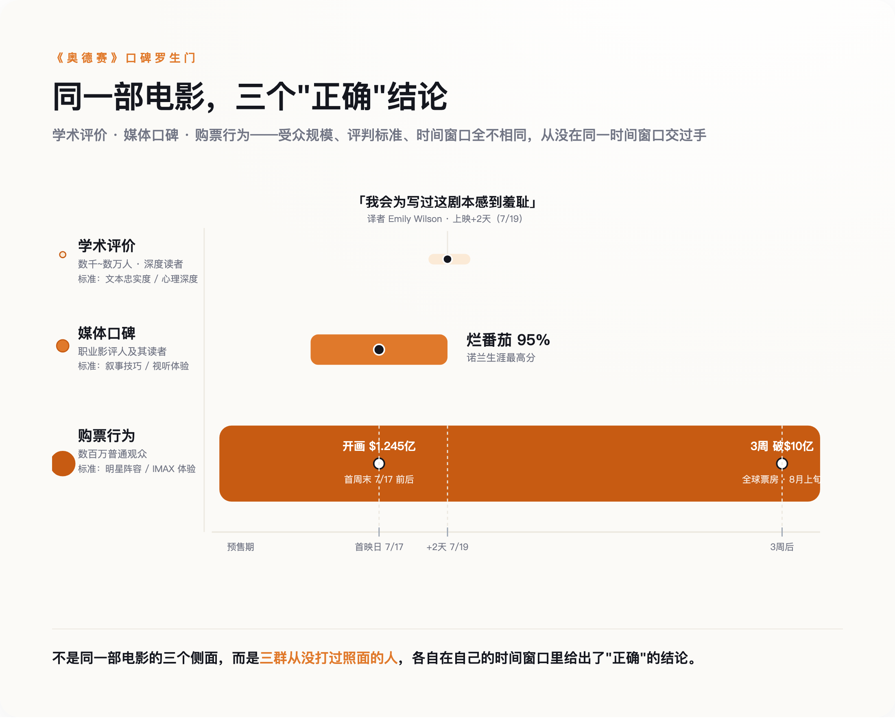

# 原著译者说这剧本"丢人"，烂番茄却打出诺兰生涯最高分——《奥德赛》的评价，分裂成了三套互不理睬的系统

> **发布日期**：2026-08-09 | **分类**：影视与文化

## 导语

7月19日，《奥德赛》英译本译者艾米莉·威尔逊（Emily Wilson）在《伦敦书评》上发文，称诺兰这部电影的剧本"糟糕透顶"，"没有一个角色的动机是让人信服的"，"我会为写出这剧本任何一部分感到羞耻"。同一周，烂番茄给出98%的媒体好评率——诺兰生涯最高（随后几周评论数增加，稳定回落到95%左右，但仍是他生涯最高）。三周后，《奥德赛》全球票房突破10亿美元，正逼近《黑暗骑士崛起》，即将成为诺兰个人票房最高的一部电影。这三件事同时成立，却没有一篇报道把它们放在一起讲——因为它们分别来自三个几乎不互相阅读对方文章的圈子：翻译学界、职业影评人、和买票进场的普通观众。

## 一、翻译者的耳光，打在谁脸上

威尔逊不是随便一个骂电影的人。她是宾夕法尼亚大学古典学教授，2017年出版的《奥德赛》英译本是这部史诗第一个由女性译者完成的权威译本，出版后被《纽约时报》《卫报》等多家媒体列入年度最佳图书。诺兰在多场路演和采访中公开提到，自己筹备剧本期间对照了三个英译本——威尔逊、Rieu、Fagles——作为理解原著的参照系。换句话说，威尔逊不是这部电影的路人批评者，是诺兰自己点名致敬过的学术源头。

她这篇文章标题叫《一个并不复杂的男人》（An Uncomplicated Man）——反讽的正是她自己那版译本开篇第一句"告诉我一个复杂的男人的故事"（Tell me about a complicated man）。通篇论证的核心不是"改编不忠于原著"这种老生常谈，而是更具体的指控：原著里的奥德修斯精于算计、擅长撒谎、常年在道德灰色地带周旋，电影里的这个人，动机简单到几乎不需要解释——**史诗里最复杂的那个男人，被改写成了一个不复杂的男人**。这个批评如果成立，打的不是"改编尺度"这种口味问题，是编剧能力问题。

威尔逊的立场并不是一味的否定，她在同一篇文章里承认，电影的视觉呈现有值得肯定的地方，也不讳言自己译本的销量因为这部电影上映而明显上涨——一个被电影带火了生意、却依然愿意公开说"我会为这剧本感到羞耻"的人，她的批评分量比一句耸动的差评标题重得多。

## 二、媒体打出的是"生涯最高分"，但这份最高分背后有另一层悖论

烂番茄评分稳定在95%左右（7月19日刚上映时一度冲到98%，随评论数增加逐渐回落），仍超过了诺兰过往所有作品，包括《黑暗骑士》《记忆碎片》的94%和《奥本海默》的93%；Metacritic给出89分，57篇评论里53篇正面、4篇褒贬不一、0篇负面；观众端的爆米花指数97%，同样是诺兰生涯纪录。单看这几个数字，"影史级别的好评"这个说法并不夸张。

但把镜头切到中国大陆，情况没那么一致。8月1日至2日，《奥德赛》在北京、上海、广州、深圳四城开展158场IMAX超前点映，豆瓣开分8.2，点映期间一度到过8.3。这个分数放进诺兰个人作品序列里比较，是他生涯倒数第三——只比评价平平的《信条》和《失眠症》高。同一部电影，在同一个"专业评价"的框架里，美国媒体给出生涯最佳，中国观众给出生涯倒数第三——这不是东西方审美差异这种笼统解释能糊弄过去的裂缝，是"媒体口碑"这条线自己内部就没能形成统一意见。

分歧的具体落点也基本一致：豆瓣讨论区里最常见的不满是动作戏调度偏弱、结局处理仓促，这和威尔逊指控的"角色动机单薄"其实是同一类问题的不同说法——只是威尔逊用学术语言说了一遍，中国观众用打分说了一遍。

## 三、观众用真金白银投的票，压根没理会前两条战线

北美开画首周末票房1.245亿美元，全球首周末2.641亿美元，是诺兰自2012年《黑暗骑士崛起》以来最大的开画规模。上映约三周后，全球票房突破10亿美元，成为诺兰生涯第三部十亿美元作品，正在逼近《黑暗骑士崛起》10.85亿美元的诺兰个人票房纪录。IMAX单项贡献了北美开画约四分之一的票房——这也是影史第一部全程用IMAX 70mm胶片拍摄的长片，诺兰团队为此专门研发了更轻更安静的IMAX摄影机。

这轮票房狂欢完全没有被网上正在同步进行的另一场骂战拖慢。因为选用Lupita Nyong'o饰演海伦、跨性别演员Elliot Page参演，马斯克在X上公开批评"诺兰失去了他的诚信"，部分传闻甚至是被证伪的假消息——比如一度流传Page饰演阿喀琉斯，实际角色是西农。与此同时，网上还出现过盗用真实影评人首映照片、冒充自己看过首映发表未观影差评的账号。

根源在于：购票决策发生在预售和首周口碑发酵这个很短的时间窗口里，靠的是明星阵容、诺兰个人品牌、IMAX胶片这种"事件感"营销；而威尔逊那种需要通读全片、消化原著再动笔的深度评论，天然要晚发布好几周，传播半径也窄得多，等它触达普通观众的时候，电影早已经开画、票已经卖出去了。**不是观众"不在乎"学术批评，是这两套信息压根没在同一个时间窗口里出现过**。

*图：学术评价、媒体口碑、购票行为，走的是三条互不相交的时间线——不是同一件事的三个侧面。*

## 四、三条轨道为什么能同时成立——因为它们从没在同一个赛道上跑过

把这三件事摆在一起，它们其实不是互相矛盾，是彼此平行。学术评价这条轨道，受众是通读过原著的极少数人，标准是文本忠实度和角色深度，传播速度以"周"甚至"月"计。媒体口碑这条轨道，受众是职业影评人和重度观众，标准是叙事完成度、视听体验，传播速度是开画前后几天。购票行为这条轨道，受众是普通观众，驱动力是明星、导演个人品牌和"IMAX事件感"，决策窗口短到预售阶段就基本定型。评判标准不同、受众规模不同、反应速度也不同，三条轨道能给出截然相反的结论，本身没有任何逻辑矛盾——真正反常的，反而是过去大家习惯把这三条线的结果直接划等号，看到"票房破纪录"就默认"口碑也好"，看到"媒体好评"就默认"忠于原著"。

诺兰本人对威尔逊式批评的回应，恰好印证了这一点。他在采访里被问及外界的负面声音时说过一句话，大意是自己能理解这个故事为什么打动了他，所以外界说它"没有奏效"这种判断在他这里立不住。这句话本身在用的，正是"打不打动人"这把尺子——是购票观众和普通影迷那条轨道最看重的标准，不是威尔逊那条轨道在意的文本忠实度。诺兰不是在反驳威尔逊，是在用另一把完全不同的尺子回应，两人从头到尾都没有真正对上过话。

## 五、下次看到"好评如潮"，先问清楚是哪把尺子在打分

《奥德赛》不是第一部同时收到两极评价的电影，特殊的地方在于，这一次三条轨道给出的结论差距大到近乎荒诞：一头是"我会为写过这剧本感到羞耻"，一头是"诺兰生涯最高分"，另一头是"即将刷新诺兰个人票房纪录"——三句话像在说三部完全不同的电影，却指向同一部。

下次再看到"烂番茄95%""票房破纪录"或者"原著粉丝痛批"这类新闻标题，值得先停下来问两句：这个判断来自谁——是通读过原著的专家、职业影评人，还是买票进场的普通观众？它的传播速度，是不是刚好赶上了另一条轨道已经尘埃落定之后？**"好评如潮"从来不是一句话，是三套互不理睬的系统各说各话**。

## 数据来源

- [The Odyssey (2026 film) — Wikipedia](https://en.wikipedia.org/wiki/The_Odyssey_(2026_film))
- [《奥德赛》定档8月14日，超前点映场次创纪录（新浪娱乐）](https://ent.sina.cn/2026-08-01/detail-inikvnzu8695903.d.html?vt=4)
- [The Odyssey Sets Record Critics' Score for Nolan's Films on Rotten Tomatoes（Forbes）](https://www.forbes.com/sites/timlammers/2026/07/19/the-odyssey-sets-record-critics-score-for-nolans-films-on-rotten-tomatoes/)
- [The Odyssey Box Office: Christopher Nolan Opening Weekend Shatters Expectations（Variety）](https://variety.com/2026/film/box-office/the-odyssey-box-office-christopher-nolan-opening-weekend-shatters-expectations-1236815861/)
- [The Odyssey Surpasses $1 Billion（Variety）](https://variety.com/2026/film/box-office/the-odyssey-surpasses-1-billion-christopher-nolan-1236830121/)
- [Emily Wilson on The Odyssey：'I would be ashamed'（TheWrap）](https://www.thewrap.com/creative-content/movies/the-odyssey-emily-wilson-review-christopher-nolan-movie/)
- [The Odyssey 'Woke' Casting Backlash（Forbes）](https://www.forbes.com/sites/erikkain/2026/07/19/the-odyssey-woke-backlash-casting-helen-of-troy-elliot-page/)
- [诺兰《奥德赛》北京点映现场（IT之家）](https://www.ithome.com/0/981/540.htm)
