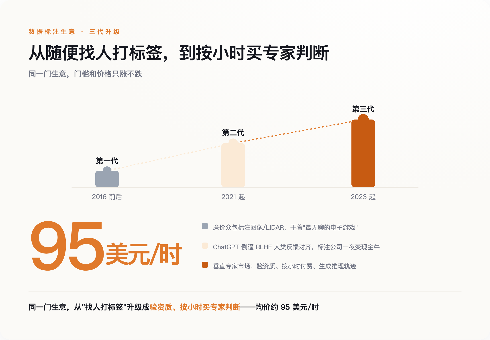
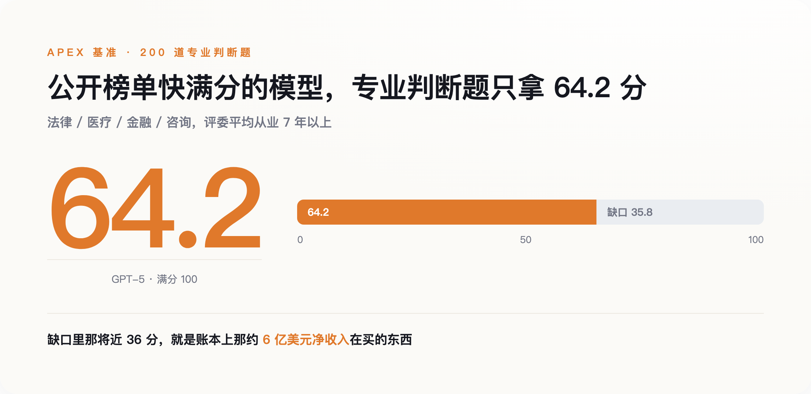
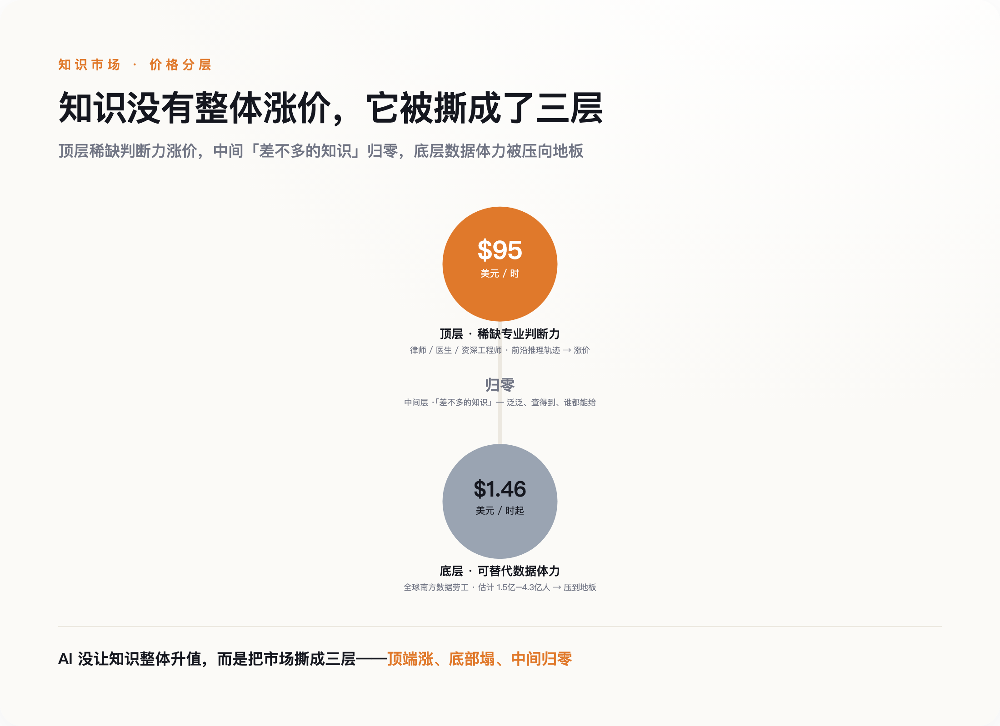

# AI 一边喊着取代人类，一边花钱雇人类给它出题——它买什么，就说明它不会什么

> **发布日期**：2026-08-11 | **分类**：AI 观察

## 导语

在 Mercor 这个平台上，一个执业律师、一个放射科医生、一个写过操作系统的资深工程师，可以按大约 95 美元一小时的价钱，接到一份活儿：给 AI 出题，写标准答案，然后挑它的错。平台上有三万多名通过资质审核的专家，每天付给他们的钱超过 150 万美元。

做这件事的公司——Scale、Surge、Mercor，还有它们背后的 OpenAI、Meta、Google——正在另一个场合告诉你，AI 很快要取代大量白领。这两件事都是真的。想知道 AI 到底还不会什么，别看它公布的榜单，也别看它路演时的 demo，看它把钱花在雇谁身上。

---

## 一、一份读起来有点别扭的招聘单

先看这份活儿本身有多贵。

Mercor 上专家的平均时薪是 95 美元，合人民币接近 700 元一小时。要接这单，你得先过一道 AI 面试，交出执照或从业证明——律师要过司法考试，医生要有行医资格，工程师得能拿出真做过的东西。审核完了，你干的不是敲代码、写文章这种"生产"，而是给模型的回答判对错、写出一道它答不上来的难题、把它的推理链条里错的那一步标出来。平台从这笔钱里抽三成到三成五，剩下六到七成落到专家手里。

别把这当成个别公司的怪招。它已经是一门有规模的生意。Mercor 的平台流水，2025 年 2 月还只有约 7500 万美元的年化水平，到年底冲到 7.6 亿，2026 年 2 月破 10 亿，到 6 月做到 20 亿美元年化——四个月翻一倍。另一家 Surge，2024 年收入就到了 12 亿美元，而且从 2021 年成立起一直盈利，靠自己赚的钱滚大，直到 2025 年中才第一次拿外部融资。Meta 更直接，去年拿 143 亿美元买下 Scale 49% 的无投票权股份，把这家公司标到了 290 亿美元。

值得停一下的是这里的别扭。这些公司对外的叙事是"AI 要接管知识工作"，账上真金白银在做的，却是高价把知识工作者请回来，一小时一小时地教 AI。它们不是不信自己的话。恰恰相反，它们比谁都清楚：模型现在到底会什么、不会什么，这条线画在哪儿。而这条线，就藏在它们愿意为什么样的活儿掏钱里。

榜单可以刷，demo 可以剪，花钱不行——花出去是要肉疼的。所以在所有关于 AI 能力的说法里，最不敢撒谎的，是账本。问题只剩一个：免费的互联网就在那儿，它们为什么非要花这个钱？

## 二、免费的那部分，吃完了

2024 年底的 NeurIPS 大会上，Ilya Sutskever 说了一句让整个行业安静了一下的话。他是 scaling law 这套"堆数据堆算力就能变强"打法的奠基人之一，他说：我们所知道的预训练要结束了，因为算力还在涨，数据不涨——"我们只有一个互联网"。

这句话点破的是一个被回避了很久的事实。过去几年模型变强，靠的是把整个互联网的文本喂进去。但能免费抓的、质量够高的文本是有限的，而且已经抓得差不多了。有人试过用 AI 自己生成的数据来续命，很快撞墙——业内把这种现象叫"模型坍缩"（model collapse）：模型反复学自己的输出，会越学越窄，把自己的偏差当成营养喂回去，最后困在原地。真正稀缺的东西，机器造不出来——一个律师面对疑难案件怎么权衡，一个医生看着片子怎么排除，这些藏在活人脑子里、从没被写下来的判断过程。

这就逼出了第三代数据生意。头一代是 2016 年前后 Scale 做的，给自动驾驶标图像，找的是最便宜的众包工，活儿枯燥得像"最无聊的电子游戏"。第二代由 ChatGPT 掀起来，模型要靠人类反馈来对齐，标注公司一夜之间成了现金牛。第三代就是现在——不再是随便找人打标签，而是验资质、按小时付费，请专家把自己的推理过程一步步喂给模型。

*图注：数据标注的三代升级——门槛和价格一代比一代高*

为什么这一代非专家不可，技术上有个说得通的理由。现在推理模型的主流训法，需要有人来定义"什么是对的答案"。数学和代码好办，答案能自动验证，对就是对。可法律怎么算对、医疗诊断怎么算对、一段开放式推理怎么算严密——这些没有自动裁判，只能靠真正懂行的人来判。数据到这一步，不再是能无限抓取的原材料，而成了得一小时一小时买的稀缺品。稀缺到什么地步，看账本上那串数字就知道。

## 三、这份账本，比它公布的榜单诚实

回头看那些数字，要看的不是"涨得多快"，是"钱花在了哪儿"。

Mercor 抽成三成算，20 亿美元流水对应大约 6 亿净收入。这 6 亿不是花在"更多的数据"上，是花在"更难的判断"上。它请的不是标注工，是高盛的分析师、麦肯锡的顾问、Latham & Watkins 的律师、西奈山医院的医生，平均从业七年多。买的也不是数据的量，是这些人脑子里那点别人替代不了的东西。换句话说，实验室愿意为哪个领域、哪种难度掏钱，就等于承认自己在那儿还不行。

**这份采购单，是一份比任何公开榜单都诚实的能力清单——它买谁，就等于承认自己在那儿还不行。** 榜单上的分数年年在涨，涨到快满分，容易让人以为模型什么都会了。但榜单是能刷的——题目泄露、针对性训练、专挑好看的指标报，都能把分数做上去。账本刷不了，请一个律师纠一天错，就得付一天的钱，付了就说明这活儿模型自己干不了。

Mercor 自己做过一个叫 APEX 的基准，可以当这份清单的一角来读。它出了 200 道法律、医疗、金融、咨询领域的专业题，请平均从业七年以上的专家来评判。结果最新的 GPT-5 只拿到 64.2 分。模型早就很会"看起来像专家"，可真到复杂、开放、要担责任的判断上，它和真专家之间还差着将近 36 分。这将近 36 分，就是账本上那 6 亿美元在买的东西。

*图注：模型很会装出专家的样子，但真到要担责的专业判断，还差着将近 36 分*

到这儿，故事像是收在一个让人踏实的结论上：AI 没让知识贬值，反而让专家更值钱了。可要是就此打住，这篇文章也就跟那些"时薪暴涨"的猎奇稿没区别了。真实的那一面，比这难看。

## 四、贵的是谁，贱的又是谁

在 95 美元一小时的另一头，是 1.77 美元。

同样是给 AI 喂数据，全球南方的数据劳工，做一单的价钱低到 1.77 美元，扣完税一小时到手约 1.46 美元。据 Noema 梳理的估算，全球这类数据工人在 1.5 亿到 4.3 亿之间——区间这么大，是因为各家对"算不算数据工"的口径本就不同。你在新闻里看到的"博士时薪 700 块"，和你看不到的"一小时 10 块钱、被监控软件盯着干活"，是同一条产业链的两头。

还有被雇来的是谁。据媒体报道，有做文案的，工作先被 ChatGPT 抢走，转头又被请去训练 ChatGPT——"我的工作没了，然后我被邀请来训练这个模型"；也有画了半辈子画的插画师，业务被 AI 蚕食掉大半之后，回头去接了个给大厂做数据标注的活儿，时薪还一路被砍。国内也一样，985、211 的硕博做标注，时薪能冲到 400 块——高学历的人在教一个可能取代自己的东西。

所以这个市场没有"整体升值"这回事。**它被撕成了三层：顶端那点稀缺的专业判断力，价格顶到天上；底部大量可替代的体力，被压到地板；中间那层"差不多的知识"，直接归零。** 中间这层归零，不是它变便宜了，是没人再单独为它掏钱——泛泛的、查得到的、谁都能给的答案，正是被免费抓干净、被模型一口吞下的那部分，没人会为本来就免费的东西付费。涨价的，只剩那将近 36 分里活人独有的判断。

*图注：AI 没让知识整体升值，而是把市场撕成三层——顶端涨、底部塌、中间归零*

有人会说，"人类数据是护城河"这话，Scale 的创始人 Alexandr Wang 早就讲过了。但这话从他嘴里说出来得打个折——他既是卖数据的，又已经是 Meta 的高管和资方，替自己的生意站台，动机太干净反而可疑。所以别信他的话，信账本。账本不替谁站台，它只记录钱真的流去了哪里。

## 五、还在请你，就说明还不会

把三样东西摆到一起，就清楚了。榜单是做给投资人看的，demo 是做给用户看的，账本是做给自己看的——只有做给自己看的那一样，不敢撒谎。

这给了每个担心自己饭碗的人一个比"AI 焦虑"实用得多的判断法。你想知道自己这行还值不值钱，不用去测 AI 能不能"大概做到"你的活儿——它大概总能做到点什么。你该看的是：那些最懂行的公司，愿不愿意花 95 美元一小时，请你这行的人去给它纠错、出题、当裁判。

它还在请，就说明它还不会。等哪天它不请了，那才是真的到了。

## 数据来源

- [Value Add VC：Mercor 商业模式拆解（流水、抽成、时薪、专家数）](https://www.valueadd.vc/)
- [Sacra：Surge AI 公司档案（2024 年 12 亿美元收入、自筹盈利）](https://sacra.com/c/surge-ai/)
- [TIME：Meta 143 亿美元入股 Scale AI 与 APEX 基准](https://time.com/)
- [Ilya Sutskever, NeurIPS 2024：预训练范式见顶、"我们只有一个互联网"](https://www.youtube.com/watch?v=1yvBqasHLZs)
- [Noema Magazine（Gebru / Miceli / Williams）：被隐藏的全球数据劳工](https://www.noemamag.com/)

