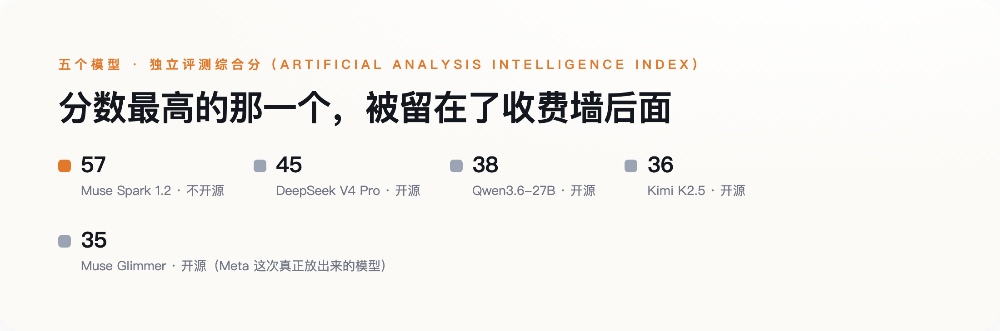

# Meta 高调宣布"重返开源"那天，真正能打的旗舰模型，却选择不开源

> **发布日期**：2026-08-11 | **分类**：科技与产业

## 导语

8月10日，扎克伯格发了一篇长文，宣布Meta"重新拥抱开源"，同时把用了三代的Llama品牌换成了一个新名字：Muse。当天一起放出的是两个模型——30B的Muse Glimmer，和更强的旗舰Muse Spark 1.2。热闹的通稿标题几乎都在讲同一件事："Meta重返开源阵营"。但独立测评机构Artificial Analysis的头对头数据说的是另一件事：真正开放权重、任何人都能下载运行的Glimmer，在综合智能指数上只拿到35分，跑不过它自己点名对标的两个中国开源模型——Qwen3.6-27B的38分和Kimi K2.5的36分；而拿到57分、明显更能打的Spark 1.2，发布当天恰恰没有开源，只能按每百万token 0.78美元的价格通过API调用。

## 一、改名之外，两个模型走了两条完全不同的路

Muse Glimmer是一个30B的稠密模型，主打本地agent场景，能在一台配单张消费级显卡的Mac或PC上跑起来，采用Apache 2.0许可证——这是本次发布里最实打实的一步：Apache 2.0没有月活门槛，不需要签署Meta自定义的许可协议，直接终结了Llama Community License时代那道"月活超过7亿必须单独找Meta谈商业授权"的限制。Muse Spark 1.2则是另一回事：官方只说"未来几周内"开源，发布当天仅通过付费API提供。

两个模型，一个开源一个不开源，一个是这次发布里的配角，一个才是真正的旗舰——这个安排本身有点反常。往常"重返开源"的叙事习惯让人默认：既然要展示诚意，那放出来的应该是能打的那个。这次刚好反过来。

## 二、官方说"表现强劲"，独立测评给出了不同的数字

Meta自己的博客对Glimmer的表述是，相比Gemma4-31B和Qwen3.6-27B"表现强劲"，在多项常用基准上有亮眼成绩。这个说法本身没有编造数据，只是选择性地摆出了对自己有利的那几项。Artificial Analysis Intelligence Index是一个独立第三方的综合评分体系，不由Meta控制，也不由任何一家参评公司控制。在这套体系里，Glimmer的综合分是35，Qwen3.6-27B是38，Kimi K2.5是36——其中Glimmer和Qwen3.6-27B的参数规模最接近（30B对27.8B），Glimmer参数更多，综合分反而更低。

Spark 1.2这边情况反过来：在xhigh（评测机构设定的最高推理强度档位）模式下综合拿到57分，明显压过DeepSeek V4 Pro的45分。但DeepSeek V4 Pro是完全开放权重的模型，Spark不是；DeepSeek V4 Pro每百万token收费0.18美元，Spark收费0.78美元，价格超过四倍。**分数低的那个开源，分数高的那个不开源还更贵**——跑分和开放程度、跑分和价格，这两组关系在Meta这次发布里恰好都是反着来的。

*图：分数越高的模型，Meta 反而没有开源；真正开源的 Glimmer，分数是五个里最低的。*

*图：分数越高的模型，Meta 反而没有开源；真正开源的 Glimmer，分数是五个里最低的。*

## 三、许可证这道题，Meta这次确实做对了

把这次发布全盘归为"公关表演"并不公平。Llama Community License当年被开源社区反复诟病的核心，就是那道月活7亿的商业授权门槛——按这个门槛，任何做大了的公司理论上都得回头找Meta单独谈判，这和开源本该有的自由使用精神相悖，Open Source Initiative此前也公开质疑过这一点。这次换成Apache 2.0，没有门槛、不需要额外协议，是实打实的让步。

许可证宽松，不等于技术追平——这是这轮通稿最容易让人上当的地方。一个模型可以在许可证条款上完全大方，同时在跑分上落后于对手，两件事互不证明。

## 四、真正的旗舰，走的是另一条路

这还不只是Spark 1.2这一款"当前旗舰"的选择。Meta内部真正对标GPT-5.4、Gemini 3.1 Pro这个级别的下一代旗舰模型代号Avocado，由前Scale AI创始人、被Meta以143亿美元的交易挖来的首席AI官Alexandr Wang负责，在新组建的部门TBD Lab里研发。据《The Information》报道的内部备忘录，Avocado已经完成预训练，跑分全面超过Meta此前做出的所有模型。但多家科技媒体的报道都指向同一个方向：Avocado大概率会以闭源形式发布，原因是"管理安全风险、保护技术细节"。也就是说，这次真正拿去打舆论战的Glimmer只是一个30B的agent模型，Meta真正押注的下一代旗舰，走的反而是闭源路线。

还有一个更具体的细节：据彭博社和多家媒体报道，Avocado的训练过程用到了阿里的Qwen模型。时间线倒转过来看挺意外——2023年，Qwen团队公开致谢过Llama训练流程给自己的启发；三年后，角色刚好换了个位置。开源大旗打得越响，越不代表这家公司真正的技术底牌押在开源上，Meta这次的选择，恰好是两件事同时成立的样本。

## 五、下次看到"Meta重返开源"，先问这两句

这次发布本身没有虚假宣传——Meta没有编造任何一个数字，Apache 2.0的许可证让步也是真实的。问题在于，"重返开源"这四个字被贴在了整个发布上，而不是被准确地贴在Glimmer这一个、跑分并不占优的模型身上。下次再看到类似标题，先问两句：开源的具体是哪一个模型，它的独立测评分数和同类竞品比是领先还是落后？公司真正押注的旗舰模型，走的是不是同一条开放路线？**"重返开源"从来不是一句可以整体打包相信的话，得先拆开看，是哪个模型在开源，哪个模型在收费墙后面。**

## 数据来源

- [Introducing Muse Glimmer（Meta 官方研究博客）](https://research.meta.ai/blog/introducing-muse-glimmer-open-agentic-model)
- [Muse Glimmer vs Qwen3.6-27B（Artificial Analysis）](https://artificialanalysis.ai/models/comparisons/muse-glimmer-vs-qwen3-6-27b)
- [Muse Spark 1.2 vs DeepSeek V4 Pro（Artificial Analysis）](https://artificialanalysis.ai/models/comparisons/muse-spark-1-2-vs-deepseek-v4-pro)
- [Zuck rekindles open-weights Llama drama with Muse Glimmer（The Register）](https://www.theregister.com/ai-and-ml/2026/08/10/zuck-rekindles-open-weights-llama-drama-with-muse-glimmer/5285666)
- [Zuckerberg manifesto pushes open-source approach to AI（ABC News / AP）](https://abcnews.com/Technology/wireStory/zuckerberg-manifesto-pushes-open-source-approach-ai-meta-135519669)
- [Role reversal: Meta adopts Qwen（Yahoo Tech）](https://tech.yahoo.com/ai/meta-ai/articles/role-reversal-meta-adopts-qwen-093000433.html)
- [Meta is reportedly working on a new AI model called 'Avocado' and it might not be open source（Engadget）](https://www.engadget.com/ai/meta-is-reportedly-working-on-a-new-ai-model-called-avocado-and-it-might-not-be-open-source-215426778.html)
- [AINews: Muse Glimmer and Spark（latent.space）](https://www.latent.space/p/ainews-muse-glimmer-and-spark-open)
