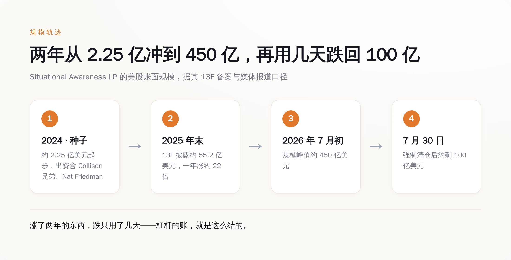
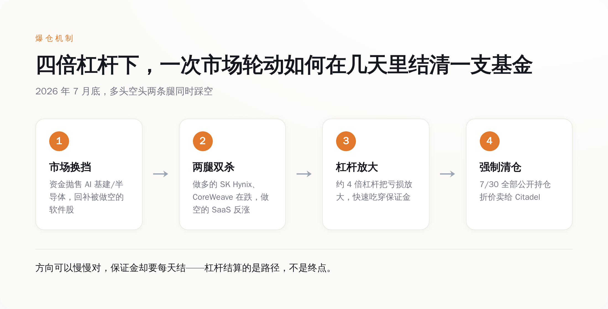
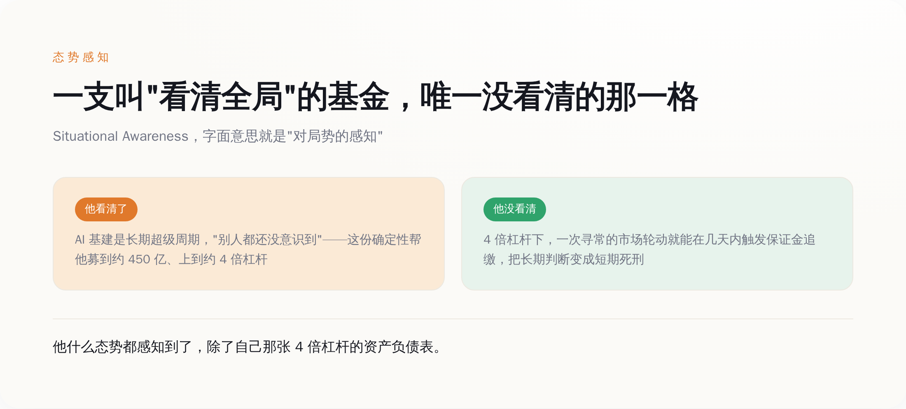

# 他给基金取名"态势感知"，用 4 倍杠杆押上 450 亿——爆仓那天才发现，唯一没被感知到的那格态势，是他自己

> **发布日期**：2026-08-11 | **分类**：AI 商业观察

## 导语

2026 年 7 月 30 日，一支管理规模一度接近 450 亿美元的基金，把手里所有公开股票，打包折价卖给了 Ken Griffin 的 Citadel。

卖家叫 Leopold Aschenbrenner，二十多岁，前 OpenAI 研究员。两年前，他写了一份 165 页的长文，开篇第一句是：**"Everyone is now talking about AI, but few have the faintest glimmer of what is about to hit them."**（所有人都在谈 AI，可几乎没人对即将砸到自己头上的东西有半点概念。）他给这份长文、也给后来的基金，起了同一个名字：Situational Awareness——态势感知，字面意思就是"比别人先看清全局"。

然后他用大约 4 倍的杠杆，把这份"我比你们都清醒"的确定性，押成了 450 亿美元的多空仓位。几天之内，450 亿变成大约 100 亿。

大部分人看到这条新闻的第一反应是"神童看走眼了"。但这事真正冷的地方恰恰相反——**他方向可能压根没赌错。他死在一个跟"对不对"无关的东西上：4 倍杠杆结算的从来不是你对不对，是你能不能扛到你对的那天。**

---

## 一、他卖的不是选股，是"我比你们都清醒"

先把这个人怎么起来的，用一手数字摆一遍。

2024 年 6 月，还是前 OpenAI 员工的 Aschenbrenner 发布了那份 165 页的《Situational Awareness: The Decade Ahead》。核心论点就三条：AGI 在 2027 年出现"惊人地可信"；算力集群会从百亿美元级冲到万亿美元级；以及最关键的那句底色——**几乎没人意识到即将发生什么，而我意识到了。**

写完没多久，他把这份判断做成了一支对冲基金，还是叫 Situational Awareness。种子资金大约 2.25 亿美元，出资名单一个比一个响：Stripe 的 Collison 兄弟、GitHub 前 CEO Nat Friedman、Daniel Gross。这些人投的不是一个二十多岁年轻人的选股履历——他压根没什么履历——投的是那份长文里的世界观：AI 是本世纪最大的一次重新定价，而这个小孩，看起来比华尔街所有人都更早看懂了它。

然后规模就开始坐火箭。据其提交的 13F 备案，到 2025 年底，他的美股账面规模已经到了约 55.2 亿美元——一年涨了大约 22 倍。到 2026 年上半年，规模冲破 200 亿，7 月初一度摸到约 450 亿美元。

*两年从 2.25 亿冲到约 450 亿，再用几天跌回约 100 亿——涨了两年的东西，跌只用了几天。*

你把这条曲线看明白，就懂了一件事：他真正的产品从来不是选股能力，是那份"我看清了别人没看清的东西"的叙事。正是这份叙事，让顶级出资人排队进场，也让他有底气把杠杆一路加上去。**清醒，是他募到钱的燃料。清醒过头，是后面那颗雷的引信。**

## 二、+439% 不是本事，4 倍杠杆才是

2026 年上半年，这支基金的费后净收益是 **+439%**。半年翻了四倍多。这个数字一出来，几乎所有财经号都在喊"当代最强对冲基金"。

先别急着跪。把 439% 这个数字拆开看，你会发现里面藏着一个被欢呼声盖住的字：杠杆。

据多家报道，这支基金的杠杆最高用到了约 **4 倍**。这是什么意思？意思是他每有 1 块钱本金，就在市场上押着约 4 块钱的仓位。所以当他看对了、标的涨了，赚的不是 1 份，是 4 份——439% 里，有很大一块不是"他判断有多准"，是"他在准确判断上又借了 3 块钱"。

这就是杠杆最容易骗人的地方。**同一个判断，1 倍杠杆下你是个投资人，4 倍杠杆下你是个赌徒——区别不在你看得准不准，在你输得起输不起。** 顺风的时候，这两者长得一模一样，都在数钱，都被夸有远见。只有风向变的那一刻，你才知道自己到底是哪一种。

他押的是什么？据 13F 披露，多头高度集中在 AI 基建和半导体：SK Hynix、CoreWeave、Nebius、美光这一类"卖铲子"的公司；空头则做空以 Adobe 为代表的软件股。逻辑非常自洽，甚至可以说漂亮：AI 的算力需求是真金白银的确定性，而传统 SaaS 会被 AI 吃掉。看多确定性，看空被颠覆者。

问题是，这套逻辑是"未来五年会怎样"的逻辑，可 4 倍杠杆结算的，是"今天收盘怎样"。**杠杆不放大你的对错，它放大你"来不及等"这件事。** 你可以在一份 165 页长文里从容地讨论 2027 年的 AGI，但你的经纪商不看你的长文，他每天收盘按市价给你算一次账——扛不住，就请立刻补钱，或者立刻走人。

## 三、他赌的从来不是"AI 会赢"，是"AI 按他的时间表赢"

7 月，风向变了。

据报道，那个月市场发生了一次轮动：资金开始抛售涨了太久的 AI 基建和半导体股，转头回补被人做空到便宜的软件股。就这么一次寻常的高低切换，精准地踩中了他两条腿——做多的那批基建股在跌，做空的那批软件股在涨。多空双杀，两条腿同时踩空。

放在没有杠杆的账户里，这也就是一次难受的回撤，扛一扛，等叙事重新兑现。但在约 4 倍杠杆下，亏损被放大，迅速吃穿保证金。经纪商不跟你讲 AGI，直接催缴。补不上，就只能清仓。7 月 30 日，他把全部公开持仓折价打包卖给了 Citadel。据报道单月回撤约 **67%**，规模从约 450 亿砸到约 100 亿。

*四倍杠杆下，一次寻常的市场轮动，几天就能结清一支基金——方向可以慢慢对，保证金却要每天结。*

注意，到这一步都没人能证明他"看错了 AI"。AI 基建是不是长期超级周期？很可能就是。SK Hynix 们两年后会不会比现在还高？完全有可能。他的长文叙事，到今天可能一个字都没被推翻。

可这重要吗？不重要了。因为**他赌的从来不是"AI 会赢"，是"AI 会按他的时间表赢"。** 方向对、时机错，在没有杠杆的世界里叫"拿得住就行"；在 4 倍杠杆的世界里，叫死刑。市场只要在他扛不住的那几天里跟他反着走一次，哪怕之后立刻掉头证明他是对的，也已经跟他没关系了——他的仓位在证明来临之前，就已经被结清了。

长期趋势判断正确，和短期仓位活得下来，是两件可以同时成立、也可以同时要命的事。他把前者写了 165 页，把后者，交给了 4 倍杠杆。

## 四、"看清全局"的基金，唯一没看清那一格

现在回到那个名字：Situational Awareness，态势感知。

这个词的反讽，浓到不用你多说。他因为在 OpenAI 内部提交备忘录、警示"公司对安全风险意识不足"（据他本人说法）而被解雇，塑造的人设是"我比一整个机构更早看到风险"。他写长文、开基金，卖的全是同一件事——对局势的超前感知。

结果呢？一支管着近 450 亿美元、名叫"态势感知"的基金，栽在了金融里最古老、最不需要什么先知能力就能看到的那个风险上：杠杆集中度，和保证金机制。**他把万亿美元级的宏大态势感知得清清楚楚，唯独没感知到自己那张 4 倍杠杆的资产负债表。**

*他看清的是别人还没意识到的长期大势，没看清的是自己脚下最基础的那格杠杆风险。*

故事还有个更黑色幽默的尾巴。爆仓才过了几天，8 月 5 日前后，Bloomberg 报道他又出手了——拿出约 4 亿美元，投进一家未公开名字、由 Sequoia 参投的私营公司。华尔街这边刚把他判成"史诗级爆仓"，硅谷那边已经排队递支票。

这个反差本身就说明了一切：在硅谷的价值体系里，他从没输过——因为他卖的确定性叙事，跟他基金的净值曲线，本来就是两回事。基金可以清零，叙事不会。这也是为什么他能几天内满血复活：给他钱的人，买的从来不是他的风控，是他那句"我比你们都先看到未来"。

所以这事对屏幕前的你，到底有什么用？

如果你也在这轮 AI 里下注——买股票也好、All in 创业也好、押上全部身家转行也好——记住这个二十多岁天才用 450 亿美元换来的一课：**方向对，不等于你能活到它兑现那天。** 一个正确的长期判断，配上你扛不住的仓位和时机，得到的不是回报，是提前出局。

杠杆结算的从来不是你对不对，是你能不能扛到你对的那天。那个逢人就说"你们都没看清"的人，最后就栽在这句话上——他什么都看清了，除了自己撑不到验证那天。

## 数据来源

- [Leopold Aschenbrenner's hedge fund is facing steep AI losses（CNBC，2026-07-30，峰值/剩余 AUM、7 月回撤、致投资者信口径）](https://www.cnbc.com/2026/07/30/leopold-aschenbrenners-hedge-fund-is-facing-steep-ai-losses.html)
- [Leopold Aschenbrenner Situational Awareness fund: $45B to fire sale（CNBC，2026-07-31，450 亿→折价清仓）](https://www.cnbc.com/2026/07/31/leopold-aschenbrenner-situational-awareness-fund-fire-sale.html)
- [Aschenbrenner hedge fund seeks capital after loss, FT says（Bloomberg，2026-07-30，向 Citadel 清仓日期）](https://www.bloomberg.com/news/articles/2026-07-30/aschenbrenner-hedge-fund-situational-awareness-seeks-capital-after-loss-ft-says)
- [Situational Awareness Returns to Investing With $400 Million Bet（Bloomberg，2026-08-05，4 亿美元投私营公司）](https://www.bloomberg.com/news/articles/2026-08-05/situational-awareness-returns-to-investing-with-400-million-bet)
- [Can the Situational Awareness Hedge Fund Raise Capital After its 439% H1 Gain?（Disruption Banking，2026-07-30，上半年 +439% 净收益）](https://www.disruptionbanking.com/2026/07/30/can-the-situational-awareness-hedge-fund-raise-capital-after-its-439-h1-gain/)
- [Citadel Buys Situational Awareness Portfolio; 4x Leverage Ends AI Fund's 1000% Run（TechTimes，2026-07-30，约 4 倍杠杆、Citadel 接盘、持仓）](https://www.techtimes.com/articles/322285/20260730/citadel-buys-situational-awareness-portfolio-4x-leverage-ends-ai-funds-1000-run.htm)
- [SITUATIONAL AWARENESS: The Decade Ahead（Aschenbrenner 本人长文原文，2024-06，开篇原句与核心论点）](https://situational-awareness.ai/)

---

> **本文由定时任务自主生成（autonomous mode）**。自主决策记录：①选题——从近一周 AI 行业信息中选取"Aschenbrenner 的 Situational Awareness 基金从约 450 亿美元规模数日内被迫清仓"事件，因其一手数据充分（13F 备案披露的规模轨迹、本人长文原句、Bloomberg/CNBC 报道的关键数字）、且具备极强内在对立面（基金名"态势感知" vs 本人栽在最基础的风险感知上），高度契合半佛仙人拆穿式风格。②角度——不复述"神童看走眼/AI 预言家爆仓"的通稿视角，改从"方向对但被 4 倍杠杆结算掉"切入：他很可能方向没赌错，死在杠杆把长期判断压缩成每日保证金结算。③风格锚定——半佛仙人（阴阳怪气/括号吐槽/拆穿式/长句铺陈后短句收束）。④数据——全部采用一手来源：本人长文开篇原句（英文逐字，经多源交叉核对）、13F 披露规模、Bloomberg/CNBC 报道数字；对存在来源冲突的数字（如 2025 全年收益率、Q1 精确 AUM）一律弃用或改用约数，未把二手评论当论据。⑤配图——3 张理解图（规模轨迹时间线/爆仓机制流程/看清 vs 没看清对照），均过删图测试。