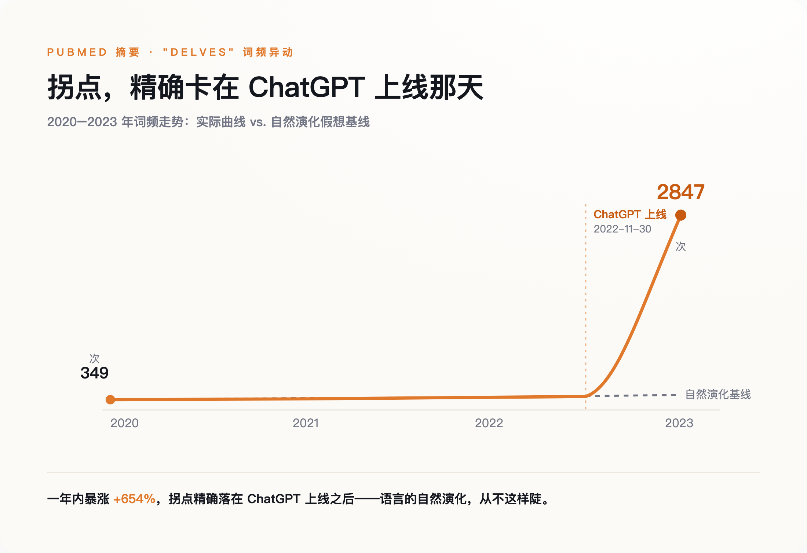
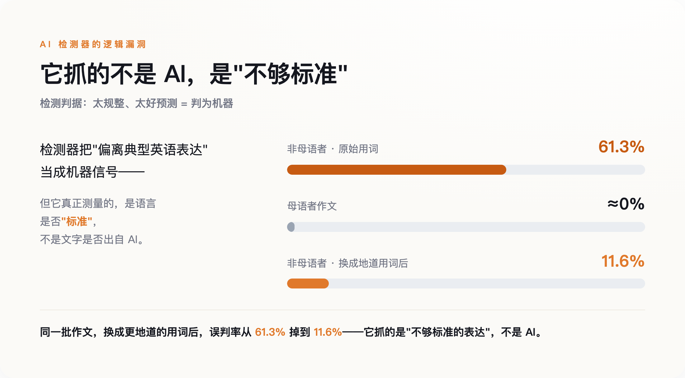

# 一个 App 上线，全世界开始用同一批词写字——我们正在失去认出一个人的能力

> **发布日期**：2026-08-12 | **分类**：AI 深度观察

## 导语

有一条曲线，可以精确到某一天开始拐弯。那天是 2022 年 11 月 30 日——ChatGPT 上线的日子。从那天起，全世界写字的人，慢慢开始用同一批词。

---

## 一、一条精确到某一天的曲线

德国图宾根大学的一个团队，扒了近些年发表在 PubMed 上的 1500 万篇医学论文摘要，只做一件事：数词频。

他们发现，有一批英文词的使用频率，在 2023 年之后不是缓慢爬升，是几乎垂直地弹起来。delve（钻研）、showcase（展现）、meticulous（一丝不苟）、underscore（强调）——这些词，医生和科学家从前不是不用，是用得没这么整齐划一。其中 "delves" 一词，2024 年的出现频率是 ChatGPT 之前基线的 28 倍。另一个更直白的数：delve 在 PubMed 摘要里的原始出现次数，2020 年 349 次，2023 年 2847 次，一年翻了七倍还多。

这项研究发在 2025 年的《科学·进展》上。他们据此估算，到 2024 年，至少 13.5% 的医学论文摘要经过了大模型的手——每七篇里就有一篇。在某些国家、某些期刊的子样本里，这个比例接近四成。

关键不在数字大小，在曲线的形状。语言当然一直在变，但语言的演化以十年、百年计，是无数人各写各的、慢慢漂移出来的。它不会精确对齐一个 App 的上线日。

标点也一样。有人分析了 OpenAlex 上一万篇生态学论文摘要，发现 em-dash——就是这种长破折号——的相对使用频率，2021 到 2025 年间翻了一倍不止，是所有标点里涨得最猛的。破折号本是个很个人的东西，有人爱用，有人一辈子不用一个。现在它开始变得均匀。

**这不是语言在演化，是一个产品在改写语言。**

*图注：delve 在 PubMed 摘要的词频，2020 年 349 次、2023 年 2847 次——拐点精确落在 ChatGPT 上线之后。自然演化不会这样。*

## 二、当机器开始判断谁是机器

问题的另一半，从一个高中生的成绩单开始。

2025 年 10 月，加州帕洛阿尔托一个姓 Kato 的高中生交了篇《萨勒姆的女巫》读后感。批改软件 Turnitin 给出判决：76% 由 AI 生成。他没用 AI。这篇作业被要求重写，重写后拿了个 D，他那门课的学期成绩，从 A- 高分段掉到了 C。

为了自证，他的家人翻出 1162 页材料——草稿、改动记录、时间戳，2026 年 5 月 5 日在加州北区联邦法院把学区告了。诉状里有个更扎的细节：在那个班上，男生被 Turnitin 判定或处罚的概率，是女生的四到五倍；此外还有至少一名亚裔学生，遭遇了一模一样的事。而 Turnitin 自己承认，它给出的百分比有正负 15 个点的误差——那个 76%，真实值可能落在 61% 到 91% 之间任何位置。一个连自己都说不准的数字，改写了一份成绩单。

这不是孤例。几个月前，纽约州一个法官刚裁定过一起类似的案子。Adelphi 大学认定大一新生 Orion Newby 用 AI 作弊，依据是 Turnitin 判他的作业"100% 由 AI 写成"。可 Newby 用另外两个检测器——Grammarly 和 ZeroGPT——一测，结论都是"人类写作"。同一篇文章，三个工具三个答案。法官 Randy Sue Marber 在 2026 年 1 月 28 日的裁决里用了很重的词：学校的认定"没有合理依据、缺乏理性"。

这些检测器为什么会错得这么离谱？斯坦福的一个团队 2023 年就给过答案。他们拿七款主流 AI 检测器，去测 91 篇非母语者写的托福作文，平均 61.3% 被判成 AI 生成；而同样的检测器去测美国学生的作文，几乎不会误判。更说明问题的是后面这步：当研究者把托福作文里的词换成更"地道"、更复杂的表达，误判率立刻从 61.3% 掉到 11.6%。

也就是说，这些检测器抓的根本不是"AI"，是"不够标准的表达"。

这里藏着一个绕不过去的悖论。AI 检测器的原理，是判断一段文字有没有"偏离正常"——太规整、太好预测，就判成机器。可当越来越多的文字本身就出自机器、或经机器润色，"正常"这个坐标系，就被 AI 自己一点点挪走了。**检测器靠"偏离正常"抓 AI；可当 AI 开始定义什么叫正常，它就再也抓不住了。**

*图注：同一批检测器，非母语者托福作文 61.3% 被误判为 AI，母语者几乎不误判；把用词换得更地道后误判率掉到 11.6%——它抓的是不够标准，不是 AI。*

## 三、趋同不是 bug，是设计

用词的收敛，和人机文字越来越难分，是同一件事的两面，而这件事是被设计出来的，不是意外。

今天的大模型，出厂前都要过一道叫"对齐"的工序：让人打分，模型照着高分的方向调。人打分的时候，偏爱清晰、得体、四平八稳的表达。于是模型学到的，是那个"最讨喜的平均值"——棱角、怪腔、个人化的毛边，都在这个过程里被磨掉了。它不是不会写得有个性，是被训练成尽量别那样写。

还有第二层。越来越多网上的新文字是 AI 生成的，而这些文字又会变成下一代模型的训练材料。研究者管这叫"模型崩溃"：反复拿生成的数据去喂模型，它会一代代丢掉分布里那些罕见的、边缘的表达，越缩越窄。人写的东西喂给机器，机器写的东西又喂给机器，绕几圈下来，尾巴就没了。

所以"AI 味"不是某个模型没调好，是整套机制在往中间挤。它让每个人都能写出 80 分的文字，代价是没人再写出那种带毛病的、一眼能认出是谁的文字。

## 四、但也许没那么可怕

把这件事讲成"AI 正在毁灭人类语言"，很爽，但不诚实。

先说一个流传很广、其实是错的归因。网上有个说法，说大模型爱用破折号和 delve，是因为给它们打分的标注员很多来自尼日利亚等非洲英语区，那里的书面英语就这习惯。听着挺合理。但有人去查了尼日利亚英语的真实语料，破折号的出现率低到几乎可以忽略，反而比全球英语的平均水平还低。这个甩锅式的解释，数据上站不住。

再说趋同本身。ACL 2025 上一篇研究新闻写作的论文发现，情况是混合的，甚至有反例——2024 年语料的某些词汇多样性指标，反而比 2018 年更高。也有研究说，AI 的写作建议对一部分本来就写得干巴巴的人，反而拓宽了词汇量。"AI 一律把人拉平"这种简单叙事，并不成立。

还有人提醒，恐慌本身也是一门生意。一位科技行业的评论者算过一笔账：关于 AI 的负面叙事，读者量大约是正面叙事的五倍。媒体天然被激励往警报的方向写；而越是渲染失控、呼吁监管的叙事，客观上越是帮了那几家已经占住位置的大公司。

这些反驳都成立。所以真正该担心的，不是"语言要完了"这种大词，是更冷、更具体的一件事。

## 五、我们真正在失去的

那条曲线告诉我们的，不是哪个词变多了，是"从一段文字认出一个具体的人"这件事，正在变难。

人类社会有一整套东西，默默建立在"每个人写得不一样"之上。署名之所以有意义，是因为文字有指纹；我们信任一篇东西，有一半是信任那个具体的、可追问的写字的人。这些都压在一个前提上：人和人是不同的，而这种不同，看得见。

难就难在，用词在被磨平的同时，我们连"这是谁写的"也快判断不清了。斯坦福那七款检测器 61.3% 的误判率说明，眼下唯一的应对——让机器替我们分辨——本身就是坏的：它抓的是"不够标准"，不是"AI"，误伤的偏偏是 Kato 和 Newby 这样的真人。差异在被一台机器抹平，辨认差异的活又交给另一台抓错对象的机器。这是一个闭合的、没有人的循环。

至于更远处那个问题——语言收窄了，思想会不会跟着收窄？如果所有人都用同一批词、同一种句式去想事情，还想得出不一样的东西吗？这个问题，目前没有任何一项研究能给出可靠的数字，谁给了都是在编。它只能作为一个开着的口子，留在这里。

能确定的只有那条曲线的起点：2022 年 11 月 30 日之后，我们开始用同一批词写字。

## 数据来源

- [Delving into ChatGPT usage in academic writing through excess vocabulary（Science Advances, Kobak et al. 2025）](https://www.science.org/doi/10.1126/sciadv.adt3813)
- [GPT detectors are biased against non-native English writers（Patterns, Liang et al. 2023）](https://www.cell.com/patterns/fulltext/S2666-3899(23)00130-7)
- [Adelphi student wins AI plagiarism lawsuit（Inside Higher Ed, 2026-02）](https://www.insidehighered.com/news/quick-takes/2026/02/11/adelphi-student-wins-ai-plagiarism-lawsuit)
- [Parent sues Palo Alto school district over AI procedures（Palo Alto Online, 2026-05）](https://www.paloaltoonline.com/palo-alto-schools/2026/05/11/parent-sues-palo-alto-school-district-over-artificial-intelligence-procedures/)
- [AI detection and the Palo Alto case（SF Standard, 2026-05）](https://sfstandard.com/2026/05/11/ai-detection-cheating-palo-alto/)
