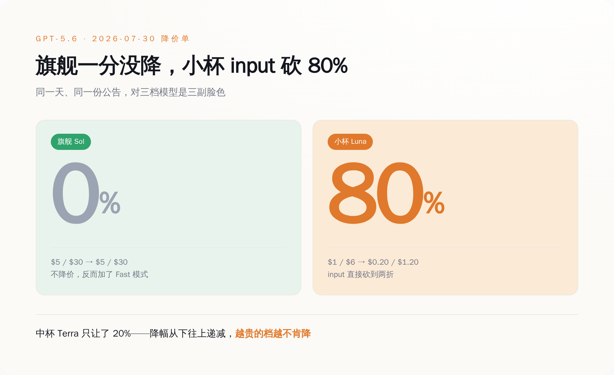
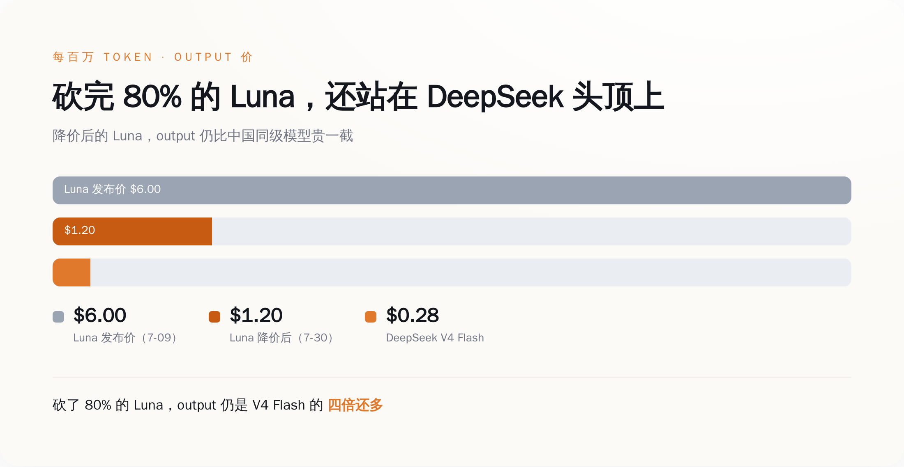
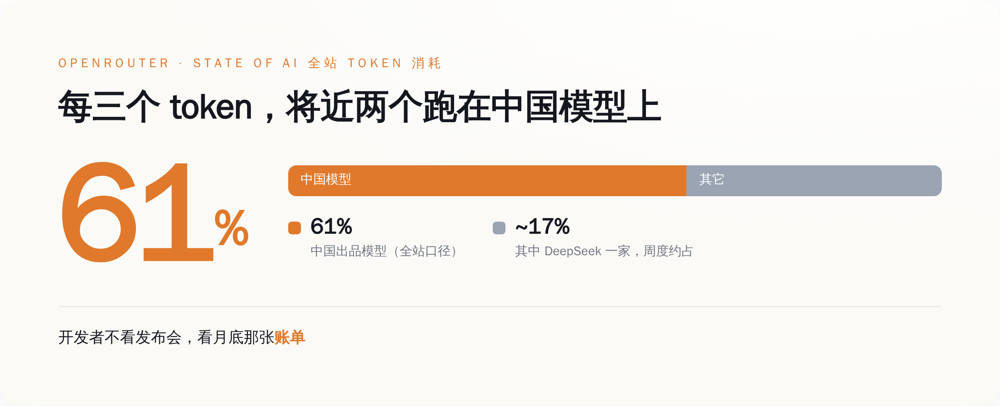

# OpenAI 给 Luna 砍价 80%，却没敢动 Sol 一分钱——这张降价单，是前沿模型定价权的一张体检报告

> **发布日期**：2026-08-12 | **分类**：AI 商业观察

## 导语

2026 年 7 月 30 日，OpenAI 发了一张降价单。

大部分人扫一眼就划走了，脑子里只留下三个字：又降价。降价嘛，好事，用的人省钱，还有什么好看的。

但这张单子真正冷的地方，不在"降"，在"降了哪一档、没降哪一档"。它把 GPT-5.6 里最便宜的 Luna 一刀砍到只剩两折，却对最贵的旗舰 Sol 一分钱都没敢动。同一天，同一份公告，一个腰斩，一个纹丝不动。

降价从来不是慈善，是体检。**你敢在哪一档打价格战，暴露的恰恰是你在那一档已经没了定价权。** 这张单子，就是"前沿模型"这门生意的第一份体检报告——而报告上，中间那一段已经开始烂了。

---

## 一、先把这张降价单，一个数字一个数字摆出来

不摆数字空谈"定价权"，那是我最烦的那种分析。先把账本摊开。

GPT-5.6 这一代，2026 年 7 月 9 日发布，一口气出了三档，按每百万 token 的 input/output 价格排（据 OpenAI 官网 gpt-5.6 发布页）：

- 旗舰 **Sol**：$5 / $30
- 中杯 **Terra**：$2.50 / $15
- 小杯 **Luna**：$1 / $6

发布才三个星期，7 月 30 日，OpenAI 官网挂出第二张公告——《advancing the price-performance frontier with GPT-5.6》，官方社区那条置顶帖标题写得明明白白：给 Terra 和 Luna 大幅降价，给 Sol 加一个 Fast 模式。价格变成了这样：

- 旗舰 **Sol**：$5 / $30 —— **一分没动**
- 中杯 **Terra**：$2 / $12 —— 降 20%
- 小杯 **Luna**：$0.20 / $1.20 —— input 直接砍 **80%**

你把这三行叠一起看，会发现一件很有意思的事：降幅是从下往上递减的。最便宜的那档砍到脚脖子，中间那档象征性让两成，最贵的那档动都不动，OpenAI 甚至反手给它加了个 Fast 模式——旗舰不打折，旗舰上新功能。

*旗舰 Sol 降价 0%、还加了 Fast 模式，小杯 Luna 的 input 却被砍 80%——降幅从下往上递减。*

一个厂商，同一代模型，同一天发的公告，为什么对自己家的三个孩子，是三副完全不同的脸色？这不是随手定的价。这是一张地图。

## 二、旗舰死守，中间腰斩——降价的结构，本身就是定价权的地图

先堵一个最容易冒出来的解释：是不是推理成本降了，所以降价？

蒸馏、MoE、推理调度这些技术这两年确实在把每 token 的成本往下压，这是真的。但成本下降解释不了这张单子最刺眼的地方——如果是成本降了，同一套底层架构的旗舰 Sol 凭什么一分不降？成本这东西不会挑客户，它降就三档一起降，不会专挑最便宜那档腰斩、独独放过最贵那档。

所以砍 Luna 不是因为省下了成本，是因为 Luna 那一档，正被人拿枪顶着后脑勺。

顶枪的是谁？看隔壁的价目表就懂了。DeepSeek 的 V4 Flash，每百万 token 报价 **$0.14 / $0.28**（据 DeepSeek 官网定价页）。你拿它跟降价后的 Luna 摆一起：Luna 降完是 $0.20 / $1.20，input 还比 V4 Flash 贵四成，output 更是贵到四倍还多——OpenAI 把 Luna 砍到脚脖子，砍完发现自己还站在人家头顶上，被明晃晃地比着。

*砍掉 80% 之后，Luna 的 output（$1.20）仍是 DeepSeek V4 Flash（$0.28）的四倍还多。*

而 Sol 那一档，暂时还没有谁能端着枪站到它对面。所以它敢不降，还敢加功能收溢价。

这就是这张降价单真正在说的话：降价的结构，就是一张定价权的地图。你在哪一档降，说明你在哪一档被人摁住了；你在哪一档死活不降，说明那里还剩最后一点护城河。降价的本质从来不是让利，是认怂——只不过认的是哪一块的怂，OpenAI 不会写在公告标题里，得你自己数着价格一行行扒出来。

Luna 这一档，认了。Sol 这一档，还在硬撑。中间的 Terra，象征性地让了两成，属于两头都想够、两头都没够着。

## 三、谁把它摁在中间那一档？OpenRouter 自己交出了答案：61%

光看价格，你只知道 OpenAI 在中间档认了怂。但认怂总得有个逼它认怂的人。这个人，OpenRouter 已经亲手把名字写出来了。

OpenRouter 是什么？一个聚合各家大模型的调用中转站，全世界的开发者在它上面按需调不同模型。它最值钱的地方在于：它手里攥着真实的调用账单——不是发布会上的 benchmark，不是 PPT 上的市占率，是每一个 token 真金白银流去了哪家。

它自己发布的年度《State of AI》数据里，有一个数字：在整个平台的 token 总消耗里，中国出品的模型占了 61%。单是 DeepSeek 一家供应商，周度就吃掉全站百分之十七上下（有周度波动，不是一个固定数）。

*OpenRouter 全站 token 消耗里，中国模型占 61%；单是 DeepSeek 一家，周度约占 17%。*

61% 是什么概念？这不是"中国模型在追赶"，这是在 OpenRouter 这个开发者用脚投票的市场里，每烧掉三个 token，就有将近两个跑在中国模型上。开发者不看发布会，不听谁家 CEO 讲 AGI 愿景，他们看月底那张账单——同样的活，哪个便宜、够用，就调哪个。

这里得说句公道话，别把口径搞混：61% 是 OpenRouter 全站的数（官方口径，偏开发者、偏性价比敏感的人群）。CNBC 另做过一个更窄的切片，说中国模型在它定义的"美国企业" token 用量里，峰值摸到过 46%——这个数是 CNBC 援引 OpenRouter 数据自己切出来的，不是 OpenRouter 官方口径，得挂着这个出处看。

但无论是全站的 61%，还是美国企业那一刀切出来的 46%，指向的是同一件事：在中间那个"够用就行"的价格带里，中国模型已经不是要不要考虑的问题，是默认选项。OpenAI 给 Luna 砍 80%，砍的就是这 61% 逼出来的血。

## 四、卖水的和收智商税的，被这张单子劈成了两半

把上面几段接起来，一幅分层的图就出来了。

AI 推理这门生意，正在被这张降价单劈成上下两半。下半截——Luna、Terra、DeepSeek V4、Gemini Flash、Claude Haiku 这些"够用就行"的档位——已经彻底是卖水生意：大家的水成分差不太多，客户只认价签，谁敢不降价就没人来打。上半截，暂时只剩 Sol 这样的旗舰还站着，还能靠"我最聪明"收一笔溢价。

这条把上下劈开的线，正在往上移。给个历史锚你感受一下速度：2023 年 3 月 GPT-4 刚出来时，input 价是每百万 token **$30**；到今天降价后的 Luna，是 **$0.20**——三年多，同样是"当时最能打的通用模型"这个位置的入门价，掉到了大约 1/150（这是我按两家官网公开定价自己算的倍数，不是官方给的统一口径）。三年前你为"前沿"付的那笔溢价，今天连零头都不到。

当然，别单向解读，这事有它复杂的一面。OpenAI 的企业收入据多家财经媒体援引的内部数字，已经占到总营收四成以上，旗舰确实还卖得动，顶端那截护城河眼下没塌。所以准确的说法不是"前沿模型不值钱了"，而是——**塌的不是顶端，是中间；不是护城河没了，是护城河被从下往上一层一层逼着往后退。**

这对每天在 API 里选模型的人，是个很实在的提醒：别再为"前沿"两个字无脑付溢价了。**你代码里那个默认调用的模型，多半早就是矿泉水，不是茅台。** 真要用到 Sol 级的活，付旗舰价不冤；可大量"总结个文档、跑个分类、写段样板文案"的活，你还在按品牌旗舰的价掏钱，那不叫为前沿买单，那叫没看账单。

## 五、下一份降价单，别再盯着"降没降"

回到那张 7 月 30 日的单子。

它最值钱的地方，从来不是"OpenAI 降价了"这个动作——降价谁都会降。值钱的是它把定价权的溃退位置，精确地标了出来：能被砍到脚脖子的地方，是已经卷成红海、没了定价权的地方；死活一分不降的地方，是最后那点还能收溢价的护城河，而它也正在被 61% 的真实调用量，一档一档往上顶。

所以以后再看到哪家发降价单，你该问的不是"降了多少"，而是——这次，轮到哪一档没敢降了？那个"没敢降"的位置，就是这家公司此刻真正的定价权边界。今天，这条边界退到了 Sol 的脚下。

定价权不会某一天"哐"地一次性崩掉。它是从最便宜那档开始，被人拿着更低的价签，一档、一档，往上逼退的。这次退到了 Sol 脚下。

下一次呢？

## 数据来源

- [OpenAI｜GPT-5.6 发布页（三档发布定价）](https://openai.com/index/gpt-5-6/)
- [OpenAI｜Advancing the price-performance frontier with GPT-5.6（7 月 30 日降价公告）](https://openai.com/index/advancing-the-price-performance-frontier-with-gpt-5-6/)
- [OpenAI 官方社区｜GPT-5.6 Terra/Luna 降价 + Sol Fast 模式公告帖](https://community.openai.com/)
- [OpenRouter｜State of AI（全站 token 消耗中中国模型占 61%）](https://openrouter.ai/)
- [DeepSeek｜API 定价页（V4 Flash / V4 Pro）](https://www.deepseek.com/)
- [CNBC｜中国模型在美国企业 token 用量占比报道](https://www.cnbc.com/)
