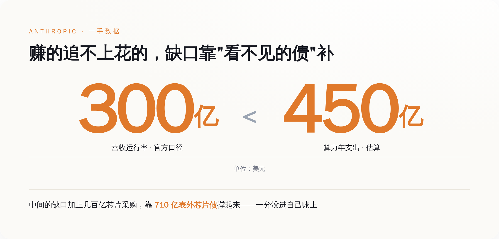
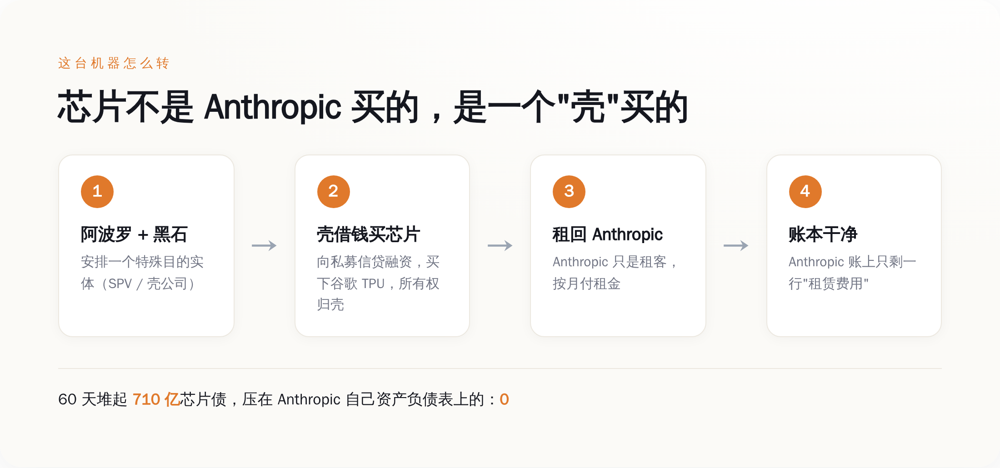
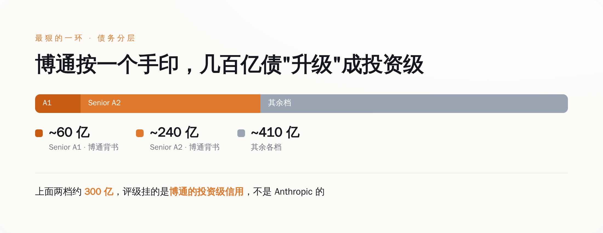

# Anthropic 60 天扛下 710 亿芯片债，账本上却干干净净——AI 竞赛最狠的一招是会计

> **发布日期**：2026-08-13 | **分类**：AI 行业 · 商业拆解

## 导语

所有人都在为两个数字鼓掌。

一个是营收：Anthropic 官方在 X 上亲口说，运行率收入已经越过 300 亿美元，而 2025 年底这个数字还是 90 亿。一个是算力：它跟谷歌、博通签下"多个吉瓦"的下一代算力，去年十月那笔单子就是一百万颗 TPU、一吉瓦以上。

大家盯着这两个数字看，然后得出结论：AI 军备竞赛太猛了，钱像水一样烧。

但真正值得盯的，是第三个数字——**710 亿美元**。这是 Anthropic 在大约 60 天里，为买芯片背下的债。

而这 710 亿的债，一分钱都没记在 Anthropic 自己的账本上。

---

## 一、先把三个数字摆在桌上，你会觉得哪里不对劲

我们先老老实实把 Anthropic 的家底摆出来，一手数据，不掺水。

营收这条线，爬得确实吓人。Anthropic 自己披露的轨迹是：2024 年 1 月运行率还只有 8700 万美元，到 2024 年底冲到 10 亿，2025 年底 90 亿，2026 年 2 月 140 亿，3 月 190 亿，到了官方最新口径，运行率已经越过 300 亿美元。CEO 本人管这叫"疯狂的 80 倍增长"。客户侧也硬：今年 2 月 G 轮融资时说有 500 多个企业客户每年在 Claude 上花超过 100 万美元，不到两个月，这个数字翻倍到了 1000 多个。

算力这条线，更吓人。2025 年 10 月 23 日，Anthropic 官方账号发推：计划扩大使用谷歌 TPU，2026 年拿下"约一百万颗 TPU、超过一吉瓦的算力"，这笔单子价值"数百亿美元"。最近这次跟谷歌、博通的续约，官方说法是"多个吉瓦的下一代算力"。一吉瓦是什么概念？差不多是一座中型核电站的满载出力，现在只是拿来喂一家公司训模型。

问题来了——不对，我不用"问题来了"这种词。

直接说：一家运行率 300 亿、但还在疯狂烧钱、净亏损的公司，凭什么能一口气签下几百亿美元的芯片采购？银行不看它的账吗？它拿什么抵押？

答案是，它根本不用自己扛这笔债。

*图注：营收爬得快，但算力支出爬得更快——中间那道缺口，才是这篇文章的主角。*

---

## 二、拆开那台机器：芯片不是 Anthropic 买的

现在我们把这台"买芯片不花自己钱"的机器，一个齿轮一个齿轮拆开。

第一步，成立一个壳。这个壳有个专业名字叫 SPV（特殊目的实体），说白了就是一个专门用来干一件事、然后跟母公司法律上撇清关系的空壳公司。安排这些壳的，是两家华尔街顶级私募——阿波罗（Apollo Global Management）和黑石信贷（Blackstone Credit）。

第二步，让壳去借钱、去买芯片。今年 6 月成交的那笔单子，规模 350 亿美元：SPV 出面，向私募信贷市场借钱，用这笔钱买下谷歌的 TPU。注意，**买家从头到尾都是这个壳，不是 Anthropic**。芯片的所有权，落在壳的名下。

第三步，把芯片租回给 Anthropic。壳买完芯片，转手租给 Anthropic 用。Anthropic 每个月付的，是租金。

就这一步之差，会计上天翻地覆。

如果 Anthropic 自己借 350 亿买芯片，它的资产负债表上会立刻多出一大坨"负债"，还有一大坨每年往下折旧的"固定资产"。投资人一看，负债率爆表，资产天天贬值，估值和信用直接受累。而现在，Anthropic 的账上只有一行字：**租赁费用**。

债在壳那边，芯片在壳那边，折旧也在壳那边。Anthropic 这边，干干净净，只是个每月按时交房租的租客。

在 60 天里，靠着这套壳，Anthropic 一共堆起了大约 710 亿美元的芯片租赁债——没有一分钱压在自己的资产负债表上。

*图注：钱和债在壳里转一圈，Anthropic 账上只留下'租金'两个字。所有权和风险，都被挡在了公司大门之外。*

---

## 三、最狠的一环：博通把自己的信用，借给了这笔债

到这里你可能还有疑问：私募机构凭什么敢借几百亿给一个空壳？壳自己没营收、没利润，就一堆芯片，万一 Anthropic 不租了、芯片砸手里，谁买单？

这就是整套结构里最精巧、也最该让人清醒的一环——博通（Broadcom）的残值背书。

私募信贷这几百亿不是一锅端的，是分层的。最优先、最安全的两档叫优先级票据：一档是大约 60 亿美元的 Senior A1，一档是大约 240 亿美元的 Senior A2，加起来约 300 亿。这两档，由博通做残值背书。

背书的意思是：万一 Anthropic 违约、芯片贬值，博通兜底那部分残值。于是这约 300 亿的优先级债，在信用评级机构眼里，**挂的不再是 Anthropic 的信用，而是博通的投资级信用**。

你品品这个设计。一家还在烧钱、连正经信用评级都未必撑得起投资级的 AI 创业公司，靠着博通这个卖芯片的供应商在债务上按了个手印，就让几百亿私募信贷变得"安全"、"可投"、评级机构可以放心打分。这一层背书，才是让 710 亿在一家现金消耗型公司身上跑得通的真正枢纽。

而博通为什么愿意按这个手印？因为这些芯片本来就是谷歌联合博通定制的 TPU——博通是这场算力盛宴的卖水人。它给自己卖出去的芯片债做背书，本质上是在给自己的订单上保险（笑）。卖芯片的、买芯片的、给债背书的，是同一桌牌友。

供应商，永远是最会算账的那个。

*图注：三档债务，最上面两档因为博通背书，评级从'Anthropic 级'一跃变成'博通投资级'——一个手印，撬动几百亿。*

---

## 四、这不是 Anthropic 发明的，但它玩到了国家级规模

表外融资（off-balance-sheet financing）这门手艺，一点都不新。航空公司几十年前就用它买飞机——不上自己的账，租着飞。零售商用它盖门店，电信公司用它铺光缆。核心逻辑永远一样：把重资产和它背后的债，塞进一个法律上独立的实体，自己只认"使用权"和"租金"，把资产负债表留得漂漂亮亮。

新鲜的不是手法，是规模和速度。60 天，710 亿美元，一家成立满打满算才几年的公司。这个体量，已经不是"财务优化"，而是把整条算力供应链的资金结构重新设计了一遍。

为什么非这么干不可？因为账面好看，直接决定生死。

Anthropic 一年的算力支出，据估算在 450 亿美元量级，而它的营收运行率才刚过 300 亿——花的比赚的还多。如果把买芯片的几百亿债和天天贬值的芯片资产，全压在自己账上，那张资产负债表会难看到没法融下一轮、更别提去敲 IPO 的钟。而现在，账上只有租金这一项经营费用，公司看上去就是"高增长、轻资产、健康烧钱"。

同一批芯片，同一笔钱，换一种记账方式，讲出来的就是两个完全不同的故事：一个是"债台高筑的重资产赌徒"，一个是"轻装上阵的增长明星"。资本市场买的，从来是后面那个故事。

这就是我说"AI 竞赛最狠的一招是会计"的意思。模型参数、benchmark 分数、发布会上的 demo，那些是给你看的。真正决定谁能一直烧下去、谁半路资金链断掉的，是谁更会把债安排到别人名下。

---

## 五、看不见的债，不等于不存在

我不是说这套结构违法，它不违法，华尔街天天这么干。我要说的是另一件事：**风险没有消失，它只是从你看得见的地方，挪到了你看不见的地方。**

想想这套机器靠什么运转。它靠一个假设——Anthropic 会一直需要这些芯片，会一直付得起租金，直到租约结束。只要这个假设成立，壳、私募、博通、谷歌，皆大欢喜。

可万一呢？万一模型迭代太快，今天买的 TPU 三年后就是电子垃圾？万一算力真的过剩，Anthropic 用不完这么多卡、想提前退租？万一增长曲线拐了个弯，300 亿的运行率没能变成盈利？

到那一天，芯片砸在壳手里贬值，优先级债要博通用真金白银去兜那份残值背书，私募信贷的窟窿要有人填。这些风险，一样都没少，只是此刻它们安安静静躺在 Anthropic 的资产负债表之外，不在任何一张财报的显眼处。你翻财报，翻不到它。

所以下次再有人拿着一家 AI 公司的营收曲线和算力数字跟你欢呼军备竞赛的时候，你可以多问一句：买这些算力的钱，记在谁的账上？债又藏在谁的名下？

一家公司账面上没有债，不代表它没借钱。有时候恰恰相反——账越干净，越说明有人花了大力气，把脏东西扫到了地毯下面。

710 亿的芯片债，一分没进 Anthropic 的账本。这不是它财务健康的证明，这是这轮 AI 泡沫里，工程做得最精致的那部分——精致到你根本看不见它。

就这。

---

## 数据来源

- [Anthropic 官方 X：运行率收入越过 300 亿美元，2025 年底为 90 亿](https://x.com/AnthropicAI/status/2041275563466502560)
- [Anthropic 官方 X：2026 年拿下约一百万颗 TPU、超过一吉瓦算力（2025-10-23）](https://x.com/AnthropicAI/status/1981460118354219180)
- [Anthropic 新闻稿：与谷歌、博通扩大合作，多个吉瓦下一代算力](https://www.anthropic.com/news/google-broadcom-partnership-compute)
- [Google Cloud 新闻室：Anthropic 扩大使用谷歌 Cloud TPU（2025-10-23）](https://www.googlecloudpresscorner.com/2025-10-23-Anthropic-to-Expand-Use-of-Google-Cloud-TPUs-and-Services)
- [Anthropic 通过 SPV 在 60 天堆起 710 亿芯片租赁债（Yahoo Finance）](https://finance.yahoo.com/technology/ai/articles/anthropic-spvs-stack-71-billion-000514097.html)
- [谷歌把 Anthropic 的芯片风险移出资产负债表（the-decoder）](https://the-decoder.com/google-moves-billions-in-anthropic-chip-risk-off-its-balance-sheet/)
- [阿波罗与黑石完成 350 亿私募信贷芯片融资（TradingKey）](https://www.tradingkey.com/analysis/stocks/us-stocks/261954424-apo-bx-avgo-tpu-anthropic-tradingkey)
- [Anthropic 称达成 300 亿美元营收运行率、80 倍增长（VentureBeat）](https://venturebeat.com/technology/anthropic-says-it-hit-a-30-billion-revenue-run-rate-after-crazy-80x-growth)
