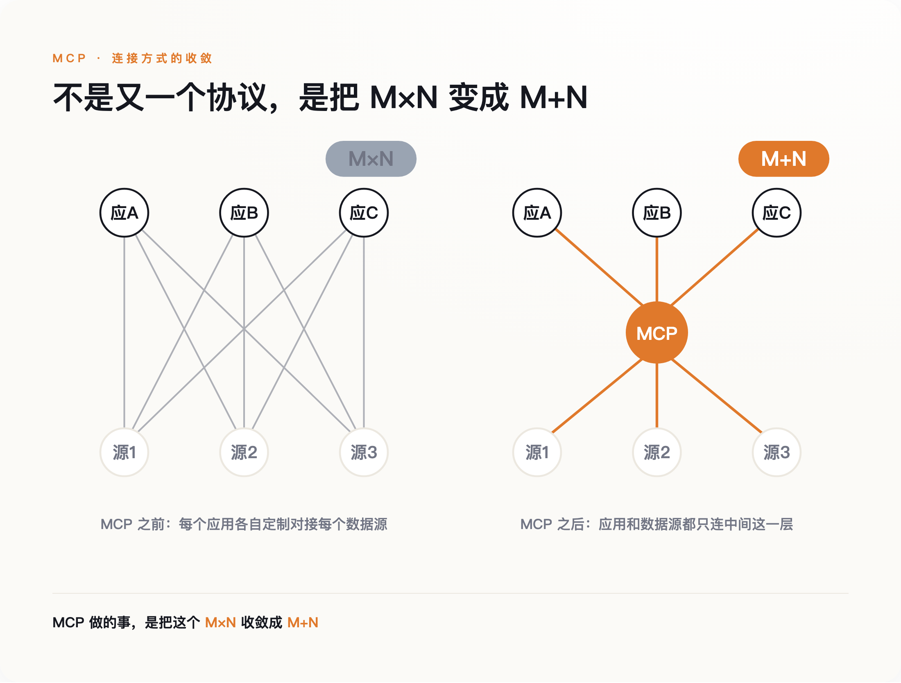
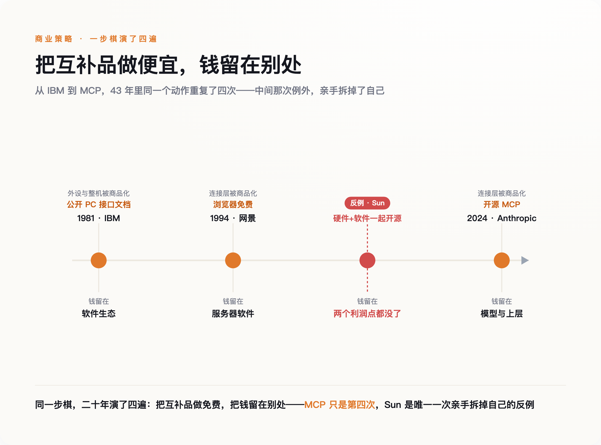
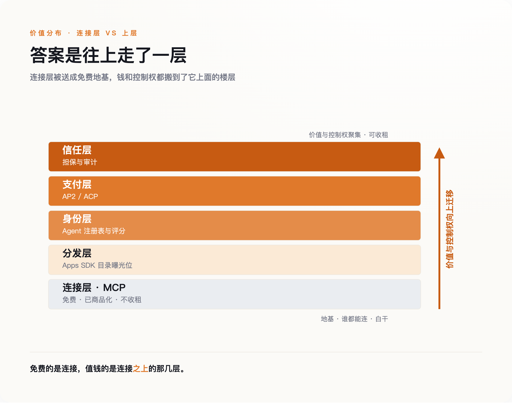

# Anthropic 把自己发明的协议白送了：这不是让利，是把战场往楼上搬了一层

> **发布日期**：2026-08-13 | **分类**：AI 战略观察

## 导语

2025 年 12 月 9 日，Anthropic 把 Model Context Protocol 的治理权交了出去，转给 Linux 基金会新设的 Agentic AI Foundation。一年前，这个协议是它自己发明的。

多数人从这个动作里读出的是胸怀：一家公司愿意让自己的标准变成公共品，不再据为己有。但一家公司主动放弃对自己标准的控制权，通常只有一个解释——值钱的东西，已经不在这一层了。

---

## 一、一个不太正常的动作

先说清楚 MCP 是什么，不然后面的账算不明白。

大模型本身不接触真实世界。它要读你的邮件、查一张数据库表、调用一个内部系统，中间都得有人写一段对接的代码。在 MCP 出现之前，这件事是按乘法增长的：M 个 AI 应用要接 N 个数据源，理论上就要写 M×N 段接口。每家公司都在重复造轮子，谁也接不动谁。

MCP 做的事，是把这个 M×N 收敛成 M+N。它定义了一套通用的接口规范，工具方按规范暴露一次，所有 AI 应用都能接上。2024 年 11 月 25 日，Anthropic 把这套规范连同开发工具一起开源，没有收一分钱授权费。

*图注：MCP 把 M×N 条定制接口收敛成 M+N 条——连接不再是重复劳动*

真正反常的不是开源，是后面跟进的速度。2025 年 3 月 26 日，OpenAI 的 Sam Altman 公开表态支持 MCP，把它接进了自家的 Agents SDK 和 ChatGPT——而在此之前，OpenAI 走的是完全相反的封闭路线，自己那套 Assistants API 是一个不对外的围墙花园。一个月后，2025 年 4 月，Google DeepMind 成为第三家接入的基础模型厂商。发布不到五个月，三家最大的对手全用上了同一个由竞争对手定义的协议。

然后是那个交治理权的动作。2025 年 12 月 9 日，Anthropic 把 MCP 捐给 Linux 基金会下的 Agentic AI Foundation，联合发起方里坐着 Block 和 OpenAI，支持方名单上还有 Google、微软、AWS。到 2026 年 4 月，这个基金会在纽约办了第一届 MCP 开发者峰会，来了差不多 1200 人。

把这几步连起来看：一个被三大对手采用、正在成为事实标准的协议，是能立起收费站的资产。正常的做法是攥紧它，慢慢收租。Anthropic 反着来，先免费送，再连方向盘都交出去。

问题就在这里：它图什么？

---

## 二、一封 2002 年的信，解释了 2024 年的动作

答案在一封二十多年前的信里。

2002 年 6 月 12 日，程序员出身的 Joel Spolsky 写了一篇后来被反复引用的文章《Strategy Letter V》。他讲了一条经济学常识：一件商品的互补品降价，这件商品的需求就会上升。汽车和汽油是互补品，油便宜了，开车的人就多。他由此推出一句给公司的忠告——聪明的公司会想尽办法，把自己产品的互补品做成不值钱的东西。

顺着这条线，Spolsky 把科技史上几桩看似大方的举动重新解释了一遍。1981 年，IBM 公开了个人电脑的接口文档，任何人都能照着做外设和兼容机。这不是慷慨，是要把外设和整机做成便宜的标准件，好让软件生态长起来。微软把 MS-DOS 非独家授权给所有硬件厂商，是同一个算盘：让做电脑的互相压价、把硬件打成商品，操作系统这一层的利润就留给了自己。1994 年，网景把浏览器免费送，图的是卖它的服务器软件。

反面教材是 Sun。它一边用 Java 的字节码去抹平底层硬件的差异，一边又把自己的软件开源，结果亲手拆掉了自己作为硬件公司仅有的两个利润点。同样是"开放"，方向做反了，就是自杀。

把 MCP 放进这条线，它的位置一目了然：连接层是大模型的互补品。模型要变得有用，就得能接上真实世界的工具和数据；接得越容易、越便宜，模型本身的需求就越大。所以把连接这件事做成免费的公共品，不是让利，是在给自己的核心产品清扫障碍。开源 MCP，本质上和 IBM 公开接口、网景免费送浏览器是同一步棋——把互补品做成白菜，让钱在别处赚。

*图注：同一步棋，二十年演了四遍——把互补品做成免费，把钱留在别处*

这里要老实交代一个常被张冠李戴的细节。很多人会把 Google 开源安卓、开源 Chromium、把利润留在搜索广告，也算进 Spolsky 这套逻辑里。这个类比成立，但它是后人的延伸，不在 Spolsky 的原文里。分清楚这一点不是较真——安卓那套"形式上开放、实质上收紧"的做法，和 Anthropic 这次真把治理权交出去，不是一回事。

---

## 三、钱搬到楼上去了

如果连接层被做成了免费公共品，一个自然的问题是：那钱去哪了？

答案是往上走了一层。连接一旦不值钱，竞争就会挪到连接之上的地方——谁来分发、谁来做身份、谁来结账、谁来担保。这几层，2025 到 2026 年正在被同一批公司抢占。

*图注：连接层被送成免费地基，钱和控制权都搬到了它上面的楼层*

先看分发。OpenAI 后来推出的 Apps SDK 是个很说明问题的样本：每一个装进 ChatGPT 的应用，底层其实就是一个 MCP server，用的是开放协议；但它上面叠了一层 OpenAI 专属的界面和目录曝光位。协议是公开的，谁都能写；能不能被几亿用户看见，由 OpenAI 说了算。开放的是连接层，攥住的是分发层——和前面说的安卓那套，是一个路数。

再看结账。Agent 要替人自主下单，就得有一套让机器付钱的规矩。2025 年 9 月，Google 联合 Coinbase 等六十多家机构推出了一个叫 AP2 的支付协议，用带签名的授权书让 Agent 在限定范围内自己交易；OpenAI 和 Stripe 合作的另一套方案已经在 Etsy 上落地；Visa、万事达也各自推出了面向 Agent 的商务套件，甚至开始给 Agent 打分、建注册表。注意这些公司在争的是什么——不是连接协议，是钱经过谁的管道、由谁来担保这个 Agent 可信。

用量数据也印证了价值的位置。Salesforce 的一个平台从 2026 年 4 月起把交互走 MCP，到 5 月底报告处理了 450 万次调用。这是少见的一手生产数字。但真正让它赚钱的，不是那 450 万次连接本身——连接是免费的——而是坐在连接之上的编排、审计和运营。

这里要补上一家最容易被漏掉的：Anthropic 自己。抢占分发、支付、信任层的是 OpenAI、Google、Visa，Anthropic 一个都没去争。它不需要争。Anthropic 是卖模型的公司，它的楼上从一开始就攥在自己手里——连接层越便宜、越通用，接上 Claude 的应用就越多，模型被调用的次数就越多。别家要往楼上爬才能占个位置，它本来就住在楼上。所以在所有玩家里，它是最有动力把楼下那层地基铲平、做成免费的那一个。

---

## 四、开放不等于失控，也不等于安全

到这里必须停下来，认一个对我不利的事实。

把治理权捐出去这个动作，有另一种读法，而且这种读法有道理：MCP 交给基金会之后，发起方里既有 Anthropic 也有它的对手 OpenAI，Anthropic 已经没法单方面靠这个协议设卡收费了。既然如此，说它"通过开放来控制"，是不是把它的算计想得太深了？

这一刀我挡不住，也不打算硬挡。更诚实的说法是这样：安卓是"形式上开放、实质上收紧"，靠的是一家公司攥着分发和认证；MCP 比安卓更彻底，它连协议的方向盘都真的交了出去。所以"往楼上搬"这件事，受益的不止 Anthropic 一家，而是所有已经卡住上层的公司。这不需要谁在下一盘精心设计的棋——互补品变便宜、价值往上迁移，是一种结构性的引力，不靠阴谋也会发生。证据就是，抢占支付层和分发层的是 Google、OpenAI、Visa 好几家在平行推进，不像是谁单独的密谋。

开放还留下一个窟窿：MCP 把身份验证设成了可选项。2025 年 7 月的一次扫描发现，公网上至少有 1862 个没有任何鉴权、任人调用的 MCP 实例。官方那个服务器注册表，也只核验你是不是仓库或域名的主人，并不审你的代码——登记在册，不等于被审核过。这不是给开放泼冷水。恰恰相反，越是开放留下的这些空档，越是上面那层"谁来担保可信"的生意的由来。**安全没做的事，变成了信任层要收的钱。**

最后一件事，来自研究这个问题的反垄断学者。海法大学的 Gal 和芝加哥大学的 Agranat 提出过一个和主流叙事相反的判断：真正的集中风险，来自 Agent 聚合了买卖双方的议价权，这跟协议开不开源几乎没关系。这句话乍看是在反驳我，其实是把我的结论往前推了一步——正因为连接层被商品化到没法据此收租，集中才必然往聚合和议价的那一层跑。2026 年 1 月，法国竞争管理局已经对 AI 代理这门生意启动了主动调查。监管盯的地方，从来不是价值离开的楼层，而是价值新去的楼层。

---

## 五、所以别再盯着谁的协议赢了

回到开头那个动作。Anthropic 交出 MCP，不是变得慷慨，是把战场往楼上挪了一层——而它自己的位置，模型层，本来就在楼上。

这件事对旁观者的用处，不在于记住 MCP 这三个字母，而在于换一个问法。过去两年，行业里吵得最凶的是"谁的协议会赢"——是 MCP 还是别的什么，会不会像当年的 HTTP 一样一统天下。这个问法本身就选错了楼层。协议这一层，赢家的奖品是被所有人免费使用，不是收租。真正该盯的问题是另一个：价值正在往哪一层迁移。这个判断也能被证伪——哪天连接层自己冒出了收费站，某个 MCP 网关或注册表开始持续抽租，而它上面几层反倒收不到钱，那就说明战场根本没往上搬。但眼下，钱都在往楼上走。

对做产品、做投资的人，这一点很具体：连接层已经被送出去了，在那儿卷接口、卷标准，是在一个注定不赚钱的楼层里内耗。钱和控制权正在往身份、分发、支付、信任这几层集中，卡住其中一层，比拥有一个漂亮的协议值钱得多。

**一个东西被免费送出来的时候，最该问的不是它多好用，而是送它的人，打算在哪儿把钱收回来。**

---

## 数据来源

- [Introducing the Model Context Protocol - Anthropic](https://www.anthropic.com/news/model-context-protocol)
- [Strategy Letter V - Joel on Software](https://www.joelonsoftware.com/2002/06/12/strategy-letter-v/)
- [Model Context Protocol - Wikipedia](https://en.wikipedia.org/wiki/Model_Context_Protocol)
- [Agent2Agent Protocol - Linux Foundation](https://www.linuxfoundation.org/press/linux-foundation-launches-the-agent2agent-protocol-project)
- [Cloud Security Alliance: MCP Security](https://cloudsecurityalliance.org/blog)
