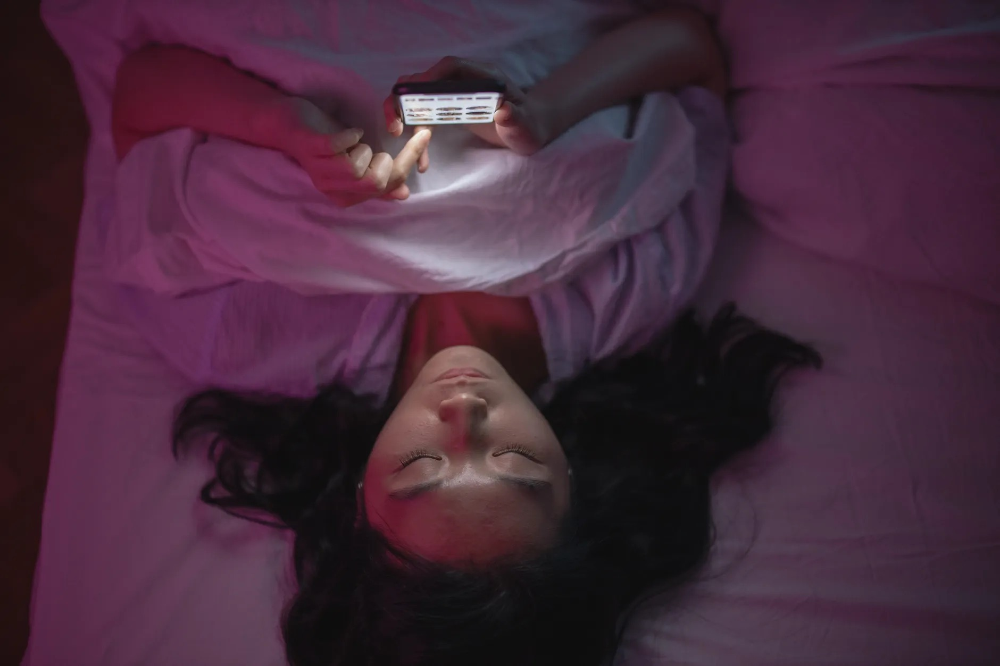

# 刷手机不欠任何人道歉

> **发布日期**：2026-08-13 | **分类**：认知深度

又是凌晨一点，你刷着手机，心里那个熟悉的声音准时上线：别人都在健身、学画画、搞副业，你在干嘛？角落里的吉他落了灰，健身卡用了四次，颜料没拆封，Kindle 在盖泡面。你把手机往被子上一扣，得出今晚的结论：我这个人，废了。

先说我的立场：你不欠任何人道歉——包括心里那个声音。这份赦免针对愧疚，不含无限续杯。

先算道德账。"有爱好的人生才完整"这套话，出身并不清白。经济学家凡勃伦（Thorstein Veblen）1899 年在《有闲阶级论》里给它起过一个难听的名字：炫耀性休闲（conspicuous leisure）——休闲从来不只是休息，它还是身份表演。一百多年过去，表演道具从猎狐和拉丁文换成了飞盘、陆冲和手冲咖啡，逻辑没换：晒出来的爱好，一半是玩，一半是简历。所以你对着别人的爱好感到羞愧时，羞愧的对象常常不是"我没有热爱"，而是"我没有可供展示的生活"。这两件事，值得分开算。

再算现实账。学者管这叫时间贫困（time poverty），翻译成生活语言：通勤一小时，到家八点半，洗漱收拾完九点半——你的"自由时间"是别人切剩下的边角料。这种时候躺着刷手机，是性价比最高的休息，这是理性，不是堕落。

还有一笔学理账。休闲研究的开山学者斯泰宾斯（Robert Stebbins）把休闲分成两大类：休闲式休闲（casual leisure），即时愉悦、无需训练，刷手机、闲聊、看剧都算；严肃休闲（serious leisure），要积累技能、有自己的"生涯"。注意他的用词：两类休闲满足不同的心理功能，就像吃饭和睡觉——这是分类，不是排名。

按理说，你现在可以安心刷手机了。可有个东西说不通：如果刷手机是合理的休息，凌晨一点那阵空洞感是哪来的？

真的是累吗？累能解释你打开手机，解释不了刷完两个小时之后，那阵空反而更重。是道德愧疚吗？也不该是，赦免状你刚刚已经拿到了。它更像一个读数：你翻遍这一天，找不到一件攒下来的东西。工作的产出归公司，刷过的视频归算法，只有那把吃灰的吉他勉强算你的——而它现在是一条罪证。

更麻烦的是，很多人正是带着这个读数去养爱好的。学画画不是因为想画，是想证明"我还没丧失投入的能力"；练吉他练的不是琴，是自我鉴定——每次拿起吉他，你都在测自己废没废。谁想天天碰一件专门给自己出坏消息的东西？第三周把吉他放回琴盒，不是意志破产，是对一场永远考不过的考试的理性回避。

心理学恰好研究过"本来喜欢的事，是怎么变得不想做的"。1973 年，斯坦福大学的莱珀（Mark Lepper）团队在幼儿园做过一个实验：先隔着单向玻璃观察，挑出真心喜欢画画的孩子，分三组——第一组事先告知"画完有奖状"，第二组画完才意外拿到奖状，第三组什么都没有。几周后看自由活动时间：事先许诺奖状的那组，画画时间比无奖励组少了约一半（8.59% 对 16.73%）；而意外拿到奖状的那组，兴趣没有掉。

毒性不在奖励，在"事先讲条件"。一场事先谈好的交易，会把"我想画"悄悄改写成"我要交差"。心理学家德西和瑞安（Deci & Ryan）的自我决定理论（self-determination theory）把这叫自主感的流失：一件事一旦被感知为换取什么的手段，内在的那点"想做"就开始蒸发。实验对象是孩子，成年人没被重新实验过——但我们和自己签的合同，结构相似得可疑：立 flag，发朋友圈，给自己设"连续 21 天"的军令状，许诺"坚持下来就奖励一顿大餐"，每一步都在事先讲条件。顺带说一句，"21 天养成习惯"本身就是讹传：它出自 1960 年马尔茨（Maxwell Maltz）的《心理控制术》，原始观察对象是整容和截肢患者适应新自我形象所需的时间，跟习惯养成没有关系。你等于在照着一本整形外科的笔记，管理你的吉他。

这样看，"三分钟热度"该改判了：羞耻开户，打卡补刀——它死于第三周，不是你的性格缺陷，是这套动机结构的正常寿命。

替刷手机辩护到底之后，还剩一件它真给不了的东西。斯泰宾斯说严肃休闲有个特征，叫持久收益（durable benefits）：技能留在手上，作品留在身后。刷手机提供的恢复是真的，但它是消费，不是积累——刷完两小时，没有一样攒得下来的东西因此多出来。爱好站得住的卖点只剩一个：不是更高级，不是更自律，是**攒得下来**。

丘吉尔算得上代言人。1915 年，他被解除海军大臣职务，政治生涯跌进谷底——一个清楚知道该做什么、却再无权做任何事的人，焦虑没有出口。把他捞出来的是画画：40 岁零基础，几支笔几张纸。他后来在《作为消遣的绘画》（Painting as a Pastime）里解释过原理：心智会像外套的手肘，被反复使用的那一处磨破；疲惫的部分"不是靠休息、而是靠使用其他部分"得到恢复——"Change is the master key."（变化是万能钥匙。）这个案例里没有装备、没有课程、没有打卡，只有一个人在最糟的时候，找到了一件能攒下来的事。

如果你愿意再试一次，试试换一种开户方式。三条规则，都有出处。

第一条：**碰没碰，可以打卡；好不好，绝不能打卡。** 入口的摩擦值得降低——琴从琴盒里拿出来架在沙发边，跑鞋放到门口；但"今天弹得好不好、进步没进步"这类问题一旦开始记账，你就又坐回了考场。

第二条：别设验收日。伦敦大学学院的拉利（Phillippa Lally）团队 2010 年追踪了 96 个人养成新习惯的全过程：达到自动化的中位数是 66 天，个体范围从 18 天到 254 天——差出十几倍，任何统一的期限对大多数人都是错的。同一个研究还发现：漏做一天，不破坏曲线。断签不是归零，它什么都不是。

第三条：奖励可以有，条件不能预设。想犒赏自己就事后犒赏，学那组"意外奖状"；别再签"坚持一周就怎样"的合同——那种合同的下场，你已经见过了。

今晚的最小动作不花一分钱：把那件蒙灰的东西从柜子里拿出来，放在明天伸手就够得到的地方。碰一下，记一笔。攒钱都是从一块钱开始的。

有两类人，这篇文章帮不上。一类是真正被生活压到没有余量的人——长期睡眠不足、体力透支，那需要的是睡觉和喘息，不是爱好，谁劝都别听。另一类是试了几样、放下了、也不觉得可惜的人——那叫探索，试衣服不买，不欠店员解释。还有一种情况要单独说：如果那种空不只出现在凌晨，而是持续几周、对什么都提不起劲，那超出了爱好能修的范围——去找专业帮助，这不是开户能解决的事，也不丢人。

这篇文章只写给剩下的那种人：夜里刷着手机、心里发空、又为那点空自责的人。自律从来不是你缺的东西——你只是把一件本该往里攒的事，办成了一场接一场的自我验收。把考核撤了，"我想做"才有机会出场。吉他还在沙发边等你，它只是替你攒着你碰过它的每一下。

---

数据来源：

- Lepper, Greene & Nisbett (1973). "Undermining children's intrinsic interest with extrinsic reward." Journal of Personality and Social Psychology, 28(1), 129-137（8.59% vs 16.73%，Stanford 原始 PDF 核验；儿童实验，正文以"结构相似"方式外推并明示未在成人重做）
- Lally et al. (2010). "How are habits formed." European Journal of Social Psychology, 40(6), 998-1009（中位 66 天、范围 18-254、漏一天不破坏曲线，多源核验；UCL 归属经独立核实）
- "21 天"讹传源头：Maxwell Maltz, Psycho-Cybernetics (1960)，整容/截肢患者自我形象适应观察（UCL 考证）
- Churchill, Painting as a Pastime（"Change is the master key."等引文经 Project Gutenberg Canada 原文逐字核验；1915 年去职背景有独立二手源佐证，文中不含未核验直引；开始作画时 40 岁，经 Churchill Society 等多方史料核实）
- Stebbins 严肃休闲理论：seriousleisure.net 官方概念页（三分法与"持久收益"特征核验通过）
- Ryan & Deci (2000)，自我决定理论（机制方向引用）
- Veblen,《有闲阶级论》(1899)：炫耀性休闲（公共知识级引用，本文仅定性）
- 时间贫困（time poverty）：仅定性引用，一手文献未核

