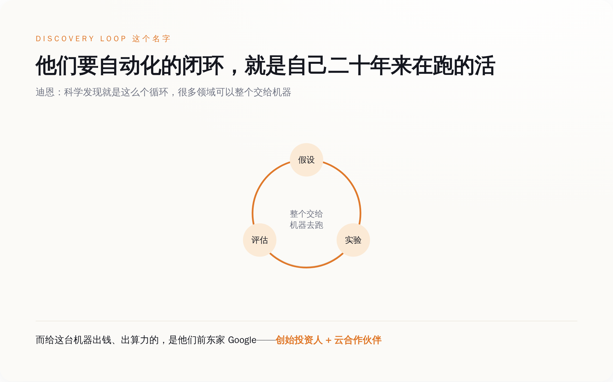
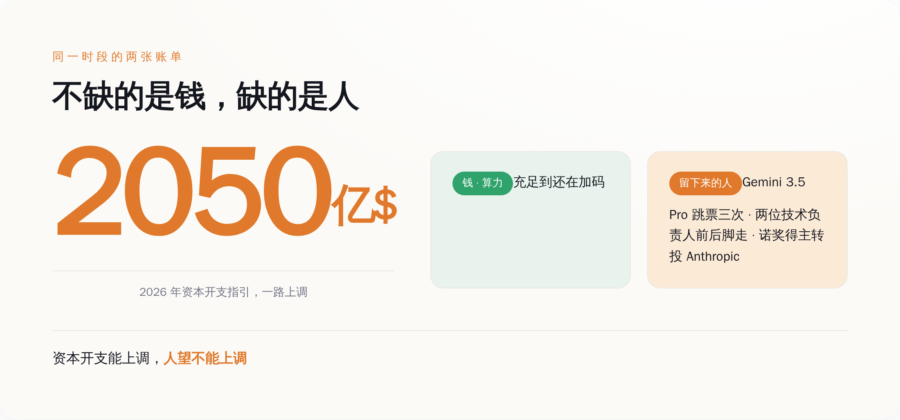

# 造了半个 Google 的四个人，辞职去造一台"以后不需要他们"的机器

> **发布日期**：2026-08-14 | **分类**：AI 与商业

## 导语

2026 年 8 月 5 日，桑达尔·皮查伊发了一封内部备忘录，里面用了"塑造 AGI 的未来""对 Alphabet 和人类都至关重要""我想不出比戴密斯更合适的人"这种话。措辞很体面。同一天，市场把 Alphabet 的股价盘中砸下去超过 5%。

备忘录夸的那个人，戴密斯·哈萨比斯，当天卸掉了 Google DeepMind 的 CEO。而备忘录没细说的另一件事是：Google 的首席科学家杰夫·迪恩，干满 27 年，带着另外三个人一起走了——去开一家公司，这家公司写在明面上的目标，是让他们四个人这辈子干的活，以后不再需要人来干。

更离谱的是，出钱资助这家公司的，是 Google 自己。

---

## 一句体面话，翻译过来就是"他不管现在了"

先说哈萨比斯这一头，因为它最容易被那封备忘录糊弄过去。

官方说法是，哈萨比斯"转任" Google DeepMind 主席、Alphabet 首席科学家，好让他"专注于长期战略和加速科学突破"。他自己在 X 上也是这个调子：我这辈子都在追求 AGI，如今到了关键时刻，我要以主席和首席科学家的新身份，专注长期的事。

一家公司什么时候会用"专注长期战略"来形容一个还在巅峰、还没到退休年龄的负责人？通常是他不再管当下那摊具体的活了的时候。哈萨比斯自己那句话说得其实很白——他要"交出日常运营职责"，好腾出时间和空间去看大图景。接手日常的是原来的技术负责人科拉伊·卡武克曲奥卢，升任 DeepMind 高级副总裁，管 Gemini（包括下一代 Gemini 4）的路线图，直接向皮查伊汇报。

翻过来就是：定方向的那个人被请去看星辰大海，真正要在明年之前把模型憋出来的担子，压到了另一个人肩上。市场当天用 5% 的跌幅给这套辞令投了票——皮查伊那句"想不出更合适的人"和交易屏幕上的红色，两句话你只能信一句。

而在同一天的公告里，跟哈萨比斯"退居二线"并列的，是四个直接走人的名字。这四个名字，才是这件事真正扎眼的地方。

## 走的这四个人，是"AI 工程"这门手艺本身

自媒体标题写"Google 首席科学家离职"，好像走的是一个高管。不是。走的是一个学科。

杰夫·迪恩和桑贾伊·格玛沃特，1999 年前后一起进的 Google。这两个人搭档造出来的东西，是 MapReduce、Bigtable、Spanner——今天你能想到的任何一家大公司，后台那套"怎么让上万台机器像一台机器一样干活"的分布式系统，本质上都是在抄他俩二十年前的作业。迪恩后来在 2011 年和吴恩达、格雷格·科拉多、还有第四个人一起，办了 Google Brain，也就是后来 DeepMind 的半壁江山。

那第四个人，叫黎国祺（Quoc Le）。他后来干的最出名的一件事，叫神经架构搜索（NAS），通俗说就是"让 AI 自己去设计 AI 的结构，不用人调"——AutoML 这个词背后站着的就是他。

第三位是奥里奥尔·维尼亚尔斯，DeepMind 研究副总裁，Gemini 的联合技术负责人之一。他 2014 年跟伊利亚·苏茨克维、黎国祺一起写的那篇 seq2seq 论文，是今天所有大模型"编码器—解码器"范式的祖宗；他还带队做了 AlphaStar，那个在《星际争霸 2》里打到宗师段位、上了 Nature 封面的东西。

*图注：走的不是四个高管，是分布式系统、深度学习框架、seq2seq、AutoML 这几门手艺的第一作者——现代 AI 工程的地基，署的就是这几个名字*

把这四个人的简历叠一块看，你会发现一件事：过去二十年里，"怎么当一个顶级的机器学习研究员和工程师"这件事，他们四个就是标准答案本身。

**所以真正的问题不是"谁走了"，而是他们四个人凑一块，跑去干了件什么活。**

## 他们辞职去干的活，字面意思是"以后不需要他们这种人"

这家新公司叫 Discovery Loop，注册成特拉华州的公益公司（public benefit corporation）。名字里的 Loop（闭环）不是随便起的。

迪恩在 X 上把话说得很直白：我们的做法，是把"做实验"这个闭环自动化掉。提出一个假设、跑一个实验、评估结果——科学发现说到底就是这么一个循环，而这个循环，很多领域里可以整个交给机器去跑。公司起步先啃机器学习研究和工程本身，往后再扩到硬件设计、药物发现、清洁能源这些地方。

你把这两段话拼一起读：一个由 AutoML 发明人、seq2seq 作者、Google Brain 创始人组成的团队，成立一家公司，目标是自动化机器学习研究与工程。这四个人本身，就是"机器学习研究与工程"这门手艺现存最贵的人肉样本。他们辞职，是为了造一台能替代"他们这种人"的机器。

*图注：Discovery Loop 要自动化的那个"假设—实验—评估"闭环，正是这四个人二十年来亲手在跑的活；而给这台机器出钱、出算力的，是他们前东家 Google*

这里就到了整件事最阴间的一层。Discovery Loop 的种子轮，由 Radical Ventures 和 Khosla Ventures 联合领投。参投名单里有一个熟悉的名字：Alphabet。Google 不光投了钱，还兼任这家公司的云服务合作伙伴——算力也它出。

捋一遍就是：四个 Google 的核心建造者跑出去开公司，要自动化掉"AI 研究员"这个岗位；而 Google 一边送走他们，一边掏钱当股东、供算力当房东，资助他们把这件事做成。**一家公司花钱出力，帮别人来革自己最核心工种的命，这操作你在商学院案例库里翻不到第二个。**

当然，Google 这么做有它自己的算盘——押注前员工、绑定未来的科研 AI、顺便留个战略窗口，都说得通。只是从"人"的角度看，这笔投资的潜台词格外刺耳：连 Google 自己都愿意下注，赌这四个人在外面造的那台机器，比他们留在公司里继续当研究员更值钱。

## Google 不缺钱，缺的是有人愿意留下来把它造出来

有人会说，大厂高管出走创业，这是硅谷天天发生的事，至于上升到"学科撤稿"吗？

单看辞职本身，确实不至于。至于的地方在于时间点，以及走的是哪个岗位的人。

就在这场人事地震前的三个月，Google 的旗舰模型 Gemini 3.5 Pro 一直在难产。皮查伊 5 月 19 日在 I/O 大会舞台上预告了它，6 月的发布窗口没赶上，Google 中途更新了训练数据想把编程能力提上去，效果不理想，到 7 月已经被报道第三次跳票。旗舰模型憋不出来的这几个月，恰好也是人往外跑得最凶的几个月。

跑的还都是最不该跑的人。Gemini 有两位联合技术负责人，一个是诺姆·沙泽尔，6 月离职去了 OpenAI；另一个就是维尼亚尔斯，8 月离职去创业。几周之内，一个模型的两位技术负责人前后脚清空。诺贝尔奖得主约翰·江珀，去了 Anthropic。更早的 5 月，DeepMind 英国的员工以 98% 的赞成票投票成立了工会，导火索是对五角大楼军事 AI 合同的抗议。士气这东西没法量化，但《财富》那篇 8 月 10 日的调查里，一个工程师的话已经够说明问题了——据报道，他说他"从没在 Gemini 那片办公区见戴密斯走动过"。

*图注：同一时段，Google 把 2026 年资本开支指引一路上调到约 2050 亿美元——钱和算力从不是瓶颈，瓶颈是愿意留下来把模型憋出来的人*

要说清楚一点：当天股价跌 5%，不能全赖在人事上。Google 同期把 2026 年的资本开支指引一路上调到约 2050 亿美元，市场对"AI 到底要烧多少钱"本来就紧张，人事地震只是又添了一把火。两个因素叠在一起，不能简单归因。

但恰恰是资本开支这条线，把话说穿了。Google 从不缺钱，也不缺卡，资本开支能一路往上加。它缺的是另一样东西——愿意在旗舰模型难产的第三个月，还留下来把它憋出来的人。而这四个最会造的人给出的答案是：与其留在这儿当那个被 crunch 到每周六十小时的研究员，不如出去造一台以后不用人 crunch 的机器。

那封夸了半天"塑造 AGI 未来"的备忘录，是 Google 那一周发出去最不诚实的一份文件。真正诚实的那份，是同一天生效的新组织架构图——它清清楚楚地写着，教了机器二十年怎么做研究的四个人，最后得出的结论是，把这活儿干完的最快办法，是自己别在这儿干了。而他们的前老板，还给他们写了张支票。

## 数据来源

- [CNBC：Google chief scientist Jeff Dean leaving after 27 years](https://www.cnbc.com/2026/08/05/google-chief-scientist-jeff-dean-leaving-company-after-27-years.html)
- [Jeff Dean 在 X 宣布创办 Discovery Loop](https://x.com/JeffDean/status/2085034604172603724)
- [Jeff Dean：automate the experimental loop（方法论跟帖）](https://x.com/JeffDean/status/2085035498222002595)
- [Demis Hassabis 在 X 说明新角色](https://x.com/demishassabis/status/2085034334914769203)
- [Radical Ventures：Our Investment in Discovery Loop](https://radical.vc/our-investment-in-discovery-loop/)
- [GeekWire：说服一位 UW 计算机传奇离开 Google 的创业点子](https://www.geekwire.com/2026/the-startup-idea-that-convinced-a-uw-computer-science-legend-to-leave-google-after-27-years/)
- [Fortune：How stalled models, missed deadlines, and staff burnout led to the unraveling of Google's DeepMind](https://fortune.com/2026/08/10/how-stalled-models-missed-deadlines-and-staff-burnout-lead-to-the-unraveling-of-googles-deepmind/)
- [Axios：Google's DeepMind and the AI model race](https://www.axios.com/2026/07/23/googles-deep-mind-ai-model-race)
- [9to5Google：Gemini 3.5 Pro delays](https://9to5google.com/2026/07/16/gemini-3-5-pro-delays/)
- [Investing.com：Alphabet shares fall 5% as Jeff Dean exits](https://www.investing.com/news/stock-market-news/alphabet-shares-fall-5-as-ai-pioneer-jeff-dean-exits-in-major-shakeup-4838743)
- [Fortune：DeepMind UK 员工 98% 投票成立工会](https://fortune.com/2026/05/05/google-deepmind-unionize-vote-military-ai-contracts-internal-backlash-pentagon-deal-israeli-defense-forces/)
