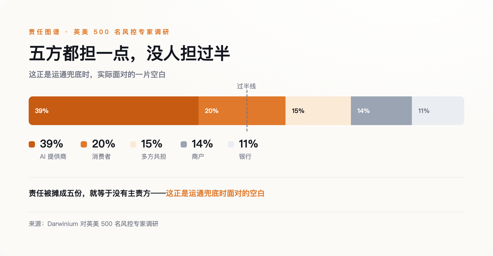
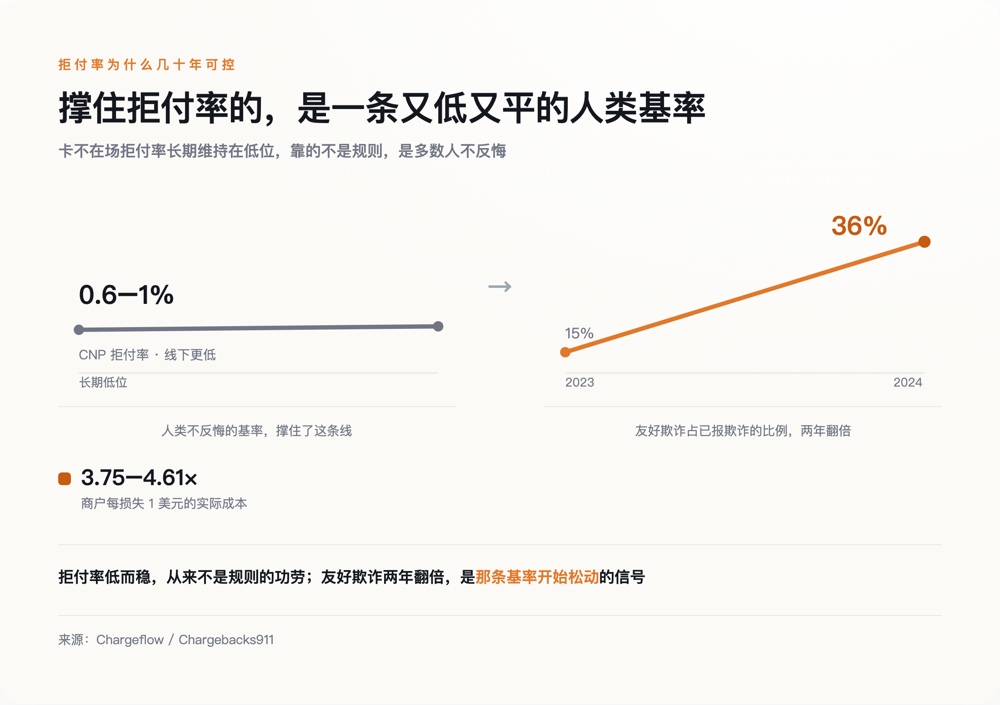
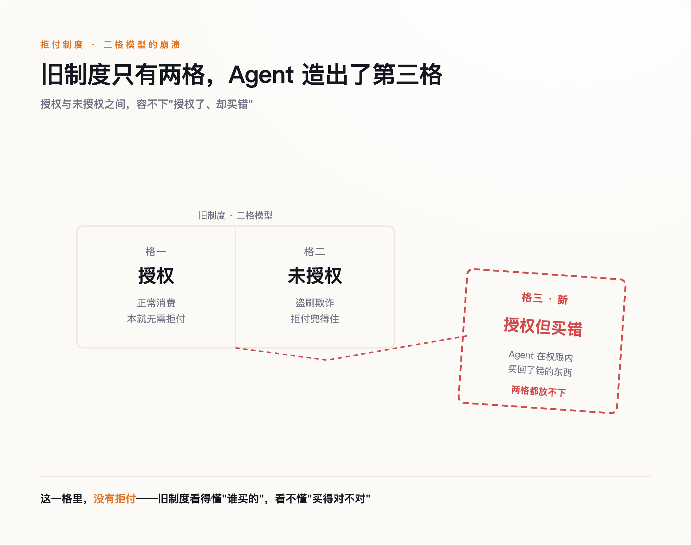

# 退款是为"会后悔的人"设计的，而 AI 不会后悔

> **发布日期**：2026-08-14 | **分类**：AI 与商业

## 导语

2026 年 4 月，当所有人都在庆祝 AI 终于学会自己结账时，美国运通做了一件不合群的事：它单独宣布，如果你的 AI 助手买错了东西，这笔钱它来赔。听上去像一句普通的售后承诺。但如果你在支付行业待过，你会立刻竖起耳朵——这句话的潜台词是，运通不敢相信另一件所有同行都在默认的事。

---

那件被默认的事，是账单背后那个人还在。

半个世纪以来，一张信用卡账单的另一头，一直站着一个具体的人。他会心疼，会后悔，会为一笔货不对板的订单打半小时电话。整套退款和拒付制度，就是为这个会后悔的人写的。运通那句承诺之所以扎眼，是因为它默认了一件别人不愿说破的事：那个替你按下"购买"的东西，可能不再是这样一个人。

## 一句不合群的承诺

先看这一年发生了什么。2025 年 9 月 29 日，OpenAI 和 Stripe 用 Apache 2.0 协议开源了一套叫 ACP 的东西，同一天 ChatGPT 的即时结账上线，第一个接入的是手工艺电商 Etsy。一个月后，PayPal 作为支付方加入。年底，Stripe 推出整套面向 Agent 的商务组件。到 2026 年 6 月，Visa 宣布与 OpenAI 战略合作，万事达发布面向机器的 Agent Pay。

这些协议解决的是同一个技术问题：用密码学签名证明"这是一个合法的 Agent，在你授权的范围内花钱"。Google 联合 Coinbase 做的 AP2 走得更细，把授权拆成两段——你先签一张"意图授权"，Agent 挑好商品后再签一张"购物车授权"，留下一条谁也赖不掉的记录。万事达则把卡凭证代币化，绑死到某个特定 Agent、特定商户、特定同意策略上。

所有这些机制，回答的都是"谁授权了"。没有一个回答另一个更难的问题：授权了，但它买错了、买多了、买了你根本不想要的东西，算谁的？

在英美 500 名风控专家里，Darwinium 问过这个问题，答案是一地碎片：39% 说该 AI 提供商担责，20% 甩给消费者，14% 推给商户，11% 认为是银行的事，还有 15% 干脆说大家一起扛。一件事如果有五个负责人，通常意味着它没有负责人。运通选择站到消费者这一边，是这张碎片图里唯一一个明确的落点，也因此显得孤单。

*责任被摊成五份，就等于没有主责方——这正是运通兜底时面对的空白*

## 退款背后，站着一个会后悔的人

要看懂运通在怕什么，得先看清拒付这套东西到底是靠什么撑住的。

它的法律源头是美国 1974 年的《公平信用账单法》，到今天五十二年。这部法律有一个从没被写进条文、却支撑着一切的前提：一笔争议交易由人发起，而这个人事后可以说"我没授权"或"东西不对"。拒付权，说到底是法律替"人会反悔"这件事上的一份保险。

保险能维持，不是因为规则有多严，而是因为反悔的人始终是少数。在线交易里，卡不在场的拒付率大约在 0.6% 到 1% 之间，线下刷卡还要更低。这个数字之所以长期都压在低位，靠的是一个朴素的事实：绝大多数人拿到东西就算了，只有极少数真觉得亏了才会费劲去争。风控、定价、准备金，全建在这条低而稳的曲线上。

*拒付率几十年可控，靠的是多数人不反悔这条人类基率；友好欺诈两年翻倍，是它开始松动的信号*

一旦发起争议的不再是"觉得亏了的人"，曲线就开始松动。行业里管消费者钻空子恶意拒付叫"友好欺诈"——明明收到了货，却谎称没收到来骗回钱。2024 年，这类"第一方欺诈"占到全部已报告欺诈的 36%，一年前这个数字还是 15%，翻了一倍多。到了商户那头，账更难看：每被拒付掉 1 美元，算上手续费、丢掉的货、行政成本和高拒付率的处罚，实际损失是 3.75 到 4.61 美元，比 2021 年涨了 37%。

拒付从来不是一条冰冷的规则，而是一个关于"人在什么时候会反悔"的概率赌注。**它赌大多数人不会反悔，而这个赌注赢了五十年，只因为下注的对象一直是人。**

## 协议只回答了"谁授权"

现在把买家换成 Agent，这个赌注的对象就变了。

旧制度只认两种状态：授权，或未授权。你刷了卡是授权，卡被盗刷是未授权，拒付机制在这两格之间干净利落地判活判死。Agent 制造了第三种状态：你授权了它去买，它也确实在权限内买了，但买回来的不是你想要的。这一格，旧制度里没有格子可放。

*旧制度只有授权与未授权两格，Agent 造出第三格——授权了却买错，而这一格里没有拒付*

有人会说，软件替人花钱不是新鲜事，脚本刷单、盗刷欺诈这些东西存在二十年了，Agent 有什么不一样？不一样的地方，恰恰藏在"授权"两个字里。盗刷是未授权的，所以它是欺诈，拒付兜得住，损失有人认。Agent 是你亲手授权的，于是它天然被划进"授权交易"那一格——你几乎丧失了拒付的理由，可它又不是你本人，那份"我会不会反悔"的人类概率，在它身上根本不成立。被人类授权、却不是人类本身，这个组合是全新的。审计链能记得清清楚楚是谁签的字，但它记录的恰恰是"你自己点了头"——查得到授权，不等于追得回损失，反而堵死了你回头喊冤的那条路。

而各家协议对这个组合的默认处理，是把它绕开。ACP 把自己定位成一个只在各方之间传数据的管道，不去分配谁对谁错；OpenAI 不是记录商户，结算、退款、拒付的责任仍旧留在商户和它的支付服务商身上。万事达的立场几乎相反：只要令牌有效、授权时策略被遵守，责任照旧按现有代币化规则由发卡行承担——可这只覆盖"令牌有效"的情形，没回答 Agent 误判了你意图的那片灰区。运通是唯一一个走进灰区、明确说"这块我兜"的。

## 拼多多的"仅退款"，是一次人类尺度的预演

想知道"发起争议的一方无法被有效追责"会怎样，不用等 Agent，中国的商家已经替所有人预演过一遍。

那场预演的名字叫"仅退款"。平台把争议的裁决权几乎无条件地倒向买家：一件商品，声称有问题就能退钱、还不用退货。它本意是保护消费者，结果催生出一整条"薅羊毛"产业链——社群里公开叫卖攻略，有人专门组织下单再仅退款，从每一单赔付里抽走三到五成。2024 年，网经社对两千多家商户的调研里，89.05% 的人强烈反对这套机制；有 7.9% 的商户说，过去一年里，他们八成的订单都遭遇过仅退款。

当反悔不再有代价，那条低而稳的曲线，就会被一群不心疼的人踩塌。

得说清楚边界，仅退款和 Agent 不是一回事。仅退款是人在利用规则的漏洞，而 Agent 的新特性是不会心疼、可以无限复制。一个薅羊毛的人一天能薅几单，受限于他有几个账号、几双手、几分精力；一段被优化过、甚至被恶意注入过的 Agent 代码，复制一万份的成本和复制一份几乎没差别。仅退款是人类尺度的地基松动，Agent 是把这个尺度乘上了一个没有上限的系数。

## 不会后悔的买家，和一个正被私下重写的地基

把镜头拉回运通那句承诺，它孤单的原因现在清楚了：它是唯一一个承认地基已经在动的人。

这个判断有它最硬的反方，值得原样端出来。PayPal 负责中小企业的高管 Michelle Gill 认为，危险的从来不是 Agent，而是"现有的基础设施本就是为人类的错误搭建的"——问题在基础设施陈旧，不在 AI 天生不可信。她说对了一半：旧地基本来就是打在"人会反悔"这条概率上的一块补丁，不是什么坚实的基石。但这块补丁能用五十年，恰恰因为下注的对象一直是人；Agent 动的不是这块补丁，是补丁底下那条它赖以成立的概率本身。

但另外两位从业者的话，指向了同一处裂缝。网络安全公司 Flare 的 CEO Norman Menz 说得直接：没有 Agent，在线欺诈本就已经是个大问题，Agent 只会指数级放大攻击面——坏人可以劫持一个合法的 Agent，也可以伪造一个。Akoya 负责政策的 Courtney Robinson 说：责任归属完全悬空，正在一家家公司之间被单独谈判，没有任何标准。

把这三句话放在一起，地基是不是在动，取决于你站在哪家公司；而补地基的方式，不是一条写给所有人看的公共规则，而是一份份关起门来签的私下协议。Visa 的风险数据说，过去半年暗网提到"AI Agent"的次数涨了 450%，恶意机器人交易量涨了四分之一——踩踏还没大规模到来，但踩踏的人已经在门口集合。

所以，在你把钱包交给一个 AI 买手之前，真正该问的不是"它买东西准不准"。上海市消保委 2026 年的一份调查里，八成多人已经试过让 AI 帮忙购物，只有 16.06% 觉得它能准确买对东西——所有人都盯着"准不准"这件事。该问的是另一件没人写在说明书上的事：这笔账单出问题的那天，谁还会为它心疼，谁能替你去争，谁认这个错。

**退款和拒付，从来都是为会后悔的人准备的。**当那个会后悔的人退场，制度不会立刻垮，它只是先失去了那个它赖以运转、却从没写下来的假设。而一个从没被写下来的假设，就算已经失去，你也很难向人证明，它曾经在那里。

## 数据来源

- [Stripe Newsroom：OpenAI 与 Stripe 开源 ACP 与 Instant Checkout（2025-09）](https://stripe.com/newsroom)
- [Google Cloud Blog：Agent Payments Protocol (AP2)](https://cloud.google.com/blog)
- [Fortune / PYMNTS：American Express Agent Purchase Protection（2026-04）](https://fortune.com)
- [Fortune Brainstorm Tech 座谈（2026-06-12）：Michelle Gill / Norman Menz / Courtney Robinson 原话](https://fortune.com)
- [Chargeflow / Chargebacks911：CNP 拒付率、友好欺诈占比与拒付连带成本（2024–2026）](https://chargeflow.io)
- [Darwinium：Agent 交易责任归属专家调研](https://www.darwinium.com)
- [网经社 / 新京报：拼多多"仅退款"商户调研（2024）](https://www.100ec.cn)
- [上海市消保委：2026 年 AI 购物体验消费者调查（八成试用 / 16.06% 认为匹配准确）](https://www.tmtpost.com)
