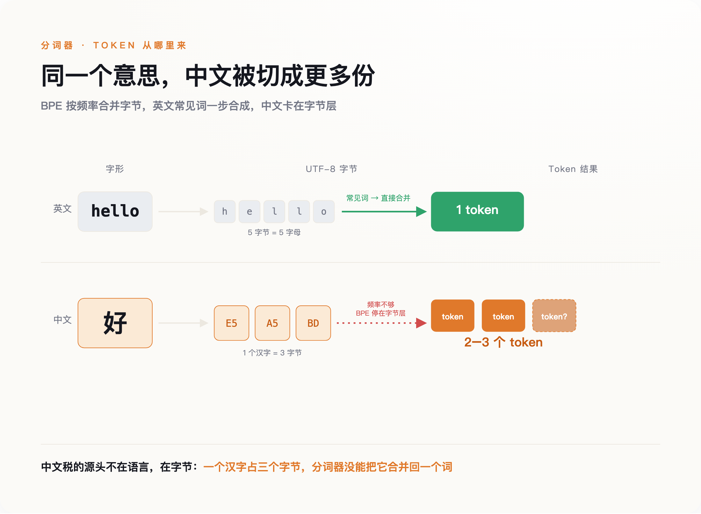
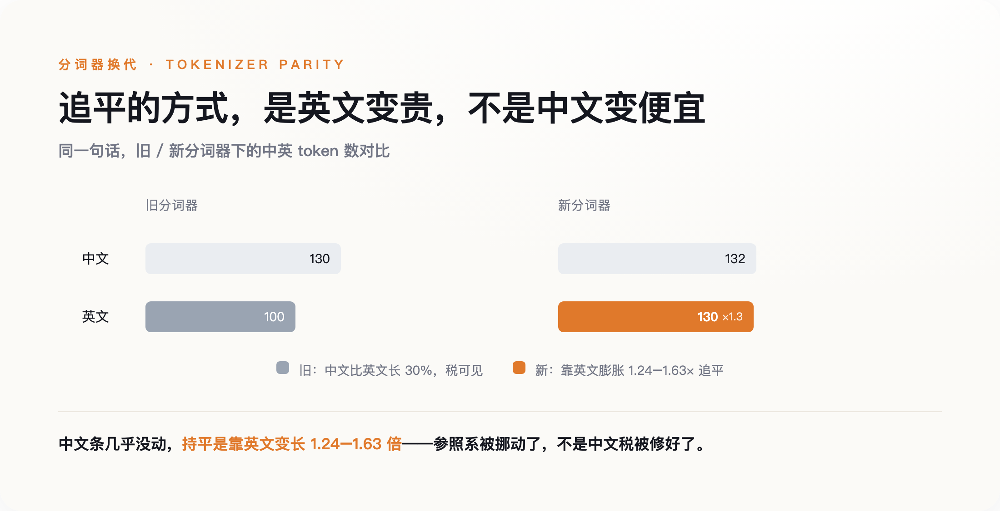
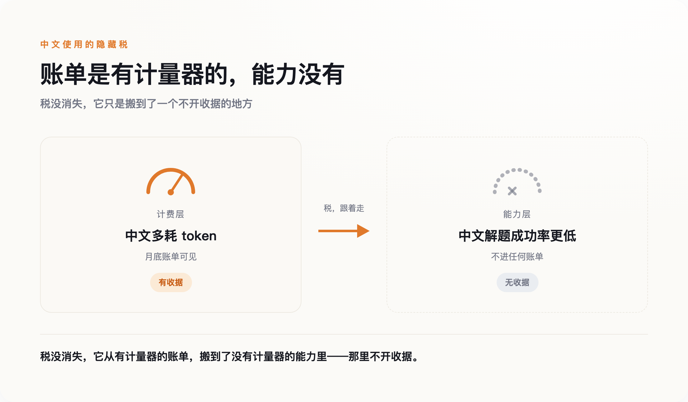

# 中文税从账单上消失的那天，它搬进了能力里

> **发布日期**：2026-08-15 | **分类**：AI 深度观察

## 导语

同样一个意思，用文言文写，喂给大模型比用白话文写更便宜。一句十二个字的古谚，和把它翻译开来的二十多个字的白话解释，前者被切成的 token 更少，花的钱也更少。

这件小事推翻了一个流传很广的说法。人们管大模型对中文的额外收费叫「中文税」，好像是中文这门语言天生吃亏。但文言文的反例说明，吃亏的从来不是中文，是一台叫分词器的机器，在按它自己的规矩记账——而这套规矩，对信息密度高的文本天然友好。

所以 2026 年真正值得讲的，不是这台机器有多不公平。而是这笔税，正在从一个你看得见的地方，搬到一个你看不见的地方。

---

## 一、这笔税，是一张字节合并表的副产品

要看清税搬去了哪，得先弄明白它当初是怎么记出来的。

大模型不认字，只认 token。把一段文字切成 token 的规则，主流叫 BPE——字节对编码。它的祖宗是 1994 年一个叫 Gage 的人发明的数据压缩算法，2016 年被引进机器翻译，到 GPT-2 手里变成了「字节级 BPE」：不再直接切字符，而是切 UTF-8 字节。好处是任何语言、任何符号都不会切出「未知词」；代价是，一个英文字母就是一个字节，一个汉字却要占三个字节。

BPE 按频率合并。英文的词根词缀，在英文主导的训练语料里天然高频，很快就被合并成一个个完整 token；而如果语料里中文的密度不够，合并就停在了字节层——一个汉字被拆成两到三个 token，再也拼不回一个字。这就是「税」的全部来源：不是谁存心歧视中文，而是训练语料里英文占了大头，中文只是分到了残羹。

*图注：中文税的源头不在语言，在字节——一个汉字占三个字节，分词器没能把它合并回一个词。*

这个差距被正式量化，是 2023 年 Petrov 等人发在 NeurIPS 的一篇论文。他们测下来，同一段内容翻译成不同语言，分词后的长度最多能差出十五倍；哪怕退到字符级、字节级的模型，某些语言对之间仍有四倍以上的差距。注意这里真正发生了什么：你为一段话付的钱，一部分不取决于你说了什么，取决于你用哪种语言说。

副产品也是账单。语料配比的一个技术性选择，最后变成了非英语用户每个月多付的那几美元。它会不会随着词表扩大自己收窄？会。

## 二、账单上，这笔税确实在消失

过去两年，账面上的中文税是真的在退。

先是 OpenAI 把老分词器 cl100k 换成了 o200k，在切词的正则里补进了覆盖中日韩的 Unicode 类目，让整字能被合并成一个 token。拿泰米尔语一段文字做对照：老分词器要切成 68 个 token，新的只要 21 个，压缩了三倍多。中文吃到的是同一波红利。

到了 Claude 的新一代分词器，第三方基准测出来，中文的 token 消耗已经趋近于英文的 1.000 倍——平价了。但这里要看清它是怎么平的。同一份基准显示，Claude 追平中文的方式，不是把中文压得更狠，而是让英文本身膨胀了 1.24 到 1.63 倍。**所谓「追平」，不是把中文修好了，是把参照系挪动了。**你以为的公平，相当一部分是靠把英文拖慢换来的。

*图注：中英在新分词器里持平了——但持平的方式是英文变贵，不是中文变便宜。参照系被挪动了。*

国产模型更进一步。第三方测试里，DeepSeek-V3 的中英 token 比低到 0.65 倍——同样的内容，中文比英文还便宜三分之一；通义千问一类也在 1.0 倍以下。从账单看，中文非但不再被罚，反而成了占便宜的一方。

如果故事到这里结束，那就是个皆大欢喜的技术进步故事：一个基础设施的历史欠账，被工程能力慢慢还清了。但账单打平了，问题就解决了吗？要回答这个，得先承认一件更尴尬的事——我们其实连「打平了没有」都说不清。

## 三、连它消没消失，都没人能达成共识

同一个 DeepSeek，一家基准说中文只要英文 0.65 倍的 token，是省的；另一位母语中文的独立测试者却反过来，测出国产模型的中文仍比英文更贵，并直言「中文更省」是把「字符数」和「token 数」搞混了的都市传说——中文字符少，不等于切出来的 token 少。两边用的都是真实数据，给它算一笔总账却根本算不拢。

差别全在怎么测：选哪些文本、算比例还是算绝对量、用哪一版分词器。只要挑对样本，你想让中文显得贵，或者显得便宜，都能测得出来。

这本身就是最该被注意的信号。当一笔税连测都测不出共识，往往不是因为它变小了，而是因为它已经离开了那个能被清楚计量的地方。账单是好算的——token 数乘以单价，一分一厘都对得上。真正难算的东西，从来不在账单上。

## 四、它搬进了能力里

2026 年 4 月，一篇预印本论文把这笔税挪动后的落点，第一次摆到了台面上。

这篇挂在 arXiv、名字里带着「Mythbuster」的论文（作者 Simiao Ren 等），做了一件很朴素的事：拿 SWE-bench Lite 里的 50 道软件工程题，分别用英文和专业翻译的中文 prompt，去考三个不同的模型，比的不是花多少钱，是解对了多少道。

结果是三个模型的中文成功率，全线低于英文：一个从 66% 掉到 61.5%，一个从 36% 掉到 26.1%，一个从 64.6% 掉到 55.1%。而在 token 消耗上，这三个模型里，两个是中文更贵，只有一个中文更省。换句话说，无论这道题用中文问是更贵、打平、还是更便宜，模型解对它的概率都更低。能力上的折扣，和账单上的盈亏，脱钩了。

得先把这篇论文的边界讲清楚，否则它撑不起太重的结论：它是没经过同行评审的预印本，作者自己也称之为「初步研究」，样本只有 50 道题、三个模型，而且死死限定在写代码这一个领域，不能直接推广到写作、推理这些别的任务上。它证明不了「中文能力普遍更差」。

但它足够撕开一道口子，让人看见税搬去了哪。账单是有计量器的，能力没有。你多付的钱，会明明白白出现在月底的账单上，你至少知道自己亏了多少；而一次本可以解对、却因为你用中文问而没解对的题，不会出现在任何地方。**账单上的税，你付得心疼；能力上的税，你付得浑然不觉。**后者显然更难办，因为它没有收据。

*图注：税没消失，它从有计量器的账单，搬到了没有计量器的能力里——那里不开收据。*

## 五、追平从来不是正义，是市场

还剩一个问题，而它的答案，才是前面那笔能力暗账真正的来处：为什么偏偏是中文的账单税能被追平，别的语言不能？决定一门语言会不会被追平的，从来是市场，不是公平——这是骨架；能力上那笔量不出的折扣，是这套市场逻辑在账单追平之后，仍然留在暗处的东西。

康奈尔大学 David Mimno 等人在 FAccT 2026 上的一篇论文（《Do Chinese models speak Chinese languages?》）给了个冷静的旁证。他们发现，国产大模型在二十多种语言上的表现，和西方模型的相关系数高达 0.93——高度一致，唯一显著的例外，是国产模型的普通话明显更好。但这份对中文的偏爱，并没有延伸到中国境内的少数民族语言：哈萨克语、维吾尔语的识别，国产模型做得和西方模型一样糟。

论文本身只做了描述，没有给因果。但顺着这个描述往下推——这是我的推断，不是论文的结论——一个模型会对哪门语言好，跟这门语言有多少人说、背后有多大的市场，关系恐怕比跟「语言平等」这类理念的关系更近。普通话被追平，不是因为语言平等值得追求，而是因为说普通话的人，多到值得。那些同样是母语、却撑不起一个市场的语言，就留在了字节层，没人替它们扩词表。

这不是新鲜事。1947 年，林语堂花光积蓄造出「明快打字机」，为的是让中文能挤进那套按拉丁字母设计的机械里。中文和现代信息基础设施打交道，快一百年一直是同一个剧本：先被挡在门外，再靠某个工程上的妥协挤进去，而挤进去的前提，永远是「这个市场已经大到不容忽视」。token 只是这台打字机最新的版本。

所以别把「中文 token 追平了」当成中文平权了。这笔税没有消失，它只是从有计量器的地方，去了没有计量器的地方——在那里，没有人会给你开一张收据。

## 数据来源

- [Petrov et al., "Language Model Tokenizers Introduce Unfairness Between Languages" (NeurIPS 2023)](https://arxiv.org/abs/2305.15425)
- [Ren et al., "Mythbuster: Chinese Language Is Not More Efficient Than English in Vibe Coding" (arXiv 2604.14210, 2026)](https://arxiv.org/abs/2604.14210)
- [Wang, Jo & Mimno, "Do Chinese models speak Chinese languages?" (FAccT 2026, arXiv 2504.00289)](https://arxiv.org/abs/2504.00289)
- [Multilingual token compression in the GPT-o family (njkumar.com)](https://njkumar.com/gpt-o-multilingual-token-compression/)
- 第三方分词基准测评：Claude 中英 token 趋近 1.000×（英文相对膨胀 1.24–1.63×）、DeepSeek-V3 约 0.65× 等数字，来自 TechFlowPost 等第三方基准的平行文本测试，经多来源交叉核对，非各厂商官方发布数据
